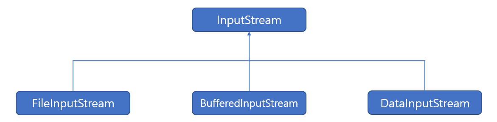
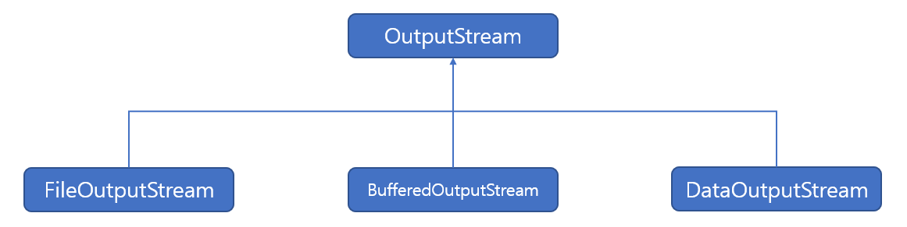
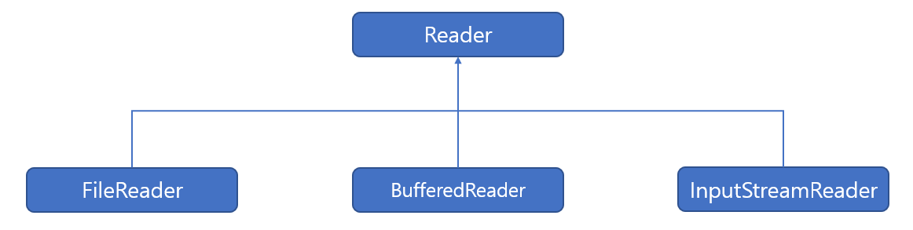
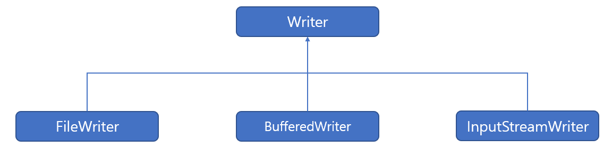

# IO

> Java IO 패키지에 대해 알아본다.

 

### 입력 스트림과 출력 스트림

자바의 기본적인 데이터 입출력(IO:Input/Output) API는 java.io 패키지에서 제공하고 있다. java.io 패키지에는 파일 시스템의 정보를 얻기 위한 File 클래스와 데이터를 입출력하기 위한 다양한 입출력 스트림 클래스를 제공하고 있다.

| java.io 패키지의 주요 클래스                                 | 설명                                                  |
| ------------------------------------------------------------ | ----------------------------------------------------- |
| File                                                         | 파일 시스템의 파일 정보를 얻기 위한 클래스            |
| Console                                                      | 콜솔로부터 문자를 입출력하기 위한 클래스              |
| InputStream / OutputStream                                   | 바이트 단위 입출력을 위한 최상위 입출력 스트림 클래스 |
| FileInputStream / FileOutputStream DataInputStream / DataOutputStream ObjectInputStream / ObjectOutputStream PrintStream BufferedInputStream BufferedOutputStream | 바이트 단위 입출력을 위한 하위 스트림 클래스          |
| Reader / Writer                                              | 문자 단위 입출력을 위한 하위 스트림 클래스            |
| FileReader / FileWriter InputStreamReader / OutputStreamWriter PrintWriter BufferedReader / BufferedWriter | 문자 단위 입출력을 위한 하위 스트림 클래스            |

 

#### InputStream

InputStream은 바이트 기반 입력 스트림의 최상위 클래스로 추상 클래스이다. 모든 바이트 기반 입력 스트림은 이 클래스를 상속받아서 만들어진다. 다음과 같은 형태를 가지고 있다.

InputStream 클래스에는 바이트 기반 입력 스트림이 기본적으로 가져야 할 메소드가 정의되어 있다. 다음은 InputStream 클래스의 주요 메소드이다.

| 리턴 타입 | 메소드                                           | 설명                                                         |
| --------- | ------------------------------------------------ | ------------------------------------------------------------ |
| int       | read( )                                          | 입력 스트림으로부터 1바이트를 읽고 읽은 바이트를 리턴한다.   |
| int       | read(byte[] b)                                   | 입력 스트림으로부터 읽은 바이트들을 매개값으로 주어진 바이트 배열 b에 저장하고 실제로 읽은 바이트 수를 리턴한다. |
| int       | read( byte[] b, int off, int len) | 입력 스트림으로부터 len 개의 바이트만큼 읽고 매개값으로 주어진 바이트 배열 b[off]부터 len개까지 저장한다. 그리고 실제로 읽은 바이트 수인 len개를 리턴한다. 만약 len개를 모두 읽지 못하면 실제로 읽은 바이트 수를 리턴한다. |
| void      | close( )                                         | 사용한 시스템 자원을 반납하고 입력 스트림을 닫는다.          |

 

#### OutputStream

OutputStream은 바이트 기반 출력 스트림의 최상위 클래스로 추상 클래스이다. 모든 바이트 기반 출력 클래스는 이 클래스를 상속받아서 만들어진다. 다음과 같은 형태를 가지고 있다.

OutputStream 클래스에는 모든 바이트 기반 출력 스트림이 기본적으로 가져야 할 메소드가 정의되어 있다. 다음은 OutputStream 클래스의 주요 메소드이다.

| 리턴 타입 | 메소드                                            | 설명                                                         |
| --------- | ------------------------------------------------- | ------------------------------------------------------------ |
| void      | write(int b)                                      | 출력 스트림으로 1바이트를 보낸다(b의 끝 1바이트)             |
| void      | write(byte[] b)                                   | 출력 스트림으로 주어진 바이트 배열 b의 모든 바이트를 보낸다. |
| void      | write( byte[] b, int off, int len) | 출력 스트림으로 주어진 바이트 배열 b[off]부터 len개까지의 바이트를 보낸다. |
| void      | flush( )                                          | 버퍼에 잔류하는 모든 바이트를 출력한다.                      |
| void      | close( )                                          | 사용한 시스템 자원을 반납하고 출력 스트림을 닫는다.          |

 

#### Reader

Reader는 문자 기반 입력스트림의 최상위 클래스로 추상 클래스이다. 모든 문자 기반 입력 스트림은 이 클래스를 상속받아서 만들어진다. 다음과 같은 형태로 되어있다.

Reader 클래스에는 문자 기반 입력 스트림이 기본적으로 가져야 할 메소드가 정의되어 있다. 다음은 Reader 클래스의 주요 메소드이다.

| 리턴 타입 | 메소드                                              | 설명                                                         |
| --------- | --------------------------------------------------- | ------------------------------------------------------------ |
| int       | read( )                                             | 입력 스트림으로부터 한 개의 문자를 일고 리턴한다.            |
| int       | read(char[] cbuf)                                   | 입력 스트림으로부터 읽은 문자들을 매개값으로 주어진 문자 배열 cbuf에 저장하고 실제로 읽은 문자 수를 리턴한다. |
| int       | read( char[] cbuf, int off, int len) | 입력 스트림으로부터 len개의 문자를 읽고 매개값으로 주어진 문자 배열 cbuf[off]부터 len개까지 저장한다. 그리고 실제로 읽은 문자 수인 len개를 리턴한다. |
| void      | close( )                                            | 사용한 시스템 자원을 반납하고 입력 스트림을 닫는다.          |

 

#### Writer

Writer는 문자 기반 출력 스트림의 최상위 클래스로 추상 클래스이다. 모든 문자 기반 출력 스트림 클래스는 이 클래스를 상속받아서 만들어진다. 형태는 다음과 같다. 

Writer 클래스에는 모든 문자 기반 출력 스트림이 기본적으로 가져야 할 메소드가 정의되어 있다. Writer 클래스의 주요 메소드는 다음과 같다.

| 리턴 타입 | 메소드                                    | 설명                                                         |
| --------- | ----------------------------------------- | ------------------------------------------------------------ |
| void      | write(int c)                              | 출력 스트림으로 주어진 한 문자를 보낸다(c의 끝 2바이트)      |
| void      | write(char[] cbuf)                        | 출력 스트림으로 주어진 문자 배열 cbuf의 모든 문자를 보낸다.  |
| void      | write(char[] cbuf, int off, int len) | 출력 스트림으로 주어진 문자 배열 cbuf[off]부터 len개까지의 문자를 보낸다. |
| void      | write(String str)                         | 출력 스트림으로 주어진 문자열을 전부 보낸다.                 |
| void      | write(String str, int off, int len)  | 출력 스트림으로 주어진 문자열 off순번부터 len개까지의 문자를 보낸다. |
| void      | flush( )                                  | 버퍼에 잔류하는 모든 문자열을 출력한다.                      |
| void      | close( )                                  | 사용한 시스템 자원을 반납하고 출력 스트림을 닫는다.          |

