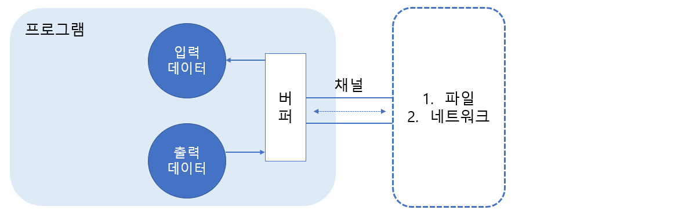
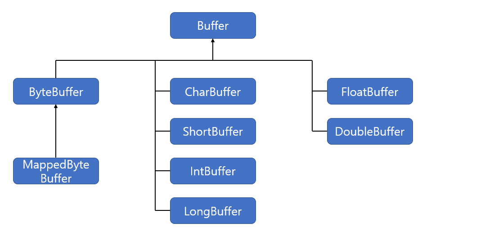

# NIO

> 자바에서 NIO 기반의 입출력 및 네트워킹에 대해 알아본다.

<br>

### NIO 소개

자바 4부터 새로운 입출력(NIO: New Input/Output)이라는 뜻에서 java.nio 패키지가 포함되었는데, 자바 7로 버전업하면서 자바 IO와 NIO 사이의 일관성 없는 클래스 설계를 바로 잡고, 비동기 채널 등의 네트워크 지원을 대폭 강화한 NIO.2 API가 추가되었다. 다음은 NIO와 NIO.2에서 제공하는 패키지에 대해 간략히 설명한 표이다.

| NIO 패키지              | 포함되어 있는 내용                                   |
| ----------------------- | ---------------------------------------------------- |
| java.nio                | 다양한 버퍼 클래스                                   |
| java.nio.channels       | 파일 채널, TCP채널, UDP 채널 등의 클래스             |
| java.nio.channels.spi   | java.nio.channels 패키지를 위한 서비스 제공자 클래스 |
| java.nio.charset        | 문자셋, 인코더, 디코더 API                           |
| java.nio.charset.spi    | java.nio.charset 패키지를 위한 서비스 제공자 클래스  |
| java.nio.file           | 파일 및 파일 시스템에 접근하기 위한 클래스           |
| java.nio.file.spi       | java.nio.file 패키지를 위한 서비스 제공자 클래스     |
| java.nio.file.attribute | 파일 및 파일 시스템의 속성에 접근하기 위한 클래스    |

<br>

<br>

### IO와 NIO의 차이점

IO와 NIO는 데이터를 입출력한다는 목적은 동일하지만, 방식에 있어서 크게 차이가 난다. 아래 표는 IO와 NIO의 차이점을 정리한 것이다.

| 구분                 | IO                 | NIO          |
| -------------------- | ------------------ | ------------ |
| 입출력 방식          | 스트림 방식        | 채널 방식    |
| 퍼버 방식            | 넌버퍼(non-buffer) | 버퍼(buffer) |
| 비동기 방식          | 지원 안 함         | 지원         |
| 블로킹/넌블로킹 방식 | 블로킹 방식만 지원 | 둘다 지원    |

<br>

<br>

### IO와 NIO의 선택

NIO는 연결 클라이언트 수가 많고, 하나의 입출력 처리 작업이 오래 걸리지 않는 경우에 사용하는 것이 좋다. 스레드에서 입출력 처리가 오래 걸린다면 대기하는 작업의 수가 늘어나기 때문에 제한된 스레드로 처리하는 것이 오히려 불리할 수 있다. 대용량 데이터를 처리할 경우에는 IO가 더 유리한데, NIO는 버퍼의 할당 크기도 문제가 되고, 모든 입출력 작업에 버퍼를 무조건 사용해야 하므로 받은 즉시 처리하는 IO보다는 좀 더 복잡하다. 연결 클라이언트 수가 적고, 전송되는 데이터가 대용량이면서 순차적으로 처리될 필요셩이 있을 경우에는 IO로 서버를 구현하는 것이 좋다.

<br>

<br>

### 경로 정의(Path)

NIO에서 제일 먼저 살펴봐야 할 API는 java.nio.file.Path 인터페이스이다. Path는 IO의 java.nio.File 클래스에 대응되는 NIO 인터페이스이다. NIO의 API에서 파일의 경로를 지정하기 위해 Path를 사용하기 때문에 Path 사용 방법을 잘 알아두어야 한다. Path 구현 객체를 얻기 위해서는 java.nio.file.Paths 클래스의 정적 메소드인 `get()` 메소드를 호출하면 된다.

```java
Path path = Paths.get(String first, String... more)
Path path = Paths.get(URI uri);
```

get() 메소드의 매개값은 파일의 경로인데, 문자열로 지정할 수도 있고, URI 객체로 지정할 수도 있다. 문자열로 지정할 경우 전체 경로를 한꺼번에 지정해도 좋고, 상위 디렉토리와 하위 디렉토리를 나열해서 지정해도 좋다.

```java
Path path = Paths.get("C:/Temp/dir/file.txt");
Path path = Paths.get("C:/Temp/dir","file.txt");
Path path = Paths.get("C","Temp","dir","file.txt");
```

Path 인터페이스는 다음과 같이 파일 경로에서 얻을 수 있는 여러 가지 정보를 제공해주는 메소드가 있다.

| 리턴 타입          | 메소드(매개 변수)     | 설명                                                         |
| ------------------ | --------------------- | ------------------------------------------------------------ |
| int                | compareTo(Path other) | 파일 경로가 동일하면 0을 리턴,<br />상위 경로면 음수,<br />하위 경로면 양수를 리턴,<br />음수와 양수 값의 차이나는 문자열의 수 |
| Path               | getFileName()         | 부모 경로를 제외한 파일 또는 디렉토리 이름만<br /> 가진 Path 리턴 |
| FileSystem         | getFileSystem()       | FileSystem 객체 리턴                                         |
| Path               | getName(int index)    | C:\Temp\dir\file.txt일 경우<br />index가 0이면 "Temp"의 Path 객체 리턴<br />index가 1이면 "dir"의 Path객체 리턴<br />index가 2이면 "file.txt"의 Path객체 리턴 |
| int                | getNameCount()        | 중첩 경로 수, C:\Temp\dir\file.txt일 경우 3을 리턴           |
| Path               | getParent()           | 바로 위 부모 폴더의 Path 리턴                                |
| Path               | getRoot()             | 루트 디렉토리의 Path 리턴                                    |
| Iterator&#60;Path> | iterator()            | 경로에 있는 모든 디렉토리와 파일을 Path 객체로 생성<br />하고 반복자를 리턴 |
| Path               | nomalize()            | 상대 경로로 표기할 때 불필요한 요소를 제거                   |
| WatchKey           | register(...)         | WatchService를 등록                                          |
| File               | toFile()              | java.File 객체로 리턴                                        |
| String             | toString()            | 파일 경로를 문자열로 리턴                                    |
| URI                | toUri()               | 파일 경로를 URI 객체로 리턴                                  |

<br>

#### 파일 시스템 정보(FileSystem)

운영체제의 파일 시스템은 FileSystem 인터페이스를 통해서 접근할 수 있다. FileSystem 구현 객체는 FileSystem의 정적 메소드인 getDefault()로 얻을 수 있다.

```java
FileSystem fileSystem = FileStytem.getDefault();
```

FileSystem은 다음과 같은 메소드를 제공한다.

| 리턴 타입               | 메소드(매개 변수)    | 설명                                         |
| ----------------------- | -------------------- | -------------------------------------------- |
| Iterable&#60;FileStore> | getFileStore()       | 드라이버 정보를 가진 FileStore 객체들을 리턴 |
| Iterable&#60;Path>      | getRootDirectories() | 루트 디렉토리 정보를 가진 Path 객체들을 리턴 |
| String                  | getSeparator()       | 디렉토리 구분자 리턴                         |

FileStore는 드라이버를 표현한 객체로 다음과 같은 메소드를 제공한다.

| 리턴 타입 | 메소드(매개 변수)     | 설명                                                         |
| --------- | --------------------- | ------------------------------------------------------------ |
| long      | getTotalSpace()       | 드라이버 전체 공간 크기(바이트 단위) 리턴                    |
| long      | getUnallocatedSpace() | 할당되지 않은 공간 크기 리턴                                 |
| long      | getUsableSpace()      | 사용 가능한 공간 크기,<br />getUnallocatedSpace()와 동일한 값 |
| boolean   | isReadOnly()          | 읽기 전용 여부                                               |
| String    | name()                | 드라이버명 리턴                                              |
| String    | type()                | 파일 시스템 종류                                             |

<br>

#### 파일 속성 읽기 및 파일, 디렉토리 생성/삭제

java.nio.file.Files 클래스는 파일과 디렉토리의 생성 및 삭제, 그리고 이들의 속성을 읽는 메소드를 제공하고 있다. 여기서 속성이란 파일이나 디렉토리가 숨김인지, 디렉토리인지, 크기가 어떻게 되는지, 소유자가 누구인지에 대한 정보를 말한다. 다음은 java.nio.file.Files클래스가 제공하는 정적 메소드들이다.

| 리턴 타입                 | 메소드(매개 변수)        | 설명                                   |
| ------------------------- | ------------------------ | -------------------------------------- |
| long 또는 Path            | copy(...)                | 복사                                   |
| Path                      | createDirectories(...)   | 모든 부모 디렉토리 생성                |
| Path                      | createDirectory(...)     | 경로의 마지막 디렉토리만 생성          |
| Path                      | createFile(...)          | 파일 생성                              |
| void                      | delete(...)              | 삭제                                   |
| boolean                   | deleteIfExists(...)      | 존재한다면 삭제                        |
| boolean                   | exists(...)              | 존재 여부                              |
| FileStore                 | getFileStore(...)        | 파일이 위치한 FileStore(드라이버) 리턴 |
| FileTime                  | getLastModifiedTime(...) | 마지막 수정 시간을 리턴                |
| UserPrincipal             | getOwner(...)            | 소유자 정보를 리턴                     |
| boolean                   | isDirectory(...)         | 디렉토리인지 여부                      |
| boolean                   | isExecutable(..)         | 실행 가능 여부                         |
| boolean                   | isHidden(...)            | 숨김 여부                              |
| boolean                   | isReadable(...)          | 읽기 가능 여부                         |
| boolean                   | isRegularFile(...)       | 일반 파일인지 여부                     |
| boolean                   | isWritable(...)          | 쓰기 가능 여부                         |
| Path                      | move(...)                | 파일 이동                              |
| BufferedReader            | newBufferedReader(...)   | 텍스트 파일을 읽는 BufferedReader 리턴 |
| BufferedWriter            | newBufferedWriter(...)   | 텍스트 파일에 쓰는 BufferedWriter 리턴 |
| SeekableByteChannel       | newByteChannel(...)      | 파일에 읽고 쓰는 바이트 채널을 리턴    |
| DirectoryStream&#60;Path> | newDirectoryStream(...)  | 디렉토리의 모든 내용을 스트림으로 리턴 |
| InputStream               | newInputStream(...)      | 파일의 InputStream 리턴                |
| OutputStream              | newOutputStream(...)     | 파일의 OutputStream 리턴               |
| boolean                   | notExcists(...)          | 존재하지 않는지 여부                   |
| String                    | probeContentType(...)    | 파일의 MIME타입을 리턴                 |
| byte[]                    | readAllBytes(...)        | 파일의 모든 바이트를 읽고 배열로 리턴  |
| List&#60;String>          | readAllLines(...)        | 텍스트 파일의 모든 라인을 읽고 리턴    |
| long                      | size(...)                | 파일의 크기 리턴                       |
| Path                      | write(...)               | 파일에 바이트나 문자열을 저장          |

<br>

<br>

### 버퍼

NIO에서는 데이터를 입출력하기 위해 항상 버퍼를 사용해야 한다. 버퍼는 읽고 쓰기가 가능한 메모리 배열이다. 버퍼를 이해하고 잘 사용할 수 있어야 NIO에서 제공하는 API를 올바르게 활용할 수 있다.

 

<br>

#### Buffer 종류

Buffer는 저장되는 데이터 타입에 따라 분류될 수 있고, 어떤 메모리를 사용하느냐에 따라 다이렉트(Direct)와 넌다이렉트(NonDirect)로 분류될 수도 있다.

##### 데이터 타입에 따른 버퍼

NIO 버퍼는 저장되는 데이터 타입에 따라서 별도의 클래스로 제공된다. 이 버퍼 클래스들은 Buffer 추상 클래스를 모두 상속하고 있다.



버퍼 클래스의 이름을 보면 어떤 데이터가 저장되는 버퍼인지 쉽게 알 수 있다. MappedByteBuffer는 ByteBuffer의 하위 클래스로 파일의 내용에 랜덤하게 접근하기 위해서 파일의 내용을 메모리와 맵핑시킨 버퍼이다.

##### 넌다이렉트와 다이렉트 버퍼

버퍼가 사용하는 메모리의 위치에 따라서 넌다이렉트(non-direct)버퍼와 다이렉트(direct) 버퍼로 분류된다. 넌다이렉트 버퍼는 JVM이 관리하는 힙 메모리 공간을 이용하는 버퍼이고, 다이렉트 버퍼는 운영체제가 관리하는 메모리 공간을 이용하는 버퍼이다. 두 버퍼의 특징은 다음과 같다.

| 구분                 | 넌다이렉트 버퍼     | 다이렉트 버퍼                     |
| -------------------- | ------------------- | --------------------------------- |
| 사용하는 메모리 공간 | JVM의 힙 메모리     | 운영체제의 메모리                 |
| 버퍼 생성 시간       | 버퍼 생성이 빠르다. | 버퍼 생성이 느리다.               |
| 버퍼의 크기          | 작다.               | 크다.(큰 데이터를 처리할 때 유리) |
| 입출력 성능          | 낮다.               | 높다.(입출력이 빈번할 때 유리)    |

<br>

#### Buffer 생성

각 데이터 타입별로 넌다이렉트 버퍼를 생성하기 위해서는 각 Buffer 클래스의 allocate( )와 wrap( ) 메소드를 호출하면 되고, 다이렉트 버퍼는 ByteBuffer의 allocateDirect( ) 메소드를 호출하면 된다.

##### allocate() 메소드

allocate() 메소드는 JVM 힙 메모리에 넌다이렉트 버퍼를 생성한다. 다음은 데이터 타입별로 Buffer를 생성하는 allocate() 메소드이다. 매개값은 해당 데이터 타입의 저장 개수를 말한다.

| 리턴 타입    | 메소드(매개 변수)                   | 설명                             |
| ------------ | ----------------------------------- | -------------------------------- |
| ByteBuffer   | ByteBuffer.allocate(int capacity)   | capacity개만큼의 byte값을 저장   |
| CharBuffer   | CharBuffer.allocate(int capacity)   | capacity개만큼의 char값을 저장   |
| DoubleBuffer | DoubleBuffer.allocate(int capacity) | capacity개만큼의 double값을 저장 |
| FloatBuffer  | FloatBuffer.allocate(int capacity)  | capacity개만큼의 float값을 저장  |
| IntBuffer    | IntBuffer.allocate(int capacity)    | capacity개만큼의 int값을 저장    |
| LongBuffer   | LongBuffer.allcate(int capacity)    | capacity개만큼의 long값을 저장   |
| ShortBuffer  | ShortBuffer.allcate(int capacity)   | capacity개만큼의 short값을 저장  |

다음은 최대 100개의 바이트를 저장하는 ByteBuffer를 생성하고, 최대 100개의 문자를 저장하는 CharBuffer를 생성하는 코드이다.

```java
ByteBuffer byteBuffer = ByteBuffer.allocate(100);
CharBuffer charBuffer = CharBuffer.allocate(100);
```

##### wrap() 메소드

각 타입별 Buffer 클래스는 모두 warp() 메소드를 가지고 있는데, warp() 메소드는 이미 생성되어 있는 자바 배열을 래핑해서 Buffer객체를 생성한다. 자바 배열은 JVM 힙 메모리에 생성되므로 wrap()은 넌다이렉트 버퍼를 생성한다. 다음은 길이가 100인 byte[]를 이용해서 ByteBuffer를 생성하고, 길이가 100인 char[]를 이용해서 CharBuffer를 생성한다.

```java
byte[] byteArray = new byte[100];
ByteBuffer byteBuffer = ByteBuffer.wrap(byteArray);
char[] charArray = new char[100];
CharBuffer charBuffer = CharBuffer.wrap(charArray);
```

##### allocateDirect() 메소드

이 메소드는 운영체제가 관리하는 메모리에 다이렉트 버퍼를 생성한다. 이 메소드는 각 타입별 Buffer 클래스에는 없고, ByteBuffer에서만 제공된다. 각 타입별로 다이렉트 버퍼를 생성하고 싶다면 우선 ByteBuffer의 allocateDirect() 메소드로 버퍼를 생성한 다음 ByteBuffer의 asCharBuffer(), asIntBuffer(), asLongBuffer(), asFloatBuffer(), asDoubleBuffer() 메소드를 이용해서 해당 타입별 Buffer를 얻으면 된다.

다음은 다이렉트 버퍼 생성 코드이다.

```java
//100개의 byte값 저장
ByteBuffer byteBuffer = ByteBuffer.allocateDirect(100);
//50개의 char값 저장
CharBuffer charBuffer = ByteBuffer.allcateDirect(100).asCharBuffer();
//25개의int값 저장
IntBuffer intBuffer = ByteBuffer.allocate(100).asIntBuffer();
```

<br>

#### Buffer의 위치 속성

Buffer를 생성하는 방법을 알았으니 이제 사용하는 방법을 알아보자. Buffer를 사용하려면 먼저 Buffer의 위치 속성 개념과 위치 속성이 언제 변경되는지 알고 있어야 한다. 다음은 Buffer의 네 가지 위치 속성을 정리한 것이다.

| 속성     | 설명                                                         |
| -------- | ------------------------------------------------------------ |
| position | 현재 읽거나 쓰는 위치값이다. 인덱스 값이기 때문에 0부터 시작하며, limit보다 큰값을<br />가질 수 없다. 만약 position과 limit의 값이 같아진다면 더 이상 데이터를 쓰거나<br />읽을 수 없다는 뜻이 된다. |
| limit    | 버퍼에서 읽거나 쓸 수 있는 위치의 한계를 나타낸다. 이 값은 capacity보다 작거나 같은 값을<br />가진다. 최초에 버퍼를 만들었을 때는 capacity와 같은 값을 가진다. |
| capacity | 버퍼의 최대 데이터 개수(메모리 크기)를 나타낸다. 인덱스 값이 아니라 수량임을 주의한다. |
| mark     | reset() 메소드를 실행했을 때에 돌아오는 위치를 지정하는 인덱스로서 mark() 메소드로<br />지정할 수 있다. 주의할 점은 반드시 position 이하의 값으로 지정해주어야 한다. position<br />이나 limit의 값이 mark보다 작은 경우, mark는 자동 제거된다. mark가 없는 상태에서 reset()<br />메소드를 호출하면 InvalidMarkException이 발생한다. |

<br>

#### Buffer 메소드

Buffer를 생성한 후 사용할 때에는 Buffer가 제공하는 메소드를 잘 활용해야 한다. Buffer마다 공통적으로 사용하는 메소드들도 있고, 데이터 타입별로 Buffer가 개별적으로 가지고 있는 메소드들도 있다.

##### 공통 메소드

각 타입별 버퍼 클래스는 Buffer 추상 클래스를 상속하고 있다. Buffer 추상 클래스에는 모든 버퍼가 공통적으로 가져야 할 메소드드들이 정의되어 있다. 다음은 Buffer 추상 클래스가 가지고 있는 메소드들을 정리한 표이다.

| 리턴 타입 | 메소드(매개 변수)         | 설명                                                      |
| --------- | ------------------------- | --------------------------------------------------------- |
| Object    | arrya()                   | 버퍼가 래핑(wrap)한 배열을 리턴                           |
| int       | arrayOffset()             | 버퍼의 첫 번째 요소가 있는 내부 배열의 인덱스를 리턴      |
| int       | capacity()                | 버퍼의 전체 크기를 리턴                                   |
| Buffer    | clear()                   | 버퍼의 위치 속성을 초기화(position=0, limit=capacity)     |
| Buffer    | filp()                    | limit을 position으로, position을 0인덱스로 이동           |
| boolean   | hasArray()                | 버퍼가 래핑(wrap)한 배열을 가지고 있는지 여부             |
| boolean   | hasRemaining()            | position과 limit사이에 요소가 있는지 여부(position<limit) |
| boolean   | isDirect()                | 운영체제의 버퍼를 사용하는지 여부                         |
| boolean   | isReadOnly()              | 버퍼가 읽기 전용인지 여부                                 |
| int       | limit()                   | limit 위치를 리턴                                         |
| Buffer    | limit(int newLimit)       | newLimit으로 limit위치를 설정                             |
| Buffer    | mark()                    | 현재 위치를 mark로 표시                                   |
| int       | position()                | position 위치를 리턴                                      |
| Buffer    | position(int newPosition) | newPosition으로 position위치를 설정                       |
| int       | remanining()              | position과 limit사이의 요소의 개수                        |
| Buffer    | reset()                   | position을 mark위치로 이동                                |
| Buffer    | rewind()                  | position을 0인덱스로 이동                                 |

##### 데이터를 읽고 저장하는 메소드

버퍼에 데이터를 저장하는 메소드는 put()이고, 데이터를 읽는 메소드는 get() 이다. 이 메소드들은 Buffer 추상 클래스에는 없고, 각 타입별 하위 Buffer 클래스가 가지고 있다. get() 과 put() 메소드는 상대적(Relative)과 절대적(Absolute)으로 구분된다. 버퍼 내의 현재 위치 속성인 position에서 데이터를 읽고, 저장할 경우는 상대적이고, position과 상관없이 주어진 인덱스에서 데이터를 읽고, 저장할 경우는 절대적이다. 

##### 버퍼 예외의 종류

주로 버퍼가 다 찼을 때 데이터를 저장하려는 경우와 버퍼에서 더 이상 읽어올 데이터가 없을 때 데이터를 읽으려는 경우에 예외가 발생한다. 다음 표는 버퍼와 관련된 예외 클래스이다. 이 중에서 가장 흔하게 발생하는 예외는 BufferOverflowException과 BufferUnderflowException이다.

| 예외                     | 설명                                                         |
| ------------------------ | ------------------------------------------------------------ |
| BufferOverflowException  | position이 limit에 도달했을 때 put()을 호출하면 발생         |
| BufferUnderflowException | position이 limit에 도달했을 때 get()을 호출하면 발생         |
| InvalidMarkException     | mark가 없는 상태에서 reset() 메소드를 호출하면 발생          |
| ReadOnlyBufferException  | 읽기 전용 버퍼에서 put() 또는 compact() 메소드를 호출하면 발생 |

 <br>

#### Buffer 변환

채널이 데이터를 읽고 쓰는 버퍼는 모두 ByteBuffer이다. 그렇기 때문에 채널을 통해 읽은 데이터를 복원하려면 ByteBuffer를 문자열 또는 다른 타입 버퍼(CharBuffer, shortBuffer, IntBuffer, LongBuffer, FloatBuffer, DoubleBuffer)로 변환해야 한다. 반대로 문자열 또는 다른 타입 버퍼의 내용을 채널을 통해 쓰고 싶다면 ByteBuffer로 변환해야 한다.

##### ByteBuffer <-> String

프로그램에서 가장 많이 처리되는 데이터를 String 타입, 즉 문자열이다. 채널을 통해 문자열을 파일이나 네트워크로 전송하려면 특정 문자셋(UTF-8, EUC-KR)으로 인코딩해서 ByteBuffer로 변환해야 한다. 먼저 문자셋을 표현하는 java.nio.charset.Charset 객체가 필요한데, 다음 두 가지 방법으로 얻을 수 있다.

```java
Charset charset = Charset.forName("UTF-8");	//매개값으로 주어진 문자셋
Charset charset = Charset.defaultCharset();	//운영체제가 사용하는 디폴트 문자셋
```

Charset을 이용해서 문자열을 ByteBuffer로 변환하려면 다음과 같이 encode() 메소드를 호출하면 된다.

```java
String data = ...;
ByteBuffer byteBuffer = charset.encode(data);	
```

반대로 파일이나 네트워크로부터 읽은 ByteBuffer가 특정 문자셋으로 인코딩되어 있을 경우, 해당 문자셋으로 디코딩해야만 문자열로 복원할 수 있다. Charset은 ByteBuffer를 디코딩해서 CharBuffer로 변환시키는 decode() 메소드를 제공하고 있기 때문에 다음과 같이 문자열로 쉽게 복원할 수 있다.

```java
ByteBuffer byteBuffer = ...;
String data = charset.decode(byteBuffer).toString();
```

##### ByteBuffer <-> IntBuffer

int 타입은 4byte 크기를 가지므로 int[] 배열 크기 또는 IntBuffer의 capacity보다 4배 큰 capacity를 가진 ByteBuffer를 생성하고, ByteBuffer의 putInt() 메소드로 정수값을 하나씩 저장하면 된다. 다음은 int[]배열을 IntBuffer로 래핑하고, 4배 큰 ByteBuffer를 생성한 후 정수값을 저장한다. 주목할 점은 putInt() 메소드는 position을 변경시키기 때문에 모두 저장한 후에는 position을 0으로 되돌려 놓는 flip() 메소드를 호출해야 한다.

```java
int[] data = new int[] {10, 20};
IntBuffer intBuffer = IntBuffer.wrap(data);
ByteBuffer byteBuffer = ByteBuffer.allocate(intBuffer.capacity()*4);
for(int i=0 ;i<intBuffer.capacity(); i++){
	byteBuffer.putInt(intBuffer.get(i));
}
byteBuffer.flip();
```

반대로 파일이나 네트워크로부터 입려된 ByteBuffer에 4바이트씩 연속된 int 데이터가 저장되어 있을 경우, int[] 배열로 복원이 가능하다.

```java
ByteBuffer byteBuffer = ...;
IntBuffer intBuffer = byteBuffer.asIntBuffer();
int[] data = new int[intBuffer.capacity()];
intBuffer.get(data);
```

참고로 ByteBuffer에서 asIntBuffer()로 얻은 IntBuffer에서는 array() 메소드를 사용해서 int[] 배열을 얻을 수 없다. array() 메소드는 래핑한 배열만 리턴하기 때문에 int[] 배열을 wrap() 메소드로 래핑한 IntBuffer에서만 사용할 수 있다.