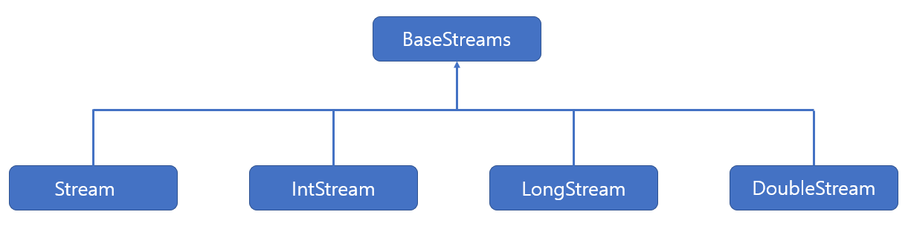
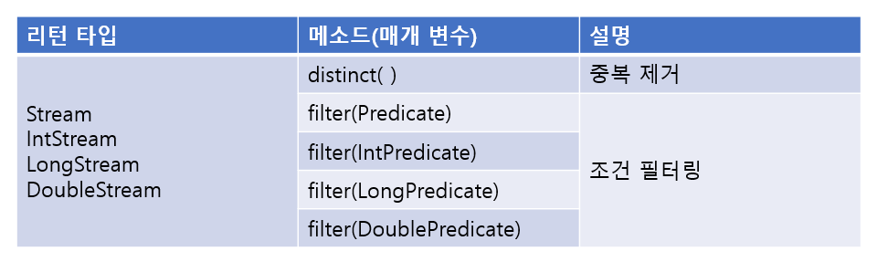
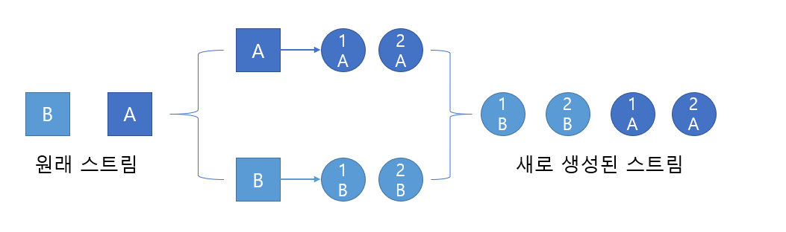
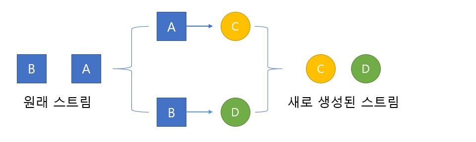

# Stream API

> 스트림의 종류와 사용 방법에 대해 알아본다.

<br>

### 스트림 소개

스트림(Stream)은 자바8 부터 초가된 컬렉션(배열 포함)의 저장 요소를 하나씩 참조해서 람다식(함수적-스타일(functional-syle))으로 처리할 수 있도록 해주는 반복자이다.

<br>

#### 반복자 스트림

자바7 이전까지는 List&#60;String> 컬렉션에서 요소를 순차적으로 처리하기 위해 Iterator 반복자를 다음과 같이 사용해왔다.

```java
List<String> list = Arrays.asList("홍길동","김자바");
Iterator<String> iterator = list.iterator();
while(iterator.hasNext()){
	String name = iterator.next();
	System.out.println(name);
}
```

이 코드를 Stream을 사용해서 변경하면 다음과 같다.

```java
List<String> list = Arrays.asList("홍길동","김자바");
Stream<String> stream = list.stream();
stream.forEach( name -> System.out.println(name) );
```

forEach(  ) 메소드는 다음과 같이 Consumer 함수적 인터페이스 타입의 매개값을 가지므로 컬렉션의 요소를 소비할 코드를 람다식으로 기술할 수 있다.

```java
void forEach(Consumer<T> action)
```

<br>

#### 스트림의 특징

Stream은 Iterator와 비슷한 역할을 하는 반복자이지만, 람다식으로 요소 처리 코드를 제공하는 점과 내부 반복자를 사용하므로 병렬 처리가 쉽다는 점, 그리고 중간 처리와 최종 처리 작업을 수행하는 점에서 많은 차이를 가지고 있다.

<br>

##### 람다식으로 요소 처리 코드를 제공한다.

Stream이 제공하는 대부분의 요소 처리 메소드는 함수적 인터페이스 매개 타입을 가지기 때문에 람다식 또는 메소드 참조를 이용해서 요소 처리 내용을 매개값으로 전달할 수 있다.

##### 내부 반복자를 사용

외부 반복자(external iterator) 란 개발자가 코드로 직접 컬렉션의 요소를 가져오는 코드 패턴을 말한다. 반면에 내부 반복자(internal iterator)는 컬렉션 내부에서 요소들을 반복시키고, 개발자는 요소당 처리해야 할 코드만 제공하는 코드 패턴을 말한다.

내부 반복자를 사용해서 얻는 이점은 컬렉션 내부에서 어떻게 요소를 반복시킬 것인가는 컬렉션에게 맡겨두고, 개발자는 요소 처리 코드에만 집중할 수 있다는 것이다. 내부 반복자는 요소들의 반복 순서를 변경하거나, 멀티 코어 CPU를 최대한 활용하기 위해 요소들을 분배시켜 병렬 작업을 할 수 있게 도와주기 때문에 하나씩 처리하는 순차적 외부 반복자보다는 효율적으로 요소를 반복시킬 수 있다.

##### 스트림은 중간 처리와 최종 처리를 할 수 있다.

스트림은 컬렉션의 요소에 대해 중간 처리와 최종 처리를 수행할 수 있는데, 중간 처리에서는 매핑, 필터링, 정렬을 수행하고 최종 처리에서는 반복, 카운팅, 평균, 총합 등의 집계 처리를 수행한다.

<br>

<br>

### 스트림의 종류

자바 8부터 새로 추가된 java.util.stream 패키지에는 스트림(stream) API 들이 포진하고 있다. 패키지 내용을 보면 BaseStream 인터페이스를 부모로 해서 자식 인터페이스들이 다음과 같은 상속 관계를 이루고 있다.



BaseStream 인터페이스에는 모든 스트림에서 사용할 수 있는 공통 메소드들이 정의되어 있을뿐 코드에서 직접적으로 사용되지는 않는다. 하위 스트림인 Stream, IntStream, LongStream, DoubleStream 이 직접적으로 이용되는 스트림인데, Stream은 객체 요소를 처리하는 스트림이고, IntStream, LongStream, DoubleStream 은 각각 기본 타입인 int, long, doule 요소를 처리하는 스트림이다. 이 스트림 인터페이스의 구현 객체는 주로 컬렉션과 배열에서 얻지만, 다음과 같은 소스로부터 스트림 구현 객체를 얻을 수도 있다.

| 리턴 타입                                                    | 메소드(매개 변수)                                            | 소스      |
| ------------------------------------------------------------ | ------------------------------------------------------------ | --------- |
| Stream&#60;T>                                                | java.util.Collection.stream()<br />java.util.Collection.parallelStrean() | 컬렉션    |
| Stream&#60;T><br />IntStream<br />LongStream<br />DoubleStream | Arrays.stream(T[ ]), Stream.of(T[ ])<br />Arrays.stream(int[ ]), IntStream.of(int[ ])<br />Arrays.stream(long[ ]), LongStream.of(long[ ])<br />Arrays.stream(double[ ]), DoubleStream.of(double[ ]) | 배열      |
| IntStream                                                    | IntStream.range(int, int)<br />IntStream.rangeClosed(int, int) | int 범위  |
| LongStream                                                   | LongStream.range(long, long)<br />LongStream.rangeClosed(long, long) | long 범위 |
| Stream&#60;Path>                                             | Files.find(Path, int, BiPredicate, FileVisitOption)<br />Files.list(Path) | 디렉토리  |
| Stream&#60;String>                                           | Files.lines(Path, Charset)<br />BufferedReader.lines( )      | 파일      |
| DoubleStream<br />IntStream<br />LongStream                  | Random.doubles(...)<br />Random.ints()<br />Random.longs()   | 랜덤 수   |

<br>

<br>

### 스트림 파이프라인

대량의 데이터를 가공해서 축소하는 것을 일반적으로 리덕션(Reduction) 이라고 하는데, 데이터의 합계, 평균값, 최대값, 최소값 등이 대표적인 리덕션의 결과물이라고 볼 수 있다. 그러나 컬렉션의 요소를 리덕션의 결과물로 바로 집계할 수 없을 경우에는 집계하기 좋도록 필터링, 매핑, 정렬, 그룹핑 등의 중간 처리가 필요하다.

<br>

#### 중간 처리와 최종 처리

스트림은 데이터의 필터링, 매핑, 정렬, 그룹핑 등의 중간 처리와 합계, 평균, 카운팅, 최대값, 최소값 등의 최종 처리를 파이프라인(pipelines)으로 해결한다. 파이프라인은 여러 개의 스트림이 연결되어 있는 구조를 말한다. 파이프라인에서 최종 처리를 제외하고는 모두 중간 처리 스트림이다.

```
오리지날 스트림.(중간 처리).(중간 처리).(최종 처리)
```

<br>

<br>

### 필터링(distinct(), filter())

필터링은 중간 처리 기능으로 요소를 걸러내는 역할을 한다. 필터링 메소드인 distinct()와 filter() 메소드는 모든 스트림이 가지고 있는 공통 메소드이다.



distinct( ) 메소드는 중복을 제거한다.  Stream의 경우 Object.equals(Object) 가 true이면 동일한 객체로 판단하고 중복을 제거한다. IntStream, LongStream, DoubleStream은 동일값일 경우 제거한다.

filter( ) 메소드는 매개값으로 주어진 Predicate 가 true를 리턴하는 요소만 필터링한다.

<br>

<br>

### 매핑(flatMapXXX( ), mapXXX( ), asXXXStream( ), boxed( ))

매핑(mapping)은 중간 처리 기능으로 스트림의 요소를 다른 요소로 대체하는 작업을 말한다. 스트림에서 제공하는 매핑 메소드는 flatXXX( )와 mapXXX( ), 그리고 asDoubleStream( ), asLongStream( ), boxed( )가 있다.

<br>

#### flatMapXXX( ) 메소드

이 메소드는 요소를 대체하는 복수 개의 요소들로 구성된 새로운 스트림을 리턴한다. 다음 그림을 보면 이해가 쉽다. 



flatMapXXX( ) 메소드의 종류는 다음과 같다.

| 리턴 타입     | 메소드(매개 변수)                              | 요소 -> 대체 요소     |
| ------------- | ---------------------------------------------- | --------------------- |
| Stream&#60;R> | flatMap(Function&#60;T, Stream&#60;R>>)        | T > Stream&#60;R>     |
| DoubleStream  | flatMap(DoubleFunction&#60;DoubleStream>)      | double > DoubleStream |
| IntStream     | flatMap(IntFunction&#60;IntStream>)            | int > IntStream       |
| LongStream    | flatMap(LongFunction&#60;LongStream>)          | long > LongStream     |
| DoubleStream  | flatMapToDouble(Function&#60;T, DoubleStream>) | T > DoubleStream      |
| IntStream     | flatMapToInt(Function&#60;T, IntStream>)       | T > IntStream         |
| LongStream    | flatMapToLong(Function&#60;T, LongStream>)     | T > LongStream        |

<br>

<br>

#### mapXXX( ) 메소드

mapXXX( ) 메소드는 요소를 대체하는 요소로 구성된 새로운 스트림을 리턴한다. 다음 그림을 보면 이해가 쉽다.



mapXXX( ) 메소드의 종류는 다음과 같다.

| 리턴 타입     | 메소드(매개 변수)                    | 요소 > 대체 요소 |
| ------------- | ------------------------------------ | ---------------- |
| Stream&#60;R> | map(Function&#60;T, R>)              | T > R            |
| DoubleStream  | mapToDouble(ToDoubleFunction&#60;T>) | T > double       |
| IntStream     | mapToInt(ToIntFunction&#60;T>)       | T > int          |
| LongStream    | mapToLong(ToLongFunction&#60;T>)     | T > long         |
| DoubleStream  | map(DoubleUnaryOperator)             | double > double  |
| IntStream     | mapToInt(DoubleToIntFunction)        | double > int     |
| LongStream    | maptoLong(DoubleToLongFunction)      | double > long    |
| Stream&#60;U> | mapToObj(DoubleFunction&#60;U>)      | double > U       |
| IntStream     | map(IntUnaryOperator mapper)         | int > int        |
| DoubleStream  | mapToDouble(IntToDoubleFunction)     | int > double     |
| LongStream    | mapToLong(IntToLongFunction mapper)  | int > long       |
| Stream&#60;U> | mapToObj(IntFunction&#60;U>)         | int > U          |
| LongStream    | map(LongUnaryOperator)               | long > long      |
| DoubleStream  | mapToDouble(LongToDoubleFunction)    | long > double    |
| IntStream     | mapToInt(LongToIntFunction)          | long > int       |
| Stream&#60;U> | mapToObj(LongFunction&#60;U>)        | long > U         |

<br>

<br>

### asDoubleStream( ), asLongStream( ), boxed( ) 메소드

asDoubleStream( ) 메소드는 IntStream의 int 요소 또는 LongStream의 long 요소를 double 요소로 타입 변환해서 DoubleStream을 생성한다. boxed( ) 메소드는 int, long, double 요소를 Integer, Long, Double 요소로 박싱해서 Stream을 생성한다.

| 리턴 타입                                                    | 메소드(매개 변수) | 설명                                                |
| ------------------------------------------------------------ | ----------------- | --------------------------------------------------- |
| DoubleStream                                                 | asDoubleStream( ) | int > double<br />long > double                     |
| LongStream                                                   | asLongStream( )   | int > long                                          |
| Stream&#60;Integer><br />Stream&#60;Long><br />Stream&#60;Double> | boxed( )          | int > Integer<br />long > Long<br />double > Double |

<br>

<br>

### 정렬(sorted( ))

스트림은 요소가 최종 처리되기 전에 중간 단계에서 요소를 정렬해서 최종 처리 순서를 변경할 수 있다. 요소를 정렬하는 메소드는 다음과 같다.

| 리턴 타입     | 메소드(매개 변수)         | 설명                                   |
| ------------- | ------------------------- | -------------------------------------- |
| Stream&#60;T> | sorted( )                 | 객체를 Comparable구현 방법에 따라 정렬 |
| Stream&#60;T> | sorted(Comparator&#60;T>) | 객체를 주어진 Comparator에 따라 정렬   |
| DoubleStream  | sorted( )                 | double 요소를 오름차순으로 정렬        |
| IntStream     | sorted( )                 | int 요소를 오름차순으로 정렬           |
| LongStream    | sorted( )                 | long 요소를 오름차순으로 정렬          |

<br>

<br>

### 루핑(peek( ), forEach( ))

루핑(looping)은 요소 전체를 반복하는 것을 말한다. 루핑하는 메소드에는 peek( ), forEach( )가 있다. 이 두 메소드는 루핑한다는 기능에서는 동일하지만, 동작 방식은 다르다. peek( )는 중간 처리 메소드이고, forEach( )는 최종 처리 메소드이다.

<br>

<br>

### 매칭(allMatch( ), anyMatch( ), noneMatch( ))

스트림 클래스는 최종 처리 단계에서 요소들이 특정 조건에 만족하는지 조사할 수 있도록 세 가지 매칭 메소드를 제공하고 있다. allMatch( ) 메소드는 모든 요소들이 매개값으로 주어진 Predicate 의 조건을 만족하는지 조사하고, anyMatch( ) 메소드는 최소한 한 개의 요소가 매개값으로 주어진 Predicate의 조건을 만족하는지 조사한다. 그리고 noneMatch( )는 모든 요소들이 매개값으로 주어진 Predicate의 조건을 만족하지 않는지 조사한다.

| 리턴 타입 | 메소드(매개 변수)                                            | 제공 인터페이스 |
| --------- | ------------------------------------------------------------ | --------------- |
| boolean   | allMatch(Predicate&#60;T> predicate)<br />anyMatch(Predicate&#60;T> predicate)<br />noneMatch(Predicate&#60;T> predicate) | Stream          |
| boolean   | allMatch(IntPredicate predicate)<br />anyMatch(IntPredicate predicate)<br />noneMatch(IntPredicate predicate) | IntStream       |
| boolean   | allMatch(LongPredicate predicate)<br />anyMatch(LongPredicate predicate)<br />noneMatch(LongPredicate predicate) | LongStream      |
| boolean   | allMatch(DoublePredicate predicate)<br />anyMatch(DoublePredicate predicate)<br />noneMatch(DoublePredicate predicate) | DoubleStream    |

<br>

<br>

### 기본 집계(sum( ), count( ), average( ), max( ), min( ))

집계(Aggregate)는 최종 처리 기능으로 요소들을 처리해서 카운팅, 합계, 평균값, 최대값, 최소값 등과 같은 하나의 값으로 산출하는 것을 말한다. 집계는 대량의 데이터를 가공해서 축소하는 리덕션(Reduction) 이라고 볼 수 있다.

스트림은 다음과 같은 기본 집계 메소드를 제공하고 있다.

| 리턴 타입                        | 메소드(매개 변수)                  | 설명         |
| -------------------------------- | ---------------------------------- | ------------ |
| long                             | count( )                           | 요소 개수    |
| OptionalXXX                      | findFirst( )                       | 첫 번째 요소 |
| Optional&#60;T><br />OptionalXXX | max(Comparator&#60;T>)<br />max( ) | 최대 요소    |
| Optional&#60;T><br />OptionalXXX | min(Comparator&#60;T>)<br />min( ) | 최소 요소    |
| OptionalDouble                   | average( )                         | 요소 평균    |
| int, long, double                | sum( )                             | 요소 총합    |

#### Optional 클래스

Optional, OptinalDouble, OptionalInt, OptionalLong 클래스들은 저장하는 타입만 다를 뿐 제공하는 기능은 거의 동일하다. Optional 클래스는 단순히 집계 값만 저장하는 것이 아니라, 집계 값이 존재하지 않을 경우 디폴트 값을 설정할 수도 있고, 집계 값을 처리하는 Consumer도 등록할 수 있다. 다음은 Optional 클래스들이 제공하는 메소드들이다.

| 리턴 타입                        | 메소드(매개 변수)                                            | 설명                                        |
| -------------------------------- | ------------------------------------------------------------ | ------------------------------------------- |
| boolean                          | isPresent( )                                                 | 값이 저장되어 있는지 여부                   |
| T<br />double<br />int<br />long | orElse(T)<br />orElse(double)<br />orElse(int)<br />orElse(long) | 값이 저장되어 있지 않을 경우 디폴트 값 지정 |
| void                             | ifPresent(Consumer)<br />ifPresent(DoubleConsumer)<br />ifPresent(IntConsumer)<br />ifPresent(LongConsumer) | 값이 저장되어 있을 경우 Consumer에서 처리   |

<br>

<br>

### 커스텀 집계(reduce( ))

스트림은 기본 집계 메소드인 sum( ), average( ), count( ), max( ), min( )을 제공하지만, 프로그램화해서 다양한 집계 결과물을 만들 수 있도록 reduce( ) 메소드도 제공한다.

| 인터페이스   | 리턴 타입       | 메소드(매개 변수)                                     |
| ------------ | --------------- | ----------------------------------------------------- |
| Strem        | Optional&#60;T> | reduce(BinaryOperator&#60;T> accumulator)             |
| Stream       | T               | reduce(T identity, BinaryOperator&#60;T> accumulator) |
| IntStream    | OptionalInt     | reduce(IntBinaryOperator op)                          |
| IntStream    | int             | reduce(int identity, IntBinaryOperator op)            |
| DoubleStream | OptionalDouble  | reduce(DoubleBinaryOperator op)                       |
| DoubleStream | double          | reduce(double identity, DoubleBinaryOperator op)      |
| LongStream   | OptionalLong    | reduce(LongBinaryOperator op)                         |
| LongStream   | long            | reduce(long identity, LongBinaryOperator op)          |

스트림에 요소가 전혀 없을 경우 디폴트 값인 identity 매개값이 리턴된다. XXXOperator 매개값은 집계 처리를 위한 람다식을 대입하는데, 예를 들어 학생들의 성적 총점은 학생 스트림에서 점수 스트림으로 매핑해서 다음과 같이 얻을 수 있다.

```java
int sum = studentList.stream()
	.map(Student :: getScore())
	.reduce(0, (a,b) -> a+b)
```

<br>

<br>

### 수집(collect( ))

 스트림은 요소들을 필터링 또는 매핑한 수 요소들을 수집하는 최종 처리 메소드인 collect( )를 제공하고 있다. 이 메소드를 이용하면 필요한 요소만 컬렉션으로 담을 수 있고, 요소들을 그룹핑한 후 집계(리덕션) 할 수 있다.

<br>

#### 필터링한 요소 수집

Stream의 collect(Collector&#60;T,A,R> collector) 메소드는 필터링 또는 매핑되니 요소들을 새로운 컬렉션에 수집하고, 이 컬렉션을 리턴한다.

| 리턴 타입 | 메소드(매개 변수)                       | 인터페이스 |
| --------- | --------------------------------------- | ---------- |
| R         | collect(Collector&#60;T,A,R> collector) | Stream     |

매개값인 Collector(수집기)는 어떤 요소를 어떤 컬렉션에 수집한 것인지를 결정한다. Collector의 타입 파라미터 T는 요소이고, A는 누적기(accumulator)이다. 그리고 R은 요소가 저장될 컬렉션이다. 풀어서 해석하면 T요소를 A누적기가 R에 저장한다는 의미이다. Collector의 구현 객체는 다음과 같이 Collectors 클래스의 다양한 정적 메소드를 이용해서 얻을 수 있다. 

| 리턴 타입                                        | Collectors의 정적 메소드                                     | 설명                                                         |
| ------------------------------------------------ | ------------------------------------------------------------ | ------------------------------------------------------------ |
| Collector&#60;T, ?, List&#60;T>>                 | toList( )                                                    | T를 List에 저장                                              |
| Collector&#60;T, ?, Set&#60;T>>                  | toSet( )                                                     | T를 Set에 저장                                               |
| Collector&#60;T, ?, Collection&#60;T>>           | toCollection(<br />Supplier&#60;Collection&#60;T>><br />)    | T를 Supplier가 제공한 Collection에 저장                      |
| Collector&#60;T, ?, Map&#60;K,U>>                | toMap(<br />Function&#60;T,K> keyMapper,<br />Function&#60;T,U> valueMapper) | T를 K와 U로 매핑해서 K를 키로, U를 값으로 Map에 저장         |
| Collector&#60;T, ?,<br />ConcurrentMap&#60;K,U>> | toConcurrentMap(<br />Function&#60;T,K> keyMapper,<br />Function&#60;T,U> valueMapper) | T를 K와 U로 매핑해서 K를 키로, U를 값으로 ConcurrentMap에 저장 |

리턴값인 Collector를 보면 A(누적기)가 ?로 되어 있는데, 이것은 Collector가 R(컬렉션)에 T(요소)를 저장하는 방법을 알고 있어 A(누적기)가 필요 없기 때문이다. Map과 ConcurrentMap의 차이점은 Map은 스레드에 안전하지 않고, ConcurrentMap은 스레드에 안전하다. 

<br>

#### 사용자 정의 컨테이너에 수집하기

스트림은 요소들을 필터링, 또는 매핑해서 사용자 정의 컨테이너 객체에 수집할 수 있도록 다음과 같이 collect( ) 메소드를 추가적으로 제공한다.

| 인터페이스   | 리턴 타입 | 메소드(매개 변수)                                            |
| ------------ | --------- | ------------------------------------------------------------ |
| Stream       | R         | collect(Supplier&#60;R>, BiConsumer&#60;R,?,super T>, BiConsumer&#60;R,R>) |
| IntStream    | R         | collect(Supplier&#60;R>, ObjIntConsumer&#60;R>, BiConsumer&#60;R,R>) |
| LongStream   | R         | collect(Supplier&#60;R>, ObjLongConsumer&#60;R>, BiConsumer&#60;R,R>) |
| DoubleStream | R         | collect(Supplier&#60;R>, ObjDoubleConsumer&#60;R>, BiConsumer&#60;R,R>) |

* 첫 번째 Supplier는 요소들이 수집될 컨테이너 객체(R)를 생성하는 역할을 한다. 순차 처리(싱글 스레드) 스트림에서는 단 한 번 Supplier가 실행되고 하나의 컨테이너 객체를 생성한다. 병렬 처리(멀티 스레드) 스트림에서는 여러 번 Supplier가 실행되고 스레드별로 여러 개의 컨테이너 객체를 생성한다. 하지만 최종적으로는 하나의 컨테이너 객체로 결합된다.
* 두 번째 XXXConsumer는 컨테이너 객체(R)에 요소(T)를 수집하는 역할을 한다. 스트림에서 요소를 컨테이너에 수집할 때마다 XXXConsumer가 실행된다.
* 세 번째 XXXConsumer는 컨테이너 객체(R)를 결합하는 역할을 한다. 순차 처리 스트림에서는 호출되지 않고, 병렬 처리 스트림에서만 호출되어 스레드별로 생성된 컨테이너 객체를 결합해서 최종 컨테이너 객체를 완성한다.

리턴 타입 R은 요소들이 최종 수집된 컨테이너 객체이다. 순차 처리 스트림에서는 리턴 객체가 첫 번째 Supplier가 생성한 객체지만, 병렬 처리 스트림에서는 최종 결합된 컨테이너 객체가 된다. 

<br>

#### 요소를 그룹핑해서 수집

collect( ) 메소드는 단순히 요소를 수집하는 기능 이외에 컬렉션의 요소들을 그룹핑해서 Map객체를 생성하는 기능도 제공한다. collect( )를 호출할 때 Collectors의 groupingBy( ) 또는 groupingByConcurrent( )가 리턴하는 Collector를 매개값으로 대입하면 된다. groupingBy( )는 스레드에 안전하지 않은 Map을 생성하지만, groupingByConcurrent( )는 스레드에 안전한 ConcurrentMap을 생성한다.

| 리턴 타입                                 | Collectors의 정적 메소드                                     | 설명                                                         |
| ----------------------------------------- | ------------------------------------------------------------ | ------------------------------------------------------------ |
| Collector&#60;T,?,Map&#60;K,List&#60;T>>> | groupingBy(Function&#60;T,K> classifire)                     | T를 K로 매핑하고 K키에 저장된<br />List에 T를 저장한 Map 생성 |
| Collector&#60;T,?,Map&#60;K,D>>           | groupingBy(<br />Function&#60;T,K> classifire,<br />Collector&#60;T,A,D> collector) | T를 K로 매핑하고 K키에 저장된<br />D객체에 T를 누적한 Map 생성 |
| Collector&#60;T,?,Map&#60;K,D>>           | groupingBy(<br />Function&#60;T,K> classifier,<br />Supplier&#60;Map&#60;K,D>> mapFactory,<br />Collector&#60;T,A,D> collector) | T를 K로 매핑하고 Supplier가<br />제공하는 Map에서 K키에 저장된<br />D객체에 T를 누적 |

<br>

#### 그룹핑 후 매핑 및 집계

Collectors.groupingBy( ) 메소드는 그룹핑 후, 매핑이나 집계(평균, 카운팅, 연결, 최대, 최소, 합계)를 할 수 있도록 두 번째 매개값으로 Collector를 가질 수 있다. Collectors는 mapping( ) 메소드 이외에도 집계를 위해 다양한 Collector를 리턴하는 다음과 같은 메소드를 제공하고 있다.

| 리턴 타입                                  | 메소드(매개 변수)                                            | 설명                                                         |
| ------------------------------------------ | ------------------------------------------------------------ | ------------------------------------------------------------ |
| Collector&#60;T,?,R>                       | mapping(<br />Function&#60;T,U> mapper,<br />Collector&#60;U,A,R> collector) | T를 U로 매핑한 후, U를 R에 수집                              |
| Collector&#60;T,?,Double>                  | averagingDouble(<br />ToDoubleFunction&#60;T> mapper)        | T를 Double로 매핑한 후, Double<br />의 평균값을 산출         |
| Collector&#60;T,?,Long>                    | counting( )                                                  | T의 카운팅 수를 산출                                         |
| Collector<br />&#60;CharSequence,?,String> | joining(CharSequence <br />delimiter)                        | CharSequence를 구분자<br />(delimiter)로 연결한 String을 산출 |
| Collector&#60;T,?,Optional&#60;T>>         | maxBy(<br />Comparator&#60;T> comparator)                    | Comparator를 이용해서 최대<br /> T를 산출                    |
| Collector&#60;T,?,Optional&#60;T>>         | minBy(<br />Comparator&#60;T> comparator)                    | Comparator를 이용해서 최소<br /> T를 산출                    |
| Collector&#60;T,?,Integer>                 | summingInt(ToIntFunction)<br />summingLong(ToLongFunction)<br />summingDouble(ToDoubleFunction) | Int,Long,Double 타입의 합계 산출                             |

