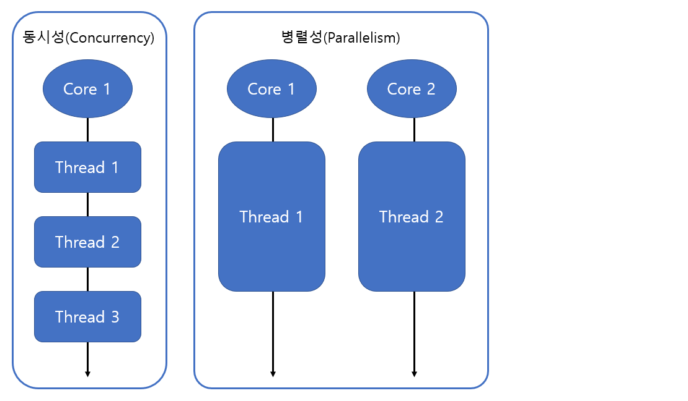
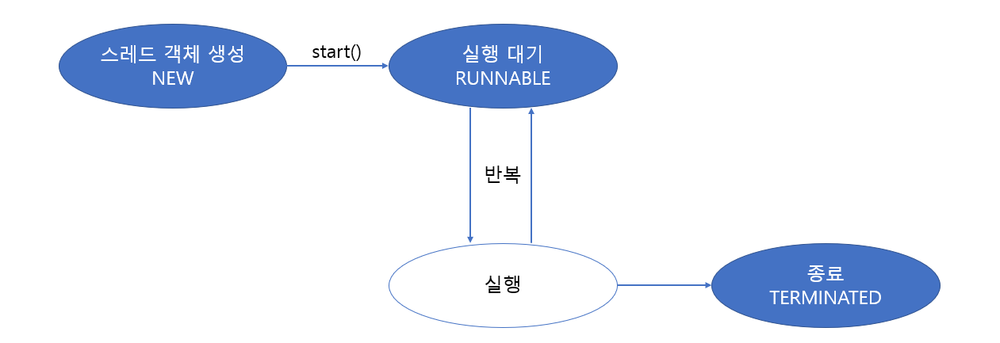
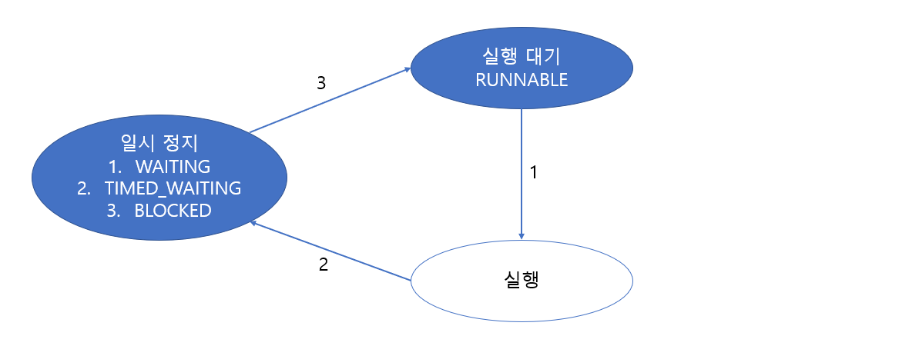
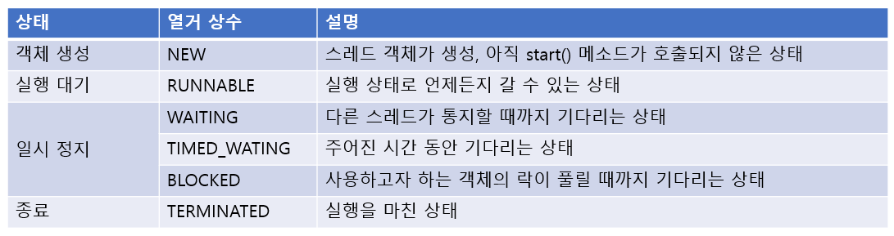

# Multi Thread

> 자바에서 쓰레드 사용 방법에 대한 전체적인 방법을 알아본다.

<br>

멀티 쓰레드에 대한 개념은 타 언어와 다른점이 없으니 생략하고 바로 사용방법에 대해 설명하겠다.

### 작업 스레드 생성과 실행

자바에서는 작업 스레드도 객체로 생성되기 때문에 클래스가 필요하다. java.lang.Thread 클래스를 직접 객체화해서 생성해도 되지만, Thread를 상속해서 하위 클래스를 만들어 생성할 수도 있다.

<br>

#### Thread 클래스로부터 직접 생성

java.lang.Thread 클래스로부터 작업 스레드 객체를 직접 생성하려면 다음과 같이 Runnable을 매개값으로 갖는 생성자를 호출해야 한다.

```java
Thread thread = new Thread(Runnable target);
```

Runnable은 인터페이스 타입이기 때문에 구현 객체를 만들어 대입해야 한다. Runnable에는 run() 메소드 하나가 정의되어 있는데, 구현 클래스는 run()을 재정의해서 작업 스레드가 실행할 코드를 작성해야 한다.

```java
class Task implements Runnable{
	public void run(){
		// 스레드가 실행할 코드
	}
}
```

Runnable 구현 객체를 생성한 후, 이것을 매개값으로 해서 Thread 생성자를 호출하면 비로소 작업 스레드가 생성된다.

```java
Runnable task = new Task();
Thread thread = new Thread(task);
```

Thread 생성자를 호출할 때 Runnable 익명 객체를 매개값으로 사용할 수 있다. 오히려 이 방법이 더 많이 사용된다.

```java
Thread thread = new Thread(new Runnable(){
	public void run(){
		// 스레드가 실행할 코드
	}
});
```

Runnable 인터페이스는 run() 메소드 하나만 정의되어 있기 때문에 함수적 인터페이스이다. 따라서 다음과 같이 람다식을 매개값으로 사용할 수도 있다.

```java
Thread thread = new Thread(()->{
	// 스레드가 실행할 코드
});
```

작업 스레드는 생성되는 즉시 실행되는 것이 아니라. start() 메소드를 다음과 같이 호출해야만 비로소 실행된다.

```java
thread.start();
```

<br>

#### Thread 하위 클래스로부터 생성

작업 스레드가 실행할 작업을 Runnable로 만들지 않고, Thread의 하위 클래스로 작업 스레드를 정의하면서 작업 내용을 포함시킬 수도 있다. Thread 클래스를 상속한 후 run 메소드를 재정의(overriding)해서 스레드가 실행할 코드를 작성하면 된다.

```java
public class WorkerThread extends Thread{
	@Override
	public void run(){
		// 스레드가 실행할 코드
	}
}
Thread thread = new WorkerThread
```

코드를 절약하기 위해 다음과 같이 Thread 익명 개체로 작업 스데르 객체를 생성할 수도 있다.

```java
Thread thread = new Thread(){
	public void run(){
		//스레드가 실행할 코드
	}
};
```

이렇게 생성된 작업 스레드 객체에서 start() 메소드를 호출하면 작업 스레드는 자신의 run() 메소드를 실행하게 된다.

```java
thread.run()
```

<br>

#### 스레드의 이름

스레드는 자신의 이름을 가지고 있다. 메인 스레드는 "main"이라는 이름을 가지고 있고, 직접 생성한 스레드는 자동적으로 "Thread-n"이라는 이름으로 설정된다. Thread 클래스의 setName() 메소드를 이름을 변경할 수 있다.

```java
thread.setName("스레드 이름");
```

반대로 스레드 이름을 알고 싶을 경우에는 getName() 메소드를 호출하면 된다.

```java
thread.getName()
```

만약 스레드 객체의 참조를 가지고 있지 않다면, Thread의 정적 메소드인 currentThread()로 코드를 실행하는 현재 스레드의 참조를 얻을 수 있다.

```java
Thread thread = Thread.currentThread();
```

<br>

<br>

### 스레드 우선순위

멀티 스레드는 동시성(Concurrency) 또는 병렬성(Parallelism) 으로 실행된다. 동시성은 멀티 작업을 위해 하나의 코어에서 멀티 스레드가 번갈아가며 실행하는 성질을 말하고, 병렬성은 멀티 작업을 위해 멀티 코어에서 개별 스레드를 동시에 실행하는 성질을 말한다.



스레드의 개수가 코어의 수보다 많을 경우, 스레드를 어떤 순서에 의해동시성으로 실행할 것인가를 결정해야 하는데, 이것을 스레드 스케줄링이라고 한다. 

자바의 스레드 스케줄링은 우선순위(Priority) 방식과 순환 할당(Round-Robin) 방식을 사용한다. 우선순위 방식은 우선순위가 높은 스레드가 실행 상태를 더 많이 가지도록 스케줄링 하는 것을 말한다. 순환 할당 방식은 시간 할당량(Time Slice)을 정해서 하나의 스레드를 정해진 시간만큼 실행하고 다시 다른 스레드를 실행하는 방식을 말한다. 스레드 우선순위 방식은 개발자가 코드로 제어할 수 있지만, 순환 할당 방식은 JVM에 의해서 정해지기 때문에 코드로 제어할 수 없다.

우선순위 방식에서 우선순위는 1에서부터 10까지 부여되는데, 1이 가장 우선순위가 낮다. 모든 스레드들은 기본적으로 5의 우선순위를 할당받는다. 만약 우선순위를 변경하고 싶다면 Thread 클래스가 제공하는 setPriority() 메소드를 이용하면 된다.

```java
thread.setPriority(우선순위);
```

우선순위의 매개값으로 1에서 10까지의 값을 직접 주어도 되지만, 코드의 가독성을 높이기 위해 Thread 클래스의 상수를 사용할 수도 있다.

```java
thread.setPriority(Thread.MAX_PRIORITY);	//10
thread.setPriority(Thread.NORM_PRIORITY);	//5
thread.setPriority(Thread.MIN_PRIORITY);	//1
```

<br>

<br>

### 동기화 메소드와 동기화 블록

자바는 임계 영역을 지정하기 위해 동기화(synchronized) 메소드와 동기화 블록을 제공한다. 스레드가 객체 내부의 동기화 메소드 또는 블록에 들어가면 즉시 객체에 잠금을 걸어 다른 스레드가 임계 영역 코드를 실행하지 못하도록 한다. 동기화 메소드를 만드는 방법은 다음과 같이 메소드 선언에 synchronized 키워드를 붙이면 된다. 이 키워드는 인스턴스와 정적 메소드 어디든 붙일 수 있다.

```java
public synchronized void method(){
	임계 영역;	//단 하나의 스레드만 실행
}
```

스레드가 동기화 메소드를 실행하는 즉시 객체에는 잠금이 일어나고, 스레드가 동기화 메소드를 실행 종료하면 잠금이 풀린다. 메소드 전체 내용이 아니라, 일부 내용만 임계영역으로 만들고 싶다면 다음과 같이 동기화(synchronized) 블록을 만들면 된다.

```java
public void method(){
	//여러 스레드가 실행 가능한 영역
	...
	synchronized(공유객체){
		임계 영역;	//단 하나의 스레드만 실행
	}
	//여러 스레드가 실행 가능한 영역
	...
}
```

동기화 블록의 외부 코드들은 여러 스레드가 동시에 실행할 수 있지만, 동기화 불록의 내부 코드는 임계 영역이므로 한 번에 한 스레드만 실행할 수 있고 다른 스레드는 실행할 수 없다. 

<br>

<br>

### 스레드 상태

스레드 객체를 생성하고, start() 메소드를 호출하면 스레드는 실행 대기 상태가 된다. 실행 대기 상태란 아직 스케줄링이 되지 않아서 실행을 기다리고 있는 상태를 말한다. 실행 대기 상태에 있는 스레드 중에서 스레드 스케줄링으로 선택된 스레드가 비로서 CPU를 점유하고 run() 메소드를 실행한다. 이때를 실행(Running) 상태라고 한다. 실행 상태의 스레드는 run() 메소드를 모두 실행하기 전에 스레드 스케줄링에 의해 다시 실행 대기 상태로 돌아갈 수 있다. 이렇게 스레드는 실행 대기 상태와 실행 상태를 번갈아가면서 자신의 run() 메소드를 조금씩 실행한다. 실행 상태에서 run() 메소드가 종료되면, 더 이상 실행할 코드가 없기 때문에 스레드의 실행은 멈추게 된다. 이 상태를 종료 상태라고 한다.



경우에 따라서 스레드는 실행 상태에서 일시 정지 상태로 가기도 하는데, 일시 정지 상태는 스레드가 실행할 수 없는 상태이다. 일시 정지 상태는 WAITING, TIMED_WAITING, BLOCKED 가 있는데, 지금은 스레드가 다시 실행 상태로 가기 위해서는 일시 정지 상태에서 실행 대기 상태로 가야 한다는 것만 알아두자.



이러한 스레드의 상태를 코드에서 확인할 수 있도록 하기 위해서 자바5부터 Thread 클래스에 getState() 메소드가 추가되었다. getState() 메소드는 다음 표처럼 스레드 상태에 따라서 Thread.State 열거 상수를 리턴한다.



<br>

### 스레드 제어 상태

실행 중인 스레드의 상태를 변경하는 것을 스레드 상태 제어라고 한다. 멀티 스레드 프로그램을 만들기 위해서는 정교한 스레드 상태 제어가 필요하다. 다음 표는 상태 변화를 가져오는 메소드의 종류를 보여준다.

| 메소드                                                       | 설명                                                         |
| ------------------------------------------------------------ | ------------------------------------------------------------ |
| interrupt()                                                  | 일시 정지 상태의 스레드에서 InterruptedException 예외를 발생시켜, 예외 처리 코드(catch)에서 실행 대기 상태로 가거나 종료 상태로 갈 수 있도록 한다. |
| notify()<br />notifyAll()                                    | 동기화 블록 내에서 wait() 메소드에 의해 일시 정지 상태에 있는 스레드를 실행 대기 상태로 만든다. |
| sleep(long millis)<br />sleep(long millis, int nanos)        | 주어진 시간 동안 스레드를 일시 정지 상태로 만든다. 주어진 시간이 지나면 자동적으로 실행 대기 상태가 된다. |
| join()<br />join(long millis)<br />join(long millis, int nanos) | join() 메소드를 호출한 스레드는 일시 정지 상태가 된다. 실행 대기 상태로 가려면, join() 메소드를 멤버로 가지는 스레드가 종료되거나, 매개값으로 주어진 시간이 지나야 한다. |
| yield()                                                      | 실행 중에 우선순위가 동일한 다른 스데르에게 실행을 양보하고 실행 대기 상태가 된다. |
| stop()                                                       | 스레드를 즉시 종료시킨다.                                    |

위 표에서 wait(), notify(), notifyAll() 은 Object 클래스의 메소드이고, 그 이외의 메소드는 모두 Thread 클래스의 메소드이다. 

<br>

