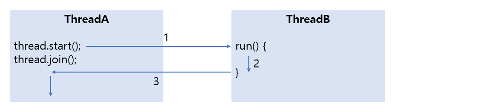

# Multi Thread

> 자바에서 쓰레드 사용 방법에 대한 전체적인 방법을 알아본다.

<br>

멀티 쓰레드에 대한 개념은 타 언어와 다른점이 없으니 생략하고 바로 사용방법에 대해 설명하겠다.

### 작업 스레드 생성과 실행

자바에서는 작업 스레드도 객체로 생성되기 때문에 클래스가 필요하다. java.lang.Thread 클래스를 직접 객체화해서 생성해도 되지만, Thread를 상속해서 하위 클래스를 만들어 생성할 수도 있다.

<br>

#### Thread 클래스로부터 직접 생성

java.lang.Thread 클래스로부터 작업 스레드 객체를 직접 생성하려면 다음과 같이 Runnable을 매개값으로 갖는 생성자를 호출해야 한다.

```java
Thread thread = new Thread(Runnable target);
```

Runnable은 인터페이스 타입이기 때문에 구현 객체를 만들어 대입해야 한다. Runnable에는 run() 메소드 하나가 정의되어 있는데, 구현 클래스는 run()을 재정의해서 작업 스레드가 실행할 코드를 작성해야 한다.

```java
class Task implements Runnable{
	public void run(){
		// 스레드가 실행할 코드
	}
}
```

Runnable 구현 객체를 생성한 후, 이것을 매개값으로 해서 Thread 생성자를 호출하면 비로소 작업 스레드가 생성된다.

```java
Runnable task = new Task();
Thread thread = new Thread(task);
```

Thread 생성자를 호출할 때 Runnable 익명 객체를 매개값으로 사용할 수 있다. 오히려 이 방법이 더 많이 사용된다.

```java
Thread thread = new Thread(new Runnable(){
	public void run(){
		// 스레드가 실행할 코드
	}
});
```

Runnable 인터페이스는 run() 메소드 하나만 정의되어 있기 때문에 함수적 인터페이스이다. 따라서 다음과 같이 람다식을 매개값으로 사용할 수도 있다.

```java
Thread thread = new Thread(()->{
	// 스레드가 실행할 코드
});
```

작업 스레드는 생성되는 즉시 실행되는 것이 아니라. start() 메소드를 다음과 같이 호출해야만 비로소 실행된다.

```java
thread.start();
```

<br>

#### Thread 하위 클래스로부터 생성

작업 스레드가 실행할 작업을 Runnable로 만들지 않고, Thread의 하위 클래스로 작업 스레드를 정의하면서 작업 내용을 포함시킬 수도 있다. Thread 클래스를 상속한 후 run 메소드를 재정의(overriding)해서 스레드가 실행할 코드를 작성하면 된다.

```java
public class WorkerThread extends Thread{
	@Override
	public void run(){
		// 스레드가 실행할 코드
	}
}
Thread thread = new WorkerThread
```

코드를 절약하기 위해 다음과 같이 Thread 익명 개체로 작업 스데르 객체를 생성할 수도 있다.

```java
Thread thread = new Thread(){
	public void run(){
		//스레드가 실행할 코드
	}
};
```

이렇게 생성된 작업 스레드 객체에서 start() 메소드를 호출하면 작업 스레드는 자신의 run() 메소드를 실행하게 된다.

```java
thread.run()
```

<br>

#### 스레드의 이름

스레드는 자신의 이름을 가지고 있다. 메인 스레드는 "main"이라는 이름을 가지고 있고, 직접 생성한 스레드는 자동적으로 "Thread-n"이라는 이름으로 설정된다. Thread 클래스의 setName() 메소드를 이름을 변경할 수 있다.

```java
thread.setName("스레드 이름");
```

반대로 스레드 이름을 알고 싶을 경우에는 getName() 메소드를 호출하면 된다.

```java
thread.getName()
```

만약 스레드 객체의 참조를 가지고 있지 않다면, Thread의 정적 메소드인 currentThread()로 코드를 실행하는 현재 스레드의 참조를 얻을 수 있다.

```java
Thread thread = Thread.currentThread();
```

<br>

<br>

### 스레드 우선순위

멀티 스레드는 동시성(Concurrency) 또는 병렬성(Parallelism) 으로 실행된다. 동시성은 멀티 작업을 위해 하나의 코어에서 멀티 스레드가 번갈아가며 실행하는 성질을 말하고, 병렬성은 멀티 작업을 위해 멀티 코어에서 개별 스레드를 동시에 실행하는 성질을 말한다.


스레드의 개수가 코어의 수보다 많을 경우, 스레드를 어떤 순서에 의해동시성으로 실행할 것인가를 결정해야 하는데, 이것을 스레드 스케줄링이라고 한다. 

자바의 스레드 스케줄링은 우선순위(Priority) 방식과 순환 할당(Round-Robin) 방식을 사용한다. 우선순위 방식은 우선순위가 높은 스레드가 실행 상태를 더 많이 가지도록 스케줄링 하는 것을 말한다. 순환 할당 방식은 시간 할당량(Time Slice)을 정해서 하나의 스레드를 정해진 시간만큼 실행하고 다시 다른 스레드를 실행하는 방식을 말한다. 스레드 우선순위 방식은 개발자가 코드로 제어할 수 있지만, 순환 할당 방식은 JVM에 의해서 정해지기 때문에 코드로 제어할 수 없다.

우선순위 방식에서 우선순위는 1에서부터 10까지 부여되는데, 1이 가장 우선순위가 낮다. 모든 스레드들은 기본적으로 5의 우선순위를 할당받는다. 만약 우선순위를 변경하고 싶다면 Thread 클래스가 제공하는 setPriority() 메소드를 이용하면 된다.

```java
thread.setPriority(우선순위);
```

우선순위의 매개값으로 1에서 10까지의 값을 직접 주어도 되지만, 코드의 가독성을 높이기 위해 Thread 클래스의 상수를 사용할 수도 있다.

```java
thread.setPriority(Thread.MAX_PRIORITY);	//10
thread.setPriority(Thread.NORM_PRIORITY);	//5
thread.setPriority(Thread.MIN_PRIORITY);	//1
```

<br>

<br>

### 동기화 메소드와 동기화 블록

자바는 임계 영역을 지정하기 위해 동기화(synchronized) 메소드와 동기화 블록을 제공한다. 스레드가 객체 내부의 동기화 메소드 또는 블록에 들어가면 즉시 객체에 잠금을 걸어 다른 스레드가 임계 영역 코드를 실행하지 못하도록 한다. 동기화 메소드를 만드는 방법은 다음과 같이 메소드 선언에 synchronized 키워드를 붙이면 된다. 이 키워드는 인스턴스와 정적 메소드 어디든 붙일 수 있다.

```java
public synchronized void method(){
	임계 영역;	//단 하나의 스레드만 실행
}
```

스레드가 동기화 메소드를 실행하는 즉시 객체에는 잠금이 일어나고, 스레드가 동기화 메소드를 실행 종료하면 잠금이 풀린다. 메소드 전체 내용이 아니라, 일부 내용만 임계영역으로 만들고 싶다면 다음과 같이 동기화(synchronized) 블록을 만들면 된다.

```java
public void method(){
	//여러 스레드가 실행 가능한 영역
	...
	synchronized(공유객체){
		임계 영역;	//단 하나의 스레드만 실행
	}
	//여러 스레드가 실행 가능한 영역
	...
}
```

동기화 블록의 외부 코드들은 여러 스레드가 동시에 실행할 수 있지만, 동기화 불록의 내부 코드는 임계 영역이므로 한 번에 한 스레드만 실행할 수 있고 다른 스레드는 실행할 수 없다. 

<br>

<br>

### 스레드 상태

스레드 객체를 생성하고, start() 메소드를 호출하면 스레드는 실행 대기 상태가 된다. 실행 대기 상태란 아직 스케줄링이 되지 않아서 실행을 기다리고 있는 상태를 말한다. 실행 대기 상태에 있는 스레드 중에서 스레드 스케줄링으로 선택된 스레드가 비로서 CPU를 점유하고 run() 메소드를 실행한다. 이때를 실행(Running) 상태라고 한다. 실행 상태의 스레드는 run() 메소드를 모두 실행하기 전에 스레드 스케줄링에 의해 다시 실행 대기 상태로 돌아갈 수 있다. 이렇게 스레드는 실행 대기 상태와 실행 상태를 번갈아가면서 자신의 run() 메소드를 조금씩 실행한다. 실행 상태에서 run() 메소드가 종료되면, 더 이상 실행할 코드가 없기 때문에 스레드의 실행은 멈추게 된다. 이 상태를 종료 상태라고 한다.


경우에 따라서 스레드는 실행 상태에서 일시 정지 상태로 가기도 하는데, 일시 정지 상태는 스레드가 실행할 수 없는 상태이다. 일시 정지 상태는 WAITING, TIMED_WAITING, BLOCKED 가 있는데, 지금은 스레드가 다시 실행 상태로 가기 위해서는 일시 정지 상태에서 실행 대기 상태로 가야 한다는 것만 알아두자.


이러한 스레드의 상태를 코드에서 확인할 수 있도록 하기 위해서 자바5부터 Thread 클래스에 getState() 메소드가 추가되었다. getState() 메소드는 다음 표처럼 스레드 상태에 따라서 Thread.State 열거 상수를 리턴한다.


<br>

<br>

### 스레드 제어 상태

실행 중인 스레드의 상태를 변경하는 것을 스레드 상태 제어라고 한다. 멀티 스레드 프로그램을 만들기 위해서는 정교한 스레드 상태 제어가 필요하다. 다음 표는 상태 변화를 가져오는 메소드의 종류를 보여준다.

| 메소드                                                       | 설명                                                         |
| ------------------------------------------------------------ | ------------------------------------------------------------ |
| interrupt()                                                  | 일시 정지 상태의 스레드에서 InterruptedException 예외를 발생시켜, 예외 처리 코드(catch)에서 실행 대기 상태로 가거나 종료 상태로 갈 수 있도록 한다. |
| notify()<br />notifyAll()                                    | 동기화 블록 내에서 wait() 메소드에 의해 일시 정지 상태에 있는 스레드를 실행 대기 상태로 만든다. |
| sleep(long millis)<br />sleep(long millis, int nanos)        | 주어진 시간 동안 스레드를 일시 정지 상태로 만든다. 주어진 시간이 지나면 자동적으로 실행 대기 상태가 된다. |
| join()<br />join(long millis)<br />join(long millis, int nanos) | join() 메소드를 호출한 스레드는 일시 정지 상태가 된다. 실행 대기 상태로 가려면, join() 메소드를 멤버로 가지는 스레드가 종료되거나, 매개값으로 주어진 시간이 지나야 한다. |
| yield()                                                      | 실행 중에 우선순위가 동일한 다른 스데르에게 실행을 양보하고 실행 대기 상태가 된다. |
| stop()                                                       | 스레드를 즉시 종료시킨다.                                    |

위 표에서 wait(), notify(), notifyAll() 은 Object 클래스의 메소드이고, 그 이외의 메소드는 모두 Thread 클래스의 메소드이다. 

<br>

#### 주어진 시간동안 일시 정지(sleep())

실행 중인 스레드를 일정 시간 멈추게 하고 싶다면 Thread 클래스의 정적 메소드인 sleep()을 사용하면 된다. 다음과 같이 Thread.sleep() 메소드를 호출한 스레드는 주어진 시간 동안 일시 정지 상태가 되고, 다시 실행 대기 상태로 돌아간다.

````java
try{
	Thread.sleep(1000);
} catch(InterruptedException e){
	// interrupt() 메소드가 호출되면 실행
}
````

매개값에는 얼마 동안 일시 정지 상태로 있을 것인지, 밀리세컨드(1/1000) 단위로 시간을 주면 된다. 일시 정지 상태에서 주어진 시간이 되기 전에 interrupt() 메소드가 호출되면 InterruptException이 발생하기 때문에 예외 처리가 필요하다.

<br>

#### 다른 스레드에게 실행 양보(yield())

스레드가 처리하는 작업은 반복적인 실행을 위해 for문이나 while 문을 포함하는 경우가 많다. 가끔은 이 반복문들이 무의미한 반복을 하는 경우가 있다. 이때 사용하는 것이 yield()메소드이다. yield() 메소드를 호출한 스레드는 실행 대기 상태로 돌아가고 동일한 우선순위 또는 높은 우선순위를 갖는 다른 스레드가 실행 기회를 가질 수 있도록 해준다.

다음 코드는 의미 없는 반복을 줄이기 위해 yield() 메소드를 호출해서 다른 스레드에게 실행 기회를 주도록 한것이다.

```java
public void run(){
	while(true){
		if(work){
			System.out.println("Thread 작업 내용");
		}
		else{
			Thread.yield();
		}
	}
}
```

<br>

#### 다른 스레드의 종료를 기다림(join())

스레드는 다른 스레드와 독립적으로 실행하는 것이 기본이지만 다른 스레드가 종료될 때까지 기다렸다가 실행해야 하는 경우가 발생할 수도 있다. 이런 경우를 위해서 Thread는 join() 메소드를 제공하고 있다. 다음 그림을 보고 이해해보자. ThreadA가 ThreadB의 join() 메소드를 호출하면 ThreadA는 ThreadB가 종료할 때까지 일시 정지 상태가 된다. ThreadB의 run() 메소드가 종료되면 비로소 ThreadA는 일시 정지에서 풀려 다음 코드를 실행하게된다.



<br>

#### 스레드 간 협업(wait(), notify(), notifyAll())

경우에 따라서는 두 개의 스레드를 교대로 번갈아가며 실행해야 할 경우가 있다. 자신의 작업이 끝나면 상대방 스레드를 일시 정지 상태에서 풀어주고, 자신은 일시 정지 상태로 만드는 것이다. 이 방법의 핵심은 공유 객체에 있다. 공유 객체는 두 스레드가 작업할 내용을 각각 동기화 메소드로 구분해 놓는다. 한 스레드가 작업을 완료하면 nofity() 메소드를 호출해여 일시 정지 상태에 있는 다른 스레드를 실행 대기 상태로 만들고, 자신은 두 번 작업을 하지 않도록 wait() 메소드를 호출하여 일시 정지 상태로 만든다.

wait() 대신 wait(long timeout)이나, wait(long timeout, int nanos) 를 사용하면 notify()를 호출하지 않아도 지정된 시간이 지나면 스레드가 자동적으로 실행 대기 상태가 된다. nofity() 메소드와 동일한 역할을 하는 notifyAll() 메소드도 있는데, notify()는 wait() 에 의해 일시 정지된 스레드 중 한 개를 실행 대기 상태로 만들고, notifyAll() 메소드는 wait()에 의해 일시 정지된 모든 스레드들을 실행 대기 상태로 만든다. 이 메소드들은 Thread 클래스가 아닌 Object 클래스에 선언된 메소드이므로 모든 공유 객체에서 호출이 가능하다. 주의할 점은 이 메소드들은 동기화 메소드 또는 동기화 블록 내에서만 사용할 수 있다.

<br>

#### 스레드의 안전한 동료(stop 플래그, interrupt())

스레드는 자신의 run() 메소드가 모두 실행되면 자동적으로 종료된다. 경우에 따라서는 실행 중인 스레드를 즉시 종료할 필요가 있다. Thread는 스레드를 즉시 종료시키기 위해서 stop() 메소드를 제공하고 있는데, 이 메소드는 deprecated 되었다. 그 이유는 stop() 메소드로 스레드를 갑자기 종료하게 되면 스레드가 사용 중이던 자원들이 불안전한 상태로 남겨지기 때문이다. 그럼 이제 스레드를 종료시키는 안전한 방법을 알아보자.

##### stop 플래그를 이용하는 방법

스레드는 run() 메소드가 끝나면 자동적으로 종료되므로, run() 메소드가 정상적으로 종료되도록 유도하는 것이 최선의 방법이다. 다음 코드는 stop 플래그를 이용해서 run() 메소드의 종료를 유도한다.

```java
public class XXXThread extends Thread{
	private boolean stop;	//stop 플래그 필드
	
	public void run(){
		while(!stop){
			스레드가 반복 실행하는 코드;
		}
		//스레드가 사용한 자원 정리
	}
}
```

##### interrupt() 메소드를 이용하는 방법

interrupt() 메소드는 스레드가 일시 정지 상태에 있을 때 InterruptedException 예외를 발생시키는 역할을 한다. 이것을 이용하면 run() 메소드를 정상 종료시킬 수 있다. 예를 들어 ThreadA가 ThreadB를 생성해서 start() 메소드로 ThreadB를 실행했다고 가정해보자.

ThreadA가 ThreadB의 inerrupt() 메소드를 실행하게 되면 ThreadB가 sleep() 메소드로 일시 정지 상태가 될 때 ThreadB에서 InterruptedException이 발생하여 예외 처리(catch)블록으로 이동한다. 결국 ThreadB는 while문을 빠져나와 run() 메소드를 정상 종료하게 된다.

<br>

<br>

###  데몬 스레드

데몬(daemon) 스레드는 주 스레드의 작업을 돕는 보조적인 역할을 수행하는 스레드이다. 주 스레드가 종료되면 데몬 스레드는 강제적으로 자동 종료되는데, 그 이유는 주 스레드의 보조 역할을 수행하므로 주 스레드가 종료되면 데몬 스레드의 존재 의미가 없어지기 때문이다.

스레드를 데몬으로 만들기 위해서는 주 스레드가 데몬이 될 스레드의 setDaemon(true)를 호출해주면 된다. 아래 코드를 보면 메인 스레드가 주 스레드가 되고 AutoSaveThread가 데몬 스레드가 된다.

```java
public static void main(String[] args){
	AutoSaveThread thread = new AutoSaveThread();
	thread.setDaemon(true);
	thread.start();
	...
}
```

주의할 점은 start() 메소드가 호출되고 나서 setDaemon(true) 를 호출하면 IllegalThreadStateException이 발생하기 때문에 satrt() 메소드 호출 전에 setDaemon(true)를 호출해야 한다. 현재 실행 중인 스레드가 데몬 스레드인지 아닌지를 구별하기 위해 isDaemon() 메소드도 제공하고 있다.

<br>

<br>

### 스레드풀

자바는 스레드풀을 생성하고 사용할 수 있도록 java.util.concurrent 패키지에서 ExecutorService 인터페이스와 Executors 클래스를 제공하고 있다. Executors 의 다양한 정적 메소드를 이용해서 ExecutorService 구현 객체를 만들 수 있는데, 이것이 바로 스레드풀이다.

<br>

#### 스레드풀 생성

ExecutorService 구현 객체는 Executors 클래스의 다음 두 가지 메소드 중 하나를 이용해서 간편하게 생성할 수 있다.

| 메소드명(매개 변수)              | 초기 스레드 수 | 코어 스레드 수 | 최대 스레드 수    |
| -------------------------------- | -------------- | -------------- | ----------------- |
| newCachedThreadPool()            | 0              | 0              | Integer.MAX_VALUE |
| newFixedThreadPool(int nThreads) | 0              | nThreads       | nThreads          |

* 초기 스레드 수 - ExecutorService 객체가 생성될 때 기본적으로 생성되는 스레드 수
* 코어 스레드 수 - 스레드 수가 증가된 후 사용되지 않는 스레드를 스레드풀에서 제거할 때 최소한 유지해야 할 스레드 수
* 최대 스레드 수 - 스레드풀에서 관리하는 최대 스레드 수

다음은 newCachedThreadPool()을 호출해서 ExecutorService 구현 객체를 얻는 코드이다.

```java
ExecutorService executorService = Executors.newCachedThreadPool();
```

다음은 CPU 코어의 수만큼 최대 스레드를 사용하는 스레드풀을 생성한다.

```java
ExecutorService executorService = Executor.newFixedThreadsPool(
	Runtime.getRuntime().availableProcessors();
);
```

<br>

#### 스레드풀 종료

스레드풀의 스레드는 기본적으로 데몬 스레드가 아니기 때문에 main 스레드가 종료되더라도 작업을 처리하기 위해 계속 실행 상태로 남아있다. 애플리케이션을 종료하려면 스레드풀을 종료시켜 스레드들이 종료 상태가 되도록 처리해주어야 한다. ExecutorService는 종료와 관련해서 다음 세 개의 메소드를 제공하고 있다.

| 리턴 타입          | 메소드명(매개 변수)                                     | 설명                                                         |
| ------------------ | ------------------------------------------------------- | ------------------------------------------------------------ |
| void               | shutdown()                                              | 현재 처리 중인 작업뿐만 아니라 작업 큐에 대기하고 있는 모든 작업을 처리한 뒤에 스레드풀을 종료시킨다. |
| List&#60;Runnable> | shutdownNow()                                           | 현재 작업 처리 중인 스레드를 interrupt 해서 작업 중지를 시도하고 스레드풀을 종료시킨다. 리턴값은 작업 큐에 있는 미처리된 작업의 목록이다. |
| boolean            | awaitTermination(<br />long timout,<br />TimeUnit unit) | shutdown() 메소드 호출 이후, 모든 작업 처리를 timeout 시간 내에 완료하면 true를 리턴하고, 완료하지 못하면 작업 처리 중인 스레드를 interrupt하고 false를 리턴한다. |

<br>

#### 작업 생성

하나의 작업은 Runnable 또는 Callable 구현 클래스로 표현한다. Runnable과 Callable의 차이점은 작업 처리 완료 후 리턴값이 있느냐 없느냐이다. 다음은 작업을 정의하기 위해 Runnable과 Callable 구현 클래스를 작성하는 방법을 보여준다.

##### Runnable 구현 클래스

```java
Runnable task = new Runnable(){
	@Override
	public void run(){
		//스레드가 처리할 작업 내용
	}
}
```

##### Callable 구현 클래스

```java
Callable<T> task = new Callable<T> {
	@Override
	public T call() throws Exception{
		//스레드가 처리할 작업 내용
		return T;
	}
}
```

Runnable의 run() 메소드는 리턴값이 없고, Callable의 call() 메소드는 리턴값이 있다. 스레드풀의 스레드는 작업 큐에서 Runnable 또는 Callable 객체를 가져와 run() 과 call() 메소드를 실행한다.

<br>

#### 작업 처리 요청

작업 처리 요청이란 ExcutorService 의 작업 큐에 Runnable 또는 Callable 객체를 넣는 행위를 말한다. ExecutorService는 작업 처리 요청을 위해 다음 두 가지 종류의 메소드를 제공한다.

| 리턴 타입                                       | 메소드명(매개 변수)                                          | 설명                                                         |
| ----------------------------------------------- | ------------------------------------------------------------ | ------------------------------------------------------------ |
| void                                            | execute(Runnable command)                                    | -Runnable을 작업 큐에 저장<br />-작업 처리 결과를 받지 못함  |
| Future<?><br />Future&#60;V><br />Future&#60;V> | submit(Runnable task)<br />submit(Runnable task, V result)<br />submit(Callable&#60;V> task) | -Runnable 또는 Callable을 작업 큐에 저장<br />-리턴된 Future를 통해 작업 처리 결과를 얻을 수 있음 |

execute()는 작업 처리 도중 예외가 발생하면 스레드가 종료되고 해당 스레드는 스레드풀에서 제거된다. 따라서 스레드풀은 다른 작업 처리를 위해 새로운 스레드를 생성한다. 반면에 submit()은 작업 처리 도중 예외가 발생하더라도 스레드는 종료되지 않고 다음 작업을 위해 재사용된다. 그렇기 때문에 가급적이면 스레드의 오버헤드를 줄이기 위해서 submit()을 사용하는 것이 좋다.

<br>

#### 블로킹 방식의 작업 완료 통보

ExecutorService 의 submit() 메소드는 매개값으로 준 Runnable 또는 Callable 작업을 스레드풀의 작업 큐에 저장하고 즉시 Future 객체를 리턴한다.

| 리턴 타입                                       | 메소드명(매개 변수)                                          | 설명                                                         |
| ----------------------------------------------- | ------------------------------------------------------------ | ------------------------------------------------------------ |
| Future<?><br />Future&#60;V><br />Future&#60;V> | submit(Runnable task)<br />submit(Runnable task, V result)<br />submit(Callable&#60;V> task) | -Runnable 또는 Callable을 작업 큐에 저장<br />-리턴된 Future를 통해 작업 처리 결과를 얻을 수 있음 |

Future  객체는 작업 결과가 아니라 작업이 완료될까지 기다렸다가(블로킹 되었다가) 최종 결과를 얻는데 사용된다. 그래서 Future를 지연 완료(pending completion) 객체라고 한다. Future 의 get() 메소드를 호출하면 스레드가 작업을 완료할 때까지 블로킹되었다가 작업을 오나료하면 처리 결과를 리턴한다. 다음은 Future가 가지고 있는 get() 메소드를 설명한 표이다.

| 리턴 타입 | 메소드명(매개 변수)              | 설명                                                         |
| --------- | -------------------------------- | ------------------------------------------------------------ |
| V         | get()                            | 작업이 완료될 때까지 블로킹되었다가 처리 결과 V 를 리턴      |
| V         | get(long timeout, TimeUnit unit) | timeout 시간 전에 작업이 완료되면 결과V를 리턴하지만,<br />작업이 완료되지 않으면 TimeoutException을 발생시킴 |

다음은 세 가지 submit() 메소드별로 Future의 get() 메소드가 리턴하는 값이 무엇인지 보여준다.

| 메소드                                | 작업 처리 완료 후 리턴 타입    | 작업 처리 도중 예외 발생  |
| ------------------------------------- | ------------------------------ | ------------------------- |
| submit(Runnable task)                 | future.get() -> null           | future.get() -> 예외 발생 |
| submit(Runnable task, Integer result) | future.get() -> int 타입 값    | future.get() -> 예외 발생 |
| submit(Callable&#60;String> task)     | future.get() -> String 타입 값 | future.get() -> 예외 발생 |

Future를 이용한 블로킹 방식의 작업 완료 통보에서 주의할 점은 작업을 처리하는 스레드가 작업을 완료하기 전까지는 get() 메소드가 블로킹되므로 다른 코드를 실행할 수 없다는 점이다. 따라서 get() 메소드를 호출하는 스레드는 새로운 스레드이거나 스레드풀의 또 다른 스레드가 되어야 한다.

Future 객체는 작업 결과를 얻기 위한 get() 메소드 이외에도 다음과 같은 메소드를 제공한다.

| 리턴 타입 | 메소드명(매개 변수)                   | 설명                                |
| --------- | ------------------------------------- | ----------------------------------- |
| boolean   | cancel(boolean mayInterruptIfRunning) | 작업 처리가 진행 중일 경우 취소시킴 |
| boolean   | isCancelled()                         | 작업이 최소되었는지 여부            |
| boolean   | isDone()                              | 작업 처리가 완료되었는지 여부       |

<br>

#### 리턴값이 없는 작업 완료 통보

리턴값이 없는 작업일 경우는 Runnable 객체로 생성하면 된다. 다음은 Runnable 객체를 생성하는 방법을 보여준다.

```java
Runnable task = new Runnable(){
	@Override
	public void run(){
		//스레드가 처리할 작업 내용
	}
};
```

결과값이 없는 작업 처리 요청은 submit(Runnable task) 메소드를 이용하면 된다. 결과값이 없음에도 다음과 같이 Future 객체를 리턴하는데, 이것은 스레드가 작업 처리를 정상적으로 완료했는지, 아니면 작업 처리 도중에 예외가 발생했는지 확인하기 위해서이다.

```java
Future future = executorService.submit(task);
```

작업 처리가 정상적으로 완료되었다면 Future의 get() 메소드는 null을 리턴하지만 스레드가 작업 처리 도중 interrupt 되면 InterruptedException을 발생시키고, 작업 처리 도중 예외가 발생하면 ExecutionException을 발생시킨다. 그래서 다음과 같은 예외 처리 코드가 필요하다.

```java
try{
	future.get();
} catch (InterruptedException e){
	//작업 처리 도중 스레드가 interrupt 될 경우 실행할 코드
} catch (ExecutionException e){
	//작업 처리 도중 예외가 발생된 경우 실행할 코드
}
```

<br>

#### 리턴값이 있는 작업 완료 통보

스레드풀의 스레드가 작업을 완료한 후에 애플리케이션이 처리 결과를 얻어야 된다면 작업 객체를 Callable로 생성하면 된다. 다음은 Callable 객체를 생성하는 코드인데, 주의할 점은 제네릭 타입 파라미터 T는 call() 메소드가 리턴하는 타입이 되도록 한다.

```java
Callable<T> task = new Callable<T> {
	@Override
	public T call() throws Exception{
		//스레드가 처리할 작업 내용
		return T;
	}
}
```

Callable 작업의 처리 요청은 Runnable 작업과 마찬가지로 ExecutorService의 submit() 메소드를 호출하면 된다. submit() 메소드는 작업 큐에 Callable 객체를 저장하고 즉시 Future<T>를 리턴한다. 이때 T는 call() 메소드가 리턴하는 타입이다.

```java
Future<T> future = executorService.submit(task);
```

스레드풀의 스레드가 Callable 객체의 call() 메소드를 모두 실행하고 T 타입의 값을 리턴하면, Future<T>의 get() 메소드는 블로킹이 해제되고 T타입의 값을 리턴하게 된다.

```java
try{
	T result = future.get();
} catch (InterruptedException e){
	//작업 처리 도중 스레드가 interrupt 될 경우 실행할 코드
} catch (ExecutionException e){
	//작업 처리 도중 예외가 발생된 경우 실행할 코드
}
```

<br>

#### 작업 처리 결과를 외부 객체에 저장

상황에 따라서 스레드가 작업한 결과를 외부 객체에 저장해야 할 경우도 있다. 이런 작업을 하기 위해서 ExecutorService 의 submit(Runnable task, V result) 메소드를 사용할 수 있는데, V가 바로 Result 타입이 된다. 메소드를 호출하면 즉시 Future<V>가 리턴되는데, Future의 get() 메소드를 호출하면 스데르가 작업을 완료할 때까지 블로킹되었다가 작업을 완료하면 V타입 객체를 리턴한다. 리턴된 객체는 submit()의 두 번째 매개값으로 준 객체와 동일한데, 차이점은 스레드 처리 결과가 내부에 저장되어 있다는 것이다.

```java
Result result = ....;
Runnable task = new Task(result);
Future<Result> future = executorService.submit(task, result);
result = future.get();
```

작업 객체는 Runnable 구현 클래스로 생성하는데, 주의할 점은 스레드에서 결과를 저장하기 위해 외부 Result 객체를 사용해야 하므로 생성자를 통해 Result 객체를 주입받도록 해야 한다.

```java
class Task implements Runnable{
	Result result;
	Task(Result result){this.result = result;}
	@Override
	public void run(){
		//작업 코드
		//처리 결과를 result로 저장
	}
}
```

<br>

#### 작업 완료 순으로 통보

여러 개의 작업들이 순차적으로 처리될 필요성이 없고, 처리 결과도 순차적으로 이용할 필요가 없다면 작업 처리가 완료된 것부터 결과를 얻어 이용하면 된다. 스레드풀에서 작업 처리가 완료된 것만 통보받는 방법이 있는데, CompletionService를 이용하는 것이다. CompletionService는 처리 완료된 작업을 가져오는 poll()과 take() 메소드를 제공한다.

| 리턴 타입     | 메소드명(매개 변수)                    | 설명                                                         |
| ------------- | -------------------------------------- | ------------------------------------------------------------ |
| Future&#60;V> | poll()                                 | 완료된 작업의 Future를 가져옴.<br />완료된 작업이 없다면 즉시 null을 리턴함 |
| Future&#60;V> | poll(long timeout,<br />TimeUnit unit) | 완료된 작업의 Future를 가져옴.<br />완료된 작업이 없다면 timeout까지 블로킹됨 |
| Future&#60;V> | take()                                 | 완료된 작업의 Future을 가져옴<br />완료된 작업이 없다면 있을 때까지 블로킹 |
| Future&#60;V> | submit(Callable&#60;V> task)           | 스레드풀에 Callable 작업 처리 요청                           |
| Future&#60;V> | submit(Runnable task, V result)        | 스레드풀에 Runnable 작업 처리 요청                           |

CompletionService 구현 클래스는 ExecutorCompletionService<V> 이다. 객체를 생성할 때 생성자 매개값으로 ExecutorService를 제공하면 된다.

```java
ExecutorService executorService = Executors.newFixedThreadPool(
	Runtime.getRuntime().availableProcessors()
);
CompletionService<V> completionService = new ExecutorCompletionService<V>(
	executorService
);
```

poll() 과 take() 메소드를 이용해서 처리 완료된 작업의 Future를 얻으려면 CompletionService의 submit() 메소드로 작업 처리 요청을 해야 한다.

```java
completionService.submit(Callable<V> task);
completionService.submit(Runnable task, V result);
```

<br>

#### 콜백 방식의 작업 완료 통보

콜백이란 애플리케이션이 스레드에게 작업 처리를 요청한 후, 스레드가 작업을 완료하면 특정 메소드를 자동 실행하는 기법을 말한다. 이때 자동 실행되는 메소드를 콜백 메소드라고 한다. 

ExecutorService는 콜백을 위한 별도의 기능을 제공하지 않는다. 하지만 Runnable구현 클래스를 작성할 때 콜백 기능을 구현할 수 있다. 먼저 콜백 메소드를 가진 클래스가 있어야 하는데, 직접 정의해도 좋고 java.nio.channels.CompletionHandler를 이용해도 좋다. 이 인터페이스는 NIO 패키지에 포함되어 있는데 비동기 통신에서 콜백 객체를 만들 때 사용된다. 그럼 CompletionHandler를 이용해서 콜백 객체를 만드는 방법을 살펴보자. 다음은 CompletionHandler 객체를 생성하는 코드이다.

```java
CompletionHandler<V, A> callback = new CompletionHandler<V, A>(){
	@Override
	public void completed(V result, A attachment){
	}
	@Override
	public void failed(Throwable exc, A attachment){
	}
};
```

CompletionHandler는 completed() 와 failed() 메소드가 있는데, completed() 는 작업을 정상 처리 완료했을 때 호출되는 콜백 메소드이고, failed() 는 작업 처리 도중 예외가 발생했을 때 호출되는 콜백 메소드이다. CompletionHandler의 V타입 파라미터는 결과값의 타입이고, A는 첨부값의 타입이다. 첨부값은 콜백 메소드에 결과값 이외의 추가적으로 전달하는 객체라고 생각하면 된다. 만약 첨부값이 필요 없다면 A는 Void로 지정해주면 된다. 다음은 작업 처리 결과에 따라 콜백 메소드를 호출하는 Runnable 객체이다.

```java
Runnable task = new Runnable(){
	@Override
	public void run(){
		try{
			//작업 처리
			V result = ...;
			callback.completed(result, null);
		} catch(Exception e){
			callback.failed(e, null);
		}
	}
};
```

작업 처리가 정상적으로 완료되면 completed() 콜백 메소드를 호출해서 결과값을 전달하고, 예외가 발생하면 failed() 콜백 메소드를 호출해서 예외 객체를 전달한다.

