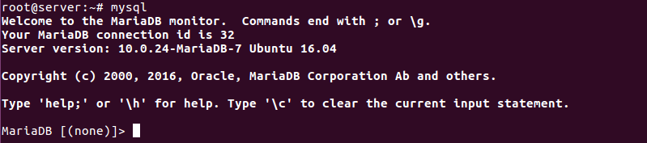
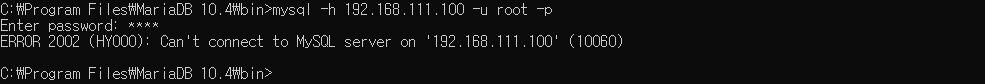
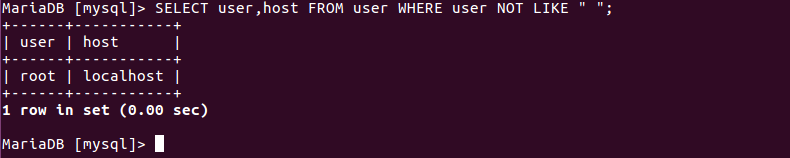
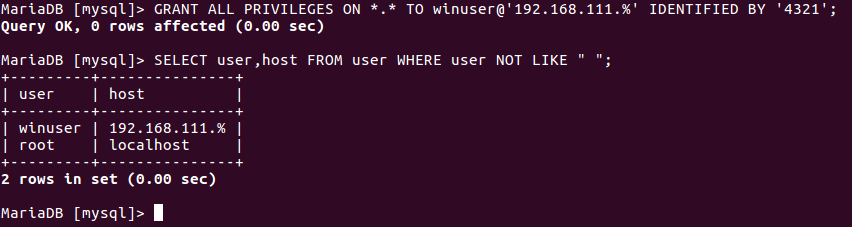
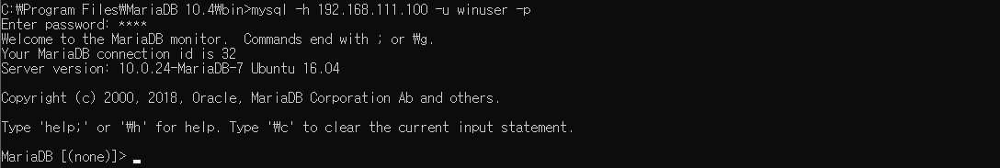

# DB Server

> 데이터베이스 서버 구축과 운영

<br>

### Maria DB 설치와 운영

`apt-get -y install mariadb-server mariadb-client` 명령으로 Maria DB를 설치한다.

다음 명령을 차례로 입력해 서비스를 가동한다. Maria DB 서비스 이름은 `mysql` 이다.

```
systemctl restart mysql
systemctl status mysql
```

`ufw allow 3306` 명령으로 Maria DB 포트인 3306번을 방화벽에서 허용해준다.

<br>

Maria DB 클라이언트 프로그램의 실행 명령인 `mysql` 을 입력한다. [MariaDB [(none)] >] 프롬프트가 나오면 서버에 정상적으로 접속된 것이다. 이제는 SQL 문을 사용하면 된다. `exit` 명령을 입력하면 종료 가능하다.



이것으로 Maria DB 데이터 베이스 서버 설치를 완료했다.

> 비록 Maria DB 서버의 실행 스크립트도 mysql 이고, Maria DB 클라이언트 실행 파일 이름도 mysql 이지만, 2개는 완전히 별개의 것이다. Maria DB 서버 스크립트는 /etc/systemd/system/mysql.service 파일이고, Maria DB 클라이언트 실행 파일은 /usr/bin/mysql 파일이다.

<br>

데이터베이스 서버에는 중요한 정보를 많이 보관하게 될 것이다. 그래서 대부분의 DBMS 는 사용자와 관련된 보안 정택이 별도로 있다.

여기서 이야기하는 사용자란 '데이터베이스 사용자'를 말하는 것이며, '운영체제 사용자'와는 별개의 개념이다. Maria DB 서버를 설치하면 별도의 데이터베이스 사용자를 생성하지 않아도 root 라는 이름의 데이터베이스 사용자가 자동으로 생성되며, 비밀번호는 따로 지정하지 않았다.

따라서 옵션을 모두 생략하고 `mysql` 명령어만 실행하면, 현재 운영체제 사용자와 같은 이름인 root사용자 권한으로 비밀번호 없이 접속이 된 것이다.

그러므로 Maria DB 서버를 설치한 직후에는, 데이터베이스 사용자 root의 비밀번호를 먼저 지정해 데이터베이스 보안의 기본을 지켜야 한다. 원칙적으로 Maria DB 서버에 접속하려면 `mysql -u 사용자이름 -p` 명령을 실행한 수, 데이터베이스 사용자의 비밀번호를 입력해서 접속해야만 한다.

<br>

#### Maria DB 의 기본적인 보안 환경 설정

`mysqladmin -u root password '1234'` 명령을 입력해 데이터베이스 관리자 root 의 비밀번호를 설정한다.


기본적으로 Maria DB는 외부에서 접속되지 않도록 설정되었다.  vi로 `/etc/mysql/mariadb.conf.d/50-server.cnf` 파일을 열고 29행쯤의 `bind-address = 127.0.0.1` 부분을 주석처리한다.

> mariaDB 버전에 따라 파일 위치가 다를수도 있다. 위 파일이 없다면 /etc/mysql/my.cnf 파일을 열어 설정파일의 위치를 확인한다.

`systemctl restart mysql` 명령으로 서비스를 재시작한다.

<br>

<br>

### Windows 에서 리눅스 Maria DB 서버로 접속

Maria DB 홈페이지에 들어가 MariaDB 클라이언트를 다운받는다.

설치된 MariaDB command prompt 를 실행해서 `mysql -h 서버IP주소 -u 사용자이름 -p` 명령으로 서버에 접속해본다.



비밀번호를 입력해도 접속이 되지 않는다. 여기서 MariaDB가 관리하는 사용자의 개념이 하나 더 나온다. MariaDB는 이메일 주소와 비슷한 형식으로 사용자 이름을 사용한다. 즉, `사용자이름@호스트이름또는IP주소` 형식으로 사용자를 관리한다. 그래서 MariaDB 서버에서 비밀번호를 '1234' 로 지정한 데이터베이스 사용자 root 의 정식 이름은 `root@localhost` 였던 것이다.

원칙적으로 MariaDB  서버에 접속하는 클라이언트 명령은 `mysql -h 서버IP주소 -u 사용자이름 -p` 명령을 실행해 접속해야 한다. 그러면 내부적으로 `사용자이름` 을 `사용자이름@현재컴퓨터IP` 를 붙여서 접속하게 된다.

다시 Windows 에서 접속할 때 입력한 명령인 `mysql -h 192.168.111.100 -u root -p` 명령을 살펴보면, 일단 Server IP 의 컴퓨터에 MariaDB 서버가 설치되어 있으므로, 사용자 인증만 받으면 접속이 승인된다. 그런데 문제는 Windows 에서 입력한 root 사용자의 정식 이름은 `root@WindowsIP주소` 다. MariaDB 서버에 접속이 허용된 DB 사용자는 `root@localhost(또는 root@127.0.0.1)` 만 있으므로 접속이 거부된 것이다.

<br>

사용자 개념을 파악했으므로 WindClient에서 접속할 사용자를 생성해주기로 한다.

먼저 서버에서 `mysql -u root -p` 명령을 입력해 MariaDB 서버에 접속한다. 접속 후에, 다음 SQL 문을 입력해 시스템 데이터베이스인 mysql 데이터베이스에 있는 user 테이블을 조회해본다.

```sql
USE mysql;
SELECT user,host FROM user WHERE user NOT "LIKE ' '";	-> 사용자 이름이 비어 있는 것은 제외
```



위 사진은 mysql 데이터베이스에 있는 user 테이블의 user 열과 host 열을 조회한 결과다. 즉, 현재 컴퓨터에서 접속할 경우에만 데이터베이스 사용자 root 로 접속할 수 있다.

WinClient 의 정확한 IP 주소만으로 사용자를 생성할 수 있다. 자신의 IP주소를 확인하고 `사용자ID@본인IP주소` 사용자를 생성하면 된다. 만약 자신이 동적 IP 주소를 사용하기 때문에 재부팅할 때마다 IP 주소가 바뀔 수 있다면 다음과 같이 사용자를 생성해 해결할 수 있다.

`GRANT ALL PRIVILEGES ON *.* TO winuser@'192.168.111.%' IDENTIFIED BY '4321'` 명령을 입력한다.



네 번째 주소인 &#42;&#42;&#42; 부분에 % 를 써줬다는 것을 살펴본다.

사용자를 생성하고 확인해보니 'winuser@192.168.111.%' 이라는 사용자가 생성된 것을 확인할 수 있다. 이제 192.168.111.&#42;&#42;&#42; IP 주소의 컴퓨터는 모두 winuser로, 암호 4321을 사용하면 접속할 수 있다.

```
'사용권한'을 'ALL PRIVILEGES'로 설정하면 모든 권한을 다 준다는 의미다. 권한의 일부만 주려면 SELECT, INSERT, UPDATE, DELETE 등의 권한을 별도로 줄 수 있다.

'데이터베이스이름.테이블이름'을 '*.*'로 설정하면 모든 데이터베이스와 모든 테이블에 접근이 가능하다는 의미다. 만약 mysql 데이터베이스의 user 테이블만 사용할 수 있게 허락하려면 'mysql.user'라고 설정하면 된다.
```

WinClient 에서 다시 `mysql -h 서버IP -u winuser -p` 명령을 입력해 winuser 사용자로 접속하면 정상적으로 접속되는걸 확인할 수 있다.

