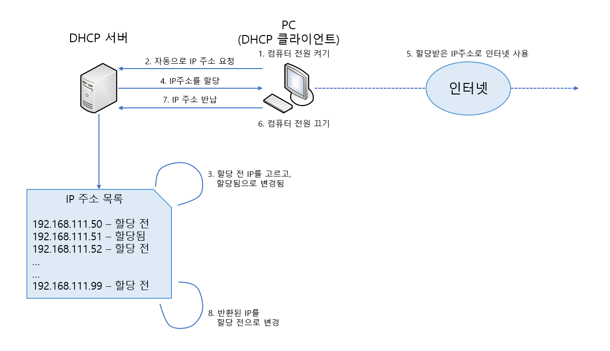
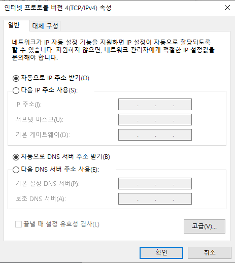

# DHCP Server

> DHCP 서버의 설치와 운영을 알아본다.

<br>

### DHCP 개념

DHCP 서버의 역할은 자신의 네트워크 안에 있는 클라이언트 컴퓨터가 부팅될 때, 자동으로 IP 주소, 서브넷 마스크, 게이트웨이 주소, DNS 서버 주소를 할당해주는 것이다. 그러면 더 이상 클라이언트 컴퓨터를 사용하는 일반 사용자는 인터넷을 하기 위한 IP 주소와 관련된 정보를 알지 못해도, 인터넷을 사용하는데 아무런 문제가 없을 것이다.

이와같이 DHCP 서버의 가장 큰 장점은 관리의 편의성과 이용자의 편의성을 들 수 있다. 또, 한정된 IP 주소로 더 많은 IP 주소가 있는 것처럼 활용할 수 있다는 점이 있다.



위 그림은 DHCP 서버의 작동 순서를 표현한다. 그림의 1 &#126; 8을 살펴보면 어렵지 않게 DHCP 서버의 작동 방식을 알 수 있을 것이다. 여기서 주목할 점은 PC는 1번과 6번 컴퓨터의 전원을 켜고 끄기만 하면 나머지는 자동으로 작동한다는 점이다. 즉, 사용자는 더 이상 IP 주소와 관련된 정보에 신경쓸 필요가 없으며, 컴퓨터를 켜고 인터넷만 사용하면 된다.

여기서 궁금할 사항은 PC는 아직 DHCP 서버의 주소를 모르는데, 어떻게 2번의 IP 주소 요청이 가능하냐는 점이다. DHCP 클라이언트로 설정된 PC는 전원이 켜지면 자신의 네트워크 케이블에 연결된 모든 컴퓨터에 2번의 IP 주소 요청을 방송`Broadcast` 한다. 그러면 네트워크에 연결된 컴퓨터 중에서 다른 컴퓨터는 PC의 요청을 무시하고 DHCP 서버만 4번의 응답을 하게 된다.

DHCP 서버를 구현했다고 가정한다면, DHCP 클라이언트를 구현할 때는 별도로 설치해줄 프로그램이 없다. Windows에선 다음과 같이 설정해주면 된다.



우분투 리눅스에선 `/etc/network/interface` 파일의 `iface ens32 inet static` 부분을 파일의 `iface ens32 inet dhcp` 로 수정하면 된다.

<br>

<br>

### DHCP 구현

`apt-get -y install isc-dhcp-server` 명령으로 패키지를 설치한다.

DHCP 서버의 설정파일인 `/etc/dhcp/dhcpd.conf` 를 생성하고 편집해야 한다. vi 나 gedit 으로 `/etc/dhcp/dhcpd.conf` 파일을 열고, 아래 내용에 맞춰 편집한다.

```
subnet 네트워크주소 netmast 넷마스크값 {
	option routers 게이트웨이주소;
	option subnet-mask 넷마스크정보;
	range dynamic-bootp 시작IP 끝IP;
	option domain-name-servers 네임서버주소;
	default-lease-time 임대시간(초);
	max-lease-time 최대임대시간(초);
}
```

본인의 사설 네트워크 상황에 맞춰 편집한다.

<br>

---

`/etc/dhcp/dhcpd.conf` 파일의 중요 내용을 확인해본다. 이 외 자세한 내용은 `man dhcpd.conf`로 확인 가능하다.

* **ddns-update-style interim 또는 none;**	→ 네임 서버의 동적 업데이트 옵션이다.

* **subnet 네트워크주소 netmask 넷마스크 { }** → DHCP의 네트워크 주소를 지정

  1. **option routers 게이트웨이IP;**	→ 클라이언트에게 알려줄 게이트웨이 IP 주소

  2. **option subnet-mask 서브넷마스크;**	→ 클라이언트에게 알려줄 네트워크의 범위(대개는 C클래스 																		255.255.255.0 이다)

  3. **option domain-name "도메인이름";**	→ 클라이언트에게 알려줄 도메인 이름 정보

  4. **option domain-name-server DNS서버IP;**	→ 클라이언트에게 알려줄 네임 서버의 주소

  5. **range dynamic-bootp 시작IP 끝IP;**	→ 클라이언트에게 할당한 IP 주소의 범위

  6. **default-lease-time 임대시간(초);**	→ 클라이언트에게 IP 주소를 임대해 줄 기본적인 초 단위 시간

  7. **max-lease-time 임대시간(초);**	→ 클라이언트가 하나의 IP 주소를 할당받은 후에 보유할 수 있는 최대의 초 단위 시간(이 설정은 특정 컴퓨터가 IP 주소를 고정적으로 보유하는 것을 방지함)

  8. **host ns {**

     ​	**hardware Ethernet MAC주소;**

     ​	**fixed-address 고정IP주소;**
     **}**	→ 특정 컴퓨터(랜카드)에게 고정적인 IP 주소를 할당할 때 사용

---

<br>

DHCP 클라이언트가 IP 주소를 대여해 간 정보가 기록되는 파일은 `/var/lib/dhcp/dhcpd.leases` 다. `ls` 명령으로 확인해 보고, 만약 이 파일이 없다면 `touch /var/lib/dhcp/dhcpd.leases` 명령을 입력해 빈 파일을 생성해야 한다.

```
systemctl restart isc-dhcp-server
systemctl enable isc-dhcp-server
systemctl status isc-dhcp-server
```

명령을 차례대로 입력해서 DHCP 서비스를 시작/확인/상시 가동한다. 만약 서비스 가동을 실패한다면 `dhcpd.conf` 파일의 설정에 이상이 있는 경우가 대부분이므로 다시 확인해본다.

`ufw allow 67` 명령과 `ufw allow 68` 명령으로 DHCP 관련 포트를 허용한다.