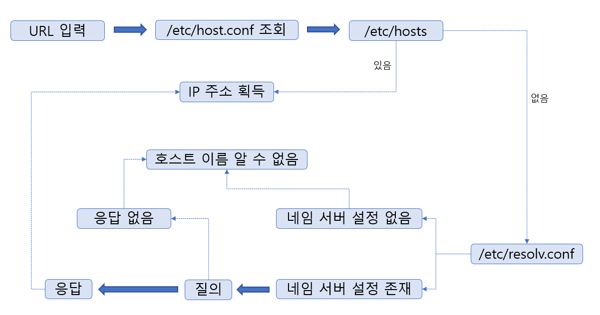
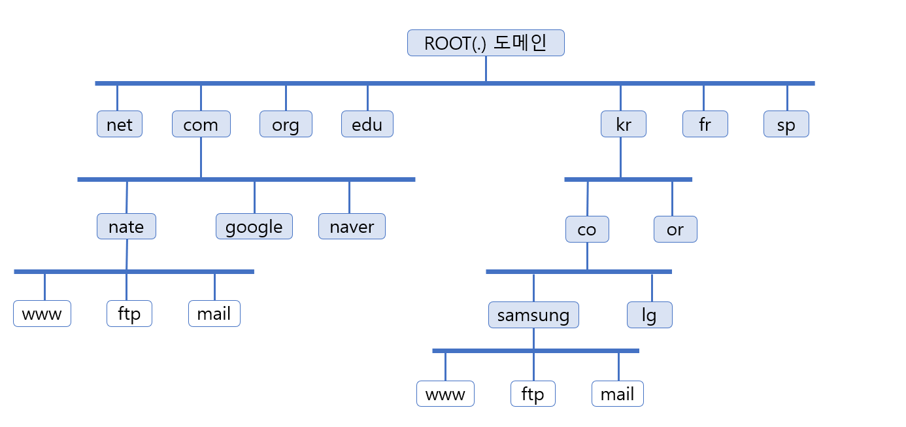
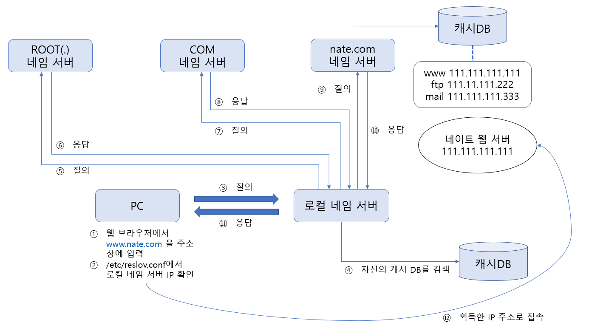
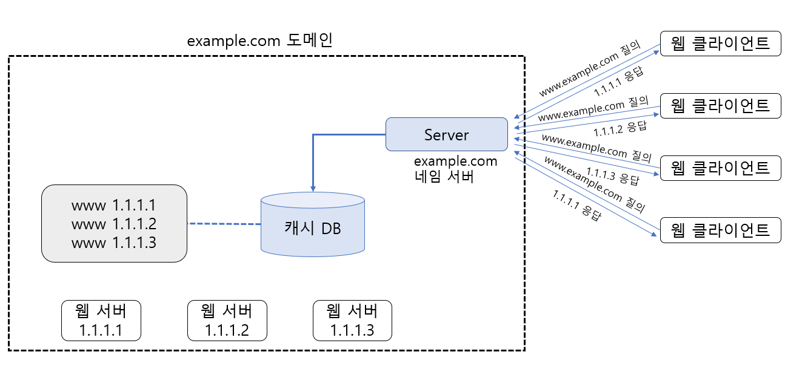
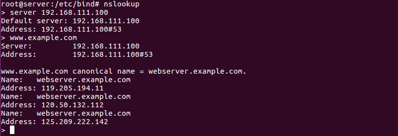

# DNS Server

> URL을 IP주소로 변환시켜주는 서버인 DNS에 대하여 알아본다.

<br>

### 네임 서버의 개념

네임 서버는 **Domain Name System** 서버라고 하며, 우리가 웹 브라우저나 FTP 클라이언트를 사용할 때 http://www.naver.com 또는 ftp://mirrors.kernel.org/ 등과 같은 URL을 사용한다. 실제 원하는 서버에 접근하려면 이 URL을 해당 컴퓨터의 IP주소로 변환시켜야 하는데, 바로 이 일을 네임 서버 또는 DNS 서버라는 컴퓨터가 담당한다.

URL 을 입력했을 때 IP주소를 획득하는 과정은 아래 그림과 같다.



<br>

<br>

### 네임 서버의 구축

네임 서버를 구축해서 운영하는 방법을 살펴본다.

<br>

#### 도메인 이름 체계

네트워크에 연결된 컴퓨터를 구분하는 유일한 방법은 IP주소다. 따라서 웹 브라우저로 웹 서버에 접속하려면 120.50.132.112 등과 같은 IP 주소를 알아야 한다. 

이러한 IP 주소는 외우기 너무 어려우므로, 각 컴퓨터의 IP 주소에 외우기 쉬운 이름을 부여하면 된다.

인터넷 초창기에는 전 세계의 인터넷에 연결된 컴퓨터가 그렇게 많이 않았으므로, 1대의 네임 서버만으로도 IP 주소와 이름을 충분히 관리할 수 있었다. 하지만 인터넷이 폭발적으로 확장되면서 인터넷에 연결된 컴퓨터는 기하급수적으로 늘어나게 되었고, 몇 대의 네임 서버로는 실시간으로 생겼다 없어지는 인터넷상의 컴퓨터를 도저히 관리할 수 없게 되었다.

그래서 아래 그림과 같은 트리 구조 형태의 도메인 이름 체계가 고안되었다. 음영이 들어간 사각형을 네임 서버로 생각한다. 또, 음영이 없는 사각형을 실제로 운영되는 컴퓨터로 보면 된다. 즉, ROOT(.) 네임 서버는 1단계 네임 서버인 com 네임 서버, net 네임 서버, org 네임 서버, edu 네임 서버 등과 국가 도메인인 kr, fr, sp 등을 관리한다. 또 1단계 네임 서버는 자신의 하위에 있는 2단계 네임 서버를 관리하면 된다.



<br>

#### 로컬 네임 서버가 작동하는 순서

리눅스에는 각자 사용하는 네임 서버가 `/etc/resolv.conf` 파일에 `nameserver IP 주소` 형식으로 설정되어 있다. 이 네임 서버를 로컬 네임 서버라고 부른다. 그래서 www.naver.com 의 IP 주소를 요구하면 이 로컬 네임 서버에 질문을 하는 것이다.

그런데 로컬 네임 서버는 의외로 아는 것이 별로 없다. 로컬 네임 서버가 혼자서 전 세계의 모든 컴퓨터의 도메인 이름을 관리할 수 없기 때문이다. 따라서 로컬 네임 서버는 자신이 아는 도메인 이름이라면 바로 알려주지만, 자신이 모를 경우에는 다음과 같은 작업을 수행한다.



1. PC의 웹 브라우저 주소창에서 www.nate.com을 입력한다.
2. PC가 리눅스일 경우 /etc/resolv.conf 파일을 열어서 'nameserver 네임서버 IP' 부분을 찾아 로컬 네임 서버 컴퓨터를 알아낸다.
3. 로컬 네임 서버에 www.nate.com 의 IP 주소를 물어본다.
4. 로컬 네임 서버는 자신의 캐시 DB를 검색해 www.nate.com의 주소를 물어본다.
5. 로컬 네임 서버가 `ROOT 네임 서버` 에 www.nate.com 의 주소를 물어본다.
6. `ROOT 네임 서버` 도 www.nate.com의 주소를 모르므로, `com 네임 서버`의 주소를 알려주면서 `com 네임 서버` 에 물어보라고 한다.
7. 로컬 네임 서버가 `com 네임 서버`에 www.nate.com의 주소를 물어본다.
8. `com 네임 서버`도 www.nate.com의 주소를 모르므로, `nate.com` 을 관리하는 네임 서버의 주소를 알려주면서 `nate.com` 네임 서버에 물어보라고 한다.
9. 로컬 네임 서버가 `nate.com 네임 서버`에 www.nate.com의 주소를 물어본다.
10. `nate.com 네임 서버`는 네이트에서 구축한 네임 서버이므로 &#42;&#42;&#42;.nate.com 이라는 이름을 가진 컴퓨터의 목록은 모두 있다. www.nate.com 의 IP 주소도 알기 때문에 IP주소를 알려준다.
11. 로컬 네임 서버는 www.nate.com의 IP수조를 요구한 PC에 IP주소를 알려준다.
12. PC는 획득한 IP주소로 접속을 시도한다.

<br>

#### 캐싱 전용 네임 서버

캐싱 전용 네임 서버 `Caching-only Nameserver` 는 PC에서 URL로 IP주소를 얻고자 할 때, 해당하는 URL의 IP주소를 알려주는 네임 서버를 말한다.

캐싱 전용 네임 서버를 구축하는 방법은 다음과 같다.

`apt-get -y install bind9 bind9utils` 명령을 입력해 네임 서버와 관련된 패키지를 설치한다.

캐싱 전용 네임 서버와 관련 설정파일인 `/etc/bind/named.conf.options` 파일을 vi 에디터로 열어서 3행쯤 에 다음 2개 행을 추가한다.

``` 
recursion yes;
allow-query { any; };
```

> recursion 을 yes로 설정하게 되면 네임 서버에 존재하는 zone파일 이외에도 응답을 하게 된다. 

그 뒤 파일 아래쪽에 있는 dnssec-validation **auto **를 dnssec-validation **no** 로 변경해준다.

다음 명령을 참고하여 서비스를 작동한다. 네임 서버의 서비스(=데몬) 이름은 `bind9`다.

```
systemctl restart bind9
systemctl enable bind9
systemctl status bind9
```

`ufw allow 53` 명령을 입력해 네임 서버 포트인 53번을 허용하고, `ufw status` 멸영으로 확인한다.

네임 서버가 잘 작동하는지는 `dig @네임서버IP 조회할URL` 형식으로 확인할 수 있다.

<br>

#### 마스터 네임 서버

마스터 네임 서버`Master Nameserver`는 example.com 과 같은 도메인에 속해 있는 컴퓨터들의 이름을 관리하고, 외부에서 www.example.com 이나 ftp.example.com 등의 컴퓨터 IP주소를 알기 원할 때 해당 컴퓨터의 IP 주소를 알려주는 네임 서버를 말한다. 

마스터 네임 서버를 구축하는 방법은 다음과 같다.

**example.com** 도메인에 대한 설정을 해준다.

vi 에디터로 `/etc/bind/named.conf` 파일을 열어서 맨 아래에 다음 내용을 추가한 후 저장한다.

```
zone "example.com" IN {
	type master;
	file "/etc/bind/example.com.db";
};
```

> 네임 서버는 설정파일이 1글자라도 틀리면, 데몬 자체가 가동하지 않을 수 있으므로 주의해서 입력해야한다.


<br>

```
/etc/bind/named.conf 파일은 네임 서버 서비스가 시작될 때 제일 먼저 읽는 파일이다.
설정 형식 중에서 중요한 부분은 다음과 같다.

zone "도메인이름" IN {
	type hint 또는 master 또는 slave;	-> 마스터 네임 서버는 master
	file "파일이름"		-> options의 directory 에 생성될 "도메인 이름"의 상세 설정파일
}
```

`named-checkconf` 명령을 입력해 입력한 내용이 문법상 틀리지 않는지 확인해 본다. 아무 메시지도 안 나오면 문법상 틀린 것이 없다는 뜻이다. 만약 문법이 틀리면 행 번호와 오류 내용이 출력된다.

/etc/bind/ 디렉터리로 이동한 후 `touch example.com.db` 명령을 입력해 example.com.db 라는 이름의 빈 파일을 생성한다. 이 파일을 `포워드 존 파일` 또는 `정방향 영역 파일` 이라고 부른다.

gedit 또는 vi로 example.com.db 파일을 열고 다음 내용을 입력한다.

```
$TTL	3H
@		IN		SOA		@		root.	(	2	1D	1H	1W	1H	)

@		IN		NS		@
		IN		A		192.168.111.100
		
www		IN		A		192.168.111.100
ftp		IN		A		192.168.111.200
```

> IP 주소는 본인의 환경에 따라 다르다

`named-checkzone example.com example.com.db` 명령을 입력해 설정한 파일의 문법에 이상이 없는지 확인한다. (`named-checkzone 도메인이름 설정파일이름` 명령의 형태다)


-----

*포워드 존 파일의 문법을 몇 개 요약하면 다음과 같다.*

1. (세미콜론): 주석을 의미한다.
2. &#36;TTL: Time To Live 의 약자로 www.example.com의 호스트 이름을 질의해갔을 때, 질의해간 다른 네임버가 해당IP 주소를 캐시에 저장하는 시간. 3H는 3시간을 의미한다.
3. &#64;: /etc/bind/named.conf 에 정의된 example.com을 의미
4. IN: 클래스 이름으로 internet을 의미한다.
5. SOA: Start Of Authority 약자로 권한의 시작을 뜻함. 또, 괄호 안의 숫자는 시간을 의미하는데 차례로 serial(버전 정보), refresh(상위 네임 서버에 업데이트된 정보를 요청하는 간격), retry(상위 네임 서버에 문제가 발생했을 때 재 접속 간격), expire(상위 네임 서버에 접속하지 못할 경우 이전의 정보를 파기하는 간격)
6. NS: Name Server의 약자로 설정된 도메인의 네임 서버 역할을 하는 컴퓨터를 지정한다.
7. MX: Mail Exchanger의 약자로 메일 서버 컴퓨터를 설정
8. A: 호스트 이름에 상응하는 IP주소를 지정한다.
9. CNAME 호스트 이름에 별칭을 부여할 때 사용

---

설정된 내용을 적용하기 위해, `systemctl restart bind9` 명령을 입력해 네임 서비스를 재시작하고 확인한다.

`ufw status`명령을 입력해 53번, 80번 포트가 허용 되어 있는지 확인한다.

이렇게하여 마스터 네임 서버를 구축하였다.

<br>

#### 라운드 로빈 방식의 네임 서버

네이버나 다음 같은 포털 사이트 웹 서버에는 동시에 수십만 이상의 접속이 있을 것이다. 따라서 웹 서버를 1대가 아니라 여러 대의 웹 서버를 운영해서, 웹 클라이언트가 서비스를 요청할 경우에 교대로 서비스를 실행할 것이다. 그러면 웹 서버의 부하를 공평하게 여러 대가 나눌 수 있다. 이러한 방식을 라운드 로빈`Round Robin` 방식이라고 부른다.

호스트 운영체제의 명령 프롬프트에서 `nslookup` 명령을 입력해서 확인해보면, 네이버 같은 웹 사이트도 여러 대의 웹 서버를 운영하는 것을 알 수 있다.

구현은 원레 여러 대의 웹 서버를 설치해서 운영해야 하지만 환경이 완전하지 않으므로 이미 인터넷에 구현된 웹 사이트를 직접 구현한 웹 서버라고 간주하고 실습을 진행한다.

즉, www.example.com 접속 시에 A, B, C 3개의 웹 사이트를 차례로 보여주는 방식으로 하겠다.

`nslookup` 명령을 입력하여 원하는 사이트 3개의 IP 주소를 확인한다.

```
네이버 125.209.222.142
네이트 120.50.132.112
다나와 119.205.194.11
```

확인한 3개의 IP주소를 www.example.com 의 3대 웹 서버로 가정한다.

gedit 으로 `/etc/bind/example.com.db` 파일을 다음과 같이 수정하고, 저장한 후 닫는다. 기존에 있던 `www IN A 192.168.111.100` 행은 삭제했고, `webserver.example.com.` 의 제일 뒤에 `.` 이 있는 것에 주의하자.

```
$TTL	3H
@		IN		SOA		@		root.	(	2	1D	1H	1W	1H	)

@		IN		NS		@
		IN		A		192.168.111.100
		
ftp		IN		A		192.168.111.200
www		IN		CNAME	webserver.example.com.

webserver	100		IN		A		125.209.222.142
		200		IN		A		120.50.132.112
		300		IN		A		119.205.194.11
```

변경 사항을 적용하기 위해서 `systemctl restart bind9` 명령을 입력해 네임 서버를 다시 가동한다.

`nslookup` 명령을 입력한 후 `server 192.168.111.100` 명령을 입력하고 www.example.com 웹 서버 정보를 확인해본다.


