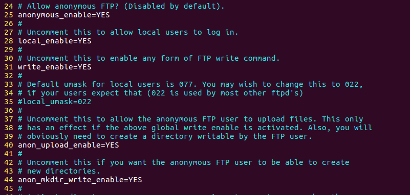
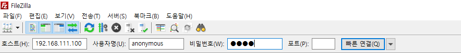
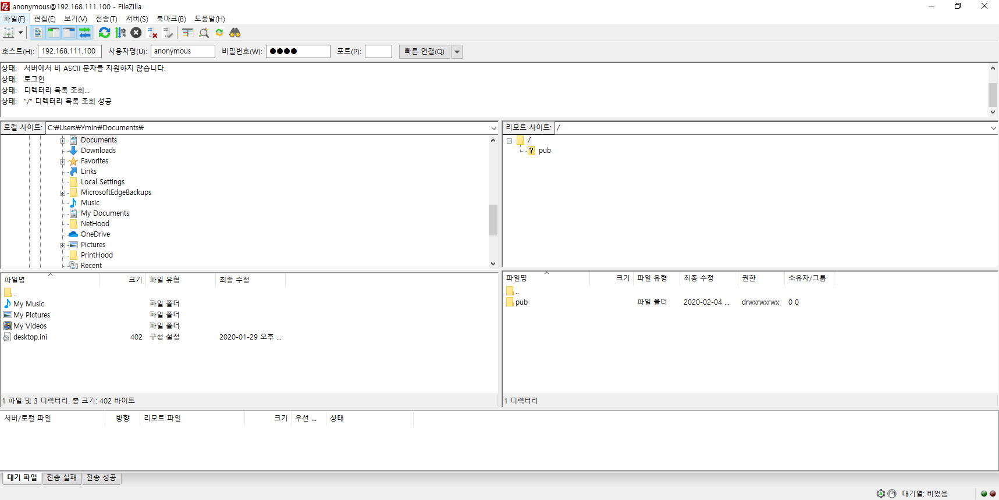
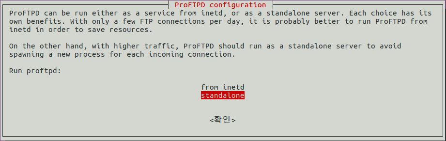
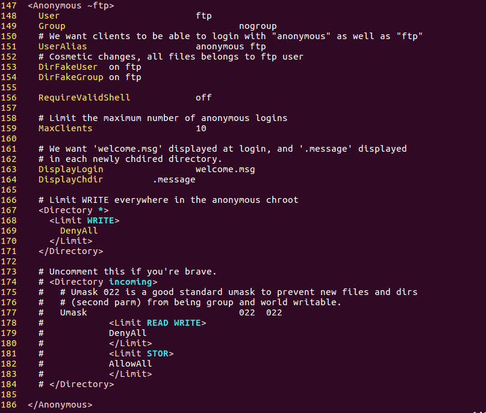

# FTP Server

> FTP 서버 설치와 운영에 대해 알아본다.

<br>

### vsftpd의 설치와 운영

vsftpd`Very Secure FTPD` 는 우분투에서 기본적으로 제공되며, 리눅스와 유닉스 환경에서 보안성과 성능이 우수한 FTP 서버로 인정받고 있다. 또한 vsftpd는 설치하고 운영하기가 쉬워서 리눅스 환경의 FTP 서버를 운영하는 데 많이 이용된다.

관련 내용을 참고하거나 소스 파일을 다운로드하는 일은 http://vsftpd.beasts.org/ 에서 할 수 있으며, 우분투에서 제공하는 vsftpd 를 apt-get 명령어로 설치하겠다.

> 서버 실습은 편의상 익명(anonymous) 사용자의 업로드를 모두 허용해 줄 것이다. 하지만, 이럴 경우 보안상 치명적인 위협이 있을 수 있다. 그러므로 이번 실습은 익명 사용자도 업로드가 가능하도록 설정하는 방법을 익히는 차원이며, 실제로 운영할 경우에는 가능하면 익명 사용자는 다운로드만 허용해야 한다.

<br>

`apt-get -y install vsftpd` 명령을 입력해 vsftpd 패키지를 설치한다.

일반적으로 FTP 의 용도는 anonymous(익명) 사용자의 접속을 허용하는 것이 대부분이다. anonymous 사용자의 허용 여부는 `/etc/vsftpd.conf` 파일에 설정되어 있다.

vi로 `/etc/vsftpd.conf` 파일을 열고, 다음과 같이 수정하고 저장한다. 다음은 anonymous 사용자가 접속 및 파일 업로드를 허용하도록 설정하는 것이다.

```
25행쯤: anonymous_enable=NO	-> YES
31행쯤: #write_enable=YES		-> 주석 제거
40행쯤: #anon_upload_enable=YES	-> 주석 제거
44행쯤: #anon_mkdir_write_enable=YES	-> 주석 제거
```



<br>

---

vsftpd.conf 파일에서 자주 사용하는 옵션은 다음과 같다.

* anonymous_enable: anonymous(익명) 사용자의 접속을 허가할지 설정
* local_enable: 로컬 사용자의접속 허가 여부를 결정
* write_enable: 로컬 사용자가 저장, 삭제, 디렉터리 생성 등의 명령을 실행하게 할 것인지 설정(anonymous 사용자는 해당 없음)
* anon_upload_enable: anonymous 사용자의 파일 업로드 허가 여부를 결정
* anon_mkdir_write_enable: anonymous 사용자의 디렉터리 생성 허가 여부를 설정
* dirlist_enable: 접속한 디렉터리의 파일 리스트를 보여줄지 설정
* download_enable: 다운로드의 허가 여부를 결정
* listen_port: FTP 서비스의 포트 번호를 설정(기본:21)
* deny_file: 업로드를 금지할 파일을 지정(예:deny_file={&#42;.mpg,&#42;.mpge,*.avi})
* hide_file: 보여주지 않을 파일을 지정(예:hide_file={&#42;.gif,&#42;.jpg,&#42;png})
* max_clients: FTP 서버의 동시 최대 접속자 수를 지정
* max_per_ip: 1개 PC가 동시에 접속할 수 있는 접속자 수를 지정

---

<br>

vsftpd 에 anonymous(익명) 로 접속되는 디렉터리는 `/srv/ftp`다. 이 디렉터리 아래에 pub 디렉터리를 만들고 모든 사용자에게 읽기/쓰기 권한을 준다.

```shell
$ cd /srv/ftp
$ mkdir pub
$ chmod 777 pub
$ cd pub
$ cp /boot/vm* file1
$ ls -l
```

> anonymous 사용자는 ftp 전용의 사용자로 모든 리눅스에 내장된 사용자다. 특별히 암호 없이도 ftp 서버에 접속할 수 있다. 외부에서 접속할 때는 사용자 이름이 anonymous 지만, 리눅스 내부에서는 ftp 라는 이름으로 사용된다. 그리고 이 ftp 사용자의 홈 디렉터리는 /srv/ftp다.

`systemctl restart vsftpd` , `systemctl enable vsftpd`, `systemctl status vsftpd` 명령으로 서비스를 시작하고 확인한다.

마지막으로 외부에서 FTP 서버에 접근하도록 `ufw allow ftp` 명령으로 포트를 허용해 준다.

<br>

<br>

### 윈도우에서 FTP 서버 접속

http://filezilla-project.org/ 에 접속해 최신 Windows용 FileZilla Client 프로그램을 설치한다.

FileZilla 를 실행한 후 [호스트]에는 Server의 IP주소를 입력하고, [사용자] 에는 anonymous(익명사용자)를, [비밀번호]는 아무거나 입력한 후 <빠른 연결> 버튼을 클린다.



접속된 상태는 다음과 같다.



파일이 정상적으로 업로드/다운로드 되는지 테스트 해본다.

<br>

<br>

### ProFTPD의 설치와 운영

ProFTPD는 주로 대형 사이트에서 오랫동안 인기가 많았던 ftp 서버다. vsftpd와 용도는 완전히 동일하지만 설정 방법이 약간 다르다.

`apt-get -y install proftpd` 명령으로 proftpd 패키지를 설치한다. 설치 중 [ProFTPD configuration] 매시지가 나오면 'standalone' 이 선택된 상태에서 <확인>을 클릭한다.



```
inetd는 슈퍼 데몬으로도 부르는데, inted가 평소에 작동하고 있다가 필요할 때마다 ftp 데몬을 호출하는 방식이다. 평소에는 ftp 데몬이 작동하지 않기 때문에 컴퓨터의 자원을 아끼는 효과가 있지만, ftp 서비스의 반응 속도는 조금 느리다. standalone은 ftp 데몬이 독립적으로 작동하는 방식으로, 평소에도 늘 ftp 서비스가 메모리에 상주하고 있다. 자원의 낭비는 조금 있겠으나, ftp 요청 시에 즉각 반응하는 장점이 있다. 일반적으로 ftp서비스가 주요한 목적이라면 standalone을 사용하는 것이 좋고, ftp 서비를 부가적인 목적으로 가끔 사용한다면 inetd 방식을 사용하는 것이 좋다.
```

설정파일은 `/etc/proftpd/proftpd.conf` 다,vi 에디터로 열고, anonymous 사용자가 접근해서 파일을 업로드/다운로드 할 수 있도록 다음 내용을 참고해 설정을 변경한다.

```
147행쯤의<Anonymous ~ftp>부터 186행쯤의 </Anonymous>까지 제일 첫 열의 주석을 모두 제거
174행쯤의 <Directory incoming> 부터 184행쯤의 </Directory>까지 각 행 앞의 주석을 제거
169행쯤: DenyAll	-> AllowAll
179행쯤: DenyAll	-> AllowAll
```



<br>

---

proftpd.conf 파일에서 자주 사용하는 옵션은 다음과 같다.

* ServerName: 서버의 이름. 아무거나 관계 없음
* DefaultServer: 기본 FTP 서버로 사용할지 결정
* MaxInstances: 최대 생성 프로세스 수, 너무 크면 DDoS 공격 시 취약할 수 있으므로 적당한 값(20~30)을 설정
* User/Group: Proftpd 가 실행될 때 실행될 사용자, 보안상 root 사용자로 지정하면 위험함
* &#60;Global&#62; &#126; &#60;/Global&#62;: 모든 접속된 사용자에게 공통으로 적용되는 설정
* AllowOverwrite: 디렉터리 안에 같은 파일이 있으면 덮어 쓸지를 설정
*  &#60;Anonymous &#126; ftp&#62; &#126; &#60;/Anonymous&#62;: anonymous 사용자 접속 여부 설정
* UserAlias anonymous ftp: anonymous 사용자로 접속했을 때 내부적으로 ftp의 권한을 부여함
* MaxClients: anonymous 사용자로 동시 접속할 수 있는 최대 숫자
* &#60;Directory uploads/*&#62; &#126; &#60;/Directory&#62;: 업로드할 디렉터리('/uploads') 의 설정
* &#60;Limit READ&#62; &#126; &#60;/Limit&#62;: 읽기를 허용할지 설정. 업로드 디렉터리는 읽기를 못하도록 설정하는 것이 좋음
* &#60;Limit STOR &#126; &#60;/Limit&#62;:  쓰기를 허용할지 설정. STOR는 동일 파일 이름이면 덮어 쓸지를 물어봄

---

<br>

`systemctl restart proftpd`, 명령과 `systemctl enable proftpd` 명령으로 서비스를 시작/상시가동한다.

`ufw allow ftp` 명령으로 ftp 포트(21번)을 허용한다.

