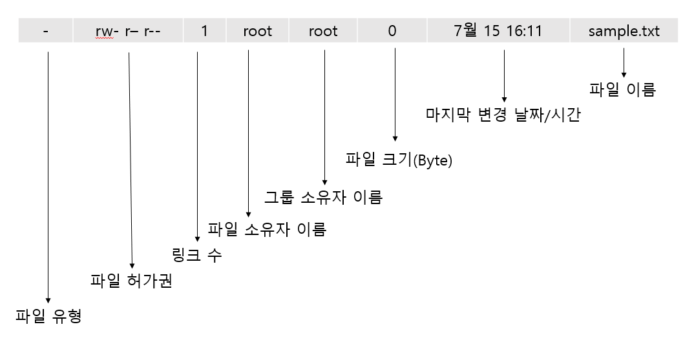

# File Permission

> linux 에서 파일의 소유권과 허가권에 대하여 설명한다.

<br>

<br>

```shell
$ touch sample.txt
$ ls -l sample.txt
-rw-r--r-- 1 root root 0 7월 15 16:11 sample.txt
```



<br>

#### 파일 유형

파일의 종류를 나타낸다. 디렉터리일 경우 'd', 일반적인 파일일 경우에는 '-' 가 표시된다. 그 외에 'b`블록 디바이스	`', 'c`문자 디바이스`', 'l`링크`' 등이 있다.

<br>

#### 파일 허가권

파일 허가권은 'rw-', 'r--', 'r--' 3개씩 끊어서 인식하면 된다. 'r' 은 `read` ,'w' 는 `write` , 'x' 는 `execute` 의 약자이다. 즉 'rw-' 는 읽거나 쓸수는 있지만 실행할 수는 없다는 의미이며 'rwx' 는 읽고, 쓰고, 실행이 가능하다는 의미이다.

또한 1번째 'rw-'는 소유자 `user` 의 파일 접근 권한을, 2번째 'r--' 는 그룹 `group` 의 파일 접근 권한을, 3번째 'r--' 는 그 외 사용자 `other` 의 파일 접근 권한을 의미한다.

즉 위 sample.txt 파일의 소유자는 읽거나 쓸 수 있고, 그룹과 그 외 사용자는 읽을 수만 있다. 

sample.txt 파일의 허가권을 다음과 같이 숫자로도 표현 할 수 있다.


소유자의 허가권인 6이라는 숫자는 이진수 110 이므로 'rw-' 라고 표현 할 수 있고, 그룹의 허가권인 4는 이진수 100 이므로 'r--' 라고 표현 할 수 있다.

파일의 허가권을 변경하는 명령어로는 `chmod` 가 있다. 이 명령어는 root 사용자 또는 해당 파일의 소유자만이 실행 할 수 있다. 예로 `chmod 777 sample.txt` 명령을 실행하면 sample.txt 파일은 모든 사용자가 읽고, 쓰고, 실행 할 수 있는 파일이 된다.

<br>

#### 파일 소유권

파일 소유권은 파일을 소유한 사용자와 그룹을 의미한다. sample.txt 파일은 root라는 이름의 사용자가 소유자며, 그룹도 root 로 되어 있다. 파일의 소유권을 바꾸는 명령어는 `chown` 이 있다. 사용법은 `chown 새로운사용자이름(.새로운그룹이름) 파일이름` 형식으로 사용할 수 있다.

예를 들어 `chown ubuntu sample.txt` 명령은 sample.txt 파일의 소유자를 ubuntu 사용자로 바꾸라는 의미이고, `chown ubuntu.ubuntu sample.txt` 명령은 파일의 그룹도 ubuntu 그룹으로 바꾸라는 의미다.

<br>

#### 링크

파일의 링크`link` 는 하드 링크`Hard Link` 와 심볼릭 링크`Symbolic Link 또는 Soft Link` 2가지가 있다. 원본 파일이 inode1 을 사용할 때, 하드 링크를 생성하면 '하드 링크 파일' 만 하나 생성되며 같은 inode1을 사용하게 된다. 하드 링크를 생성하려면 `ln 링크대상파일이름 링크파일이름` 명령을 실행 한다.

원본에 심볼릭 링크를 생성하면 새로운 inode2 를 만들고, 데이터는 원본 파일과 연결되는 효과를 갖는다. 일반적으로 사용자들이 주로 사용하는 링크는 심볼릭 링크를 사용하며. Windows 의 바로 가기 아이콘도 심볼릭 링크에 해당한다. 심볼릭 링크를 생성하려면 `ln -s 링크대상파일이름 링크파일이름` 을 실행하면 된다.


*하드 링크와 심볼릭 링크의 비교 그림*


