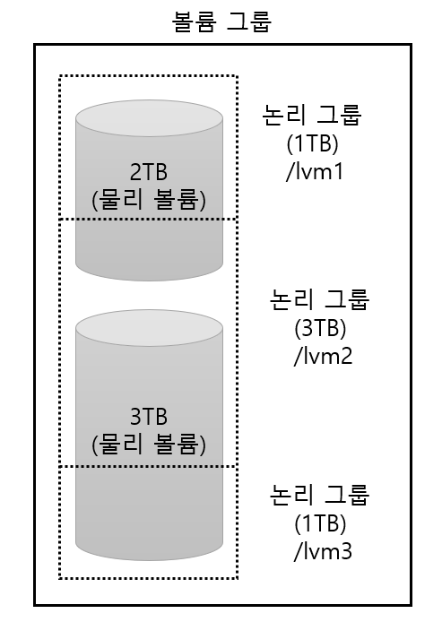
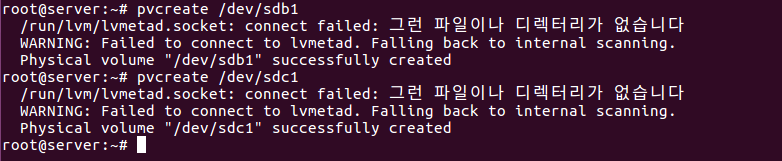
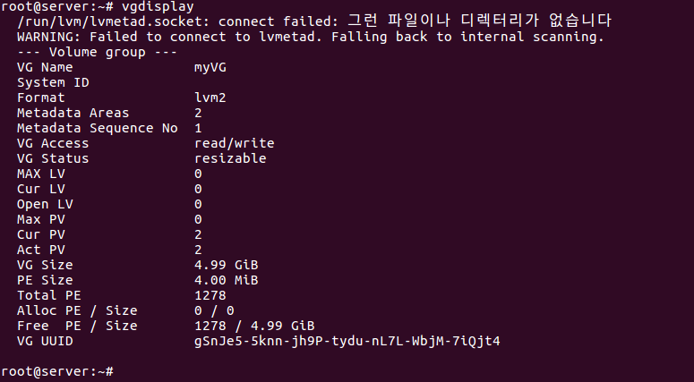
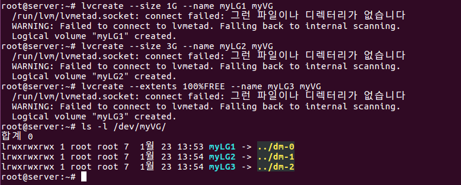
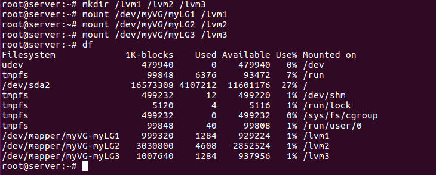

# LVM

> Logical Volume Manager 의 약자인 LVM 에 대하여 학습한다.

<br>

LVM의 주요한 용도는 여러 개의 하드디스크를 합쳐서 한 개의 파티션으로 구성한 후에, 필요에 따라서 다시 나눌 수 있다. 또는 한 개의 하드디스크로 LVM을 구성하고 다시 파티션을 구분할 수도 있다. 예를 들어 2TB 용량의 하드디스크 2개를 합친 후에 다시 1TB와 3TB로 나눠서 사용할 수 있다.

RAID 와 달리 LVM 에서는 새로운 용어가 몇 개 나온다.

* 물리 볼륨(Physical Volume): /dev/sda1, /dev/sdb1 등의 파티션을 말한다.
* 볼륨 그룸(Volume Group): 물리 볼륨을 합쳐서 1개의 물리 그룹으로 만든 것이다.
* 논리 볼륨(Logical Volume): 볼륨 그룹을 1개 이상으로 나눈 것으로 논리적 그룹이라고도 한다.

아래 그림을 보면서 이해하자.




5TB를 1TB, 3TB, 1TB로 분할해서 각 /lvm1, /lvm2, /lvm3 디렉터리에 마운트한 상태를 보여준다.

결국 LVM 은 여러 개의 하드디스크(물리 볼륨)을 묶어서 1개의 볼륨 그룹으로 만든 뒤, 다시 필요한 용량의 파티션(논리 그룹)으로 나눠서 사용하는 것으로 보면 된다.

<br>

<br>

### LVM 구현

실습은 위 사진과 똑같이 구성한다. 물리적 하드디스크(물리 볼륨) 2GB, 3GB 를 장착하고 하나의 볼륨 그룹으로 만든 뒤 이를 각각 1GB, 3GB, 1GB의 논리 그룹으로 나누어 마운트하게 된다. 

먼저 장착한 하드디스크에 파티션을 할당한다. 이번에는 별도로 파일 시스템 유형을 **8e** 로 지정해야 한다.

```shell
$ fdisk /dev/sdb		-> SCSI 0:1 하드디스크 선택
Command: n			-> 새로운 파티션 분할
Select: p			-> Primary 파티션 선택
Partition number (1~4): 1	-> 파티션 번호 1번 선택
First sector: Enter	-> 시작 섹터 번호 입력(기본 설정)
Last sector: Enter	-> 마지막 섹터 번호 입력(기본 설정)
Command: t			-> 파일 시스템 유형 선택
Hex Code: 8e		-> 선택한 파일 시스템 유형 번호 입력('L'을 입력하면 유형 번호가 출력됨)
Command: p			-> 설정된 내용 확인
Command: w			-> 설정 저장
```

위 방법으로 2개 하드디스크의 파티션을 나눈다. 

`apt-get -y install lvm2` 명령으로 관련 패키지를 설치한다.

`pvcreate /dev/sdb1` 명령과 `pvcreate /dev/sdc1` 명령을 입력해 물리적인 볼륨을 생성한다. 경고는 무시해도 된다.



2개의 물리 볼륨을 하나로 묶어준다. 즉, 볼륨 그룹을 생성하는 단계이며 `vgcreate myVG /dev/sdb1 /dev/sdc1` 명령을 입력하면 된다. 볼륨 그룹 이름은 myVG로 설정했다.

`vgdisplay` 명령을 입력해 볼륨 그룹이 제대로 생성되었는지 확인할 수 있다.

 

생성한 myVG 볼륨 그룹은 현재 물리 볼륨이 2개로 구성되어 있다. 2GB+3GB=5GB 인 것을 확인할 수 있다. 이제부터는 /dev/myVg를 하나의 하드디스크처럼 생각하고 작업하면 된다.

논리 그룹을 1GB, 3GB, 1GB로 나누기 위해 다음 명령을 입력하고, /dev/myVG 디렉터리를 확인한다.

```
lvcreate --size 1G --name myLG1 myVG	-> myVG 아래 myLG1을 1GB 크기로 생성
lvcreate --size 3G --name myLG2 myVG
lvcreate --extents 100%FREE --name myLG3 myVG	-> 나머지 용량을 모두 할당
ls -l /dev/myVG
```



각각의 디렉터리를 포멧해준다.

```
mkfs.ext4 /dev/myVG/myLG1
mkfs.ext4 /dev/myVG/myLG2
mkfs.ext4 /dev/myVG/myLG3
```

`mkdir /lvm1 /lvm2 /vm3` 을 입력한 후, 각각의 드라이브를 마운트 해준다. 마운트 한 후에는 `df` 명령어로 확인할 수 있다.



마지막으로 컴퓨터로 켤 때 언제든지 /dev/myVG/myLG1&#126;3 장치가 /lvm1&#126;3에 마운트되도록 설정한다. /etc/fstab 파일을 vi 에디터나 gedit으로 열어서 맨 아래 부분에 다음을 추가하고 재부팅 하면 된다.

```
/dev/myVG/myLG1		/lvm1		ext4		0		0
/dev/myVG/myLG2		/lvm2		ext4		0		0
/dev/myVG/myLG3		/lvm3		ext4		0		0
```
