# Mail Server

> 메일 서버 설치와 운영에 대하여 알아본다.

<br>

이메일 송수진에 사용되는 프로토콜은 세 가지가 있다. 일단 용어만 눈에 익혀 두고 각 프로토콜이 사용되는 용도를 살펴보자.

* SMTP(Simple Mail Transfer Protocol): 클라이언트가 메일을 보내거나, 메일 서버끼리 메일을 주고 받을 때 사용한다.
* POP3(Post Office Protocol): 메일 서버에 도착되어 있는 메일을 클라이언트로 가져올 때 사용한다.
* IMAP(Internet Mail Access Protocol): POP3 와 용도가 같다.

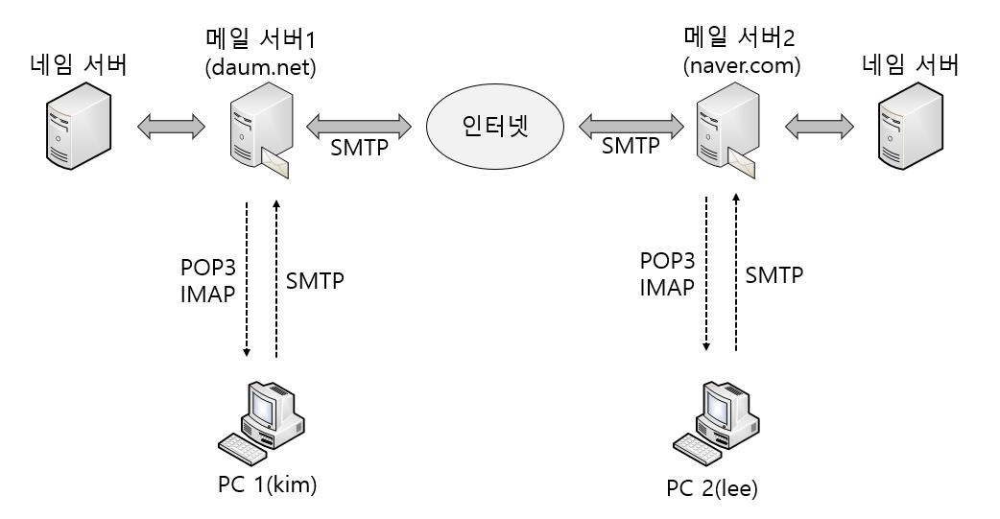

위 그림은 이메일 서버의 작동 원리를 단순화 한것이다.

우선 kim 이라는 이름의 사람은 daum.net 이라는 메일 서버에 계정이 있다 .즉, kim@daum.net 이라는 계정이 있다. 마찬가지로 lee라는 사람은 lee@naver.com 이라는 계정이 있다.

이제 kim 이 lee에게 메일을 보내고 받는 과정을 살펴보자.

1. kim 이 PC 1에서 메일 클라이언트 프로그램을 실행해서 daum.net에 접속한다. '편지쓰기' 를 클릭해서 [받는 이] 란에 'lee@naver.com' 이라고 쓰고 내용을 채운 후에 <보내기> 버튼을 클릭해서 메일을 보낸다. (이때는 `SMTP` 프로토콜을 이용한다.)
2. 메일 서버 1(daum.net) 은 kim 이 보낸 메일을 잠시 임시 장소에 보관한다. 시간의 여유가 생겼을 때 메일 서버1은 kim 이 보낼 메일의 수신자 주소인 naver.com 메일 서버 IP 주소를 네임 서버에게 요청해 알아본다.
3. 메일 서버 1은 메일을 인터넷을 통해서 메일 서버 2(naver.com) 에게 전송한다. (이때도 SMTP 프로토콜을 이용한다.)
4. 메일 서버 2(naver.com) 는 메일 서버 1(daum.net) 로부터 받은 메일의 수신자 이름을 확인한다. 즉, lee라는 수신자 이름이 자신이 관리하는 계정 중에 있는지 확인한다. lee라는 이름이 자신의 계정 중에 있다면 lee의 메일 박스에 kim에게서 받은 메일을 넣어 둔다.
5. lee는 PC 2에게 메일 클라이언트 프로그램을 실행해서, 자신의 메일 서버인 naver.com에 접속한다. 접속 후에, 자신의 메일 박스에 도착된 편지들을 PC 2로 보낸다. (이때는 POP3/IMAP 프로토콜을 사용한다.) 이제 kim으로부터 온 메일을 읽으면 된다.

지금까지 과정이 인터넷상에서 메일을 주고 받는 작동 원리를 단순화한 것이다.

<br>

다음 그림은 메일이 전송되는 과정을 앞으로 구현할 센드메일`Sendmail` 서버의 입장에서 내부적으로 좀 더 상세히 표현한 것이다.

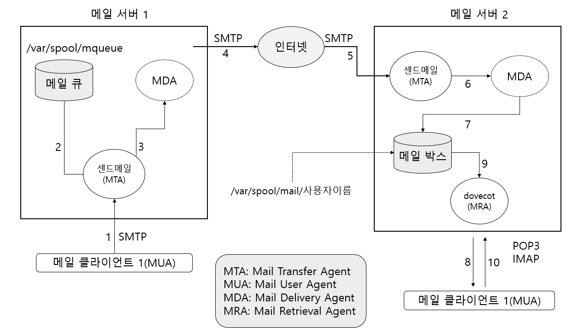

1. 메일 클라이언트 1은 SMTP 프로토콜을 이용해서, 메일 서버 1의 센드메일 서비스(=데몬) 에게 메일을 보내달라고 요청한다.
2. 센드메일 서비스는 메일을 '메일 큐'에 넣어 놓는다. (이 파일은 /var/spool/mqueue다)
3. 센드메일 서비스는 시간이 되면 MDA에게 메일을 보내달라고 요청한다.
4. 5. MDA는 SMTP 프로토콜을 이용해서 메일 서버 2의 센드메일 서비스에게 메일을 전송한다.

6. 7. 메일 서버 2의 센드메일 서비스는 받은 메일을 MDA를 통해 사용자의 메일 박스에 넣어 놓는다.

8. 메일 클라이언트 2는 메일 서버2의 dovecot 서비스에게 자신의 메일을 달라고 요청한다.
9. dovecot 서비스는 메일 박스에서 메일 클라이언트 2의 메일을 POP3 또는 IMAP 프로토콜을 이용해 전송한다.

위와 같은 작동들은 센드메일 서버를 이용해서 메일을 보내는 과정에서 발생한다.

<br>

<br>

### 센드메일 서버의 구현

가장 먼저 `apt-get -y install sendmail` 명령을 입력으로 센드메일을 설치한다.

`/etc/hostname` 파일의 `server`를 `mail.example.com` 으로 변경한다.

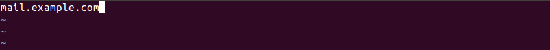

`/etc/hosts` 파일에 `서버의IP mail.example.com` 을 추가한다.

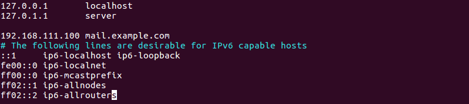

`/etc/mail/local-host-names` 파일에 `mail.example.com` 을 추가한다.

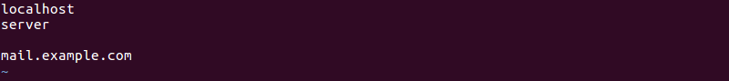

설정된 내용이 적용되도록 `reboot` 명령을 입력해 재부팅한다.

`hostname` 명령을 입력하면 호스트 이름이 변경된것을 확인할 수 있다.

<br>

다음은 example.com 도메인의 네임 서버를 설정한다.

`apt-get -y install bind9 bind9utils` 를 입력해 네임 서버 패키지를 설치한다.

vi 에디터나 gedit 으로 `/etc/bind/named.conf.options` 파일을 열고 3행쯤 내용을 추가하고 밑에 `dnssec-validation` 을 **no**로 변경해준다.

```
recursion yes;
allow-query { any; };
```

vi 에디터로 `/etc/bind/named.conf` 파일을 열어서 맨 아래에 다음 내용을 추가한다.

```
zone "example.com" IN {
	type master;
	file "/etc/bind/example.com.db";
};
```

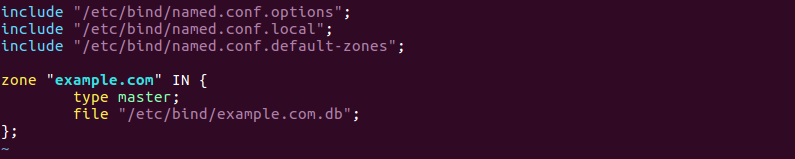

`/etc/bind/` 디렉터리로 이동한 후 example.com.db 라는 빈 파일을 만든다.

vi 에디터로 example.com.db 파일을 다음처럼 추가하고 저장한 후 종료한다.

```
$TTL	3H
@		IN		SOA		@		root. ( 2 1D 1H 1W 1H )

@		IN		NS		@
		IN		A		192.168.111.100		-> Server의 IP 주소
		IN		MX		10		mail.example.com.	-> 메일을 처리하는 컴퓨터를 지정
		
mail	IN		A		192.168.111.100		-> Server의 IP 주소
```

> IP 주소 부분의 끝에는 `.`을 입력해선 않되며, URL 형식 부분의 끝에는 `.` 을 찍어줘야 한다.

설정한 파일에 이상이 없는지 체크한다.

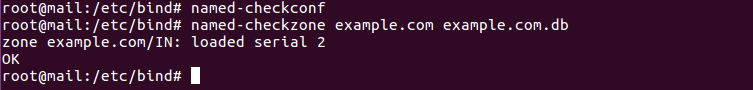

설정한 내용을 적용하기 위해 `systemctl restart bind9` , `systemctl enable bind9`, `systemctl status bind9` 명령을 입력해 네임 서버 서비스를 재시작하고 확인한다.

방화벽을 꺼도 되고, DNS(52번), SMTP(25번),POP3(110번) 포트만 열어도 된다.

<br>

---

#### 메일 서버의 DNS 서버를 직접 구축한 네임 서버로 설정하는 방법

vi 에디터로 `/etc/NetworkManager/system-connections/유선 연결 1` 파일을 열고 [ipv4] 아래 부분의 dns를 `네임 서버 IP` 로 수정한 후 저장한다.

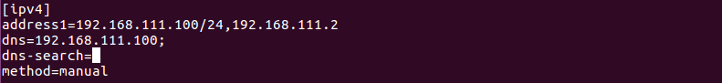

vi 에디터로 `/etc/resolv.conf` 파일을 열고 nameserver 부분을 `네임 서버 IP` 으로 수정한 후 저장한다.

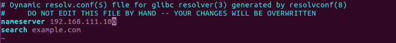

---

<br>

#### example.com 메일 서버를 구현한다.

메일 서버를 구현하는 피루 패키지는 보내는 기능의 `sendmail`, 받는 기능의 `dovecot-pop3d` 2가지다. sendmail은 앞 실습에서 설치했으르므로, `apt-get -y install dovecot-pop3d` 명령을 입력해 dovecot 관련 패키지를 설치한다.

vi 에디터로 `/etc/mail/sendmail.cf` 파일을 열고 다음과 같이 수정한다. (vi 에디터에서 행 번호는 `set number` 를 입력하면 확인할 수 있다.)

```
98행쯤 수정: Cwlocalhost	-> Cwexample.com(붙여서 쓴다)
269행쯤 수정: O DaemonPortOptions=Faminy=inet, Name=MTA-v4, Port=smtp, Addr=127.0.0.1
							-> , Addr=127.0.0.1 부분 삭제
270행쯤 수정: O DaemonPortOptions=Faminy=inet, Name=MSP-v4, Port=submission, M=Ea, Addr=127.0.0.1		-> , Addr=127.0.0.1 부분 삭제
```

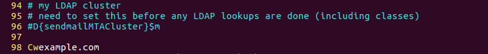

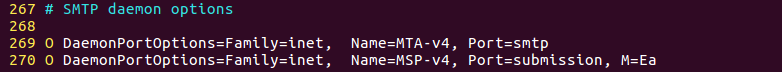

sendmail.cf 파일을 수정한 후에는 Sendmail 메일 서비스를 재시작해야한다. 하지만 지금은 다른 설정까지 모두 마친 후에 서비스를 다시 시작할 것이므로, 아직은 서비스를 재시작하지 않아도 된다.

<br>

---

/etc/mail/sendmail.cf 파일은 Sendmail 서버의 설정파일이다. 설정 내용이 길고 복잡해 꽤 까다롭게 여겨지지만, 꼭 필요한 부분만 알면 된다.

* Cw도메인 이름: 도메인 이름을 가진 메일 서버로 사용하겠다는 의미다.
* MaxMessageSize=용량: 1개 메일의 본문과 첨부 파일을 합친 제한 용량(바이트 단위)이다.
* Mlocal 설정내용: 전체 메일 공간을 '설정 내용' 으로 제한한다.
* O QueueDirectory=/var/spool/mqueue: 메일 전송 시 사용하는 임시 저장 디렉터리
* O DaemonPortOptions=Faminy=inet, Name=MTA-v4, Port=smtp, Addr=127.0.0.1: 'Addr=127.0.01'은 자기 자신만 메일을 보낼 수 있다는 의미다. 그래서 외부에서도 메일을 보낼 수 있도록 이부분을 삭제한 것이다.

---

<br>

외부 네트워크 또는 호스트가 메일을 보낼 수 있도록 허가해준다. vi에디터로 `/etc/mail/access` 파일을 열어서 제일 아래에 다음 내용을 추가해준다.

```
example.com	RELAY	-> example.com 도메인의 릴레이 허용
192.168.111	RELAY	-> 192.16.111.*** 컴퓨터의 릴레이 허용
```

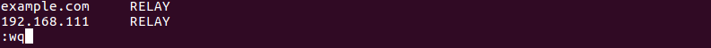

`/etc/mail/access` 파일을 수정한 후에는 `makemap hash /etc/mail/access < /etc/mail/access` 명령을 입력해 적용해야 한다.

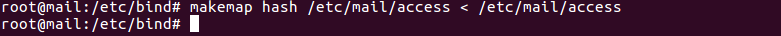

```
메일 릴레이(Mail Relay) 란 다른 네트워크 또는 호스트에서 자신의 메일 서버를 경유해서 메일을 전송하는 것이다. 이 기능을 악용해서 스팸 메일이나 바이러스 메일 등 대량 메일을 발송하는 경우가 종종 발생되어서 사회적인 문제까지 야기시키곤 한다.

그래서 Sendmail 에서 제공하는 메일 릴레이 기능은 기본적으로 자기 자신의 IP 주소(127.0.0.1) 외에는 아무도 메일을 발송할 수 없도록 설정된 것이다. 이 파일이 /etc/mail/access 파일이다.

하지만 모든 사용자가 메일 서버 컴퓨터 앞에 앉아서 메일을 보낼 수는 없으므로, 신뢰할 수 있는 도메인이나 호스트 또는 네트워크에는 메일을 릴레이할 수 있도록 허용한다. 보통 /etc/mail/access 파일의 릴레이 허용은 RELAY로, 거부는 REJECT 또는 DISCARD를 사용한다.

예를 들면 다음과 같다.
192.168.111.200	RELAY	->  192.168.111.200 컴퓨터의 릴레이 허용
abc.com	RELAY	-> abc.com 도메인에 릴레이 허용
192.168	RELAY	-> 192.168.xxx.xxx의 모든 컴퓨터에 릴레이 허용
babo@	DISCARD	-> babo라는 메일 계정의 메일 거부(거부 매시지 안 보내줌)
@daum.net	REJECT	-> daum.net 메일 사용자의 메일 거부(거부 메시지 안 보애줌)
```

/etc/mail/access 파일을 수정하면 꼭 센드메일 서비스를 재시작해야 한다.

<br>

사용자에게 메일 박스의 내용을 보내주는 dovecot 서비스의 설정파일은 `/etc/dovecot/dovecot.conf` 다. vi 에디터로 연 후 다음 부분을 수정해준다.

```
30행쯤 주석 제거: listen = *, ;;
33행쯤 주석 제거: base_dir = /var/run/dovecot/
34행쯤 추가: disable_plaintext_auth = no
```

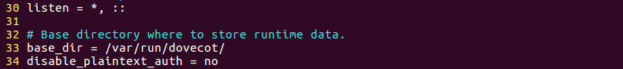

> dovecot.conf 설정파일도 내용이 좀 복잡하다. 30행의 '*'는 IPv4를, ';;'는 IPv6프로토콜을 의미한다. 또한 추가한 'disable_plaintext_auth = no' 부분이 틀리면 외부에서 정상 접속이 안되므로 주의한다. 그 외에 내용은 dovecot.conf 주석에 나와있으니 참고하도록 한다.

`/etc/dovecot/conf.d/10-mail.conf` 를 vi 에디터로 열고 다음 부분을 수정한다.

``` 
121행쯤 주석 제거 후 변경: mail_access_groups = mail
166행쯤 주석 제거: lock_method = fcntl
```


다음 명령을 입력해 `sendmail` 및 `dovecot` 서비스를 시작하고 상시 가동한다.

```
systemctl restart sendmail
systemctl enable sendmail
systemctl restart dovecot
systemctl enable dovecot
```

이로서 example.com 메일 서버를 완성 했다. 유저를 만들고 메일 클라이언트 프로그램으로 직접 사용해본다.

