# NFS Server

> NFS (Network File System) 서버 설치와 운영에 대해 알아본다.

<br>

Windows는 네트워크로 연결된 컴퓨터끼리는 간단하게 폴더(디렉터리)를 공유할 수 있지만, 리눅스는 대부분 명령어로 작업을 해결해야 하므로 윈도우보다는 좀 더 복잡한 과정을 거쳐야 한다.

NFS의 개념은 별로 어려울 것이 없으므로 아래 그림과 같이 구현해본다.

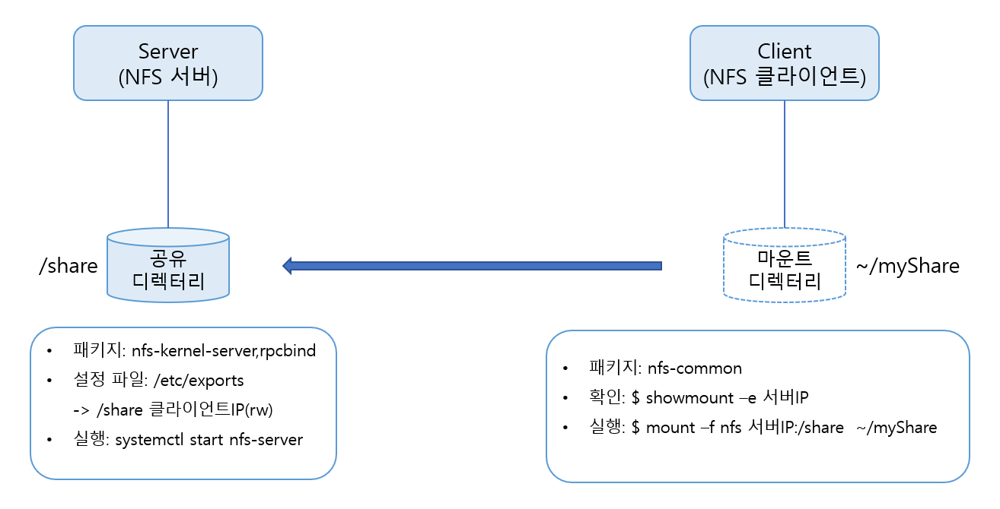

1. NFS 서버에 관련 패키지를 설치한다.
2. NFS 서버의 `/etc/exports` 에 공유할 디렉터리와 접근을 허가해줄 컴퓨터, 접근 권한을 지정한다.
3. NFS 서비스를 실행한다.
4. NFS 클라이언트에 관련 패키지를 설치한다.
5. NFS 클라이언트에 `showmount` 명령어를 실행해 NFS 서버에 공유된 디렉터리가 있는지를 확인한다.
6. NFS 클라이언트에서 `mount` 명령어를 실행해 NFS 서버에 공유된 디렉터리를 마운트한다.

위 그림에서 주목할 것은 NFS 클라이언트는 마운트된 `~/myShare` 라는 디렉터리에 접근하면 자동으로 NFS 서버의 `/share` 디렉터리에 접근하는 효과를 내는 것이다. (여기서 '&#126;' 는 현재 사용자의 홈 디렉터리이므로 현재 사용자가 ubuntu 사용자라면 /home/ubuntu/myShare 디렉터리가 된다.)

<br>

### NFS Server 구축

`apt-get -y install nfs-common nfs-kernel-server rpcbind` 명령을 입력해 NFS 서버와 관련된 패키지를 설치한다.

vi로 `/etc/exports` 파일에 다음 내용을 넣어서 공유할 디렉터리를 추가하고 저장한다.

```
/share		서버에접근할컴퓨터의IP주소(rw,sync)
```

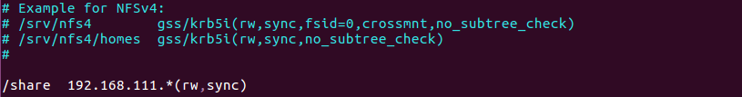

> 위 내용의 의미는 "'/share' 디렉터리에 해당 IP 주소 컴퓨터가 접근할 수 있도록 해주고, 접근 권한은 Read, Write 모두를 할 수 있도록 한다" 이다.
>
> 마지막에 있는 sync는 기본 설정 값이며, NFS가 쓰기 작업을 완료할 때마다 디스크를 동기화한다. 그래서 쓰기 속도가 async보다는 약간 더 느려진다.

<br>

```
/etc/exports 파일은 다양하게 사용될 수 있다. 형식은 다음과 같다.
	공유할디렉터리		접근할호스트IP주소또는이름(접근권한옵션)
예를들면 다음과 같다.
ex) /share라는 디렉터리를 192.168.111.128 컴퓨터에 읽기 전용으로 공유하라
	/share		192.168.111.128(ro)
ex) /share 라는 디렉터리를 this.com 도메인 아래의 모든 호스트에서 읽기가 가능하도록 공유하라.
	/share		*.this.com(rw)
이 외에 세부사항은 man exports 명령을 실행해 확인한다.
```

<br>

`/share` 디렉터리를 생성하고, `chmod` 명령으로 `/share` 디렉터리의 접근 권한을 `707`로 한다. 적당한 파일을 /share 디렉터리에 미리 복사한다.

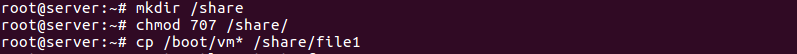

`systemctl restart nfs-server` 명령과 `systemctl enable nfs-server` 명령을 입력해 nfs-server 서비스를 시작 및 상시 가동되도록 한다.

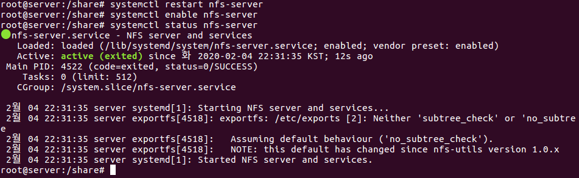

`exportfs -v` 명령을 입력해 서비스가 가동하는지 확인한다.

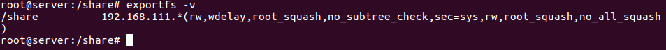

`ufw disable` 명령으로 방화벽을 끈다.

> NFS 서버는 보안에 취약한 편이라 일일이 보안 관련 설정을 하는것이 좋다. 보안 관련 내용은 따로 기술하도록 하겠다.

<br>

<br>

### 리눅스에서 NFS Server 접속하기

`apt-get -y install nfs-common` 명령을 입력해 관련 패키지를 설치한다.

우선 `showmount -e NFS서버IP주소` 명령을 입력해 NFS서버에 공유된 디렉터리를 확인해본다.

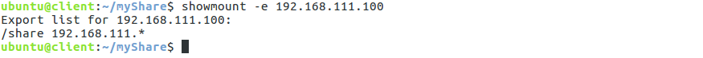

다음 명령을 참고해 NFS 서버의 `/share` 디렉터리에 마운트할 디렉터리 `/home/사용자/myShare` 를 만들고, 마운트한다.

```shell
$ cd -> 사용자의 홈 디렉터리로 이동
$ mkdir myShare
$ sudo mount -t nfs NFS서버IP주소:서버공유디렉터리 클라이언트마운트디렉터리
```

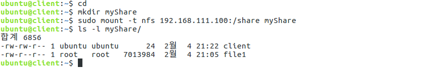

이제 `/home/ubuntu/myShare` 디렉터리를 사용한다는 의미는 NFS 서버의 `/share` 디렉터리를 사용하는 것과 같다.

##### 부팅될때마다 NFS 서버의 디렉터리에 자동으로 마운트

`sudo gedit /etc/fstab` 명령으로 파일을 열고 맨 아래 줄에 다음 내용을 추가한다.

```
NFS서버IP:서버공유디렉터리	클라이언트마운트디렉터리	nfs 	defaults 	0	0
```

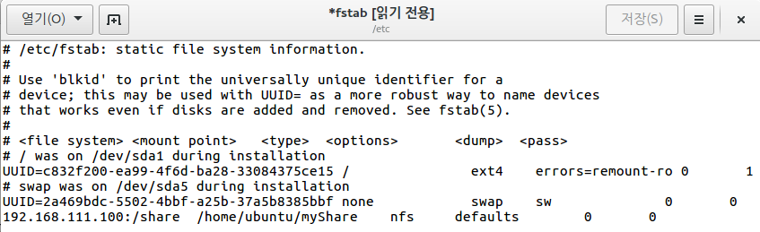

재부팅한 후, 자동으로 nfs 공유 폴더가 마운트되었는지 확인한다.

<br>

### 윈도우에서 NFS 서버 접속하기

검색에 [Windows 기능 켜기/끄기] 기능을 선택하고 [NFS용 서비스] -> [NFS용 클라이언트]의 체크를 켜고 [확인] 을 클릭해 설치한다.

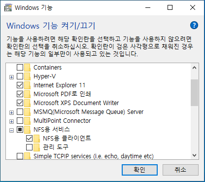

설치가 완료된 후, 명령 프롬프트에서 `mount NFS서버IP주소:서버공유디렉터리 *` 명령을 입력해 NFS서버에 접속한다.

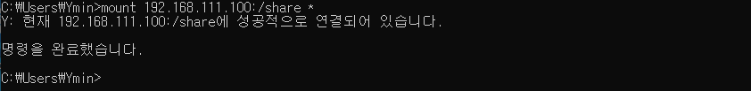

자동으로 Z드라이브가 생성되면서 접속된다. Windows 파일 탐색기를 열고 확인해본다.

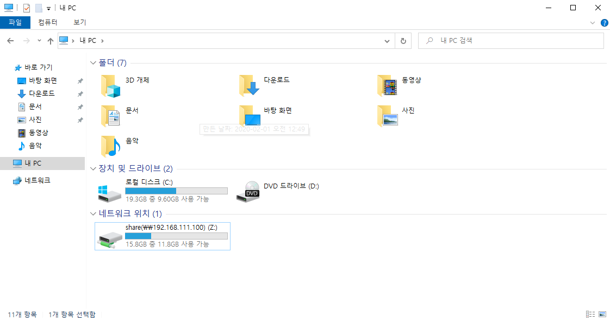