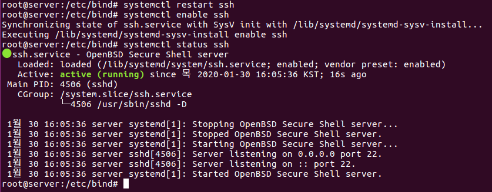

# OpenSSH Server

> 원격에서 서버를 관리할 수 있게 해주는 SSH 서버에 대해 알아본다.

<br>

openssh 서버는 원격지에서 리눅스 서버에 접속할 수 있게 해준다. 텔넷과 용도는 동일하지만 ssh 서버는 데이터 전송시 패킷을 암호화 해주기 때문에 보안상 더 안전하다.

<br>

### OpenSSH 설치

`apt-get -y install openssh-server` 명령으로 SSH 서버를 설치한다.

다음 명령을 입력해 서비스를 재가동/상시가동/가동확인 한다. SSH 서버의 서비스(데몬) 이름은 ssh이다.

```bash
systemctl restart ssh	-> 서비스 재가동
systemctl enable ssh	-> 서비스 상시 가동
systemctl status ssh	-> 서비스 가동 여부(q를 누르면 종료)
```



만약 방화벽이 켜져 있다면 `ufw allow 22/tcp` 명령으로 방화벽에서 SSH 포트인 22번을 허용하고 `ufw status` 명령으로 확인한다.


<br>

<br>

### 서버 접속하기

#### 리눅스

`ssh 사용자이름@호스트이름` 또는 `ssh 사용자이름@IP주소` 명령으로 접속하면 된다.

#### 윈도우

윈도우에선 외부 텔넷 프로그램인 `한글 PuTTY` 라는 프로그램을 사용하여 접속한다.