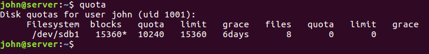

# Quota 쿼터

> 리눅스에서 사용자별 파일 관리를 도와주는 쿼터에 대해 학습한다.

<br>

쿼터`Quota` 를 간단히 정의하면 다음과 같다.

**파일 시스템마다 사용자나 그룹이 생성할 수 있는 파일의 용량과 개수를 제한하는것**

일반 사용자들이 사용하는 파일 시스템을 루트(/)로 지정하는 것보다는 별도의 파일 시스템을 지정해서 지정한 부분만 사용하도록 하는 것이 여러 면에서 좋다. 우선 실수로 시스템과 관련된 문제를 발생시킬 소지가 적어지고, 서버용 하드와 사용자별 하드를 분리시켜 시스템 성능을 향상시킬 수 있다.


위 그림과 같은 순서대로 실습을 진행한다.

<br>

사용자 디스크의 파티션을 나눠준 뒤, 포멧하고 /userHome 에 마운트 시켜준다. 

```
$ fdisk /dev/sdb
Command: n
Select: p
Partition number: 1
First cylinder: Enter
Last cylinder: Enter
Command: w
$ mkfs.ext4 /dev/sdb1
$ mkdir /userHome
$ mount /dev/sdb1 /userHome
```

재부팅해도 인식되도록 vi 나 gedit 을 이용해서 /etc/fstab 맨 아래에 다음의 내용을 추가한다.

**/dev/sdb1		/userHome		ext4		defaults		0			0**

다음 명령을 입력해 쿼터 실습을 할 사용자 john 과 bann 을 만들고, 비밀번호도 사용자 이름과 동일하게 입력한다.

```shell
$ adduser --home /userHome/john john	-> 암호도 john으로 지정하고 나머지는 기본값 생략
$ adduser --home /userHome/bann bann	-> 암호도 bann으로 지정하고 나머지는 생략
```

 /etc/fstab 파일을 열어서, /dev/sdb1 을 마운트하는 부분에 다음과 같이 `,usrjquota=aquota.user,jqfmt=vfsv0` 을 추가한다.

**/dev/sdb1	/userHome	ext4	defaults,usrjquota=aquota.user,jqfmt=vfsv0	0	0**


아래는 /etc/fstab 에 적용할 수 있는 옵션들이다.

| 옵션               | 적용대상      | 용도                                                         |
| ------------------ | ------------- | ------------------------------------------------------------ |
| usrquota           | 모든 유형     | 사용자 할당량 사용                                           |
| usrjquota=filename | vfsv0         | 저널 사용자 할당량 사용(jqfmt 옵션의 스펙 및 할당량 데이터베이스 파일 이름(일반적으로 aquota.user)이 필요함) |
| uquota             | xfs           | usrquota와 동등                                              |
| grpquota           | 모든 유형     | 그룹 할당량 사용                                             |
| grpjquota=filename | vfsv0         | 저늘 그룹 할당량 사용(jqfmt 옵션의 스펙 및 할당량 데이터베이스 파일 이름(일반적으로 aquota.group)이 필요함) |
| gquota             | xfs           | grpquota와 동등                                              |
| prijquota          | xfs           | 프로젝트 할당량 사용                                         |
| pquota             | xfs           | prjquota와 동등                                              |
| fqfmt=format       | vfsv0         | usrjquota 또는 grpjquota가 지정될 때 사용된 할당량의 형석(현재는 vfsv0가 유일하게 지원되는 형식임) |
| quota              | vfsold, vfsv0 | usrquota와 동등                                              |
| noquota            | vfsold,vfsv0  | 할당량을 사용하지 않음                                       |
| uqnoenforce        | xfs           | 사용자 할당량 계산을 사용하지만 적용하지는 않음              |
| gqnoenforce        | xfs           | 그룹 할당량 계산을 사용하지만 적용하지는 않음                |
| pqnoenforce        | xfs           | 프로젝트 할당량 계산을 사용하지만 적용하지는 않음            |

<br>

재부팅하는 효과를 내기 위해 `mount --options remount /userHome` 명령을 입력해 다시 마운트한다. 그리고 `mount` 명령을 입력해 확인해보면 /dev/sdb1 디렉터리가 '쿼터' 용으로 마운트된 것을 확인할 수 있다.

`apt-get -y install quota` 명령으로 관련 패키지를 설치한다.

<br>

쿼터를 사용하려면 쿼터 DB를 생성해야 한다. 다음 명령을 차례로 입력한다.

```shell
$ cd /userHome			-> 쿼터용 파일 시스템이 마운트된 디렉터리로 이동
$ quotaoff -avug		-> 일단 쿼터를 끈다.
$ quotacheck -augmn		-> 파일 시스템의 쿼터 관련 체크를 한다.
$ rm -f aquota.*		-> 생성된 쿼터 관련 파일을 일단 삭제한다.
$ quotacheck -augmn		-> 다시 파일 시스템의 쿼터 관련 체크를 한다.
$ touch aquota.user aquota.group	-> 쿼터 관련 파일을 생성한다.
$ chmod 600 aquota.*	-> 보안을 위해 소유자(root) 외에는 접근하지 못하게 한다.
$ quotacheck -augmn		-> 마지막으로 파일 시스템의 쿼터 관련 체크를 한다.
$ quotaon -avug			-> 설정된 쿼터를 시작한다.
```

<br>

> quotacheck 명령은 하드디스크를 스캔해서 여러 가지 부분을 체크하는 기능하고, quotaon/quotaoff 명령은 설정된 쿼터를 키거나 끄는 기능을 한다. 사용할 수 있는 옵션을 요약하면 다음과 같다.

* -a(All): 모든 파일 시스템을 체크한다.
* -u(User): 사용자 쿼터 관련 체크를 한다.
* -g(Group): 그룹 쿼터 관련 체크를 한다.
* -m(no-remount): 재마운트를 생략한다.
* -n(use-first): 첫 번째 검색된 것을 사용한다.
* -p(print-state): 처리 결과를 출력한다.
* -v(Verbose): 파일 시스템의 상태를 보여준다.

<br>

쿼터 DB의 생성을 완료했으므로 이제는 각 사용자별로 공간을 할당해줘야 한다.

john 사용자와 bann 사용자가 사용할 수 있는 공간을 각각 15MB 씩 할당하자. `edquota -u john` 명령을 입력하면 각 사용자별 또는 그룹별 할당량을 편집할 수 있다.


우선 각 열의 의미를 살펴본다.

* [Filesystem] : 사용자별 쿼터를 할당하는 파일 시스템을 의미한다. 앞에서 /etc/fstab 파일에 /dev/sdb1 을 쿼터로 설정해놓았다.
* [blocks], [soft], [hard] : 현재 사용자가 사용하는 블록(KB단위)과 소프트 한도, 하드 사용 한도를 의미한다. blocks 에 28이 설정되어 있으므로 현재 john이라는 사용자가 28KB를 사용한다는 의미다. soft 와 hard에 0을 입력하면 사용한도를 제한하지 않겠다는 의미이다.
* [inodes], [soft], [hard] : [blocks] 는 용량을 의미하지만, inodes는 inode의 개수를 의미한다.(파일의 개수라고 이해하면 쉽다) 현재 john 사용자는 5개의 파일을 사용하며, 한도는 제한하지 않았다는 의미이다.

<br>

[soft]와 [hard] 부분에 각각 10MB(10,240KB), 15MB(15,360KB)로 제한하고 저장한다. 

이제는 john 사용자가 사용할 수 있는 용량이 설정한 대로 제한되어 있는지 확인한다. john 사용자로 접속한 수 다음 명령을 입력한다.

```shell
su -john
$ pwd
$ cp /boot/vm* test1	-> 약 6.7MB 사용
$ cp /boot/vm* test2	-> 약 13.4MB 사용: 소프트 한도(10MB) 초과
$ ls -l		-> test2 파일이 소프트 한도가 넘었지만 파일은 정상적으로 복사됨
$ cp /boot/vm* test3	-> 약 20.1MB 사용: 하드 한도(15MB)를 초과해 더 사용할 수 없음
$ ls -l		-> test3 파일은 하드 한도까지 사용할 수 있는 남은 용량(약 1.6MB) 만큼 만 파일이 생성됨. 그러므로 test3은 정상적인 파일이 아님
```


john 사용자는 `quota` 명령을 입력해 자신에게 할당된 디스크 공간을 확인하면 된다.



[blocks] 는 현재 사용자(john) 가 사용하는 하드디스크 공간이다. [limit] (=hard) 가 15,360KB 이므로 이미 제한된 사용량을 모두 사용한 것이다. 그런데 john 사용자에게 허용된 실제 사용량은 [quota] (=soft) 인 10,240KB 가 된다. 이를 넘는 공간인 5,120KB  는 [grace] (유예기간) 인 6일 동안만 사용할 수 있는 것이다. 그러므로 john 사용자는 6일 이내에 자신의 [quota] 사용량인 10,240KB 를 넘는 공간을 정리해야 한다.

<br>

`exit` 명령을 입력해 로그아웃 한 후 root 사용자의 권한으로 `repquota /userHome` 명령을 실행하면 사용자별 현재 사용량을 확인할 수 있다.


<br>

이번에는 bann 사용자에게도 john 사용자와 똑같이 사용량을 할당해본다. `edquota -p 기준사용자 대상사용자` 명령을 입력하면 동일하게 저장할 수 있다. 작업이 끝나면 `repquota /userHome` 명령으로 확인해본다.

