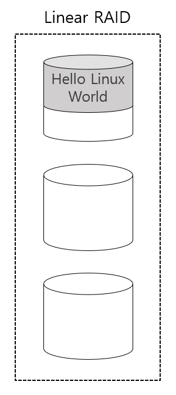
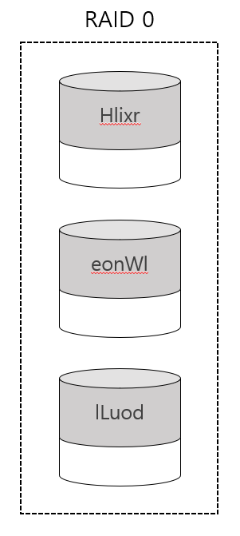
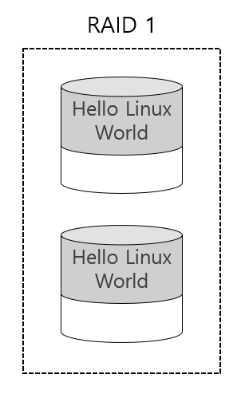
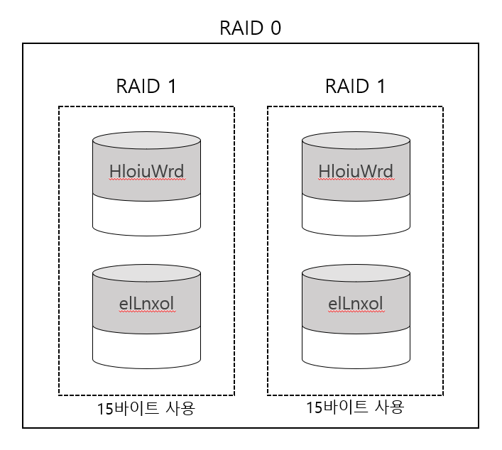

# RAID Level

> 여러 개의 하드디스크를 하나의 하드디스크처럼 사용 할 수 있는 RAID에 대하여 설명한다.

 

### Linear RAID

Linear RAID 방식은 최소 2개 이상의 하드디스크를 1개의 볼륨으로 사용한다. 파일이 저장되는 방식은 앞 하드디스크에 데이터가 완전히 저장 된 후, 다음 하드디스크에 데이터를 저장한다. 즉, 앞 하드디스크에 데이터가 완전히 저장되지 않는다면 다음 하드디스크는 전혀 사용되지 않는 것이다.

Linear RAID의 장점은 각 하드디스크의 용량이 달라도 전체 용량을 문제 없이 사용할 수 있어 공간 효율성이 100% 라는 것이다. 앞으로 설명할 RAID 0 과 비교하자면 10TB 하드와 1TB 하드로 Linear RAID 와 RAID 0 를 구성했을때 Linear RAID는 총 11TB의 용량을 사용할 수 있지만 RAID 0가 사용할 수 있는 용량은 2TB밖에 안된다.

 

### RAID 0

RAID 0 역시 최소 2개 이상의 하드디스크를 1개의 볼륨으로 사용한다. 단 Linear RAID 와는 달리 파일이 저장될때 모든 하드디스크를 동시에 사용한다. 예를 들어 "Hello Linux World" 라는 내용이 저장될때 다음과 같은 방식으로 저장된다.

*Hello Linux World*

Linear RAID 는 1번째 하드디스크가 모두 채워진 후에 2번째 하드디스크를 사용한다. 이와 달리 RAID 0은 1번째, 2번째, 3번째 하드디스크에 동시에 저장된다. 

여기서 '동시에' 라는 말은 중요한 의미를 갖는다. Linear RAID에서 "Hello Linux World" 가 저장되는 시간이 한 글자당 1초라고 가정하면 Linear RAID 경우에는 총 15초의 시간이 소요된다. 그러나 RAID 0 의 경우에는 동시에 하드디스크 3개를 사용하므로 각 하드디스크당 5글자만 저장된다. 즉, 5초면 저장이 완료된다. 이렇게 여러 개의 하드디스크에 동시에 저장되는 방식을 `스트라이핑` 방식이라고 부른다.

단점으로는 RAID 0의 경우 3개의 하드디스크 중 하나가 고장 날 경우에는 모든 데이터를 잃어버린다는 것이다. 그러므르 RAID 0 방식을 사용하는 데이터는 `빠른 성능을 요구하되, 전부 잃어버려도 큰 문제가 되지 않는 자료` 를 저장하는 데 적절한 방식이라고 볼 수 있다.

 

### RAID 1

RAID 1 방식의 핵심은 `미러링` 이라고 할 수 있다. 즉, 똑같은 데이터의 거울을 만들어 놓는다는 것이다. 예를 들어 하드디스크 2개를 RAID 1 방식으로 구성한 후 "Hello Linux World" 를 저장하면 다음과 같다.

15바이트를 저장하는 데는 2배의 용량인 30바이트가 사용되었음을 확인 할 수 있다. 즉, 데이터를 저장하는 데 2배의 용량을 사용한다. 이 말은 총 하드디스크 용량의 절반밖에 사용하지 못한다는 것이다. 

RAID 1 의 장점은 2개의 하드디스크중 하나가 고장나도 데이터는 손상되지 않는다는 것이다. 이 것을 "`결함 허용`을 제공한다" 라고 표현한다. 반대로 단점은 위에서 언급한것처럼 실제 계획하는 것보다 2배 큰 저장 공간이 필요하다는 것이다.  이를 "공간 효율이 떨어진다" 라고도 표현한다.

저장 속도의 측면에서는 똑같은 데이터를 2번 저장하므로, 2배의 시간이 걸린다고 생각 할 수도 있지만 똑같은 데이터가 다른 하드디스크에 동시에 저장되는 것이므로, 저장 속도는 빠르지도 느리지도 않다.

 

RAID 0 과 RAID 1을 간단하게 비교하면 다음과 같다.

| -                        | RAID 0                | RAID 1             |
| ------------------------ | --------------------- | ------------------ |
| 성능(속도)               | 뛰어남                | 변화 없음          |
| 데이터 안전성(결함 허용) | 보장 못함(결함 허용X) | 보장함(결함 허용O) |
| 공간 효율성              | 좋음                  | 나쁨               |

 

 

### RAID 5

RAID 5는 RAID 1처럼 데이터의 안정성도 어느 정도 보장되면서 RAID 0 처럼 공간 효율성도 어느정도 포용하는 방식이다.

RAID 5는 최소한 3개 이상의 하드디스크가 있어야만 구성이 가능하며 대개는 5개 이상의 하드디스크로 구성한다. 하드디스크에 오류가 발생하면 `패리티` 를 이용해서 데이터를 복구할 수 있다.

'000 111 010 011'이라는 12비트 데이터를 4개의 하드디스크로 구성된 RAID 5에 저장하는걸로 예를 들어본다.

.PNG)

네모로 표시된 데이터는 패리티 데이터다. 각 행에 하나씩 패리티 데이터를 사용하며 첫 번째 행은 sdd, 두 번째 행은 sdc 3번째 행은 sdb 와 같은 순서로 패리티를 사용할 공간을 비워 놓는다.

다음 예는 짝수 패리티를 사용하여 빈칸은 채워넣은 사진이다.

.PNG)

짝수 패리티를 사용하기로 했으므로 첫 행의 '0+0+0+Parity'는 짝수가 되어야 한다. 그러므로 첫 행의 패리티는 0이 입력된다. 두 번째 행도 '1+Parity+1+1=짝수' 이므로 패리티는 1이 된다. 세 번째 네 번째도 마찬가지이다.

이렇게 저장이 완료된 RAID 5는 어느 정도의 결함을 허용한다.  네 개의 하드디스크 중에서 1개가 고장 나도 원래의 데이터를 추출 할 수 있는 것이다.

다음은 두 번째 하드디스크인 sdb가 고장 났다고 가정하고 sdb의 데이터 저장 상태를 유추하는 그림이다.

.PNG)

첫 행을 보면 현재 sda 에는 0, sdb는 알 수 없음, sdc는 0, sdd는 0이 들어 있다. '0+알수없음+0+0=짝수' 여야 하므로 알 수 없는 sdb의 값은 0이 되는 것을 예측할 수 있다. 나머지도 마찬가지로 유추해보면 sdb에 들어 있던 원래 값이 0110 이라는 것을 알 수 있으므로 원래의 데이터를 손실 없이 사용할 수 있다.

RAID 5 의 장점은 어느 정도의 결함을 허용하며 저장 공간의 효율도 좋다는 것이다. 각 하드디스크의 용량이 1TB 라고 가정한다면, 총 사용할 수 있는 공간은 3TB 로 전체 용량의 75%가 된다. 이는 하드디스크의 갯수를 늘릴수록 효율을 높일 수 있다.

 

 

### RAID 6

RAID 6 방식은 RAID 5 방식의 개선으로, RAID 5는 1개의 패리티를 사용하지만 RAID 6 은 2개의 패리티를 사용한다. 공간 효율은 RAID 5 보다 약간 낮지만, 2개의 하드디스크가 동시에 고장 나도 데이터에는 이상이 없도록 한다. 

또, RAID 5 의 경우에는 최소 3개의 하드디스크로 구성해야 했지만, RAID 6 의 경우에는 최소 4개의 하드디스크로 구성해야 한다는 점도 기억해야 한다.

 

 

### RAID 1+0

기본적인 RAID 방식을 조합해서 구성할 수도 있다. 그 중 많이 사용하는 예로 RAID 1+0 방식이 있다. RAID 1로 구성한 데이터를 다시 RAID 0으로 구성하는 방법이다. 신뢰성(안전성)과 성능(속도)을 동시에 확보하는 방법이다.

위 RAID 1+0 방식은 전체 15글자(15바이트)를 저장하는 데 각 하드디스크당 7&#126;8 글자만 저장하면 되므로 총 7&#126;8초밖에 걸리지 않는다. 또 왼쪽 RAID 1과 오른쪽 RAID 1에서 각각 하드디스크가 1개씩 고장나도 데이터는 안전하므로 신뢰성(안전성) 까지 얻을 수 있다. 이 외에도 아주 중요한 데이터일 경우에는 RAID 1+6 방식을 사용할 수도 있다.
