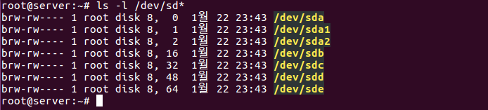
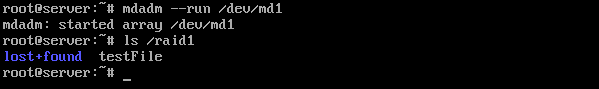

# RAID Practice

> RAID 구성을 직접 실습해본다.

<br>

RAID 0,1 을 직접 리눅스에서 구성해보고 하드디스크에 오류가 발생했을때의 결과와 복구 방법에 대하여 실습해보기로 한다.

<br>



<br>

본격적으로 시작하기 전에 하드 디스크 장착을 먼저 확인한다. 위 사진에선 우분투가 깔려있는 `/dev/sda` 하드디스크를 제외하고 `/dev/sdb~/dev/sde` 까지 4개의 하드디스크가 추가로 장착되어 있는것을 확인 할 수 있다.

이중 `sdb,sdc` 로는 RAID 0 을 구성하고 `sdd,sde` 로는 RAID 1을 구성하기로 한다.

가장 먼저 해야할 일은 각각의 하드디스크에 파티션을 생성하는 것이다. 파이션 생성은 아래 명령어를 참고하여 4개의 하드디스크에 전부 파티션을 생성하도록 한다.

```shell
$ fdisk /dev/sdb	-> [SCSI 0:1] 하드디스크 선택
Command: n			-> 새로운 파티션 분할
Select: p			-> Primary 파티션 선택
Partition number: 1	-> 파티션 번호 1번 선택				
First sector: Enter	-> 시작 섹터 번호
Last sector: Enter	-> 마지막 섹터 번호
Command: t			-> 파일 시스템 유형 선택
Hex Code: fd		-> 'Linux raid autodetect' 유형 번호
Command: p			-> 설정 내용 확인
Command: w			-> 설정 저장
```

<br>

파티션을 전부 생성하면 `ls -l /dev/sd*` 명령어로 확인 해 본다.


`apt-get -y install mdadm` 명령어로 관련 패키지를 설치해 놓는다.

```
mdadm 명령은 우분투에서 RAID 장치를 생성/관리하는 명령어다. 옵션의 의미는 다음과 같다.
	--create /dev/md9		-> md9 장치에 RAID를 생성
	--level=0				-> RAID 0 을 지정, 1은 RAID 1, linear 은 Linear RAID
	
이 외에도 자주 사용되는 명령은 다음과 같다.
	mdadm --stop /dev/md9	-> RAID 장치인 /dev/md9 를 중지
	mdadm --run /dev/md9	-> 중지된 RAID 장치를 가동
	mdadm --detail /dev/md9	-> /dev/md9 장치의 상세한 내역을 출력

더 자세한 내용은 'man mdadm' 을 실행해 확인할 수 있다.
```

<br>

<br>

---

### RAID 0 구축

<br>

mdadm 명령을 이용하여 RAID 를 구성한다.

```shell
$ mdadm --create /dev/md0 --level=0 --raid-devices=2 /dev/sdb1 /dev/sdc1
$ mdadm --detail --scan
```


`mkfs.ext4 /dev/md0` 명령을 입력해 `/dev/md0` 장치를 포맷해준다.

`mkdir /raid0` 명령을 입력해 마운트할 디렉터리(/raid0) 를 생성하고 `mount /dev/md0 /raid0` 명령을 입력해 마운트시킨다. `df` 명령을 입력해 확인해보면 `/raid0` 디렉터리가 약 1.9GB 가량 여유공간이 있음을 확인할 수 있다. RAID 0 은 2개 하드디스크 용량을 모두 사용하기 때문에 약 2GB 정도가 나왔다.


마지막으로 컴퓨터를 켤 때 언제든지 /dev/md0 장치가 /raid0 디렉터리에 마운트되어 있도록 설정하자.

/etc/fstab 파일을 vi 에디터나 gedit 으로 열어서 맨 아래 부분에 다음을 추가하고 저장하자.

**/dev/md0	/raid0	ext4	defaults	0	0**

**mdadm --detail /dev/md0** 명령을 입력해 구축한 RAID 0 을 자세히 확인할 수 있다.

<br>

<br>

---

### RAID 1 구축

<br>

mdadm 명령을 이용하여 RAID 를 구성한다.

```shell
$ mdadm --create /dev/md1 --level=1 --raid-devices=2 /dev/sdd1 /dev/sde1
$ mdadm --detail --scan
```


`mkfs.ext4 /dev/md1` 명령을 입력해 `/dev/md1` 장치를 포맷해준다.

`mkdir /raid1` 명령을 입력해 마운트할 디렉터리(/raid0) 를 생성하고 `mount /dev/md1 /raid1` 명령을 입력해 마운트시킨다. `df` 명령을 입력해 확인해보면 `/raid1` 디렉터리가 약 0.9GB 가량 여유공간이 있음을 확인할 수 있다. RAID 1 은 동일한 데이터를 2회 저장하기 때문에 실제 가용 용량은 2GB 의 절반인 1GB 정도로 나온다.


마지막으로 컴퓨터를 켤 때 언제든지 /dev/md1 장치가 /raid1 디렉터리에 마운트되어 있도록 설정하자.

/etc/fstab 파일을 vi 에디터나 gedit 으로 열어서 맨 아래 부분에 다음을 추가하고 저장하자.

**/dev/md1	/raid1	ext4	defaults	0	0**

**mdadm --detail /dev/md1** 명령을 입력해 구축한 RAID 1 을 자세히 확인할 수 있다.

<br>

재부팅하기 전에 몇 가지 mdadm의 버그 때문에 몇 가지 설정을 해야 한다.

**mdadm --detail --scan** 명령으로 2개 ARRAY 의 내용을 마우스로 드래그하고, 복사한다.


**gedit /etc/mdadm/mdadm.conf** 명령으로 설정파일을 열고 제일 아래에 붙여넣기 한다. 또 각 행의 중간 부분에 있는 'name=server: 숫자' 부분은 삭제한다. 최종적으로 다음과 같이 저장하고 gedit 을 닫는다.


**update-initramfs -u** 명령으로 설정한 내용을 적용시킨다.

<br>

<br>

---

### RAID 0,1 에서 문제 발생과 조치 방법

<br>

각 RAID 장치들이 학습한 내용처럼 잘 작동하는지 테스트해본다.

RAID 0 은 하드디스크 중 하나라도 고장 나면 해당 디스크에 저장된 데이터는 복구 불가능하다. 반면에 RAID 1은 하드디스크중 하나가 고장 나도 데이터는 안전하다.

먼저 기존의 /raid0, /raid1 디렉터리에 적당한 파일을 하나 만들어둔다. 그 뒤 RAID 0,1에 연결되있는 하드디스크를 각각 한개씩 제거하여 고장내는 작업을 한다.

부팅을 하면 정상적으로 부팅되지 않고 응급 모드`Emergency mode` 로 접속된다. RAID로 구성된 하드디스크가 고장 나면 일단 응급 모드로 접속된다.

먼저 `ls -l /dev/sd*` 명령을 입력해 장치 이름을 확인해보자. 기존에 `/dev/sdb~/dev/sde` 4개의 하드디스크가 `/dev/sdb~/dev/sdc` 2개만 남아있다.


`df` 명령을 입력해 확인하면 기존의 /raid0, /raid1 디렉터리는 보이지 않는다.


<br>

---

우선 **mdadm --run /dev/md1** 명령을 입력해 결함 허용을 제공하는 RAID 1 을 다시 가동시킨다.



`ls /raid1` 명령을 입력해 RAID 1에 저장했던 파일을 확인해보면 그대로 잘 있는 것을 확인할 수 있다.

`mdadm --detail /dev/md1` 명령을 입력해 RAID 1 장치를 확인해보면 총 2개의 하드디스크 중에서 1개가 작동함을 확인 할 수 있다.


<br>

---

이번에는 **mdadm --run /dev/md0** 명령을 입력해 결함 허용을 제공하지 않는 RAID 0을 가동시켜본다.


이미 학습했듯이 RAID 0 은 1개의 하드디스크로는 작동 자체를 하지 않는다.

우선 시스템이 정상적으로 가동되도록 하기 위해 RAID 0 장치는 중지하고, /etc/fstab 에서도 제거하도록 한다.

`mdadm --stop /dev/md0` 명령을 입력해 RAID 0을 중지한다. 그 뒤 vi 에디터로 /etc/fstab 을 열어 /dev/md0 행 앞에 #를 붙여 주석처리한뒤 리붓한다.

<br>

---

### RAID 0,1 의 원상 복구

<br>

새로운 하드디스크를 추가하여 RAID 0,1 을 원상복구 해본다. 기본적으로 하드디스크를 추가한다고 해서 자동으로 RAID 장치가 복구되는 것은 아니다.


새로 장착한 하드디스크를 확인 한 뒤 파티션을 분할해준다(방법은 위에 나와있다).

<br>

먼저 RAID 0 장치부터 복구한다.

`mdadm --stop /dev/md0` 명령을 입력해 RAID 0 장치를 중지하고 **mdadm --create /dev/md0 --level=0 --raid-devices=2 /dev/sdb1 /dev/sdc1** 명령을 입력해 다시 구성한다.

`mdadm --detail /dev/md0` 명령을 입력해 RAID 장치를 확인하면 잘 작동하는 것을 확인할 수 있다.


<br>

다음으로 RAID 1을 복구해본다. RAID 1 은 하드디스크가 1개 빠졌을 분 잘 작동한다, 그러므로 새로운 하드디스크만 추가하는 명령인 **mdadm /dev/md1 --add /dev/sde1** 을 입력해야 한다.


`mdadm --detail /dev/md1` 명령어로 확인하면 RAID 1 장치가 잘 작동하는것을 확인할 수 있다.


<br>

마지막 확인차 `ls` 명령어로 /raid0, /raid1 디렉터리를 보면 당연하게도 raid0 디렉터리에는 아무 파일도 없고 /raid1 디렉터리에는 testFile 이 그대로 남아있다.

