# Samba Server

> Samba Server 설치와 운영에 대해 알아본다.

<br>

### 리눅스에서 Windows의 폴더와 프린터 사용

Windows에서 폴더와 프린터를 공유해 놓으면, Windows에서는 특별한 절차 없이 공유된 폴더와 프린터를 사용할 수 있다. 이러한 방식으로 Windows에서 공유해 놓은 폴더와 프린터를 리눅스에서도 자유롭게 사용 가능하다.

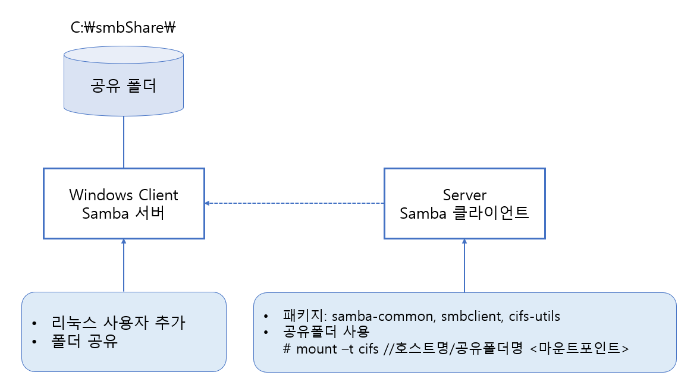

그림에서 보는 바와 같이, 여기서 한 가지 확인해야 할 것은 `Samba 서버` 를 별도로 설치할 필요가 없으며 `Samba 클라이언트` 만 존재하면 된다는 점이다. 즉, Windows가 Samba 서버 역할을 해서 자신의 공유 폴더와 프린터를 제공하며, 리눅스(Server) 는 Samba 클라이언트 역할을 해서 Windows가 제공한 폴더와 프린터를 사용하는 것이다.

<br>

#### WinClient(Samba 서버 역할)

* WinClient에 자신의 자원을 사용할 사용자를 추가한다.
* WinClient의 자원을 공유한다.

#### Server(Samba 클라이언트 역할)

* Samba 클라이언트 패키지가 설치되어 있는지 확인한다.
* smbclient 명령으로 WinClient가 제공하는 자원을 확인한다.
* smbmount 명령으로 WinClient가 제공한 공유 폴더를 마운트한다.

<br>

Windows에서 C:\smbShare\라는 폴더를 만든다. 만든 폴더를 마우스 우클릭 한 후 바로가기 메뉴에서 [속성]->[공유]를 선택한 후, [공유] 버튼을 클릭해서 다음과 같이 [Everyone] 사용자를 추가하고, 읽기/쓰기 권한을 설정해준뒤 [공유]를 클릭한다.

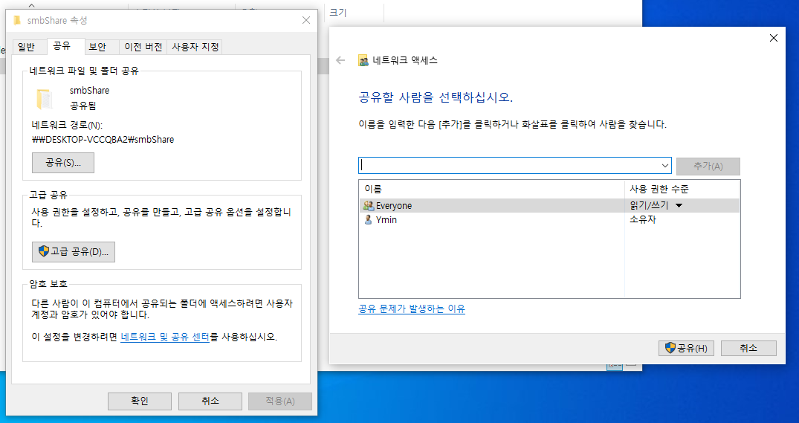

공유할 폴더인 C:\smbShare\ 에 적당한 파일을 몇 개 복사해둔다.

제어판의 [사용자 계정]에 들어가 root 계정을 하나 만든다.

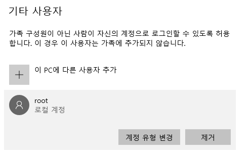

명령 프롬프트에서 `ipconfig` 명령을 입력해 IP를 확인해둔다.

이제 리눅스로 넘어와서 `apt-get -y install samba-common smbclient cifs-utils` 명령을 입력해 관련 패키지를 설치한다.

vi로 `/etc/samba/smb.conf` 파일을 열고 `[global]` 섹션에 다음을 추가한다.

```
client min protocol = SMB2
client max protocol = SMB3
```


다음 명령을 입력해 Windows에서 공유한 폴더 및 프린터가 보이는지 확인한다.

```
smbclient -L WinClient주소
Enter root's password:		-> Windows에서 생성한 root 사용자의 암호
```

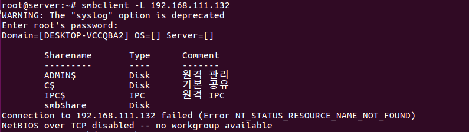

공유된 PC의 이름과 공유 폴더(smbShare) 등을 확인할 수 있다.

다음 명령을 입력해 Windows에서 공유한 폴더에 마운트할 디렉터리(이름은 아무 이름이나 상관 없다)를 만들고, 마운트시킨다.

```
mkdir 마운트할디렉터리이름
mount -t cifs //WinClientIP주소/공유폴더이름 마운트할디렉터리이름 -o vers=2.0
Password:		-> Windows에서 생성한 root의 암호
```

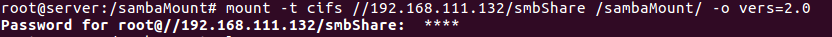

더 이상 마운트할 필요가 없다면 `umount /sambaMount` 명령을 입력해 마운트를 종료하면 된다.

<br>

<br>

### Windows에서 리눅스 폴더와 프린터 사용

Windows에서 리눅스의 자원을 사용하는 것은 다음 그림과 같이 구성할 수 있다.

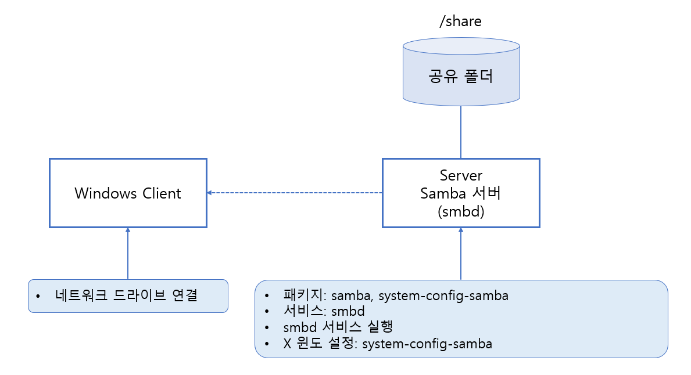

> Samba 서버를 설치하면 리눅스 컴퓨터가 Windows 컴퓨터처럼 사용된다는 의미다. 즉, 리눅스 컴퓨터가 Windows의 네트워크 환경에서 Windows 컴퓨터와 동등하게 나타난다는 의미이다.

<br>

보안은 따로 고려하지 않고 진행하도록 하겠다.

`apt-get -y install samba system-config-samba` 명령으로 삼바 서버와 관련된 패키지를 설치한다.

```
systemctl restart smbd
systemctl enable smbd
systemctl status smbd
```

명령으로 Samba 서버를 시작/상시 가동/상태를 확인하도록 한다.

공유할 디렉터리를 `/share` 로 생성하고, `chmod 707 /share` 명령을 입력해 디렉터리 속성을 707로 변경한다.

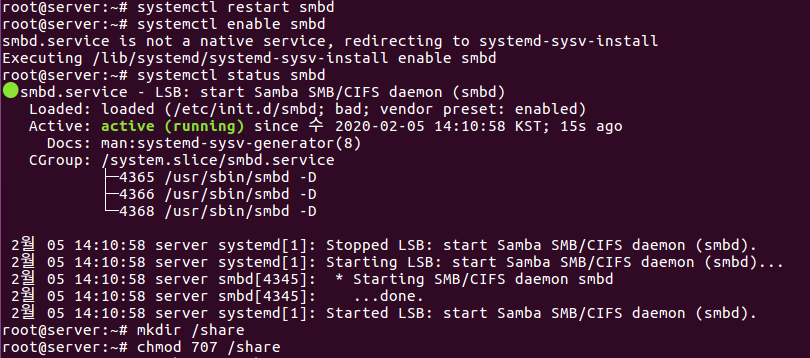

먼저 `touch /etc/libuser.conf` 명령으로 빈 파일을 만들어 둔다.

`system-config-samba` 명령을 입력하고, 설정창이 나타나면 [+] 아이콘을 클릭하고, [기본] 탭에서 [폴더] 에 '/share' 를 입력한다. [공유명]은 자동으로 입력될 것이며, 설명은 생략해도 된다. 또, [쓰기 기능]과 [보이기]의 체크를 켠다. 

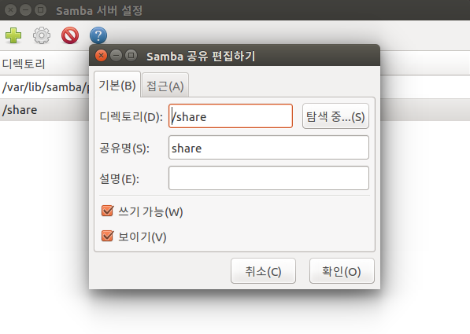

이어서 [접근] 탭을 클릭해서 [모든 사용자에게 접근 허가]를 선택한 후, [확인] 을 클리가면 공유 결과가 추가된다. 더 공유할 디렉터리가 있다면 [+] 버튼을 클릭해서 반복하면 된다. 다 마치면 설정 창을 닫는다.

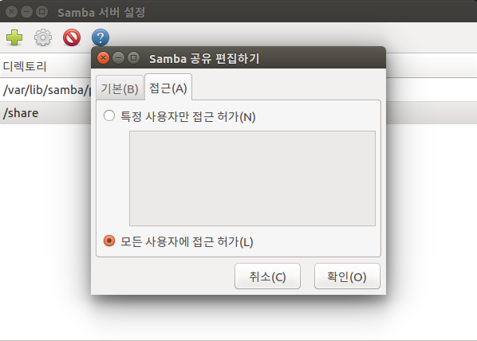

`ufw disable` 명령으로 방화벽을 끈다.

`systemctl restart smbd` 명령을 입력해 Samba 서버를 재시작한다. 이제는 WinClient에서 접속하면 된다.

Windows의 파일 탐색기를 실행하고, 왼쪽에서 [내 PC] 를 선택하고 메뉴의   [컴퓨터] -> [네트워크 드라이브 연결]을 선택한다. [네트워크 드라이브 연결]창이 나오면 드라이브는 적당한 드라이브를 선택하고,[폴더]에 `\\서버IP\share` 을 입력하고 [마침]을 클릭한다.

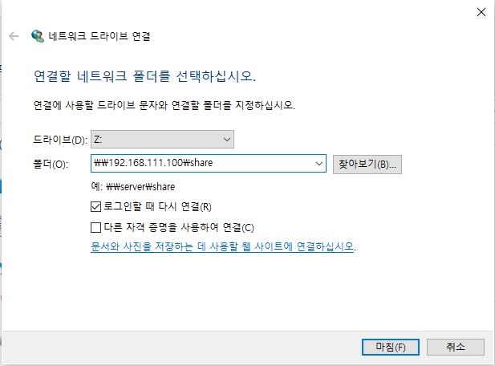

Windows 파일 탐색기에서 확인하면 Z:드라이브가 연결되어 있다. 파일을 생성하고 잘 생성되었는지 Server에서도 확인한다.

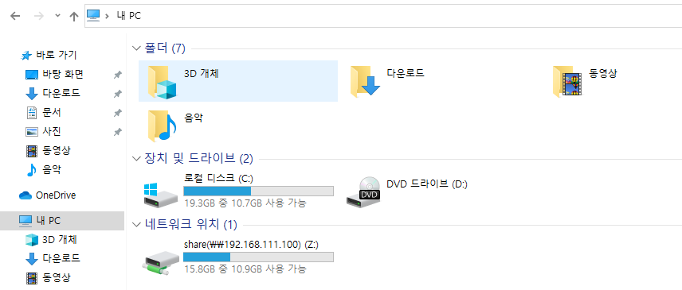

현재 Samba 서버에 접속한 Windows는 `smbstatus` 명령을 입력해 확인할 수 있다.

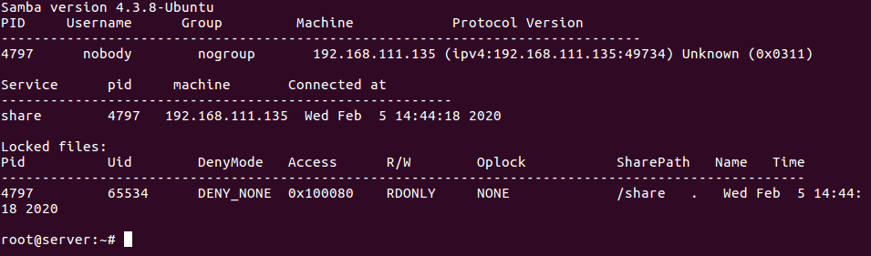

이제 Windows에서도 리눅스의 저장 공간을 자신의 것처럼 사용할 수 있다. NFS와의 차이점이라면 NFS는 리눅스(또는 유닉스) 사이에서 저장 공간을 공유하는 것이며, Samba는 리눅스(또는 유닉스) 와 Windows 사이에 저장 공간을 공유하는 것이다. 그러므로 리눅스/유닉스/Windows가 혼재한 시스템이라면 NFS와 Samba를 모두 구축하는 것이 바람직하다.

<br>

<br>

### Samba 서버 설정파일

Samba 서버의 설정파일은 `/etc/samba/smb.conf`다. `system-config-samba`를 이용해서 Samba 서버를 설정한다는 것은 결국은 `/etc/samba/smb.conf` 파일을 수정하기 위한 것이다. 그러므로 직접 `smb.conf` 파일을 편집하면 굳이 `system-config-samba` 를 이용하지 않아도 된다.

Samba 설정파일인 `/etc/samba/smb.conf` 파일의 문법 중 중요한 부분을 몇 가지 알아본다.

#### [global]: 모든 자원의 공유를 위한 설정

* workgroup = Windows의 작업 그룹 이름
* server string = Windows의 네트워크에 보이는 컴퓨터 설명 이름(생략 가능)
* log file = 삼바 서버에 접속하는 컴퓨터의 접속 기록 파일

#### [공유 이름]: 공유하는 디렉터리를 설정

* comment = 공유하는 디렉터리를 설명(생략 가능)
* path = 물리적인 디렉터리
* writeable = 디렉터리에 쓰기 권한이 있는지 여부. no는 읽기 전용.
* browseable = 공유 리스트를 보여줄지 여부
* guest ok = 다른 사용자도 사용하게 할지 여부('public'과 같음)

이 외에 더 상세한 옵션은 `man smb.conf` 명령을 실행해 확인해본다.

또, 에디터로 직접 `/etc/samba/smb.conf` 파일을 수정한 후에는 문법상 오류가 없는지 체크해주는 것이 좋다. `testparm` 명령을 실행하면 `smb.conf` 파일의 오류를 검사한다.

