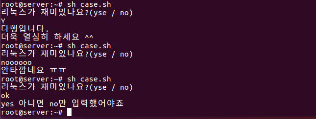
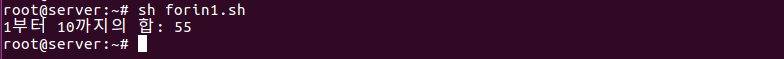
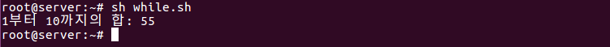
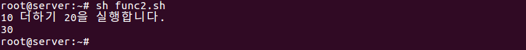
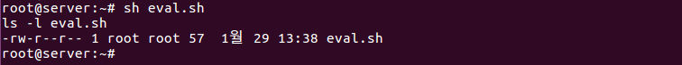
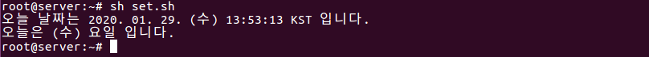
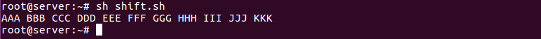

# Shell Script

> 우분투에서 사용하는 bash/shell 의 기초적인 내용을 알아본다.

<br>

셸은 사용자가 입력한 명령을 해석해 커널에게 전달하거나, 커널의 처리 결과를 사용자에게 전달하는 역할을 한다.

<br>

### 환경변수

셸에 설정된 환경 변수는 `echo $환경변수이름` 형식의 명령으로 확인할 수 있다. 환경 변수의 값을 변경하려면 `expert 환경변수=값` 형식을 실행한다. 그 이외의 환경 변수는 `printev` 명령을 실행하면 출력된다.

| 환경 변수 | 설명                      | 환경 변수    | 설명                           |
| --------- | ------------------------- | ------------ | ------------------------------ |
| HOME      | 현재 사용자의 홈 디렉터리 | PATH         | 실행 파일을 찾는 디렉터리 경로 |
| LANG      | 기본 지원되는 언어        | PWD          | 사용자의 현재 작업 디렉터리    |
| TERM      | 로그인 터미널 타입        | SHELL        | 로그인해서 사용하는 셸         |
| USER      | 현재 사용자의 이름        | DISPLAY      | X 디스플레이 이름              |
| COLUMNS   | 현재 터미널의 컬럼 수     | LINES        | 현재 터미널 라인 수            |
| PS1       | 1차 명령 프롬프트 변수    | PS2          | 2차 명령 프롬프트(대개는'>')   |
| BASH      | bash 셸의 경로            | BASH_VERSION | bash 버전                      |
| HISTFILE  | 히스토리 파일의 경로      | HISTSIZE     | 히스토리 파일에 저장되는 개수  |
| HOSTNAME  | 호스트이 이름             | USERNAME     | 현재 사용자 이름               |
| LOGNAME   | 로그인 이름               | LS_COLORS    | ls 명령의 확장사 색상 옵션     |
| MAIL      | 메일을 보관하는 경로      | OSTYPE       | 운영체제 타입                  |

<br>

<br>

## 셸 스크립트

셸 스크립트도 일반적인 프로그래밍 언어와 비슷하게 변수, 반복문, 제어문 등을 사용할 수 있다. 또한 별도로 컴파일하지 않고 텍스트 파일 형태로 셸에서 바로 실행할 수 있다. 

셸 스크립트의 첫 번째 행에는 `#!/bin/sh` 을 꼭 써줘야 한다.

<br>

### sh 명령으로 실행

`sh 스크립트파일` 명령으로 실행할 수 있따. 셸 스크립트 파일의 속성을 변경할 필요가 없다는 장점이 있다.

### '실행가능' 속성으로 변경한 후 실행

`chmod +x 파일명` 명령으로 파일에 '실행 가능' 속성을 추가하면 `./스크립트파일` 명령으로 실행할 수 있다.

<br>

<br>

 ### 변수

셸 스크립트의 구조는 변경할 필요가 없는데 설정해야 하는 값이 상황에 따라 다르다면 변수에 필요한 값을 계속 바꿔가는 방법으로 프로그래밍해 다양한 상황에 대처할 수 있다.

<br>

#### 변수의 기본

* 셸 스크립트에서는 변수를 사용하기 전에 미리 선언하지 않으며, 처음 변수에 값이 할당되면 자동으로 변수가 생성된다.
* 변수에 넣는 모든 값은 문자열로 취급된다. 즉, 숫자를 넣어도 문자로 취급한다.
* 변수 이름은 대소문자를 구분한다. 즉 $aa 라는 변수 이름과 $AA라는 변수 이름은 다르다.
* 변수를 대입할때 `=` 좌우에는 공백이 없어야 한다.

<br>

#### 변수의 입력과 출력

`read 변수명` 명령으로 사용자 키보드값을 입력받을수 있다. 변수의 출력은 `echo $변수명`  명령으로 가능하다.

<br>

#### 숫자 계산

변수에 들어 있는 값에 `+, -, *, /` 등의 연산을 하려면 `expr` 키워드를 사용하면 된다. 단, 수식과 함께 꼭 키보드 숫자 1 왼쪽에 있는 역따옴표(`) 로 묶어줘야 한다. 수식에 괄호를 사용하려면 그 앞에 꼭 역슬래시를 붙여줘야한다. 또 곱하기(*)기호도 예외적으로 앞에 역슬래시 기호를 붙여줘야 한다.

```sh
num1=`expr 100 + 200`
num2=`expr \( 100 + 200 \) /10 /* 2`
echo num1		-> 300
echo num2		-> 60
```

<br>

#### 파라미터 변수

파라미터 변수는 **$0, $1, $2** 등의 형태를 갖는다. 이는 실행하는 명령의 부분 하나하나를 변수로 지정한다는 의미다.

예를 들어 `apt-get -y install gftp` 명령을 실행한다고 가정하면, 파라미터 변수는 다음과 같이 지정할 수 있다.

| 명령          | apt-get | -y   | install | gftp |
| ------------- | ------- | ---- | ------- | ---- |
| 파라미터 변수 | $0      | $1   | $2      | $3   |

 명령 전체의 파라미터 변수는 $* 로 표현한다.

```sh 
#!/bin/sh
echo "실행파일 이름은 <$0> 이다"
echo "첫번째 파라미터는 <$1>이고, 두번째 파라미터는 <$2>다"
echo "전체 파라미터는 <$*>다"
exit 0
```


<br>

<br>

### if 문과 case 문

<br>

#### if~else 문

if~else 문의 형식은 다음과 같다.

```sh
if [ 조건 ]
then
	참일 경우 실행
else
	거짓일 경우 실행
fi
```

주의할 점은 '[ 조건 ]' 사이의 각 단어에는 모두 공백이 있어야 한다는 것이다. 위 형식에서 else는 생략 가능하다.

<br>

#### 조건문에 들어가는 비교 연산자

조건문에 들어가는 비교 연산자에는 문자열 비교 연산자와 산술 연산자가 있다. 

**문자열 비교 연산자**

| 문자열 비교            | 결과                                 |
| ---------------------- | ------------------------------------ |
| "문자열1" = "문자열2"  | 두 문자열이 같으면 참                |
| "문자열1" != "문자열2" | 두 문자열이 같지 않으면 참           |
| -n "문자열"            | 문자열이 NULL(빈 문자열)이 아니면 참 |
| -z "문자열"            | 문자열이 NULL(빈 문자열)이면 참      |

**산술 비교 연산자**

| 산술 비교       | 결과                                |
| --------------- | ----------------------------------- |
| 수식1 -eq 수식2 | 두 수식(또는 변수)이 같으면 참      |
| 수식1 -ne 수식2 | 두 수식(또는 변수)이 같지 않으면 참 |
| 수식1 -gt 수식2 | 수식1이 크다면 참                   |
| 수식1 -ge 수식2 | 수식1이 크거나 같으면 참            |
| 수식1 -lt 수식2 | 수식1이 작으면 참                   |
| 수식1 -le 수식2 | 수식1이 작거나 같으면 참            |
| !수식           | 수식이 거짓이라면 참                |

<br>

#### 파일과 관련된 조건

| 파일 조건   | 결과                              |
| ----------- | --------------------------------- |
| -d 파일이름 | 파일이 디렉터리면 참              |
| -e 파일이름 | 파일이 존재하면 참                |
| -f 파일이름 | 파일이 일반 파일이면 참           |
| -g 파일이름 | 파일에 set-group-id가 설정되면 참 |
| -r 파일이름 | 파일이 읽기 가능이면 참           |
| -s 파일이름 | 파일 크기가 0이 아니면 참         |
| -u 파일이름 | 파일에 set-user-id가 설정되면 참  |
| -w 파일이름 | 파일이 쓰기 가능 상태이면 참      |
| -x 파일이름 | 파일이 실행 가능 상태이면 참      |

<br>

#### case~esac 문

if문은 참과 거짓이라는 두 가지 경우면 사용할 수 있다. 그런데 여러 가지 경우의 수가 있다면  if문을 중복해서 사용해야 하므로 구문이 복잡해진다. 이때 사용하는 것이 case문이다. 이를 `다중 분기` 라 한다.

```sh
#!/bin/sh
echo "리눅스가 재미있나요?(yes / no)"
read answer			-> answer 변수에 입력한 값을 받는다.
case $answer in
	yes | y | Y | Yes | YES)	-> 입력된 값이 yes,y,Y,Yes,YES 중 하나면 6~7행을 실행한다.
		echo "다행입니다."		-> 실행할 구문이 더 있으므로 끝에 ;;를 붙이지 않는다.
		echo "더욱 열심히 하세요 ^^";;	-> 실행할 구문이 더 없으면 끝에 ;;를 붙인다.
	[nN]*)		-> 앞에 n 또는 N 이 들어가는 모든 단어를 다 인정해준다는 의미다.
		echo "안타깝네요 ㅠㅠ";;
	*)		-> 그 외에 것들이 모두 해당한다.
		echo "yes 아니면 no만 입력했어야죠"
		exit 1;;	-> 정상적인 종료가 아니므로 exit 1로 종료한다.
esac
exit 0
```



<br>

#### AND, OR 관계 연산자

조건문에서는 and 와 or 의 의미를 갖는 관계 연산자를 사용할 수 있다. and 는 `-a 또는 &&`를 사용하며, or은 `-o 또는 ||` 를 사용한다. -a 나 -o는 테스트문([ ])안에서 사용할 수 있는데, 이때 괄호등의 특수 문자 앞에는 역슬래시를 붙여줘야 한다.

```sh
#!/bin/sh
echo "보고 싶은 파일명을 입력하세요."
read fname
if [ -f $fname ] && [ -s $fname ] ; then
	head -5 $fname
else
	echo "파일이 없거나, 크기가 0입니다."
if
exit 0
```

입력한 파일 이름이 일반 파일(-f)이고, 크기가 0이 아니라면(-s) `head -5 $fname` 명령을 실행한다. 또, 이 구문은 `if [\(-f $fname\) -a \(-s $fname\)] ; then` 과 동일하다.

<br>

<br>

### 반복문

<br>

#### for~in 문

for~in 문은 다음 형식을 보면 변수에 각각의 값을 넣은 후 do 안에 있는 '반복할 문장' 을 실행한다. 그러므로 값의 개수만큼 반복 실행하게 된다.

```sh
for 변수 in 값1 값2 값3
do
	반복할 문장
done
```

```sh
1 #!/bin/sh
2 hap=0
3 for i in 1 2 3 4 5 6 7 8 9 10
4 do
5 	hap=`expr $hap + $i`
6 done
7 echo "1부터 10까지의 합: "$hap
8 exit 0
```



* 3행: i변수에 1~10까지 반복해 넣으면서 5행을 10회 실행한다.
  		기존의 for 문과 비슷하게 `for((i=1; i<=10; i++))` 로 변경해서 사용할 수 있다. (변경할 때 괄호가 2		개인 것에 주의한다.) 또 `sep` 명령을 사용할 수도 있다. 예를 들어 `seq 1 10` 은 1에서 10까지 숫자를 돌		려준다.

<br>

#### while 문

while 문은 조건식이 참인 동안에 계속 반복하는 특성을 갖는다.

```sh
1 #!/bin/sh
2 hap=0
3 i=1
4 while [ $i -le 10 ]
5 do
6 	hap=`expr $hap + $i`
7 	i=`expr $i + 1`
8 done
9 echo "1부터 10까지의 합: "$hap
10 exit0
```



<br>

#### until 문

while 문과 용도가 거의 같지만, until 문은 조건식이 참일 때까지( = 거짓인 동안) 계속 반복한다.

<br>

#### break, continue, exit, return

break는 주로 반복문을 종료할 때 사용되며, continue 는 반복문의 조건식으로 돌아가게 한다. 또, exit는 해당 프로그램을 완전히 종료한다. return 은 함수 안에서 사용될 수 있으며 함수를 호출한 곳으로 돌아가게 한다.

<br>

<br>

### 기타 내용

<br>

#### 사용자 정의 함수

사용자가 직접 함수를 작성하고 호출할 수 있다. 형식은 다음과 같다.

```sh
함수이름 ( ) {		-> 함수를 정의
	내용들...
}
함수이름	-> 함수를 호출
```

```sh
1 #!/bin/sh
2 myFuntion(){
3	echo "함수 안으로 들어왔음"
4	return
5 }
6 echo "프로그램을 시작합니다."
7 myFuntion
8 echo "프로그램을 종료합니다."
9 exit 0
```


<br>

#### 함수의 파라미터 사용

함수의 파라미터, 즉 인자를 사용하려면 함수를 호출할 때 뒤에 파라미터를 붙여서 호출하며, 함수 안에는 $1, $2, ... 로 사용된다. 형식은 다음과 같다.

```
함수이름 ( ){		-> 함수를 정의
	$1, $2 ... 등을 사용
}
함수이름 파라미터1 파라미터2 ...	-> 함수를 호출
```

```sh
1 #!/bin/sh
2 hap(){
3 	echo `expr $1 + $2`
4 }
5 echo "10더하기 20을 실행합니다."
6 hap 10 20
7 exit 0
```



<br>

#### eval

문자열을 명령문으로 인식하고 실행한다.

```sh
1 #!/bin/sh
2 str="ls -l eval.sh"
3 echo $str
4 eval $str
5 exit 0
```



<br>

#### export

외부 변수로 선언한다. 즉, 선언한 변수를 다른 프로그램에서도 사용할 수 있게 한다. 형식은 `export 변수생성` 과 같다.

<br>

#### printf

C 언어의 printf() 함수와 비슷하게 형식을 지정해서 출력할 수 있다.

```sh
1 #!/bin/sh
2 val1=100.5
3 val2="재미있는 리눅스~"	-> 공백이 있으므로 "" 로 묶어줘야 한다.
4 printf "%5.2f \n\n \t %s \n" $val1 "$val2"	-> $val2 의 경우, 값 중간에 공백이 있으므로, 변수 이름을 "" 로 묶어줘야 오류가 없다.
```


<br>

#### set과 $(명령)

리눅스 명령을 결과로 사용하려면`$(명령)` 형식을 사용해야 한다. 또, 결과를 미리 파라미터로 사용하고자 할 떄는 set 명령과 함께 사용한다.

```sh
1 #!/bin/sh
2 echo "오늘 날짜는 $(date) 입니다."
3 set $(date)
4 echo "오늘은  $4 요일입니다."
5 exit 0
```



<br>

#### shift

파러미터 변수를 왼쪽으로 한 단계씩 아래로 쉬프트(이동) 시킨다.

 ```sh
1 #!/bin/sh
2 myfunc(){
3 	str=""
4 	while [ "$1" != "" ] ; do
5 		str="$str $1"
6 		shift
7 	done
8 	echo $str
9 }
10 myfunc AAA BBB CCC DDD EEE FFF GGG HHH III JJJ KKK
11 exit 0
 ```



**소스 설명**

* 3행: 결과를 누적할 str변수를 초기화한다.
* 4행: $1 파라미터가 비어 있지 않은 동안에 반복 실행한다.(처음 $1은 AAA고, 한 번 반복 실행하면 5,6행에 의해 $1이 BBB가 됨).
* 5행: str변수에 $1을 추가한다.
* 6행: 전체 파라미터를 왼쪽으로 쉬프트시킨다. 즉, $2 -> $1, $3 -> $2, $4 -> $3, ... 의 형태로 작업이 일어난다.
* 8행: while문이 끝나면 누적한 str변수를 출력한다.