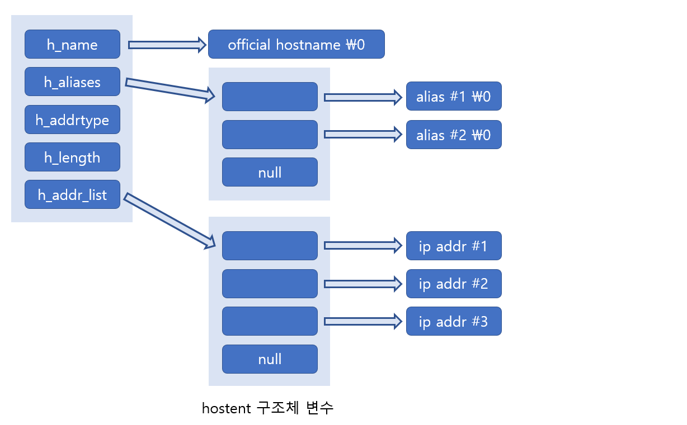

# Domain Name to IP

> IP 주소와 도메인 이름 사이의 변환방법을 소개한다.

<br>

### 도메인 이름을 이용해서 IP주소 얻기

다음 함수를 이용하면 문자열 형태의 도메인 이름으로부터 IP의 주소정보를 얻을 수 있다.

```c
#include <netdb.h>

struct hostent * gethostbyname(const char *hostname);
> 성공 시 hostent 구조체 변수의 주소 값, 실패 시 NULL 포인터 반환
```

변환하고자 하는 도메인의 이름을 문자열 형태로 전달하면 해당 도메인의 IP 주소정보가 반환된다. 단, hostent라는 구조체의 변수에 담겨서 변환이 되는데, 이 구조체는 다음과 같이 정의되어 있다.

```c
struct hostent{
	char *h_name;	//official name
	char **h_aliases;	//alias list
	int h_addrtype;	//host address type
	int h_length;	//address length
	char **h_addr_list;	//address list
}
```

위의 구조체 정의를 보면 IP 정보만 반환되는 것이 아니라, 여러 가지 다른 정보들도 덤으로 반환되는 것을 알 수 있다. 간단하게 멤버 각각에 대해 설명하겠다.

##### h_name

이 멤버에는 `공식 도메인 이름(Official domain name)`이라는 것이 저장된다. 공식 도메인 이름은 해당 홈페이지를 대표하는 도메인 이름이라는 의미를 담고 있다.

##### h_aliases

하나의 IP에 둘 이상의 도메인 이름을 지정하는 것이 가능하기 때문에, 공식 도메인 이름 이외에 해당 메인 페이지에 접속할 수 있는 다른 도메인 이름의 지정이 가능하다. 그리고 이들 정보는 h_aliases를 통해서 얻을 수 있다.

##### h_addrtype

gethostbyname 함수는 IPv4뿐만 아니라 IPv6까지 지원한다. 때문에 h_addr_list로 반환된 IP주소의 주소체계에 대한 정보를 이 멤버를 통해 반환한다. IPv4의 경우 이 멤버에는 AF_INET이 저장된다.

##### h_length

함수호출의 결과로 반환된 IP주소의 크기정보가 담긴다. IPv4의 경우에는 4바이트이므로 4가 저장되고, IPv6의 경우에는 16바이트이므로 16이 저장된다.

##### h_addr_list

이 멤버를 통해서 도메인 이름에 대한 IP주소가 정수의 형태로 반환된다. 참고로 접속자수가 많은 서버는 하나의 도메인 이름에 대응하는 IP를 여러 개 둬서, 둘 이상의 서버로 부하를 분산시킬 수 있는데, 이러한 경우에도 이 멤버를 통해서 모든 IP의 주소정보를 얻을 수 있다.

이번에는 gethostbyname 함수호출 후에 반환되는 hostent 구조체 변수의 구성을 그림을 통해서 정리해 보았다.



<br>

<br>

### IP주소를 이용해서 도메인 정보 얻어오기

지금 소개하는 gethostbyaddr 함수는 IP 주소를 이용해서 도메인 정보를 얻을 때 호출하는 함수이다.

```c
#include <netdb.h>

struct hostent * gethostbyaddr(const char *addr, socklen_t len, int family);
> 성공 시 hostent 구조체 변수의 주소 값, 실패 시 NULL 포인터 반환
```

* **addr -** IP주소를 지니는 in_addr 구조체 변수의 포인터 전달, IPv4 이외의 다양한 정보를 전달받을 수 있도록 일반화하기 위해서 매개변수를 char형 포인터로 선언.
* **len -** 첫 번째 인자로 전달된 주소정보의 길이, IPv4의 경우 4, IPv6의 경우 16 전달.
* **family -** 주소체계 정보 전달. IPv4의 경우 AF_INET, IPv6의 경우 AF_INET6 전달.

<br>

<br>

#### 윈도우 기반 함수

```c
#include <winsock2.h>

struct hostent * gethostbyname(const char *name)
```

```c
#include <winsock2.h>

struct hostent * gethostbyaddr(const char *addr, int len, int type)
```

