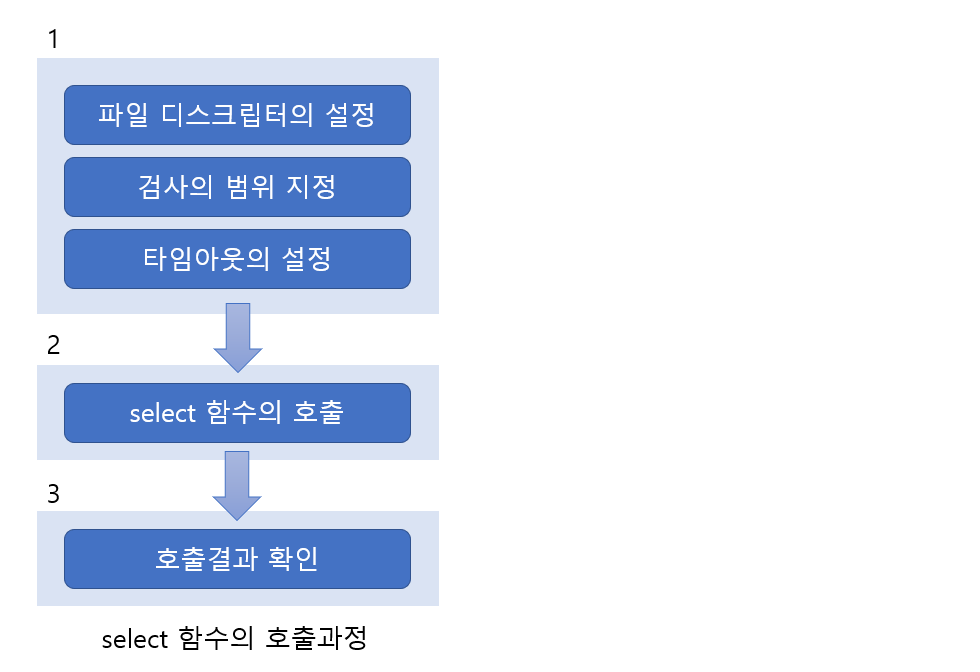

# IO Multiplexing

> 다중접속 서버의 구현방법중 하나인 멀티플렉싱 기법에 대해 알아본다.

<br>

### 멀티프로세스 서버의 단점과 대안

기존의 멀티 프로세스 서버에선 클라이언트의 연결요청이 있을 때마다 새로운 프로세스를 생성하였다. 이는 실제 사용되는 방법이지만 문제가 전혀 없는 방법은 아니다. 프로세스의 생성에는 상당히 많은 자원이 들어가기 때문이다. 많은 양의 연산이 요구되며, 필요한 메모리 공간도 비교적 큰 편이다. 또한 프로세스마다 별도의 메모리 공간을 유지하기 때문에 상호간의 데이터를 주고받으려면 다소 복잡한 방법을 택할 수밖에 없다.

이런 단점을 보완한 방법이 멀티플렉싱 기반의 서버이다. 그러나 이 방법도 만능은 아니니 구현하려는 서버의 특성에 따라서 구현방법을 결정하도록 하자.

<br>

<br>

### 멀티플렉싱이라는 단어의 이해

멀티플렉싱이라는 단어를 간단하게 요약하면 다음과 같다.

**"하나의 통신채널을 통해서 둘 이상의 데이터(시그널)를 전송하는데 사용되는 기술"**

위 개념을 서버에 적용하면 얻게되는 장점은 프로세스의 수를 줄일 수 있다. 그럼 비교를 위해서 멀티프로세서 기반의 서버모델을 그림으로 나타내었다.


위 모델에 멀티플렉싱 기술을 적용하면 다음과 같이 프로세스의 수가 줄어든다. 여기서 중요한 것은 접속해 있는 클라이언트의 수에 상관없이, 서비스를 제공하는 프로세스의 수는 딱 하나라는 사실이다.


이제 멀티플렉싱 서버 모델에 대해서도 이해했으니, 하나의 프로세스를 이용해서 둘 이상의 클라이언트에게 서비스를 제공하는 방법에 대해 고민할 차례이다.

<br>

<br>

### select 함수의 이해와 서버의 구현

select 함수를 이용하는 것이 멀티플렉싱 서버의 구현에 있어서 가장 대표적인 방법이다. 그리고 윈도우에도 이와 동일한 이름으로 동일한 기능을 제공하는 함수가 있기 때문에 이식성에 있어서도 좋다.

<br>

#### select 함수의 기능과 호출순서

select 함수를 사용하면 한곳에 여러 개의 파일 디스크립터를 모아놓고 동시에 이들을 관찰할 수 있다. 이때 관찰할 수 있는 항목은 다음과 같다.

* 수신한 데이터를 지니고 있는 소켓이 존재하는가?
* 블로킹되지 않고 데이터의 전송이 가능한 소켓은 무엇인가?
* 예외사항이 발생한 소켓은 무엇인가?

이제 select 함수의 호출방법과 순서를 알아볼 텐데, 먼저 이를 전체적으로 정리해 보겠다.



위 그림은 select 함수를 호출해서 결과를 얻기까지의 과정을 간략히 정리한 것이다. 그림에서는 select 함수의 호출에 앞서 뭔가 준비가 필요하고, 또 호출 이후에도 결과의 확인을 위한 별도의 과정이 존재함을 보이고 있다. 그럼 이제 하나씩 그림에서 보이는 순서대로 살펴보자.

<br>

#### 파일 디스크립터의 설정

select 함수를 사용하면 여러 개의 파일 디스크립터를 동시에 관찰할 수 있다고 하였다. 물론 파일 디스크립터의 관찰은 소켓의 관찰로 해석할 수 있다. 그렇다면 먼저 관찰하고자 하는 파일 디스크립터를 모아야 한다. 모을 때도 (수신, 전송, 예외)에 따라서 구분해 모아야 한다.

파일 디스크립터를 세 묶음으로 모을 때 사용되는 것이 fd_set 형 변수이다. 이는 다음 그림에서 보이듯이 0과 1로 표현되는, 비트단위로 이뤄진 배열이라고 생각하면 된다.


위 그림의 배열에서 가장 왼쪽 비트는 파일 디스크립터 0을 나타낸다(나타내는 위치이다). 이 비트가 1로 설정되면 해당 파일 디스크립터가 관찰의 대상임을 의미한다. 위 그림에서는 파일 디스크립터 1과 3이 관찰대상으로 지정되어 있는 것이다.

이 fd_set형 변수의 조작은 비트단위로 이뤄지기 때문에 다음 메크로 함수를 통해서 값을 변경할수 있다. 

---

* **FD_ZERO(fd_set *fdset) -** 인자로 전달된 주소의 fd_set형 변수의 모든 비트를 0으로 초기화한다.
* **FD_SET(int fd, fd_set *fdset) -** 매개변수 fdset으로 전달된 주소의 변수에 매개변수 fd로 전달된 파일 디스크립터 정보를 등록한다.
* **FD_CRL(int fd, fd_set *fdset) -** 매개변수 fdset으로 전달된 주소의 변수에서 매개변수 fd로 전달된 파일 디스크립터 정보를 삭제한다.
* **FD_ISSET(int fd, fd_set *fdset) -** 매개변수 fdset으로 전달된 주소의 변수에 매개변수 fd로 전달된 파일 디스크립터 정보가 있으면 양수를 반환한다.

---

위의 함수들 중에서 FD_ISSET은 select 함수의 호출결과를 확인하는 용도로 사용된다. 그럼 간단히 위 함수들의 기능을 다음 그림을 통해서 정리하겠다.


<br>

#### 검사(관찰)의 범위지정과 타임아웃의 설정

먼저 select 함수를 보고 앞서 소개한 '파일 디스크립터 설정' 이외의 나머지 두 개를 설명하겠다.

```c
#include <sys/select.h>
#include <sys/time.h>

int select(int maxfd, fd_set *readset, fd_set *writeset, fd_set *exceptset,
const struct timeval *timeout);
> 성공 시 0 이상, 실패 시 -1 반환
```

* **maxfd -** 검사 대상이 되는 파일 디스크립터의 수.
* **readset -** fd_set형 변수에 '수신된 데이터의 존재여부'에 관심 있는 파일 디스크립터 정보를 모드 등록해서 그 변수의 주소 값을 전달한다.
* **writeset -** fd_set형 변수에 '블로킹 없는 데이터 전송의 가능여부'에 관심 있는 파일 디스크립터 정보를 모두 등록해서 그 변수의 주소 값을 전달한다.
* **exceptset -** fd_set형 변수에 '예외사항의 발생여부'에 관심이 있는 파일 디스크립터 정보를 모두 등록해서 그 변수의 주소 값을 전달한다.
* **timeout -** select 함수호출 이후에 무한정 블로킹 상태에 빠지지 않도록 타임아웃(time-out)을 설정하기 위한 인자를 전달한다.
* **반환 값 -** 오류발생시에는 -1이 반환되고, 타임 아웃에 의한 반환 시에는 0이 반환된다. 그리고 관심대상으로 등록된 파일 디스크립터에 해당 관심에 관련한 변화가 발생하면 0보다 큰 값이 반환되는데, 이 값은 변화가 발생한 파일 디스크립터의 수를 의미한다.

select 함수의 첫 번째 매개변수는 `파일 디스크립터의 관찰(검사) 범위`와 관련이 있다. 사실 select 함수는 관찰의 대상이 되는 파일 디스크립터의 수를 첫 번째 인자로 요구하고 있다. 따라서 fd_set형 변수에 등록된 파일 디스크립터의 수를 확인할 필요가 있는데, 파일 디스크립터의 값은 생성될때마다 1씩 증가하기 때문에 가장 큰 파일 디스크립터의 값에 1을 더해서 인자로 전달하면 된다.(1을 더하는 이유는 파일 디스크립터가 0부터 시작되기 때문)

그리고 select 함수의 두 번째 매개변수는 `타임아웃 시간`과 관련이 있는데, 매개변수 선언에서 보이는 자료형 timeval 은 구조체 기반의 자료형으로, 다음과 같이 정의되어 있다.

```c
struct timeval{
	long tv_sec;		// seconds
	long tv_usec;		// microseconds
}
```

원래 select 함수는 관찰중인 파일 디스크립터에 변화가 생겨야 반환을 한다. 때문에 변화가 생기지 않으면 무한정 블로킹 상태에 머물게 된다. 바로 이러한 상황을 막기 위해 타임아웃을 지정하는 것이다. 만약 타임아웃을 설정하고 싶지 않을 경우에는 NULL을 인자로 전달하면 된다.

<br>

#### select 함수호출 이후의 결과확인

select 함수의 반환값은 위에서 한번 정리하였다. 0이 아닌 양수가 반환되면, 그 수만큼 파일 디스크립터에 변화가 발생했음을 의미한다.

그렇다면 select 함수가 양의 정수를 반환한 경우, 변화가 발생한 파일 디스크립터는 어떻게 알아낼 수 있을까? select 함수의 두 번째, 세 번째 그리고 네 번째 인자로 전달된 fd_set형 변수에 다음 그림에서 보이는 변화가 발생하기 때문에 어렵지 않게 알아낼 수 있다.


위 그림에서 보이듯이 select 함수호출이 완료되고 나면, select 함수의 인자로 전달된 fd_set 형 변수에 변화가 생긴다. 1로 설정된 모든 비트가 다 0으로 변경되지만, 변화가 발생한 파일 디스크립터 해당하는 비트만 그대로 1로 남아있게 된다. 때문에 여전히 1로 남아있는 위치의 파일 디스크립터에서 변화가 발생했다고 판단할 수 있다.

<br>

<br>

---

#### 윈도우 기반의 select

윈도우에서 제공하는 select 함수의 모든 인자는 리눅스 기반의 select 함수와 동일하다. 단, 윈도우가 제공하는 select 함수의 첫 번째 인자는 리눅스를 포함하는 유닉스 계열의 운영체제와의 상호 호환성을 위해 존재하는 것 일뿐, 별다른 의미가 없다.

```c
#include <winsock2.h>

int select(int nfds, fd_set *readfds, fd_set *writefds, fd_set *excepfds,
const struct timeval *timeout);
> 성공 시 0 이상, 실패 시 -1 반환
```

timeval 구조체의 정의형태를 확인하자.

```c
typedef struct timeval{
	long tv_sec;
	long tv_usec;
} TIMEVAL;
```

기본적인 정의 형태는 앞서 보인 리눅스와 동일하나 윈도우에서는 typedef 선언을 포함한 형태로 정의되어 있다. 그럼 이번에는 fd_set을 살펴보자.

```c
typedef struct fd_set{
	u_int fd_count;
	SOCKET fd_array[FD_SETSIZE];
} fd_set;
```

윈도우의 fd_set은 저장된 소켓의 해들 수를 기록하기 위한 멤버 fd_count와 소켓의 핸들 저장을 위한 멤버 fd_array로 이뤄져 있다. 윈도우 기반의 소켓 핸들은 리눅스와 달리 0부터 시작하지 않을 뿐 아니라 생성되는 핸들의 정수 값 사이에서도 규칙을 찾아낼 수 없다. 때문에 소켓의 핸들을 그대로 저장할 수 있는 배열과 저장된 배열의 수를 기록하기 위한 변수 하나가 필요한 것이다. 다행히도 리눅스에서 사용하던 매크로 함수는 이름과 사용법이 동일하다. 