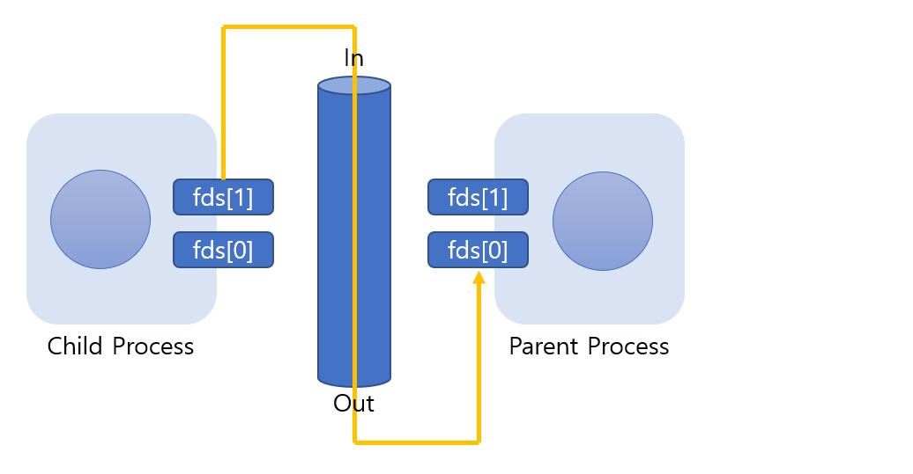
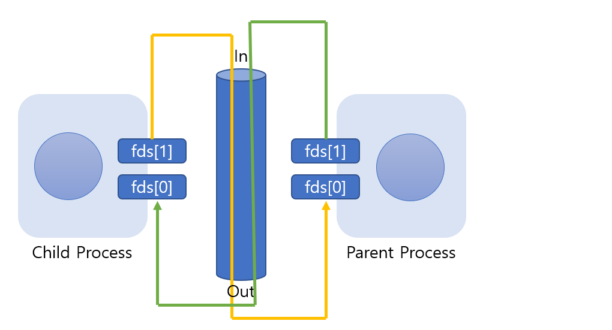
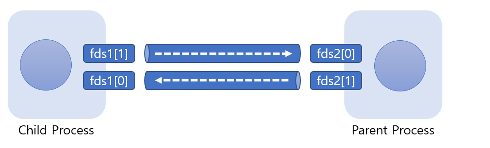

# Inter Process Communication

> pipe를 이용한 프로세스간 통신 방법에 대해 알아본다. 

<br>

프로세스간 통신이 가능하다는 것은 서로 다른 두 프로세스가 데이터를 주고 받을 수 있다는 의미가 되며, 이렇게 되기 위해서는 두 프로세스가 동시에 접근 가능한 메모리 공간이 있어야 한다.

<br>

### 프로세스간 통신의 기본 이해

프로세스간 통신은 두 프로세스가 동시에 접근 가능한 메모리 공간만 있다면, 이 공간을 통해서 얼마든지 데이터를 주고 받을 수 있다. 하지만 fork 로 생성한 자식 프로세스는 부모 프로세스와 메모리 공간을 조금도 공유하지 않는다. 따라서 프로세스간 통신은 별도로 마련된 방법을 통해서만 이뤄질 수 있다.

<br>

<br>

### 파이프(PIPE) 기반의 프로세스간 통신

다음 그림은 프로세스간 통신의 방법으로 사용되는 파이프 기법의 구조적 모델을 보이고 있다.


위 그림에서 보이듯이 두 프로세스간 통신을 위해서는 파이프라는 것을 생성해야 한다. 이 파이프는 프로세스에 속하는 자원이 아니다. 이는 소켓과 마찬가지로 운영체제에 속하는 자원이다. (때문에 fork 함수의 호출에 의한 복사 대상이 아니다). 즉, 운영체제가 마련해 주는 메모리 공간을 통해서 두 프로세스는 통신을 하게 된다. 그럼 파이프의 생성에 사용되는 함수를 소개하겠다.

```c
#include <unistd.h>

int pipe(int filedes[2]);
> 성공 시 0, 실패 시 -1 반환
```

* **filedes[0] -** 파이프로부터 데이터를 수신하는데 사용되는 파일 디스크립터가 저장된다. 즉, filedes[0]는 파이프의 출구가 된다.
* **filedes[1] -** 파이프로 데이터를 전송하는데 사용되는 파일 디스크립터가 저장된다. 즉, filedes[1]은 파이프의 입구가 된다.

길이가 2인 int형 배열의 주소 값을 인자로 전달하면서 위의 함수를 호출하면 배열에는 두 개의 파일 디스크립터가 담긴다. 그리고 이들 각각은 파이프의 출구와 입구로 사용이 된다. 결국 부모 프로세스가 위의 함수를 호출하면 파이프가 생성되고, 파이프의 입구 및 출구에 해당 하는 파일 디스크립터를 동시에 얻게 되는 것이다.

파이프를 이용한 프로세스간 단방향 통신은 매우 쉽다. 다음과 같이 구성하면 끝이다.



<br>

<br>

### 파이프(PIPE) 기반의 프로세스간 양방향 통신

바로 위에서 단방향 통신의 구조를 보았는데 그걸 보고 양방향 통신은 어떻게 구성할지 생각해보자.



만약 이런 방식을 생각했다면 일단 구현은 가능하다. 그러나 이러한 모델로 구현하려면 매우 주의하면서 구현을 해야한다. 파이프에 데이터가 들어가면, 이는 임자가 없는 데이터가 된다. 즉, read 함수호출을 통해서 먼저 데이터를 읽어 들이는 프로세스에게 데이터가 전달된다. 따라서 위 모델로 구현한다면 프로그램의 실행흐름을 예측하고 컨트롤해야 하는데, 이는 시스템에 따라서 달라져야 하는 부분이기 때문에 사실상 불가능하다. 그렇다면 어떻게 해야 양방향 통신이 가능할까?

**"파이프를 두 개 생성하면 된다."**

어렵게 생각할것 없다. 파이프를 반드시 하나만 생성해야 하는 것은 아니기 때문에, 다음 그림과 같이 두 개의 파이프를 생성해서 각각이 서로 다른 데이터의 흐름을 담당하게 하면 된다.



위 그림에서 보이듯이 두 개의 파이프를 이용하면 프로그램의 흐름을 예측하거나 컨트롤할 필요가 없다. 