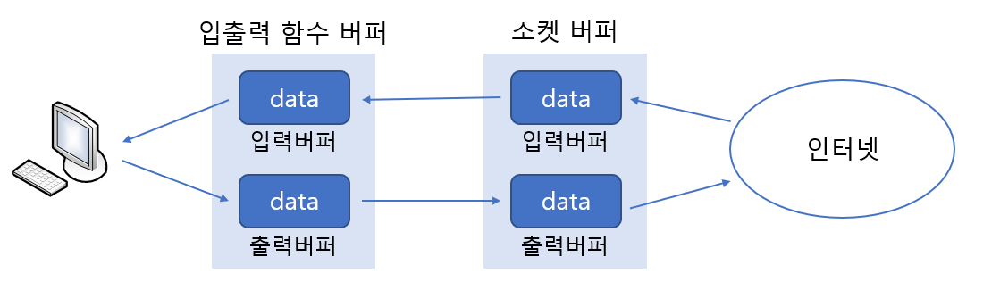

# Linux Standard IO

> 표준 입출력 함수를 이용한 데이터 송수신 방법에 대해 알아본다. 

<br>

### 표준 입출력 함수의 장점

다음은 표준 입출력 함수가 지니는 장점 두 가지이다.

1. 표준 입출력 함수는 이식성(Portability)이 좋다.
2. 표준 입출력 함수는 버퍼링을 통한 성능의 향상에 도움이 된다.

이식성에 대해선 많은 이야기가 필요 없을 것이다. 입출력 뿐만 아니라 모든 표준 함수들은 이식성이 좋다. 모든 운영체제(컴파일러)가 지원하도록 ANSI C에서 표준으로 정의했기 때문이다.

그럼 이어서 두 번째 장점에 대해 이야기하겠다. 표준 입출력 함수를 사용할 경우 추가적으로 입출력 버퍼를 제공받게 된다. 그럼 소켓을 생성하면 기본적으로 운영체제에 의해서 만들어지는 입출력 버퍼와의 관계는 어떻게 될까? 소켓의 버퍼와 별도로 표준 입출력 함수를 사용하게 되면, 이에 더불어 추가로 또 하나의 버퍼를 제공받는다.



위 그림에서 보이듯이 표준 입출력 함수를 사용해서 데이터를 전송할 경우, 거쳐야 하는 버퍼의 수는 두 개가 된다. 버퍼는 기본적으로 성능의 향상을 목적으로 한다. 하지만 소켓과 관련해서 제공되는 버퍼는 TCP의 구현을 위한 목적이 더 강하다. 반면 표준 입출력 함수 사용시 제공되는 버퍼는 오로지 성능 향상만을 목적으로 제공이 된다.

특히 전송해야 할 데이터의 양이 많아질 수록 버퍼링 유무에 따른 성능의 차이는 매우 크다. 일단 다음 두 가지 관점에서 성능의 우월함을 말할 수 있다.

* 전송하는 데이터의 양
* 출력버퍼로의 데이터 이동 횟수

1바이트짜리 데이터를 총 열 번에 걸쳐서 (열 개의 패킷에) 보내는 경우와 이를 버퍼링해서 10바이트로 묶어서 한번에 전송하는 상황을 예로 비교해보자. 데이터의 전송을 위해서 구성된 패킷에는 헤더정보가 추가되는데 이를 패킷당 40바이트로만 잡아도 다음과 같이 전송해야 할 데이터의 양에 큰 차이가 난다.

* 1바이트 10회 - 40 X 10 = 400바이트
* 10바이트 1회 - 40 X 1 = 40바이트

그리고 데이터의 전송을 위해, 소켓의 출력버퍼로 데이터를 이동시키는 데도 시간이 많이 소모된다. 그런데 이 역시 이동 횟수와 관련이 있다. 1바이트를 10회 이동하는데 걸리는 시간이, 10바이트를 한 번에 이동하는 것보다 열 배 가까운 시간이 더 소모된다.

<br>

<br>

### 표준 입출력 함수 사용의 단점

표준 입출력의 단점은 다음과 같다.

1. 양방향 통신이 쉽지 않다.
2. 상황에 따라서 fflush 함수의 호출이 빈번히 등장할 수 있다.
3. 파일 디스크립터를 FILE 구조체의 포인터로 변환해야 한다.

<br>

<br>

### 표준 입출력 함수 사용하기

소켓 생성시에는 파일 디스크립터가 반환되는데, 표준 입출력 함수의 사용을 위해서는 이를 FILE 구조체의 포인터로 변환해야 한다. 따라서 그 방법을 설명하겠다.

<br>

#### fdopen 함수를 이용한 FILE 구조체 포인터로의 변환

소켓의 생성과정에서 반환된 파일 디스크립터를 표준 입출력 함수의 인자로 전달 가능한 FILE 포인터로 변환하는 일은 fdopen 함수를 통해서 간단히 해결할 수 있다.

```c
#include <stdio.h>

FILE * fdopen(int filedes, const char *mode);
> 성공 시 변환된 FILE 구조체 포인터, 실패 시 NULL 반환
```

* **filedes -** 변환할 파일 디스크립터를 인자로 전달.
* **mode - **생성할 FILE 구조체 포인터의 모드(mode)정보 전달.

위 함수의 두 번째 전달인자는, fopen 함수호출 시 전달하는 파일 개방모드와 동일하다. 대표적인 예로 읽기모드인 "r"과 쓰기모드인 "w"가 있다.

<br>

#### fileno 함수를 이용한 파일 디스크립터로의 변환

이번에는 fdopen 함수의 반대기능을 제공하는 함수를 소개하겠다.

```c
#include <stdio.h>

int fileno(FILE *stream);
> 성공 시 변환된 파일 디스크립터, 실패 시 -1 반환
```

<br>

<br>


