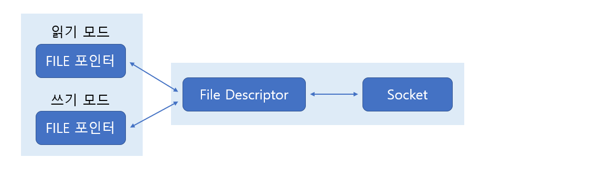
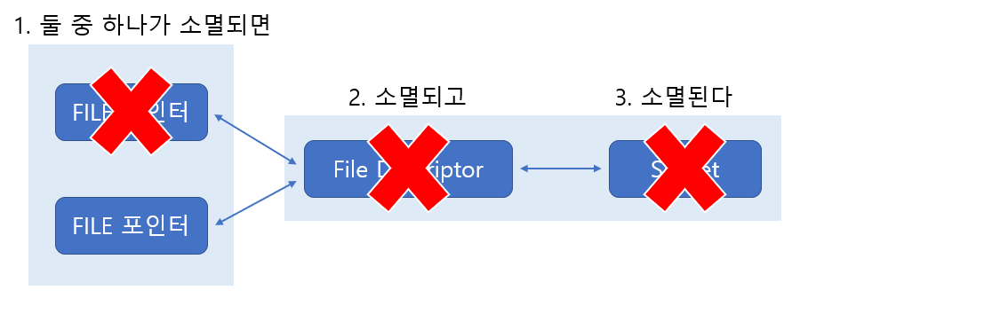
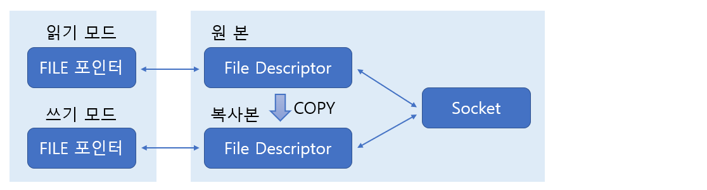
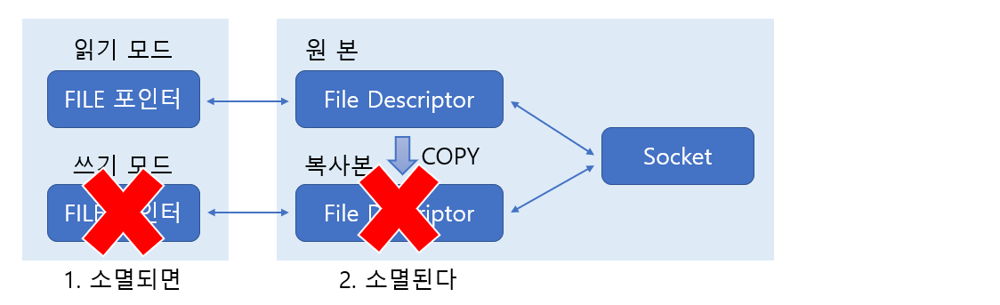
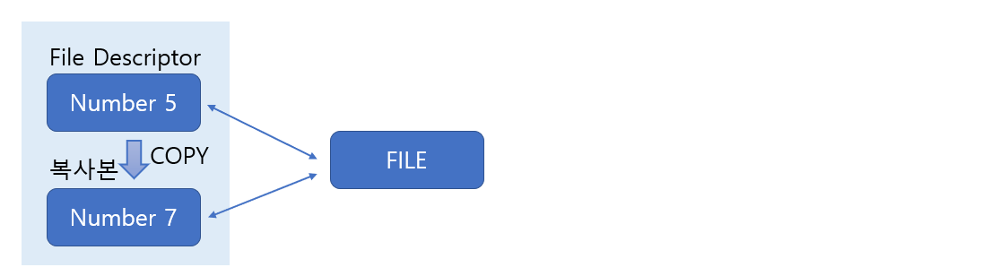

# Linux Standard IO

> 표준 입출력 함수를 이용한 데이터 송수신 방법에 대해 알아본다. 

<br>

### 표준 입출력 함수의 장점

다음은 표준 입출력 함수가 지니는 장점 두 가지이다.

1. 표준 입출력 함수는 이식성(Portability)이 좋다.
2. 표준 입출력 함수는 버퍼링을 통한 성능의 향상에 도움이 된다.

이식성에 대해선 많은 이야기가 필요 없을 것이다. 입출력 뿐만 아니라 모든 표준 함수들은 이식성이 좋다. 모든 운영체제(컴파일러)가 지원하도록 ANSI C에서 표준으로 정의했기 때문이다.

그럼 이어서 두 번째 장점에 대해 이야기하겠다. 표준 입출력 함수를 사용할 경우 추가적으로 입출력 버퍼를 제공받게 된다. 그럼 소켓을 생성하면 기본적으로 운영체제에 의해서 만들어지는 입출력 버퍼와의 관계는 어떻게 될까? 소켓의 버퍼와 별도로 표준 입출력 함수를 사용하게 되면, 이에 더불어 추가로 또 하나의 버퍼를 제공받는다.


위 그림에서 보이듯이 표준 입출력 함수를 사용해서 데이터를 전송할 경우, 거쳐야 하는 버퍼의 수는 두 개가 된다. 버퍼는 기본적으로 성능의 향상을 목적으로 한다. 하지만 소켓과 관련해서 제공되는 버퍼는 TCP의 구현을 위한 목적이 더 강하다. 반면 표준 입출력 함수 사용시 제공되는 버퍼는 오로지 성능 향상만을 목적으로 제공이 된다.

특히 전송해야 할 데이터의 양이 많아질 수록 버퍼링 유무에 따른 성능의 차이는 매우 크다. 일단 다음 두 가지 관점에서 성능의 우월함을 말할 수 있다.

* 전송하는 데이터의 양
* 출력버퍼로의 데이터 이동 횟수

1바이트짜리 데이터를 총 열 번에 걸쳐서 (열 개의 패킷에) 보내는 경우와 이를 버퍼링해서 10바이트로 묶어서 한번에 전송하는 상황을 예로 비교해보자. 데이터의 전송을 위해서 구성된 패킷에는 헤더정보가 추가되는데 이를 패킷당 40바이트로만 잡아도 다음과 같이 전송해야 할 데이터의 양에 큰 차이가 난다.

* 1바이트 10회 - 40 X 10 = 400바이트
* 10바이트 1회 - 40 X 1 = 40바이트

그리고 데이터의 전송을 위해, 소켓의 출력버퍼로 데이터를 이동시키는 데도 시간이 많이 소모된다. 그런데 이 역시 이동 횟수와 관련이 있다. 1바이트를 10회 이동하는데 걸리는 시간이, 10바이트를 한 번에 이동하는 것보다 열 배 가까운 시간이 더 소모된다.

<br>

<br>

### 표준 입출력 함수 사용의 단점

표준 입출력의 단점은 다음과 같다.

1. 양방향 통신이 쉽지 않다.
2. 상황에 따라서 fflush 함수의 호출이 빈번히 등장할 수 있다.
3. 파일 디스크립터를 FILE 구조체의 포인터로 변환해야 한다.

<br>

<br>

### 표준 입출력 함수 사용하기

소켓 생성시에는 파일 디스크립터가 반환되는데, 표준 입출력 함수의 사용을 위해서는 이를 FILE 구조체의 포인터로 변환해야 한다. 따라서 그 방법을 설명하겠다.

<br>

#### fdopen 함수를 이용한 FILE 구조체 포인터로의 변환

소켓의 생성과정에서 반환된 파일 디스크립터를 표준 입출력 함수의 인자로 전달 가능한 FILE 포인터로 변환하는 일은 fdopen 함수를 통해서 간단히 해결할 수 있다.

```c
#include <stdio.h>

FILE * fdopen(int filedes, const char *mode);
> 성공 시 변환된 FILE 구조체 포인터, 실패 시 NULL 반환
```

* **filedes -** 변환할 파일 디스크립터를 인자로 전달.
* **mode - **생성할 FILE 구조체 포인터의 모드(mode)정보 전달.

위 함수의 두 번째 전달인자는, fopen 함수호출 시 전달하는 파일 개방모드와 동일하다. 대표적인 예로 읽기모드인 "r"과 쓰기모드인 "w"가 있다.

<br>

#### fileno 함수를 이용한 파일 디스크립터로의 변환

이번에는 fdopen 함수의 반대기능을 제공하는 함수를 소개하겠다.

```c
#include <stdio.h>

int fileno(FILE *stream);
> 성공 시 변환된 파일 디스크립터, 실패 시 -1 반환
```

<br>

<br>

### 입력 스트림과 출력 스트림의 분리

표준 입출력을 사용한 통신에선 파일 디스크립터를 파일 포인터로 변환해서 사용해야 하는데 이때 입출력 스트림 분리의 이점과 문제점을 알아보도록 한다.

<br>

#### 스트림 분리의 이점

* FILE 포인터는 읽기모드와 쓰기모드를 구분해야 한다.
* 읽기모드와 쓰기모드의 구분을 통한 구현의 편의성 증대
* 입력버퍼와 출력버퍼를 구분함으로 인한 버퍼링 기능의 향상

<br>

#### 파일 디스크립터 복사와 Half-close

표준 입출력 함수를 사용하면 읽기,쓰기 모드로 별도의 FILE 포인터 자료형을 사용하는데 이때 fclose 함수로 읽기 모드의 파일을 닫으면 Half-close가 진행되지 않는다. 왜 이렇게 되는지 그림으로 나타내 보겠다.

다음 그림은 두 개의 FILE 포인터와 파일 디스크립터, 그리고 소켓의 관계를 보이고 있다.



 위 그림에서 보이듯이 읽기모드 FILE 포인터와 쓰기모드 FILE 포인터는 하나의 파일 디스크립터를 기반으로 생성되었기 때문에, 어떠한 FILE 포인터를 대상으로 fclose 함수를 호출하더라도 파일 디스크립터가 종료되고, 이는 소켓의 완전종료로 이어진다.



위 그림에서 보이듯이 소켓이 소멸되면 더 이상 데이터의 송수신은 불가능한 상태가 된다. 그렇다면 출력은 불가능하지만 입력은 가능한 Half-close 상태는 어떻게 만들어야할까? 다음 그림에서 보이듯이 FILE 포인터를 생성하기에 앞서 파일 디스크립터를 복사하면 된다.



위 그림에서 보이듯이 복사를 통해서 파일 디스크립터를 하나 더 만든 다음에 각각의 파일 디스크립터를 통해서 읽기모드 FILE 포인터와 쓰기모드 FILE 포인터를 만들면, **"모든 파일 디스크립터가 소멸되어야 소켓도 소멸된다"** 라는 원칙에 따라 Half-close의 환경이 마련된다.

즉, 쓰기모드 FILE 포인터를 대상으로 fclose 함수를 호출하면, 해당 FILE 포인터와 연관된 파일 디스크립터만 소멸될 뿐, 소켓은 소멸되지 않는다.



위 그림에서 보이듯이 fclose 함수호출 후에도 아직 파일 디스크립터가 하나 더 남아있기 때문에 소켓은 소멸되지 않는다. 그렇지만 이 상태를 Half-close 상태로는 볼 수 없다. 그림을 보면 파일 디스크립터가 하나 더 남아있고, 이 파일 디스크립터는 입력 및 출력이 모두 가능하다. 때문에 상대 호스트로 EOF가 전송되지 않는다. 따라서 바로 위 모델을 바탕으로 EOF가 전송되는 Half-close를 진행하는 방법을 설명하겠다.

<br>

#### 파일 디스크립터의 복사

위에서 말한 파일 디스크립터의 목사는 fork 함수호출 시 진행되는 복사와 차이가 있다. fork 함수호출시 진행되는 복사는 프로세스를 통째로 복사하는 상황에서 이뤄지기 때문에, 하나의 프로세스에 원본과 복사본이 모두 존재하지 않는다. 그러나 여기서 말하는 복사는 프로세스의 생성을 동반하지 않는, 원본과 복사본이 하나의 프로세스 내에 존재하는 형태의 복사를 뜻한다.



위 그림은 하나의 프로세스 내에 동일한 파일에 접근할 수 있는 파일 디스크립터가 두 개 존재하는 상황을 설명한다. 이러한 형태로 파일 디스크립터를 구성하려면 파일 디스크립터를 복사해야 한다. 즉, 여기서 말하는 복사는 다음과 같이 정의할 수 있다. 

**"동일한 파일 또는 소켓의 접근을 위한 또 다른 파일 디스크립터의 생성"**

흔히 복사라고 하면 있는 그대로, 파일 디스크립터의 정수 값까지 복사한다고 생각할 수 있지만, 여기서 말하는 복사는 그런 복사가 아니다.

<br>

#### dup &#38; dup2

그럼 이번에는 파일 디스크립터의 복사방법에 대해서 설명하겠다. 파일 디스크립터의 복사는 다음 두 함수 중 하나를 이용해서 진행한다.

```c
#include <unistd.h>

int dup(int fildes);
int dup2(int fildes, int fildes2);
> 성공 시 복사된 파일 디스크립터, 실패 시 -1 반환
```

* **fildes -** 복사할 파일 디스크립터 전달.
* **fildes2 -** 명시적으로 지정할 파일 디스크립터의 정수 값 전달.

dup2 함수는 복사된 파일 디스크립터의 정수 값을 명시적으로 지정할 때 사용한다. 이 함수의 인자로, 0보다 크고 프로세스당 생성할 수 있는 파일 디스크립터의 수보다 작은 값을 전달하면, 해당 값을, 복사되는 파일 디스크립터의 정수 값으로 지정해 준다.

<br>

#### 파일 디스크립터의 복사 후 스트림의 분리

마지막으로 실제 코드에서 Half-close를 어떻게 적용하는지 알아보자. 

```c
FILE *readfp, *writefp;

....

readfp = fdopen(clnt_sock, "r");
writefp = fdopen(clnt_sock, "w");

....

shutdown(fileno(writefp), SHUT_WR);
fclose(writefp);
```

필요없는 부분은 생략하고 작성하였다. 위 문장에서 fileno 함수호출 시 반환되는 파일 디스크립터를 대상으로 shutdown 함수를 호출하고 있다. 이로 인해서 Half-close가 진행되어 클라이언트로 EOF가 전달된다. 즉, 앞서 말한 EOF의 전달방법은 바로 이 한 줄에 있다. 이렇듯 **shutdown 함수가 호출되면 복사 된 파일 디스크립터의 수에 상관없이 Half-close가 진행되며, 이 과정에서 EOF도 전달된다.** 

