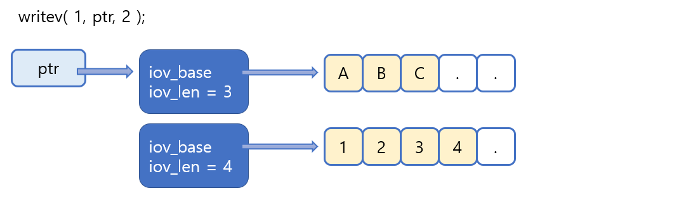

# Linux send &#38; recv

> read & write 함수에 비해 send & recv 함수가 지니는 특성을 알아보고 다른 입출력 함수도 소개한다.

<br>

### 리눅스에서의 send &#38; recv

다른 포스팅에서 이미 send &#38; recv 함수를 소개했지만 윈도우 기반에서 소개한 것이니, 이번에는 리눅스 기반에서 send &#38; recv 함수를 소개하겠다.

```c
#include <sys/socket.h>

ssize_t send(int sockfd, const void *buf, size_t nbytes, int flags);
> 성공 시 전송된 바이트 수, 실패 시 -1 반환
```

* **sockfd - **데이터 전송 대상과의 연결을 의미하는 소켓의 파일 디스크립터 전달.
* **buf -** 전송할 데이터를 저장하고 있는 버퍼의 주소 값 전달.
* **nbytes -** 전송할 바이트 수 전달.
* **flags -** 데이터 전송 시 적용할 다양한 옵션 정보 전달.

위의 send 함수와 윈도우의 send 함수를 비교해보면 선언된 자료형의 이름에서는 차이가 난다. 그러나 매개변수의 순서, 의미 그리고 사용방법까지 완전히 동일하기 때문에 사실상 차이가 없다.

```c
#include <sys/socket.h>

ssize_t recv(int sockfd, void *buf, size_t nbytes, int flags);
> 성공 시 수신한 바이트 수(단 EOF 전송 시 0), 실패 시 -1 반환
```

* **sockfd -** 데이터 수신 대상과의 연결을 의미하는 소켓의 파일 디스크립터 전달.
* **buf -** 수신된 데이터를 저장할 버퍼의 주소 값 전달.
* **nbytes -** 수신할 수 있는 최대 바이트 수 전달.
* **flags -** 데이터 수신 시 적용할 다양한 옵션 정보 전달.

send 함수와 recv 함수의 마지막 매개변수에는 데이터 송수신시 적용할 옵션정보가 전달된다. 이 옵션정보에는 비트 OR 연산자를 이용해서 둘 이상을 함께 전달할 수 있다. 간단히 마지막 매개변수에 전달할 수 있는 옵션의 종류와 그 의미를 정리해 보겠다.

| 옵션(Option)  | 의미                                                         | send | recv |
| ------------- | ------------------------------------------------------------ | ---- | ---- |
| MSG_OOB       | 긴급 데이터(Out-of-band data)의 전송을 위한 옵션             | O    | O    |
| MSG_PEEK      | 입력버퍼에 수신된 데이터의 존재유무 확인을 위한 옵션         |      | O    |
| MSG_DONTROUTE | 데이터 전송과정에서 라우팅(Routing)테이블을 참조하지 않을 것을 요구하는 옵션, 따라서 로컬(Local) 네트워크상에서 목적지를 찾을 때 사용되는 옵션 | O    |      |
| MSG_DONTWAIT  | 입출력 함수 호출과정에서 블로킹 되지 않을 것을 요구하기 위한 옵션, 즉, 넌-블로킹(Non-blocking) IO의 요구에 사용되는 옵션 | O    | O    |
| MSG_WAITALL   | 요청한 바이트 수에 해당하는 데이터가 전부 수신될 때까지, 호출된 함수가 반환되는 것을 막기 위한 옵션 |      | O    |

이 옵션들의 지원여부는 운영체제마다 조금씩 차이가 날 수 있다.

<br>

<br>

### readv &#38; writev 입출력 함수

이번에 소개할 readv &#38; writev 입출력 함수는 데이터 송수신의 효율성을 향상시키는데 도움이 되는 함수들이다. 일단 사용방법부터 알아보고 나서, 유용하게 사용되는 경우에 대해 이야기 하겠다.

<br>

#### readv &#38; writev 함수의 사용

readv &#38; writev 함수의 기능을 한마디로 정리하면 다음과 같다.

**"데이터를 모아서 전송하고, 모아서 수신하는 기능의 함수"**

즉, writev 함수를 사용하면 여러 버퍼에 나뉘어 저장되어 있는 데이터를 한번에 전송할 수 있고, 또 readv 함수를 사용하면 데이터를 여러 버퍼에 나눠서 수신할 수 있다. 그럼 먼저 writev 함수를 소개하겠다.

```c
#include <sys/uio.h>

ssize_t writev(int filedes, const struct iovec *iov, int iovcnt);
> 성공 시 전송된 바이트 수, 실패 시 -1 반환
```

* **filedes -** 데이터 전송의 목적지를 나타내는 소켓의 파일 디스크립터 전달, 단 소켓에만 제한된 함수가 아니기 때문에, read 함수처럼 파일이나 콘솔 대상의 파일 디스크립터도 전달 가능하다.
* **iov -** 구조체 iovec 배열의 주소 값 전달, 구조체 iovec의 변수에는 전송할 데이터의 위치 및 크기 정보가 담긴다.
* **iovcnt -** 두 번째 인자로 전달된 주소 값이 가리키는 배열의 길이정보 전달.

그리고 위 함수의 두 번째 인자로 전달되는 배열의 구조체 iovec은 다음과 같이 정의되어 있다.

```c
struct iovec{
	void *iov_base;		//버퍼의 주소 정보
	size_t iov_len;		//버퍼의 크기 정보
}
```

이렇듯 구조체 iovec은 전송할 데이터가 저장되어 있는 버퍼(char형 배열)의 주소 값과 실제 전송할 데이터의 크기 정보를 담기 위해 정의되었다. 함수의 사용방법을 그림으로 보면 다음과 같다.



위 그림에서 writev의 첫 번째 인자 1은 파일 디스크립터를 의미하므로 콘솔에 출력이 이뤄지고, ptr은 전송할 데이터 정보를 모아둔 iovec 배열을 가리키는 포인터이다. 또한 세 번째 인자가 2이기 때문에 ptr이 가리키는 주소를 시작으로 총 두 개의 iovec 변수를 참조하여, 그 두 변수가 가리키는 버퍼에 저장된 데이터의 전송이 진행된다. 

그럼 이번에는 readv 함수에 대해 살펴보도록 하자. readv 함수는 writev 함수와 반대로 생각하면 된다.

```c
#include <sys/uio.h>

ssize_t readv(int filedes, const struct iovec *iov, int iovcnt);
> 성공 시 수신된 바이트 수, 실패 시 -1 반환
```

* **filedes -** 데이터를 수신할 파일(혹은 소켓)의 파일 디스크립터를 인자로 전달.
* **iov -** 데이터를 저장할 위치와 크기 정보를 담고 있는 iovec 구조체 배열의 주소 값 전달.
* **iovcnt -** 두 번째 인자로 전달된 주소 값이 가리키는 배열의 길이정보 전달.

<br>

#### readv &#38; writev 함수의 적절한 사용

readv와 writev는 사용할 수 있는 모든 상황이 적절한 상황이다. 간단하게 C언어 차원에서 생각해봐도 함수의 호출횟수가 적으면, 그만큼 성능이 향상되므로 이득이다. 그러나 전송되는 패킷의 수를 줄일 수 있다는데 더 큰 의미가 있다. 

직접 구현한 서버에서 성능향상을 위해 Nagle 알고리즘을 명시적으로 중지시킨 상황을 생각하자. 사실 writev 함수는 Nagle 알고리즘이 중지된 상황에서 더 활용의 가치가 높다. 전송해야 할 데이터가 세 곳의 영역에 나뉘어 저장된 상황에서의 데이터 전송을 예로 들어보자. 이 상황에서 write 함수를 사용할 경우 총 세 번의 함수호출이 필요하다. 그런데 속도향상을 목적으로 이미 Nagle 알고리즘이 중지된 상황이라면, 총 세 개의 패킷이 생성되어 전송될 확률이 높다. 반면 writev 함수를 사용할 경우, 한번에 모든 데이터를 출력버퍼로 밀어 넣기 때문에 하나의 패킷만 생성되어서 전송될 확률이 높다. 때문에 writev 함수와 readv 함수의 호출이 유용한 것이다. 