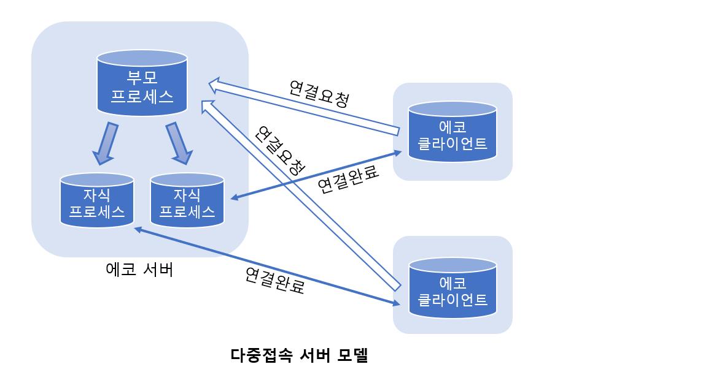
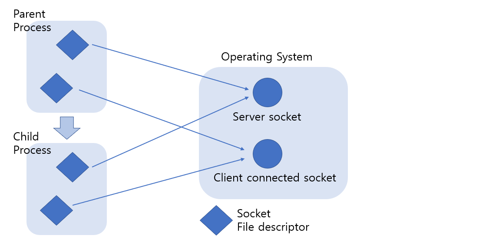
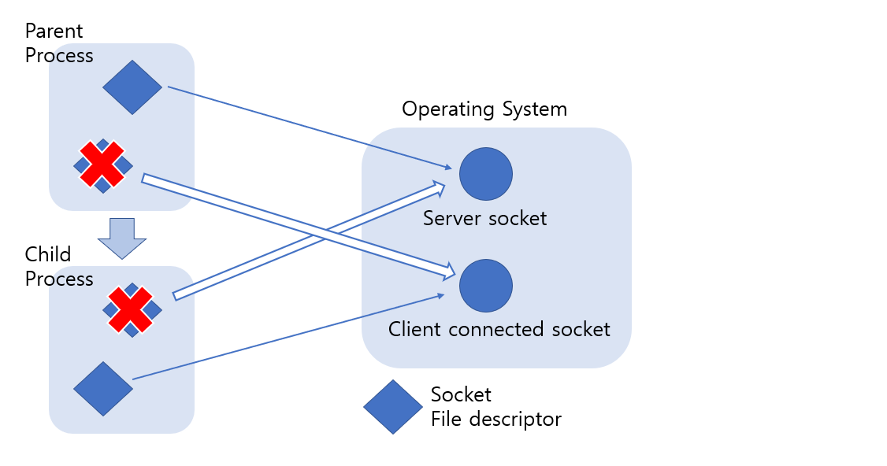

# Multitasking base Server

> 멀티태스킹 기반의 다중 접속 서버의 구현 방법에 대해 알아본다.

<br>

### 프로세스 기반의 다중접속 서버의 구현 모델

동시에 둘 이상의 클라이언트에게 서비스를 제공하는 형태로 에코 서버를 제작하겠다. 다음 그림은 앞으로 구현할 멀티프로세스 기반의 다중접속 에코 서버의 구현모델을 보이고 있다.



위 그림에서 보이듯이 클라이언트의 서비스 요청(연결요청)이 있을 때마다 에코 서버는 자식 프로세스를 생성해서 서비스를 제공한다. 즉, 서비스를 요청하는 클라이언트의 수가 다섯이라면 에코 서버는 추가로 다섯 개의 자식 프로세스를 생성해서 서비스를 제공한다. 이를 위해서 에코 서버는 다음의 과정을 거쳐야 한다.

1. 에코 서버(부모 프로세스)는 accept 함수호출을 통해서 연결요청을 수락한다.
2. 이때 얻게 되는 소켓의 파일 디스크립터를 자식 프로세스를 생성해서 넘겨준다.
3. 자식 프로세스는 전달받은 파일 디스크립터를 바탕으로 서비스를 제공한다.

여기서 자식 프로세스에게 소켓의 파일 디스크립터를 넘긴다는게 혼란스러울수도 있는데 실제로 코드를 보면 아무것도 아님을 알 수 있다. 왜냐하면 자식 프로세스는 부모 프로세스가 소유하고 있는 것을 전부 복사하기 때문이다. 즉, 사실상 파일 디스크립터를 넘기는 과정은 별도로 거칠 필요가 없다.

<br>

<br>

### 다중접속 에코 서버의 구현

```c
#define _XOPEN_SOURCE 700
#include <stdio.h>
#include <stdlib.h>
#include <string.h>
#include <unistd.h>
#include <signal.h>
#include <sys/wait.h>
#include <arpa/inet.h>
#include <sys/socket.h>

#define BUF_SIZE 30
void error_handling(char *message);
void read_childproc(int sig);

int main(int argc, char *argv[]){
	int serv_sock, clnt_sock;
	struct sockaddr_in serv_adr, clnt_adr;

	pid_t pid;
	struct sigaction act;
	socklen_t adr_sz;
	int str_len, state;
	char buf[BUF_SIZE];
	if(argc != 2){
		printf("Usage : %s <port>\n", argv[0]);
		exit(1);
	}

	act.sa_handler = read_childproc;
	sigemptyset(&act.sa_mask);
	act.sa_flags = 0;
	state = sigaction(SIGCHLD, &act, 0);

	serv_sock = socket(PF_INET, SOCK_STREAM, 0);
	memset(&serv_adr, 0, sizeof(serv_adr));
	serv_adr.sin_family = AF_INET;
	serv_adr.sin_addr.s_addr = htonl(INADDR_ANY);
	serv_adr.sin_port = htons(atoi(argv[1]));

	if(bind(serv_sock, (struct sockaddr*) &serv_adr, sizeof(serv_adr))==-1)
		error_handling("bind() error");
	if(listen(serv_sock, 5)==-1)
		error_handling("listen() error");

	while(1){
		adr_sz = sizeof(clnt_adr);
		clnt_sock = accept(serv_sock, (struct sockaddr*) &clnt_adr, &adr_sz);
		if(clnt_sock == -1)
			continue;
		else
			puts("new client connected...");
		pid = fork();
		if(pid == -1){
			close(clnt_sock);
			continue;
		}
		if(pid == 0){
			close(serv_sock);
			while((str_len = read(clnt_sock, buf, BUF_SIZE))!= 0)
				write(clnt_sock, buf, str_len);
			close(clnt_sock);
			puts("client disconnected....");
			return 0;
		}
		else
			close(clnt_sock);
	}
	close(serv_sock);
	return 0;
}

void read_childproc(int sig){
	pid_t pid;
	int status;
	pid = waitpid(-1, &status, WNOHANG);
	printf("removed proc id: %d\n",pid);
}

void error_handling(char *message){
	fputs(message, stderr);
	fputc('\n', stderr);
	exit(1);
}
```

위 코드는 다중접속 에코 서버이다. 전체적으로 한번 훝어보면서 중간에 close 함수의 호출에 주의하자 close 호출이 어째서 저렇게 이루어지는지는 밑에서 바로 설명하겠다.

<br>

<br>

### fork 함수호출을 통한 파일 디스크립터 복사

위의 코드는 fork 함수호출을 통한 파일 디스크립터의 복사를 보여준다. 부모 프로세스가 지니고 있던 두 소켓(하나는 서버 소켓, 하나는 클라이언트와 연결된 소켓)의 파일 디스크립터가 자식 프로세스에게 복사되었다.

여기서 소켓의 복사와 파일 디스크립터의 복사를 혼동할수 있다. 그러나 소켓은 프로세스의 소유가 아니라 운영체제의 소유이다. 다만 해당 소켓을 의미하는 파일 디스크립터만 이 프로세스의 소유인 것이다. 

즉, 위 코드에서 fork 함수의 호출결과는 다음과 같다. fork 함수호출 이후에 하나의 소켓에 두 개의 파일 디스크립터가 할당된 모습을 보인다.



위 그림과 같이 하나의 소켓에 두 개의 파일 디스크립터가 존재하는 경우, 두 개의 파일 디스크립터가 모두 종료(소멸)되어야 소켓은 소멸된다. 그래서 fork 함수호출 후에는 다음 그림에서 보이듯이 서로에게 상관이 없는 소켓의 파일 디스크립터를 닫아줘야 한다.



위 그림의 형태로 파일 디스크립터를 정리하기 위해서 위 코드의 close 호출을 저렇게 한것이다.