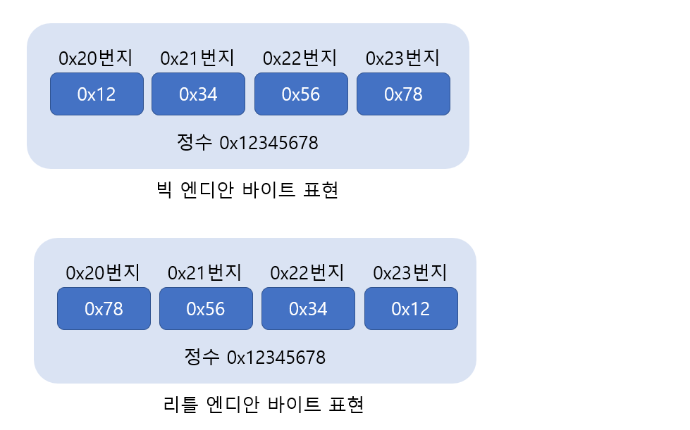

# Socket Address Structure(Bind)

> 소켓에 IP 와 Port 번호를 부여하는 bind 함수에 대해 알아본다. 

<br>

### 소켓에 인터넷 주소 할당

소켓에 IP와 Port 번호를 할당하는 함수인 bind 함수를 확인해보자.

```c
#include <sys/socket.h>

int bind(int sockfd, struct sockaddr *myaddr, socklen_t addrlen);
> 성공 시 0, 실패 시 -1 반환
```

* **sockfd -** 주소정보를(IP와 PORT를) 할당할 소켓의 파일 디스크립터.
* **myaddr -** 할당하고자 하는 주소정보를 지니는 구조체 변수의 주소 값.
* **addrlen -** 두 번째 인자로 전달된 구조체 변수의 길이 정보.

위의 함수호출이 성공하면, 첫 번째 인자에 해당하는 소켓에 두 번째 인자로 전달된 주소정보가 할당된다. 그럼 이제 2번 째 인자인 주소정보를 지니는 구조체 변수가 무엇인지 본격적으로 알아보도록 하자. 

<br>

<br>

### 주소정보의 표현

어플리케이션상에서의 IP주소와 PORT번호 표현을 위한 구조체가 정의되어 있다. 따라서 이 구조체를 중심으로 목적지 주소의 표현방법에 대해 살펴보겠다.(IPv4 중심)

<br>

#### IPv4 기반의 주소표현을 위한 구조체

주소 정보를 담을 떄에는 다음 세가지 정보를 포함해야 한다.

1. 사용하는 주소체계(ex. IPv4, IPv6)
2. IP 주소
3. PORT 번호

위의 세 정보를 담을 수 있도록 다음 형태로 구조체가 이미 정의되어 있다. 이 구조체가 bind 함수에 주소정보를 전달하는 목적으로 사용된다.

```c++
struct sockaddr_in{
	sa_family_t		sin_family; //주소체계(Address Family)
	uint16_t		sin_port; //16비트 TCP/UDP PORT번호
	struct in_addr	sin_addr; //32비트 IP 주소
	char		sin_zero[8]; //사용되지 않음
}
```

그리고 위의 구조체 정의에 사용된 또 다른 구조체 in_addr은 다음과 같이 정의되어 있다. 이는 32비트 IP 주소정보를 담을 수 있도록 정의되어 있다.

```c
struct in_addr{
	in_addr_t		s_addr; //32비트 IPv4 인터넷 주소
}
```

위의 두 구조체 설명에 앞서 생소한 자료형에 대한 소개가 먼저 필요해 보인다. 유닉스 계열의 운영체제에 적용하기 위한 표준을 알려주는 POSIX에는 다음과 같이 추가로 자료형을 정의하고 있다.

| 자료형 이름                                                  | 자료형에 담길 정보                                           | 선언된 헤더파일 |
| ------------------------------------------------------------ | ------------------------------------------------------------ | --------------- |
| int8_t<br>uint8_t<br>int16_t<br>uint16_t<br>int32_t<br>uint32_t | signed 8-bit int<br>unsigned 8-bit int (unsigned char)<br>signed 16-bit int<br>unsigned 16-bit int (unsigned short)<br>signed 32-bit int<br>unsigned 32-bit int (unsigned long) | sys/types.h     |
| sa_family_t<br>socklen_t                                     | 주소체계(address family)<br>길이정보(length of struct)       | sys/socket.h    |
| in_addr_t<br>in_port_t                                       | IP주소정보, uint32_t로 정의되어 있음<br>PORT번호정보, uint16_t로 정의되어 있음 | netinet/in.h    |

위의 자료형 정보만 참조를 해도 앞에 나온 구조체의 의미를 파알할 수 있을 것이다. 이렇게 자료형을 따로 정의해둔 이유는 확장성을 고려한 결과이다. 즉, 이 int32_t라는 자료형을 사용한다면, 이는 어떠한 경우에도 4바이트 자료형임을 보장받을 수 있다는 말이다.

<br>

#### 구조체 sockaddr_in의 멤버 분석

그럼 이제 구조체의 멤버 별로 어떠한 의미를 지니고 또 어떠한 정보로 채워지는지 하나씩 알아보도록 하자. 

##### 멤버 sin_family

프로토콜 체계마다 적용하는 주소체계가 다르다. 따라서 아래 표를 참조하여 멤버 sin_family에 적용할 주소체계정보를 저장해야 한다.

| 주소체계( Address Family) | 의미                                        |
| ------------------------- | ------------------------------------------- |
| AF_INET                   | IPv4 인터넷 프로토콜에 적용하는 주소체계    |
| AF_INET6                  | IPv6 인터넷 프로토콜에 적용하는 주소체계    |
| AF_LOCAL                  | 로컬 통신을 위한 유닉스 프로토콜의 주소체계 |

##### 멤버 sin_port

16비트 PORT 번호를 저장한다. 단 `네트워크 바이트 순서`로 저장해야 하는데, 이에 대해서는 잠시 후에 별도로 설명하겠다. 

##### 멤버 sin_addr

32비트 IP주소정보를 저장한다. 이 역시 `네트워크 바이트 순서`로 저장해야 한다. 이 멤버를 정확하게 파악하기 위해서는 구조체 in_addr도 함께 살펴봐야 한다. 그런데 구조체 in_addr의 유일한 멤버가 uint32_t로 선언되어 있으니, 간단히 32비트 정수자료형으로 인식해도 괜찮다.

##### 멤버 sin_zero

특별한 의미를 지니지 않는 멤버이다. 단순히 구조체 sockaddr_in의 크기를 구조체 sockaddr와 일치시키기 위해 삽인된 멤버이다. 그러나 반드시 0으로 채워야 한다. 만약에 0으로 채우지 않으면 원하는 결과를 얻지 못한다. 

---

sockaddr_in 구조체 변수의 주소 값은 bind 함수의 인자로 다음과 같이 전달된다. bind 함수의 형변환 코드에 주의해서 보자.

```c
struct sockaddr_in serv_addr;
....
if(bind(serv_sock, (struct sockaddr*) &serv_addr, sizeof(serv_addr))==-1)
	error_handling("bind() error");
....
```

여기서 중요한 것은 두 번째 전달인자이다. 사실 bind 함수는 sockaddr 구조체 변수의 주소 값을 요구한다. 앞서 설명한 주소체계, PORT번호, IP주소정보를 담고 있는 sockaddr 구조체 변수의 주소값을 요구하는 것이다. 그런데 아래에 보이듯이 구조체 sockaddr은 이들 정보를 담기에 다소 불편하게 정의되어 있다.

```c
struct sockaddr{
	sa_family_t		sin_family; //주소체계
	char		sa_data[14]; //주소정보
}
```

우의 구조체 멤버 sa_data에 저장되는 주소정보에는 IP주소와 PORT번호가 포함되어야 하고, 이 두 가지 정보를 담고 남은 부분은 0으로 채울 것을 bind 함수는 요구하고 있다. 그런데 이는 주소정보를 담기에 매우 불편한 요구사항이다. 그래서 구조체 sockaddr_in이 등장한 것이다. sockaddr_in 구조체 멤버를 앞서 설명한대로 채우면, 이 때 형성되는 구조체 변수의 바이트 열이 bind 함수가 요구하는 바이트열이 된다. 

---

<br>

<br>

### 네트워크 바이트 순서와 인터넷 주소 변환

CPU에 따라서 4바이트 정수 1을 메모리공간에 저장하는 방식이 달라질 수 있다. 이러한 부분을 고려하지 않고 데이터를 송수신하면 문제가 발생할 수 있다. 저장순서가 다르다는 것은 전송되어온 데이터의 해석순서가 다름을 뜻하기 때문이다.

#### 바이트 순서(Order)와 네트워크 바이트 순서

CPU가 데이터를 메모리에 저장하는 방식은 다음과 같이 두 가지로 나뉜다. 참고로 CPU가 데이터를 메모리에 저장하는 방식이 두 가지로 나뉜다는 것은 CPU가 데이터를 해석하는 방식도 두 가지로 나뉜다는 것이다.

* **빅 엔디안(Big Endian) -** 상위 바이트의 값을 작은 번지수에 저장하는 방식
* **리틀 엔디안(Little Endian) -** 상위 바이트의 값을 큰 번지수에 저장하는 방식

이 둘은 글로만 보면 이해하기 어려우니 예를 하나 들겠다. 0x20번지를 시작으로 4바이트 int형 정수 0x12345678을 저장한다고 가정해보자. 각각의 방식은 다음과 같이 메모리에 저장한다.



이러한 저장 방식의 차이때문에 네트워크를 통해서 데이터를 전송할 때에는 통일된 기준으로 데이터를 전송하기로 약속하였으며, 이 약속을 가리켜 `네트워크 바이트 순서(Network Byte Order)` 라 한다. 네트워크 바이트 순서의 약속은 매우 간단하다.

**"빅 엔디안 방식으로 통일한다."**

즉, 네트워크상으로 데이터를 전송할 때에는 데이터의 배열을 빅 엔디안 기준으로 변경해서 송수신하기로 약속한 것이다. 

<br>

#### 바이트 순서의 변환(Endian Conversions)

이제 sockaddr_in 구조체 변수에 값을 채우기 앞서 네트워크 바이트 순서로 변환해서 저장해야 하는 이유를 알았을 것이다. 그럼 이번에는 바이트 순서의 변환을 돕는 함수를 소개하겠다.

* unsigned short htons (unsigned short);
* unsigned short ntohs (unsigned short);
* unsigned long htonl (unsigned long);
* unsigned long ntohl (unsigned long);

잘 확인해보면 함수의 이름만 가지고도 기능을 파악할 수 있다. 

* htons에서의 h는 호스트(host) 바이트 순서를 의미한다.
* htons에서의 n은 네트워크(network) 바이트 순서를 의미한다.

그리고 s는 short, l은 long을 의미한다. 따라서 htons는 h, to, n, s의 조합이므로 다음과 같이 해석할 수 있다.

**"short형 데이터를 호스트 바이트 순서에서 네트워크 바이트 순서로 변환해라"**

일반적으로 뒤에 s가 붙는 함수는 PORT번호의 변환에 사용되고, 뒤에 l이 붙는 함수는 IP주소 변환에 사용한다. 

우리가 사용하는 인텔, AMD계열의 CPU는 모두 리틀 엔디안을 기준으로 정렬하기 때문에 위 함수를 통해 바이트 순서 변환을 해주어야 한다.

<br>

<br>

### 인터넷 주소의 초기화와 할당

네트워크 바이트 순서에 대해서도 알았으니, 이제 bind 함수를 비롯해서 앞서 소개한 구조체의 활용을 이야기 하겠다. 

#### 문자열 정보를 네트워크 바이트 순서의 정수로 변환하기

sockaddr_in 안에서 주소정보를 저장하기 위해 선언된 멤버는 32비트 정수형으로 정의되어 있다. 따라서 우리는 IP주소 정보의 할당을 위해서 32비트 정수형태로 IP주소를 표현할 수 있어야 한다. 그러나 일반적으로 우리는 IP주소를 점이 찍힌 10진수 문자열 표현으로 사용하기 때문에 변환하기가 매우 번거롭다.

그래서 이 문자열로 표현된 IP주소를 32비트 정수형으로 변환해 주는 함수가 있다. 뿐만 아니라 이 함수는 변환과정에서 네트워크 바이트 순서로의 변환도 동시에 진행한다.

```c
#include <arpa/inet.h>

in_addr_t inet_addr(const char* string);
> 성공 시 빅엔디안으로 변환된 32비트 정수 값, 실패 시 INADDR_NONE 반환
```

위 함수의 인자로 "211.213.107.99"와 같이 점이 찍힌 10진수로 표현된 문자열을 전달하면, 해당 문자열 정보를 참조해서 IP주소 정보를 32비트 정수형으로 반환한다.

이어서 소개하는 inet_aton 함수도 기능상으로는 inet_addr 함수와 동일하다. 즉, 문자열 형태의 IP주소를 32비트 정수, 그것도 네트워크 바이트 순서로 정렬해서 반환한다. 다만 구조체 변수 in_addr를 이용하는 형태라는 점에서 차이를 보인다. 참고로 활용도는 inet_aton 함수가 더 높다.

```c
#include <arpa/inet.h>

int inet_aton(const char* string, struct in_addr* addr);
> 성공 시 1(true), 실패 시 0(false) 반환
```

* **string -** 변환할 IP 주소 정보를 담고 있는 문자열의 주소 값 전달.
* **addr -** 변환된 정보를 저장할 in_addr 구조체 변수의 주소 값 전달.

마지막으로 위 2 함수와 반대기능을 제공하는 함수를 소개하겠다. 이 함수는 네트워크 바이트 순서로 정렬된 정수형 IP주소 정보를 우리가 눈으로 쉽게 인식할 수 있는 문자열의 형태로 변환해준다.

```c
#include <arpa/inet.h>

char* inet_ntoa(struct in_addr adr);
> 성공 시 변환된 문자열의 주소 값, 실패 시 -1 반환
```

<br>

#### 인터넷 주소의 초기화

지금까지 살펴본 내용을 기반으로 소켓생성과정에서 흔히 등장하는 인터넷 주소정보의 초기화 방법을 보이겠다.

```c
struct sockaddr_in addr;
char *serv_ip = "211.217.168.13"; //IP주소 문자열 선언
char *serv_port = "9190"; //PORT번호 문자열 생성
memset(&addr, 0, sizeof(addr)); //구조체 변수 addr의 모든 멤버 0으로 초기화
addr.sin_family = AF_INET; //주소체계 지정
addr.sin_addr.s_addr = inet_addr(serv_ip); //문자열 기반의 IP주소 초기화
addr.sin_port = htons(atio(serv_port)); //문자열 기반의 PORT번호 초기화
```

위의 코드에서 memset으로 addr변수를 0으로 초기화 하는 이유는 sockaddr_in 구조체 멤버 sin_zero를 0으로 초기화하기 위함이다.

<br>

#### INADDR_ANY

서버 소켓의 생성과정에서 매번 서버의 IP주소를 입력하는 것은 귀찮은 일이다.  따라서 다음 방식으로 주소정보를 초기화해도 된다.

```c
struct sockaddr_in addr;
char *serv_port = "9190";
memset(&addr, 0, sizeof(addr));
addr.sin_family = AF_INET;
addr.sin_addr.s_addr = inet_addr(INADDR_ANY);
addr.sin_port = htons(atio(serv_port));
```

앞서 소개한 방식과의 가장 큰 차이점은 INADDR_ANY라는 이름의 상수를 통해서 서버의 IP주소를 할당하고 있다는 점이다. 소켓의 IP주소를 이렇게 초기화할 경우 소켓이 동작하는 컴퓨터의 IP주소가 자동으로 할당되기 때문에 IP주소를 직접 입력하는 수고를 덜 수 있다.