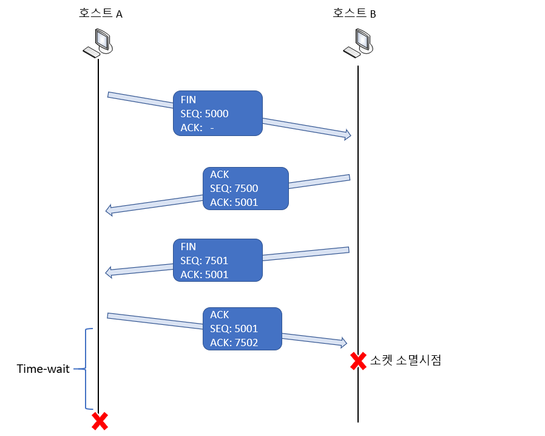
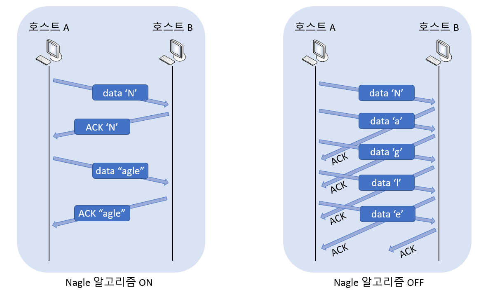

# Socket Option

> 소켓에 존재하는 다양한 옵션과 옵션 변경 방법에 대해 알아본다.

<br>

소켓 프로그래밍을 할 때 데이터의 송수신에만 신경을 쓰고, 소켓이 지니는 그 이외의 특서에는 관심을 덜 갖는 경우가 있다. 그러나 소켓이 지니는 다양한 특성을 파악하고, 또 그 특성을 필요에 맞게 변경하는 것은 데이터 송수신만큼이나 중요한 일이다.

<br>

### 소켓의 다양한 옵션

| Protocol Level | Option  Name                                                 | Get                                                | Set                                                |
| -------------- | ------------------------------------------------------------ | -------------------------------------------------- | -------------------------------------------------- |
| SOL_SOCKET     | SO_SNDBUF<br />SO_RCVBUF<br />SO_REUSEADDR<br />SO_BROADCAST<br />SO_DONTROUTE<br />SO_OOBINLINE<br />SO_ERROR<br />SO_TYPE | O<br />O<br />O<br />O<br />O<br />O<br />O<br />O | O<br />O<br />O<br />O<br />O<br />O<br />X<br />X |
| IPPROTO_IP     | IP_TOS<br />IP_TTL<br />IP_MULTICAST_TTL<br />IP_MULTICAST_LOOP<br />IP_MULTICAST_IF | O<br />O<br />O<br />O<br />O                      | O<br />O<br />O<br />O<br />O                      |
| IPPROTO_TCP    | TCP_KEEPALIVE<br />TCP_NODELAY<br />TCP_MAXSEG               | O<br />O<br />O                                    | O<br />O<br />O                                    |

위의 표에서 보이듯이 소켓의 옵션은 계층별로 분류된다. IPPROTO_IP 레벨의 옵션들은 IP 프로토콜에 관련된 사항들이며, IPPROTO_TCP 레벨의 옵션들은 TCP 프로토콜에 관련된 사항들이다. 그리고 SOL_SOCKET 레벨의 옵션들은 소켓에 대한 가장 일반적인 옵션들로 생각하면 된다.

이번 포스팅에선 중요한 옵션 몇 가지에 대해서만 그 의미와 변경 방법을 소개하겠다.

<br>

<br>

### getsocopt &#38; setsockopt

위의 표에서 보이듯이 거의 모든 옵션은 설정상태의 참조(Get) 및 변경(Set)이 가능하다. 그리고 옵션의 참조 및 변경에는 다음 두 함수를 사용한다.

```c
#include <sys/socket.h>

int getsockopt(int sock, int level, int optname, void *optval, socklen_t *optlen);
> 성공 시 0, 실패 시 -1 반환
```

* **sock -** 옵션확인을 위한 소켓의 파일 디스크립터 전달.
* **level -** 확인할 옵션의 프로토콜 레벨 전달.
* **optname -** 확인할 옵션의 이름 전달.
* **optval -** 확인결과의 저장을 위한 버퍼의 주소 값 전달.
* **optlen -** 네 번째 매개변수 optval로 전달된 주소 값의 버퍼크기를 담고 있는 변수의 주소 값 전달, 함수호출이 완료되면 이 변수에는 네 번째 인자를 통해 반환된 옵션정보의 크기가 바이트 단위로 계산되어 저장된다.

이 함수는 소켓의 옵션을 확인할 때 호출하는 함수이다. 이어서 소켓의 옵션을 변경할 때 호출하는 함수를 소개하겠다.

<br>

```c
#include <sys/socket.h>

int setsockopt(int sock, int level, int optname, const void *optval, socklen_t optlen);
> 성공 시 0, 실패 시 -1 반환
```

* **sock -** 옵션변경을 위한 소켓의 파일 디스크립터 전달.
* **level -** 변경할 옵션의 프로토콜 레벨 전달.
* **optname -** 변경할 옵션의 이름 전달.
* **optval -** 변경할 옵션정보를 저장한 버퍼의 주소 값 전달.
* **optlen -** 네 번째 매개변수 optval로 전달된 옵션정보의 바이트 단위 크기 전달.

<br>

<br>

### SO_SNDBUF &#38; SO_RCVBUF

소켓이 생성되면 기본적으로 입력버퍼와 출력버퍼가 생성된다. SO_RCVBUF는 입력버퍼의 크기와 관련된 옵션이고, SO_SNDBUF는 출력버퍼의 크기와 관련된 옵션이다. 즉, 이 두 옵션을 이용해서 입출력 버퍼의 크기를 참조할 수 있는 뿐만 아니라, 변경도 가능하다.

<br>

<br>

### SO_REUSEADDR

위 옵션, 그리고 그와 관련 있는 Time-wait 상태는 상대적으로 중요하다. 따라서 반드시 이해하고 기억해 둘 필요가   있다.

#### Time-wait 상태

먼저 다음의 Four-way handshaking 과정을 살펴보자.



위 그림에서 호스트 A를 서버라고 보면, 호스트 A가 호스트 B로 FIN 메시지를 먼저 보내고 있으니, 서버가 콘솔상에서 Ctrl + C 를 입력한 상황으로 볼 수 있다. 그런데 여기서 주목할 점은 연결의 해제 과정인 Four-way handshaking 이후에 소켓이 바로 소멸되지 않고 Time-wait 상태라는 것을 일정시간 거친다는 점이다. Time-wait 상태는 먼저 연결의 종료를 요청한 호스만 거친다. 이 때문에 서버가 먼저 연결의 종료를 요청해서 종료하고 나면, 바로 이어서 실행을 할 수 없는 것이다. 소켓이 Time-wait 상태에 있는 동안에는 해당 소켓의 PORT 번호가 사용중인 상태이기 때문이다.

그렇다면 Time-wait 상태는 무엇 때문에 존재하는 것인가? 위 그림에서 호스트 A가 호스트 B로 마지막 ACK 메시지를 전송하고 나서 소켓을 바로 소멸시켰다고 가정해 보자. 그런데 이 마지막 ACK메시지가 호스트 B로 전달되지 못하고 중간데 소멸되어 버렸다. 그렇다면 호스트 B는 자신이 좀 전에 보낸 FIN메시지(SEQ7501,ACK5001)가 호스트 A에 전송되지 못했다고 생각하고 재 전송을 시도할 것이다. 그러나 호스트 A의 소켓은 완전히 종료된 상태이기 때문에, 호스트 B는 호스트 A로부터 영원히 마지막 ACK 메시지를 받지 못하게 된다. 반면 호스트 A의 소켓이 Time-wait 상태로 놓여있다면 호스트 B로 마지막 ACK 메시지를 재전송하게 되고, 호스트 B는 정상적으로 종료할 수 있게 된다. 이러한 이유로 먼저 FIN 메시지를 전송한 호스트의 소켓은 Time-wait 과정을 거치는 것이다.

<br>

#### 주소의 재할당

이러한 Time-wait는 매우 중요하지만, 이러한 기능이 늘 반가운 것은 아니다. 시스템에 문제가 생겨서 서버가 갑작스럽게 종료된 상황을 생각해보자. 재빨리 서버를 재가동시켜 서비스를 이어가야 하는데, Time-wait 상태 때문에 몇 분을 기다릴 수밖에 없다면 이는 문제가 될 수 있다. 또한 Time-wait 상태는 상황에 따라서 더 길어질 수 있어서 더 큰 문제로 이어질 수 있다.

다행히도 이를 해결할 방법이 있다. 소켓의 옵션 중에서 **SO_REUSEADDR** 의 상태를 변경하면 된다. 이의 적절한 변경을 통해서 Time-wait 상태에 있는 소켓에 할당되어 있는 PORT 번호를 새로 시작하는 소켓에 할당되게끔 할 수 있다. SO_REUSEADDR의 디폴드 값은 0(FALSE)인데, 이는 Time-wait 상태에 있는 소켓의 PORT번호는 할당이 불가능함을 의미한다. 따라서 이 값을 1(TRUE)로 변경 해 줘야 한다.

<br>

<br>

### TCP_NODELAY

이 옵션에 대해 설명하려면 Nagle 알고리즘에 대해 이해를 하고 있어야 한다.

#### Nagle 알고리즘

Nagle 알고리즘은 네트워크상에서 돌아다니는 패킷들의 흘러 넘침을 막기 위해서 1984년에 제안된 알고리즘이다. 이는 TCP 상에서 적용되는 매우 단순한 알고리즘으로써, 이의 적용여부에 따른 데이터 송수신 방식의 차이는 다음과 같다.



위 그림은 문자열 "Nagle"을 Nagle 알고리즘을 적용해서 전송할 때와 적용하지 않고 전송할 때의 차이를 보여준다. 그리고 이를 통해서 다음의 결론을 내릴 수 있다.

**"Nagle 알고리즘은 앞서 전송한 데이터에 대한 ACK 메시지를 받아야만, 다음 데이터를 전송하는 알고리즘이다."**

기본적으로 TCP 소켓은 Nagle 알고리즘을 적용해서 데이터를 송수신한다. 때문에 ACK가 수신될 때까지 최대한 버퍼링을 해서 데이터를 전송한다. 위 그림의 왼편에는 이러한 상황을 보여준다. 문자열 "Nagle"의 전송을 위해 이를 출력버퍼로 전송한다. 이 때 첫 문자 'N'이 들어온 시점에서는 이전에 전송한 패킷이 없으므로 바로 전송이 이루어진다. 그리고는 문자 'N'에 대한 ACK를 수신하고 출력버퍼에 존재하는 데이터 "agle"을 하나의 패킷으로 구성해서 전송하게 된다. 즉, 하나의 문자열 전송에 총 4개의 패킷이 송수신되었다.

그럼 이번에는 Nagle 알고리즘을 적용하지 않은 상태에서의 문자열 "Nagle" 전송에 대해 이야기해 보자. 문자 'N'에서 문자'e'까지 순서대로 출력버퍼로 전달된다고 가정해보자. 이 상황에서 ACK의 수신에 상관없지 패킷의 전송이 이뤄지기 때문에 출력버퍼에 데이터가 전달되는 즉시 전송이 이루어진다. 따라서 위 그림의 오른쪽에서 보이듯이 문자열 "Nagle"의 전송에는 총 10개의 패킷이 송수신될 수 있다. 이렇듯 Nagle 알고리즘을 적용하지 않으면 네트워크 트래픽에 좋지 않은 영향을 미친다. 따라서 네트워크의 효율적인 사용을 위해서는 Nagle 알고리즘을 반드시 적용해야 한다.

그러나 Nagle 알고리즘이 항상 좋은 것은 아니다. 전송하는 데이터의 특성에 따라서 Nagle알고리즘의 적용 여부에 따른 트래픽의 차이가 크지 않으면서도 Nagle 알고리즘을 적용하는 것보다 데이터의 전송이 빠른 경우도 있다. **'용량이 큰 파일 데이터의 전송'** 이 대표적인 예이다. 

결론을 내면, 일반적으로 Nagle 알고리즘을 적용하지 않으면 속도의 향상을 기대할 수 있으나, 무조건 Nagle 알고리즘을 적용하지 않을 경우에는 트래픽에 상당한 부담을 주게 되어 더 좋지 않은 결과를 얻을 수 있다.

<br>

<br>

#### Nagle 알고리즘의 중단

바로 위에서 언급한 상황에서까지 Nagle 알고리즘을 고집할 필요는 없다. 즉, 필요하다면 Nagle 알고리즘도 중단시켜야 한다.

방법은 간단하다. 아래의 코드에서 보이듯이 소켓옵션 **TCP_NODELAY**를 1(TRUE)로 변경해주면 된다.

```c
int opt_val = 1;
setsockopt(sock, IPPROTO_TCP, TCP_NODELAY, (void*)&opt_val, sizeof(opt_val));
```

그리고 Nagle 알고리즘의 설정상태를 확인하려면 다음과 같이 TCP_NODELAY에 설정된 값을 확인하면 된다.

```c
int opt_val;
socklen_t opt_len;
opt_len = sizeof(opt_val);
getsockopt(sock, IPPROTO_TCP, TCP_NODELAY, (void*)&otp_val, &opt_len);
```

Nagle 알고리즘이 설정된 상태라면 함수호출의 결과고 변수 otp_val에는 0이 저장되며, 반대로 설정되지 않은 상태라면 1이 저장된다.

<br>

<br>

---

#### 윈도우 기반으로 구현하기

```c
#include <winsock2.h>

int getsockopt(SOCKET sock, int level, int optname, char *optval, int *optlen);
> 성공 시 0, 실패 시 SOCKET_ERROR 반환
```

* **sock -** 옵션확인을 위한 소켓의 핸들 전달.
* **level -** 확인할 옵션의 프로토콜 레벨 전달.
* **optname -** 확인할 옵션의 이름 전달.
* **optval -** 확인결과의 저장을 위한 버퍼의 주소 값 전달.
* **optlen -** 네 번째 매개변수 optval로 전달된 주소 값의 버퍼 크기를 담고 있는 변수의 주소 값 전달, 함수호출이 완료되면 이 변수에는 네 번째 인자를 통해 반환된 옵션정보의 크기가 바이트 단위로 계산되어 저장된다.

```c
#include <winsock2.h>

int setsockopt(SOCKET sock, int level, int optname, const char *optval, int optlen);
> 성공 시 0, 실패 시 SOCKET_ERROR 반환
```

* **sock -** 옵션확인을 위한 소켓의 핸들 전달.
* **level -** 확인할 옵션의 프로토콜 레벨 전달.
* **optname -** 확인할 옵션의 이름 전달.
* **optval -** 확인결과의 저장을 위한 버퍼의 주소 값 전달.
* **optlen -** 네 번째 매개변수 optval로 전달된 옵션정보의 바이트 크기 전달.

