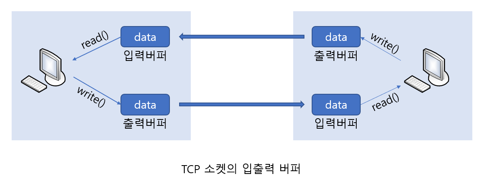
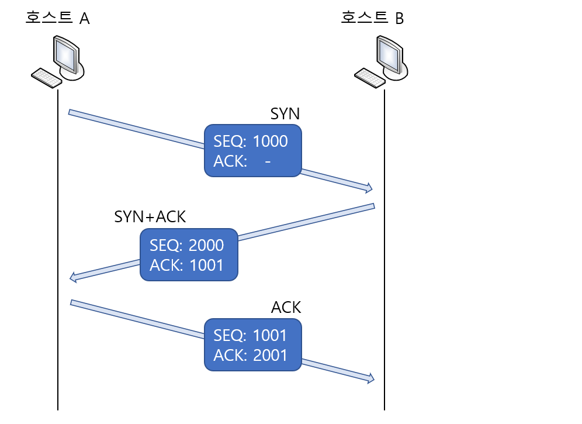
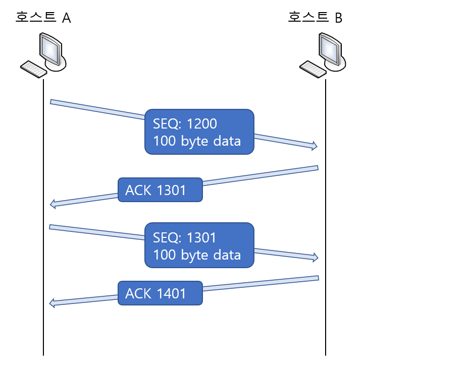
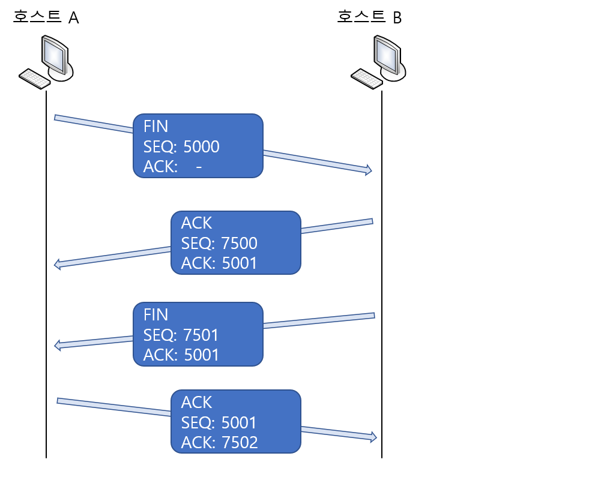

# TCP Flow Control(흐름 제어)

> TCP의 이론적인 부분에 대하여 설명한다.

 

### TCP 소켓에 존재하는 입출력 버퍼

TCP 소켓의 데이터 송수신에는 경계다 없다. 따라서 서버가 한번의 write 함수호출을 통해서 40바이트를 전송해도 클라이언트는 네 번의 read 함수호출을 통해서 10바이트씩 데이터를 수신하는것이 가능하다. 그런데 여기서 read 함수로 10바이트만 수신했다면 나머지 30바이트는 어디 있는걸까?

사실 write 함수가 호출되는 순간이 데이터가 전송되는 순간이 아니고, read 함수가 호출되는 순간이 데이터가 수신되는 순간이 아니다. 정확히 말하면 write 함수가 호출되는 순간 데이터는 출력버퍼로 이동하고, read 함수가 호출되는 순간 입력버퍼에 저장된 데이터를 읽어 들이게 된다.

위 그림에 보이듯이 write 함수가 호출되면 출력버퍼라는 곳에 데이터가 전달되어서 상황에 맞게 적절히 데이터를 상대방의 입력버퍼로 전송한다. 그러면 상대방은 read 함수호출을 통해서 입려버퍼에 저장된 데이터를 읽게 되는 것이다. 특징을 정리하면 다음과 같다.

* 입출력 버퍼는 TCP 소켓 각각에 대해 별도로 존재한다.
* 입출력 버퍼는 소켓생성시 자동으로 생성된다.
* 소켓을 닫아도 출력버퍼에 남아있는 데이터는 계속해서 전송이 이뤄진다.
* 소켓을 닫으면 입력버퍼에 남아있는 데이터는 소멸된다.

 

 

### TCP의 내부 동작원리: 상대 소켓과의 연결

TCP 소켓의 생성에서 소멸의 과정까지 거치게 되는 일을 크게 나누면, 다음 세가지로 구분할 수 있다.

1. 상대 소켓과의 연결
2. 상대 소켓과의 데이터 송수신
3. 상대 소켓과의 연결종료

그럼 먼저 상대 소켓과의 연결이 어떻게 이뤄지는 설명하겠다. TCP 소켓은 연결설정 과정에서 총 세 번의 대화를 주고 받는다. 그래서 이를 가리켜 Three-way handshaking 이라 한다. 그럼 연결설정 과정에서 주고받는 메시지의 형태를 다음 그림을 통해서 알아보자.

소켓은 전 이중(Full-duplex) 방식으로 동작하므로 양방향으로 데이터를 주고받을 수 있다. 따라서 데이터 송수신에 앞서 준비과정이 필요하다. 먼저 연결요청을 하는 호스트 A가 호스트 B에게 다음 메시지를 전달한다.

**[SYN] SEQ: 1000, ACK: -**

이는 SEQ가 1000, ACK는 비어있음을 뜻하는데, 여기서 SEQ 1000이 의미하는 바는 다음과 같다.

"내가 지금 보내는 이 패킷에 1000이라는 번호를 부여하니 잘 받았다면 다음에는 1001번 패킷을 전달하라고 내게 말해달라!"

이는 처음 연결요청에 사용되는 메시지이기 때문에 이 메시지를 가리켜 SYN이라 한다. 이는 데이터 송수신에 앞서 전송되는 `동기화 메시지` 라는 의미를 담고 있다. 이어서 호스트 B가 호스트 A에게 다음 메시지를 전달한다.

**[SYN+ACK] SEQ: 2000, ACK: 1001**

이는 SEQ가 2000, ACK가 1001임을 뜻하는데, 여기서 SEQ 2000이 의미하는 바는 다음과 같다.

"내가 지금 보내는 이 패킷에 2000이라는 번호를 부여하니, 잘 받았다면 다음에는 2001번 패킷을 전달하라고 내게 말해달라!"

그리고 ACK 1001이 의미하는 바는 다음과 같다.

"좀 전에 전송한 SEQ가 1000인 패킷은 잘 받았으니, 다음 번에는 SEQ가 1001인 패킷을 전송하기 바란다!"

이렇듯 데이터의 송수신에 앞서, 송수신에 사용되는 패킷에 번호를 부여하고, 이 번호정보를 상대방에게 알림으로서 손실된 데이터의 확인 및 재전송이 가능한 것이고, 때문에 TCP는 손실 없는 데이터의 전송을 보장한다.

 

 

### TCP의 내부 동작원리2: 상대 소켓과의 데이터 송수신

처음 진행한 Three-way handshaking을 통해서 데이터의 송수신 준비가 끝났으니, 이제 본격적으로 데이터를 송수신할 차례가 되었다. 데이터 송수신의 기본방식은 다음과 같다.

위 그림은 호스트 A가 호스트 B에게 200바이트를 두 번에 나눠서(두 개의 패킷에 나눠서) 전송하는 과정을 보인 것이다. 먼저 호스트 A가 100바이트의 데이터를 하나의 패킷에 실어 전송하였는데, 패킷의 SEQ를 1200으로 부여하고 있다. 때문에 호스트 B는 이를 근거로 패킷이 제대로 수신되었음을 알려야 하기에, ACK 1301 메시지를 담은 패킷을 호스트 A에게 전송한다.

이 때 다음의 공식에 따라 ACK를 전달함으로서 패킷에 손실이 있었는지 알 수 있다.

**ACK 번호 → SEQ 번호 + 전송된 바이트 크기 + 1**

마지막에 1을 더한 이유는 Three-way handshaking에서도 보였듯이, 다음 번에 전달될 SEQ의 번호를 알리기 위함이다.

만약 중간에 패킷이 소멸되면 어떻게 될까? 호스트 A에서 패킷을 보냈는데 일정시간이 지나도 ACK 메시지를 받지 못하면 재전송을 시작한다. 이렇듯 데이터의 손실에 대한 재전송을 위해서, TCP 소켓은 ACK 응답을 요구하는 패킷 전송 시에 타이머를 동작시킨다. 그리고 해당 타이머가 Time-out 되었을 때 패킷을 재전송한다.

 

 

### TCP의 내부 동작원리3: 상대 소켓과의 연결종료

TCP 소켓은 연결종료도 그냥 진행하지 않는다. 상대방이 전송할 데이터가 남아있을 때 문제가 되기 때문에 상호간에 연결종료의 합의과정을 거치게 된다. 다음 연결종료 과정에서 주고받는 메시지를 그림으로 나타낸것이다.

먼저 소켓 A가 종료 메시지를 소켓 B에게 전달하고, 소켓 B는 해당 매시지의 수신을 소켓 A에게 알린다. 그리고 이어서 소켓 B가 종료 메시지를 소켓 A에게 전달하고, 소켓 A는 해당 메시지의 수신을 소켓 B에게 알리며 종료의 과정을 마치게 된다.

위 그림에서 패킷 안에 삽입되어 있는 FIN은 종료를 알리는 메시지를 뜻한다. 즉, 상호간에 FIN 메시지를 한번씩 주고 받고서 연결이 종료되는데, 이 과정이 네 단계에 걸쳐서 진행되기 때문에 이를 가리켜 Four-way handshaking이라고 부른다.