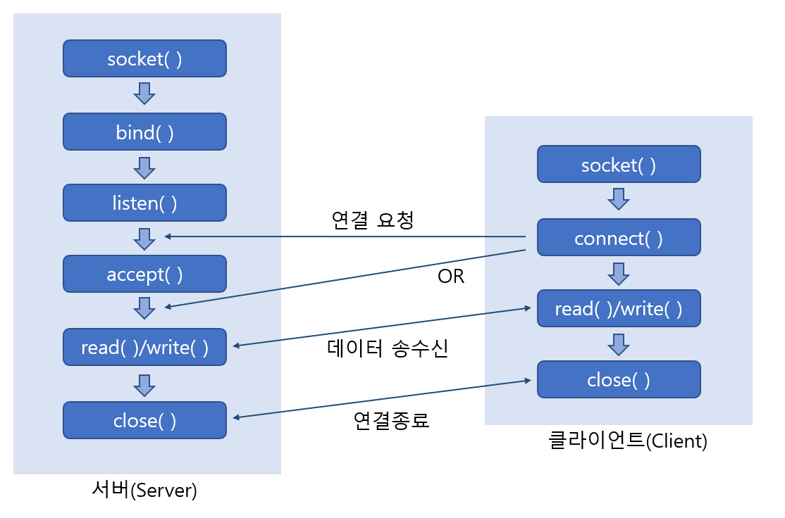

# TCP Server,Client Structure

> TCP 기반의 서버, 클라이언트 동작 방식을 확인한다.

<br>

### TCP 서버에서의 기본적인 함수호출 순서

아래 그림은 TCP 서버구현을 위한 기본적인 함수의 호출순서를 보이고 있다. 대부분의 TCP 서버 프로그램은 이 순서로 구현이 된다.


가장 먼저 socket 함수의 호출을 통해서 소켓을 생성한다. 그리고 주소정보를 담기 위한 구조체 변수를 선언 및 초기화해서 bind 함수를 호출하여 소켓에 주소를 할당한다. 이 두 단계는 이미 다른 게시글에 있으니 이 다음 과정을 설명하겠다.

<br>

<br>

### 연결요청 대기상태로의 진입

bind 함수호출을 통해서 소켓에 주소까지 할당했다면, 이번에는 listen 함수호출을 통해서 `연결요청 대기상태`로 들어갈 차례이다. 그리고 listen 함수가 호출되어야 연결요청을 할 수 있는 상태가 된다.

---

```c
#include <sys/socket.h>

int listen(int sock, int backlog);
> 성공 시 0, 실패 시 -1 반환
```

* **sock -** 연결요청 대기상태에 두고자 하는 소켓을 파일 디스크립터 전달, 이 함수의 인자로 전달된 디스크립터의 소켓이 서버 소켓(리스닝 소켓)이 된다.
* **backlog -** 연결요청 대기 큐의 크기정보 전달, 5가 전달되면 큐의 크기가 5가 되어 클라이언트의 연결요청을 5개까지 대기시킬 수 있다.

---

listen 함수의 첫 번째 인자로 전달된 파일 디스크립터의 소켓의 용도를 알아보자. 클라이언트의 연결요청도 인터넷을 통해서 흘러 들어오는 일종의 데이터 전송이기 때문에, 이것을 받아들이려면 당연히 소켓이 하나 있어야 한다. 서버 소켓의 역할이 바로 이것이다. 즉, 연결요청을 맞이하는, 일종의 문지기 또는 문의 역할을 한다고 볼 수 있다. 

listen 함수가 호출되면, 이렇듯 문지기의 역할을 하는 서버 소켓이 만들어지고, listen 함수의 두 번째 인자로 전달되는 정수의 크기에 해당하는 대기실이 만들어진다. 이 대기실을 가리켜 `연결요청 대기 큐`라 하며, 서버 소켓과 연결요청 대기 큐가 완전히 준비되어서 클라이언트의 연결요청을 받아들일 수 있는 상태를 가리켜 `연결요청 대기상태` 라 한다.

<br>

<br>

### 클라이언트의 연결요청 수락

listen 함수호출 이후에 클라이언트의 연결요청이 들어왔다면, 들어온 순서대로 연결요청을 수학해야 한다. 연결요청을 수락한다는 것은 클라이언트와 데이터를 주고받을 수 있는 상태가 됨을 의미한다. 따라서 이러한 상태가 되기 위해 소켓을 하나 더 만들어야 한다. 하지만 직접 소켓을 만들 필요는 없다. 다음 함수의 호출결과로 소켓이 만들어지고, 이 소켓은 연결요청을 한 클라이언트 소켓과 자동으로 연결된다.

---

```c
#include <sys/socket.h>

int accept(int sock, struct sockaddr *addr, socklen_t *addrlen);
> 성공 시 생성된 소켓의 파일 디스크립터, 실패 시 -1 반환
```

* **sock -** 서버 소켓의 파일 디스크립터 전달
* **addr -** 연결요청 한 클라이언트의 주소정보를 담을 변수의 주소 값 전달, 함수호출이 완료되면 인자로 전달된 주소의 변수에는 클라이언트의 주소정보가 채워진다.
* **addrlen -** 두 번째 매개변수 addr에 전달된 주소의 변수 크기를 바이트 단위로 전달, 단 크기정보를 변수에 저장한 다음에 변수의 주소 값을 전달한다. 그리고 함수호출이 완료되면 크기정보로 채워져 있던 변수에는 클라이언트의 주소정보 길이가 바이트 단위로 계산되어 채워진다.

---

accept 함수는 `연결요청 대기 큐`에서 대기중인 클라이언트의 연결요청을 수락하는 기능의 함수이다. 따라서 accept 함수는 호출성공 시 내부적으로 데이터 입출력에 사용할 소켓을 생성하고, 그 소켓의 파일 디스크립터를 반환한다. 중요한 점은 소켓이 자동 생성되어, 연결요청을 한 클라이언트 소켓에 연결까지 이뤄진다는 점이다. 

<br>

<br>

### TCP 클라이언트의 기본적인 함수호출 순서

클라이언트의 구현과정은 서버에 비해 매우 간단하다. `소켓의 생성`, 그리고 `연결요청`이 전부이기 때문이다.


서버의 구현과정과 비교해서 차이가 있는 부분은 `연결요청`이라는 과정이다. 이는 클라이언트 소켓을 생성한 후에 서버로 연결을 요청하는 과정이다. 서버는 listen 함수를 호출한 이후부터 연결요청 대기 큐를 만들어 놓는다. 따라서 그 이후부터 클라이언트는 연결요청을 할 수 있다. 그러면 클라이언트는 다음 함수를 통해 연결요청을 할 수 있다.

---

```c
#include <sys/socket.h>

int connect(int sock, struct sockaddr *servaddr, socklen_t addrlen);
> 성공 시 0, 실패 시 -1 반환
```

* **sock -** 클라이언트 소켓의 파일 디스크립터 전달.
* **servaddr -** 연결요청 할 서버의 주소정보를 담은 변수의 주소 값 전달.
* **addrlen -** 두 번째 매개변수 servaddr에 전달된 주소의 변수 크기를 바이트 단위로 전달.

---

클라이언트에 의해서 connect 함수가 호출되면 다음 둘 중 한가지 상황이 되어야 함수가 반환된다(함수호출이 완료된다.)

* 서버에 의해 연결요청이 접수되었다.
* 네트워크 단절 등 오류상황이 발생해서 연결요청이 중단되었다.

여기서 주의할 사실은 위에서 말하는 `연결요청의 접수`는 서버의 accept 함수호출을 의미하는 것이 아니라는 점이다. 이는 클라이언트의 연결요청 정보가 서버의 연결요청 대기 큐에 등록된 상황을 의미하는 것이다. 때문에 connect 함수가 반환했더라도 당장에 서비스가 이뤄지지 않을 수도 있음을 기억해야 한다.

<br>

<br>

### TCP기반 서버,클라이언트의 함수호출 관계

지금까지 TCP 서버, TCP 클라이언트 프로그램의 구현순서를 설명했는데, 사실 이 둘은 서로 독립된 과정이 아니기 때문에 하나의 과정으로 머리 속에 그릴 수 있어야 한다. 그래서 이 두 과정을 하나의 그림으로 정리했다.



