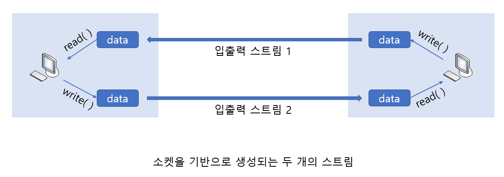

# TCP base Half-close

> TCP 입출력 스트림의 일부만 종료하는 Half-close에 대해 알아본다.

<br>

TCP에서는 연결과정보다 중요한 것이 종료과정이다. 연결과정에서는 큰 변수가 발생하지 않지만 종료과정에서는 예상치 못한 일이 발생할 수 있기 때문이다. 따라서 종료과정은 명확해야 한다.

<br>

### 일방적인 연결종료의 문제점

리눅스의 close 함수호출과 윈도우의 closesocket 함수호출은 완전종료를 의미한다. 완전종료라는 것은 데이터를 전송하는 것은 물론이고 수신하는 것 조차 더 이상 불가능한 상황을 의미한다. 때문에 한쪽에서의 일방적인 close, closesocket 함수호출은 경우에 따라 치명적일 수 있다.

때문에 데이터 송수신에 사용되는 스트림의 일부만 종료(Half-close) 하는 방법이 제공되고 있다. 일부를 종료한다는 것은 전송은 가능하지만 수신은 불가능한 상황, 혹은 수신은 가능하지만 전송은 불가능한 상황을 뜻한다.

<br>

<br>

### 소켓과 스트림(Stream)

소켓을 통해서 두 호스트가 연결되면, 그 다음부터는 상호간에 데이터의 송수신이 가능한 상태가 된다. 그리고 바로 이러한 상태를 가리켜 `스트림이 형성된 상태`라 한다. 즉, 두 소켓이 연결되어서 데이터의 송수신이 가능한 상태를 일종의 스트림으로 보는 것이다.

소켓의 스트림은 한쪽 방향으로만 데이터의 이동이 가능하기 때문에 양방향 통신을 위해서는 다음 그림에서 보이듯이 두 개의 스트림이 필요하다.



그림에서 보이듯 한 호스트의 입력 스트림은 다른 호스트의 출력 스트림으로 이어지고, 한 호스트의 출력 스트림은 다른 호스트의 입력 스트림으로 이어진다. 그리고 이번 포스팅에서 하고자 하는것은 한번에 이 두 스트림을 모두 끊어버리는 것이 아니라, 이 중 하나의 스트림만 끊은 것이다. 물론 close, closesocket 함수는 두 가지 스트림을 동시에 끊어버리기 때문에 사용하지 않는다.

<br>

<br>

### Half-close를 위한 shutdown 함수

다음 shutdown 함수가 스트림의 일부를 종료하는데 사용되는 함수이다.

```c
#include <sys/socket.h>

int shutdown(int sock, int howto);
> 성공 시 0, 실패 시 -1 반환
```

* **sock -** 종료할 소켓의 파일 디스크립터 전달.
* **howto -** 종료방법에 대한 정보 전달.

위의 함수호출 시 두 번째 매개변수에 전달되는 인자에 따라서 종료의 방법이 결정된다. 두 번째 매개변수에 전달될 수 있는 인자의 종류는 다음과 같다.

* **SHUT_RD -** 입력 스트림 종료
* **SHUT_WR -** 출력 스트림 종료
* **SHUT_RDWR -** 입출력 스트림 종료

shutdown 함수의 두 번째 인자로 SHUT_RD가 전달되면 입력 스트림이 종료되어 더 이상 데이터를 수신할 수 없는 상태가 된다. 데이터가 입력버퍼에 전달되더라도 그냥 지워져 버릴 뿐만 아니라 입력 관련 함수의 호출도 더 이상은 허용이 안 된다. 반면 SHUT_WR가 두 번째 인자로 전달되면 출력 스트림이 종료되어 더 이상의 데이터 전송이 불가능해진다. 단, 출력버퍼에 아직 전송되지 못한 상태로 남아있는 데이터가 존재하면 해당 데이터는 목적지로 전송된다. 마지막으로 SHUT_RDWR가 전달되면 입력 스트림과 출력 스트림이 모두 종료된다.

<br>

<br>

#### 윈도우 기반의 함수

```C
#include <winsock2.h>

int shutdown(SOCKET sock, int howto);
> 성공 시 0, 실패 시 SOCKET_ERROR 반환
```

* **sock -** 종료할 소켓의 핸들
* **howto -** 종료방법에 대한 정보 전달

위 함수의 두 번째 매개변수에 전달되는 인자와 그 의미는 다음과 같다.

* **SD_RECEIVE -** 입력 스트림 종료
* **SD_SEND -** 출력 스트림 종료
* **SD_BOTH -** 입출력 스트림 종료

