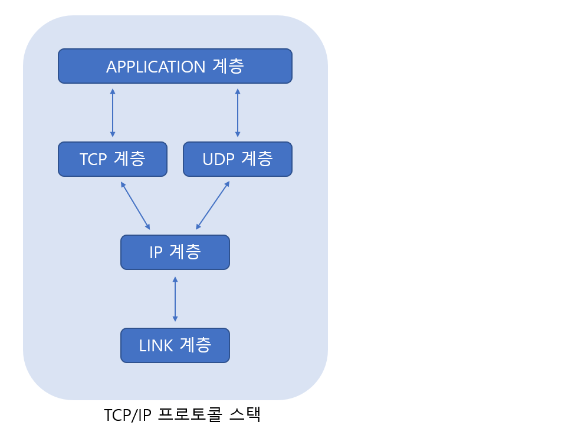

# TCP/IP Protocol

> TCP 소켓의 정확한 이해를 위해 컨트롤의 방법과 범위에 대해 살펴보자.

 

### TCP/IP 프로토콜 스택

TCP를 이야기하기에 앞서 TCP가 속해있는 "TCP/IP 프로토콜 스택"을 먼저 설명하고자 한다. 

위 그림을 통해서 TCP/IP 스택이 총 네 개의 계층으로 나뉨을 알 수 있는데, 이는 데이터 송수신의 과정을 네 개의 영역으로 계층화했다는 의미로 받아들일 수 있다. 즉 '인터넷 기반의 효율적인 데이터 전송'이라는 커다란 하나의 문제를 하나의 덩치 큰 프로토콜 설계로 해결한 것이 아니라, 그 문제를 작게 나눠서 계층화하려는 노력이 시도되었고, 그 결과로 탄생한 것이 `TCP/IP 프로토콜 스택`인 것이다. 

 

 

### LINK 계층

Link 계층은 물리적인 영역의 표준화에 대한 결과이다. 이는 가장 기본이 되는 영역으로 LAN, WAN, MAN과 같은 네트워크 표준과 관련된 프로토콜을 정의하는 영역이다. 

 

 

### IP 계층

복잡하게 연결되어 있는 인터넷을 통한 데이터의 전송을 위해 경로를 선택해주는게 IP 계층이다. 이 계층에서 사용하는 프로토콜이 **IP(Internet Protocol)**이다.

IP자체는 비 연결지향적이며 신뢰할 수 없는 프로토콜이다. 데이터를 전송할 때마다 거쳐야 할 경로를 선택해 주지만, 그 경로는 일정치 않다. 특히 데이터 전송 도중에 경로상에 문제가 발생하면 다른 경로를 선택해 주는데, 이 과정에서 데이터가 손실되거나 오류가 발생하는 등의 문제가 발생한다고 해서 이를 해결해주지 않는다. 즉, 오류발생에 대한 대비가 되어있지 않은 프로토콜이 IP이다.

 

 

### TCP/UDP 계층

TCP와 UDP 계층은 IP계층에서 알려준 경로정보를 바탕으로 데이터의 실제 송수신을 담당한다. 때문에 이 계층을 가리켜 **전송(Transport) 계층**이라 한다.

TCP는 신뢰성 있는 데이터의 전송을 담당한다. 그런데 TCP가 데이터를 보낼 때 기반이 되는 프로토콜이 IP이다. IP는 오로지 하나의 데이터 패킷(데이터 전송의 기본단위)이 전송되는 고정에만 중심을 두고 설계되었다. 따라서 여러 개의 데이터 패킷을 전송한다 하더라도 각각의 패킷이 전송되는 과정은 IP에 의해서 진행되므로 전송의 순서는 물론 전송 그 자체를 신뢰할 수 없다. 

여기서 TCP 프로토콜이 추가되어 데이터를 송수신하면 데이터를 주고받는 과정에서 서로 데이터의 주고받음을 확인해주고, 분실된 데이터에 대해서 재전송해주는 역할을 한다.

결론적으로 말하면 IP의 상위계층에서 호스트 대 호스트의 데이터 송수신 방식을 약속하는 것이 TCP, UDP이며, TCP는 확인절차를 걸쳐서 신뢰성 없는 IP에 신뢰성을 부여한 프로토콜이라 할 수 있다.

 

 

### APPLICATION 계층

지금까지 설명한 내용은 소켓을 생성하면 데이터 송수신과정에서 자동으로 처리되는 것들이다. 데이터의 전송경로를 확인하는 과정이라든가 데이터 수신에 대한 응답의 과정이 소켓이라는 것 하나에 감춰져 있기 때문이다.

최종적으로 소켓이라는 도구가 주어졌고, 이 도구를 이용해서 무엇인가를 만들면 된다. 이렇게 무엇인가를 만드는 과정에서 프로그램의 성격에 따라 클라이언트와 서버간의 데이터 송수신에 대한 약속(규칙)들이 정해지기 마련인데, 이를 가리켜 APPLICATION 프로토콜이라 한다. 그리고 대부분의 네트워크 프로그래밍은 APPLICATION 프로토콜의 설계 및 구현이 상당부분을 차지한다.