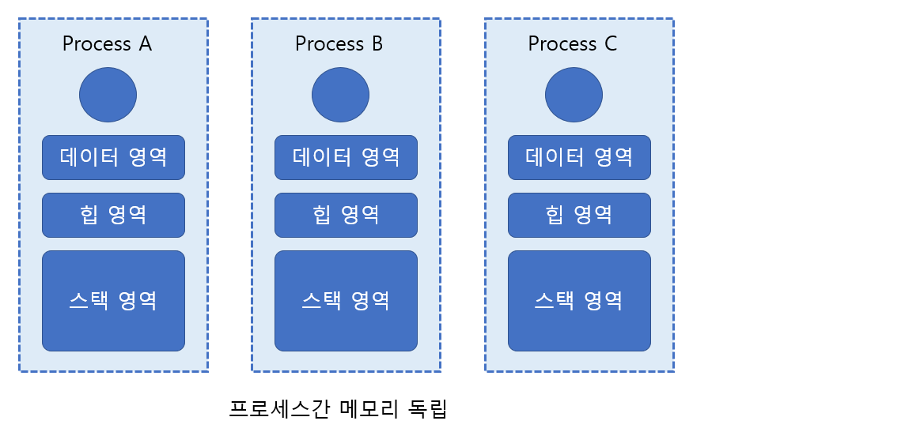
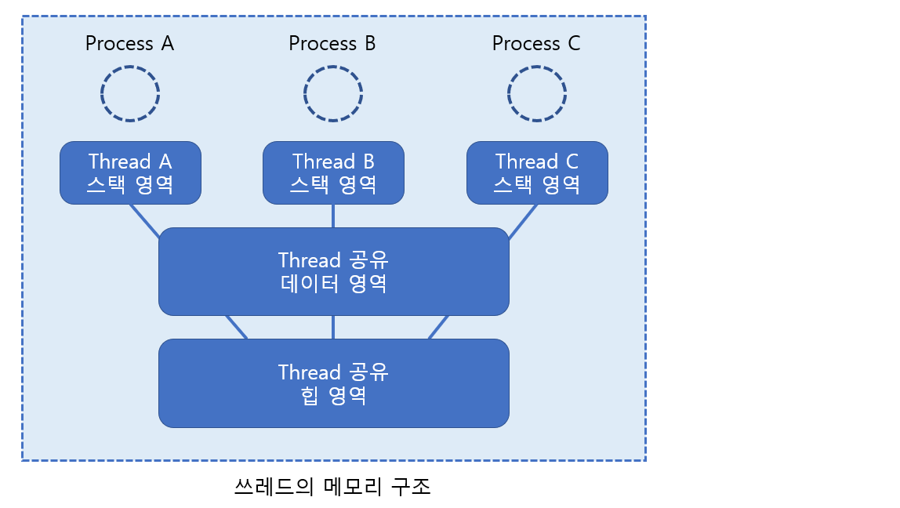
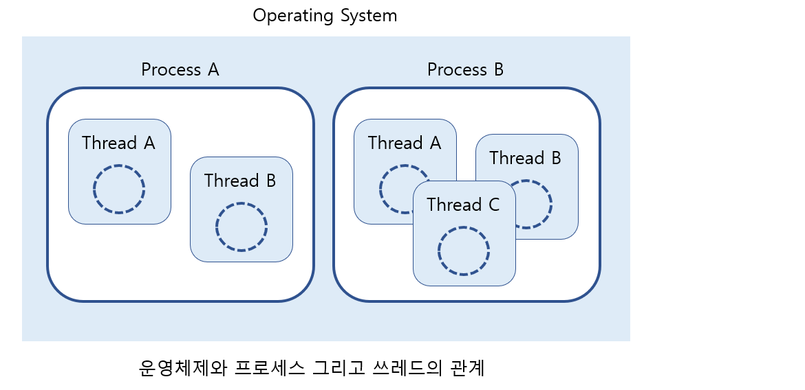

# Thread Definition

> 쓰레드의 등장 배경과 원리를 알아본다.

 

### 쓰레드의 이론적 이해

쓰레드의 등장 배경과 프로세스와의 차이점등을 알아보자.

 

#### 쓰레드의 등장배경

멀티 프로세스 기반의 서버는 일단 프로세스의 생성이라는(복사라는) 작업자체가 운영체제 차원에서 상당히 부담되는 작업이다. 뿐만 아니라 프로세스마다 완전히 독립된 메모리 공간을 유지하기 때문에 프로세스 사이에서 메시지를 주고받아야 하는 경우에는 그만큼 구현의 어려움을 겪기도 한다. 즉, 멀티 프로세스 기반의 단점은 다음과 같다. 

* 프로세스 생성이라는 부담스러운 작업과정을 거친다.
* 두 프로세스 사이에서의 데이터 교환을 위해서는 별도의 IPC 기법을 적용해야 한다.

하지만 이 둘은 다음의 단점에 비하면 그나마 봐줄만 하다.

**"초당 적게는 수십 번에서 많게는 수천 번까지 일어나는 '컨텍스트 스위칭(Context Switching)'에 따른 부담은 프로세스 생성방식의 가장 큰 부담이다."**

여기서 `컨텍스트 스위칭`이란 다음과 같다. 프로그램의 실행을 위해서는 해당 프로세스의 정보가 메인 메모리에 올라와야 한다. 때문에 현재 실행중인 A 프로세스의 뒤를 이어서 B 프로세스를 실행시키려면 A 프로세스 관련 데이터를 메인 메모리에서 내리고 B 프로세스 관련 데이터를 메인 메모리로 이동시켜야 한다. 이것이 바로 컨텍스트 스위칭이다.

결국 멀티프로세스의 특징을 유지하면서 단점을 어느 정도 극복하기 위해서 `쓰레드(Thread)`라는 것이 등장하였는데, 이는 멀티프로세스의 여러 가지 단점을 최소화하기 위해서, 설계된 일종의 `경량화 된 프로세스`이다. 쓰레드는 프로세스와 비교해서 다음의 장점을 지닌다.

* 쓰레드의 생성 및 컨텍스트 스위칭은 프로세스의 생성 및 컨텍스트 스위칭보다 빠르다.
* 쓰레드 사이에서의 데이터 교환에는 특별한 기법이 필요치 않다.

 

#### 쓰레드와 프로세스의 차이점

프로세스의 메모리 구조는 전역변수가 할당되는 `데이터 영역`, malloc 함수 등에 의해 동적 할당이 이뤄지는 `힙(Hip)` 그리고 함수의 실행에 사용되는 `스택(Stack)`으로 이뤄진다. 그런데 프로세스들은 이를 완전히 별도로 유지한다. 때문에 프로세스 사이에서는 다음의 메모리 구조를 보인다.

그런데 둘 이상의 실행흐름을 갖는 것이 목적이라면, 위 그림처럼 완전히 메모리 구조를 분리시킬 것이 아니라, 스택 영역만을 분리시킴으로써 다음의 장점을 얻을 수 있다.

* 컨텍스트 스위칭 시 데이터 영역과 힙은 올리고 내릴 필요가 없다.
* 데이터 영역과 힘을 이용해서 데이터를 교환할 수 있다.

그래서 등장한 것이 쓰레드이며, 지금 설명한 것처럼 모든 쓰레드는 별도의 실행흐름을 유지하기 위해서 스택 영역만 독립적으로 유지하기 때문에 다음의 메모리 구조를 보인다.

위 그림에서 보이듯이 데이터 영역과 힘 영역을 공유하는 구조로 쓰레드는 설계되어 있다. 그리고 이를 위해서 쓰레드는 프로세스 내에서 생성 및 실행되는 구조로 완성되었다. 즉, 프로세스와 쓰레드는 다음과 같이 정의할 수 있다.

* **프로세스 -** 운영체제 관점에서 별도의 실행흐름을 구성하는 단위
* **쓰레드 -** 프로세스 관점에서 별도의 실행흐름을 구성하는 단위

즉, 프로세스가 하나의 운영체제 안에서 둘 이상의 실행흐름을 형성하기 위한 도구라면, 쓰레드는 하나의 프로세스 내에서 둘 이상의 실행흐름을 형성하기 위한 도구로 이해할 수 있다. 때문에 운영체제와 프로세스, 그리고 쓰레드의 관계는 다음과 같이 표현 가능하다.

