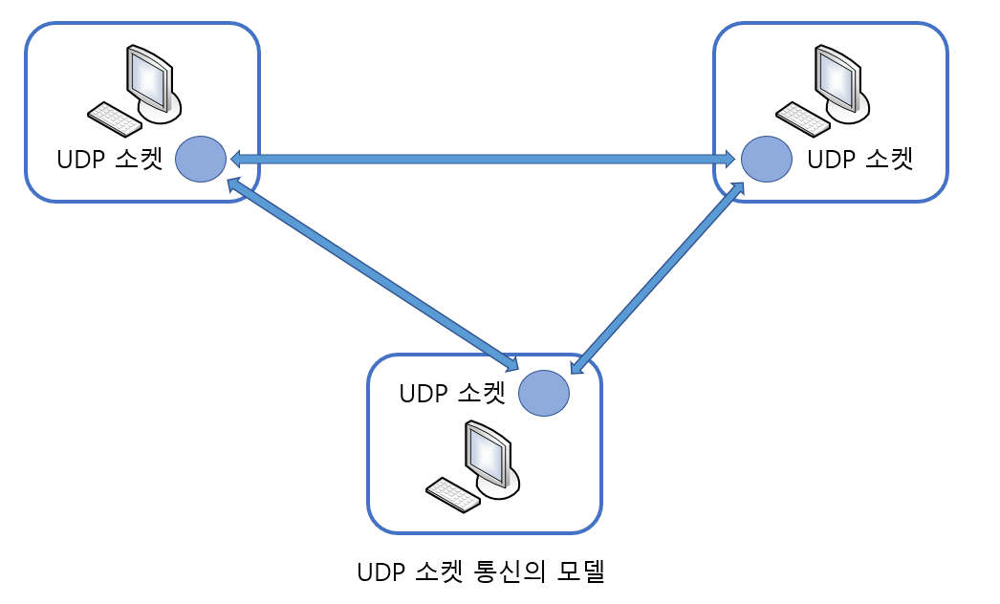

# UDP Server,Client

> UDP 기반 서버/클라이언트 구현에 대해 알아본다.

<br>

### UDP에서 서버와 클라이언트의 연결

UDP 서버, 클라이언트는 TCP와 같이 연결된 상태로 데이터를 송수신하지 않는다. 때문에 TCP와 달리 연결 설정의 과정이 필요 없다. 따라서 TCP 서버 구현과정에서 거쳤던 listen 함수와 accept 함수의 호출은 불필요하다. UDP 소켓의 생성과 데이터의 송수신 과정만 존재할 뿐이다.

<br>

<br>

### UDP의 서버, 클라이언트 소켓

TCP와 달리 UDP는 서버건 클라이언트건 하나의 소켓만 있으면 된다. UDP 소켓이 하나 있다면 어디든 데이터를 전송할 수 있다. 



위 그림에서는 하나의 UDP 소켓으로 두 곳의 호스트를 대상으로 데이터의 송수신이 가능함을 보이고 있다. 이렇듯 UDP 소켓은 하나만 있으면 둘 이상의 호스트와의 통신이 가능하다.

<br>

<br>

### UDP 기반의 데이터 입출력 함수

UDP 소켓은 TCP와 달리 연결상태를 유지하지 않으므로 데이터를 전송할 때마다 반드시 목적지의 주소정보를 별도로 추가해야 한다. 주소정보를 써 넣으면서 데이터를 전송할 때 호출하는 UDP 관련함수는 다음과 같다.

---

```c
#include <sys/socket.h>

ssize_t sendto(int sock, void *buff, size_t nbytes, int flags,struct sockaddr *to, socklen_t addrlen);
> 성공 시 전송된 바이트 수, 실패 시 -1 반환
```

* **sock -** 데이터 전송에 사용될 UDP 소켓의 파일 디스크립터를 인자로 전달.
* **buff -** 전송할 데이터를 저장하고 있는 버퍼의 주소 값 전달.
* **nbytes -** 전송할 데이터 크기를 바이트 단위로 전달.
* **flags -** 옵션 지정에 사용되는 매개변수, 지정할 옵션이 없다면 0 전달.
* **to -** 목적지 주소정보를 담고 있는 sockaddr 구조체 변수의 주소 값 전달.
* **addrlen -** 매개변수 to로 전달된 주소 값의 구조체 변수 크기 전달.

---

위 함수가 TCP 기반의 출력함수와 가장 비교되는 것은 목적지 주소정보를 요구하고 있다는 점이다. 그리고 만약에 sendto 함수호출 시까지 소켓에 주소정보가 할당되지 않았다면, sendto 함수가 처음 호출되는 시점에 해당 소켓에 IP와 PORT번호가 자동으로 할당된다.

그럼 이어서 UDP 데이터 수신에 사용되는 함수를 소개하겠다. UDP 데이터는 발신자가 일정치 않기 때문에 발신지의 정보를 얻을 수 있도록 함수가 정의되어 있다.

---

```c
#include <sys/socket.h>

ssize_t recvfrom(int sock, void *buff, size_t nbytes, int flags, struct sockaddr *from, socklen_t *addrlen);
> 성공 시 수신한 바이트 수, 실패 시 -1 반환
```

* **sock -** 데이터 수신에 사용될 UDP 소켓의 파일 디스크립터를 인자로 전달.
* **buff -** 데이터 수신에 사용될 버퍼의 주소 값 전달.
* **nbytes -** 수신할 최대 바이트 수 전달, 때문에 매개변수 buff가 가리키는 버퍼의 크기를 넘을 수 없다.
* **flags -** 옵션 지정에 사용되는 매개변수, 지정할 옵션이 없다면 0 전달.
* **from -** 발신지 정보를 채워 넣을 sockaddr 구조체 변수의 주소 값 전달.
* **addrlen -** 매개변수 from 으로 전달된 주소에 해당하는 구조체 변수의 크기정보를 담고 있는 변수의 주소값 전달.

---

<br>

<br>

### connected, unconnected UDP 소켓

TCP 소켓에는 데이터를 전송할 목적지의 IP와 PORT번호를 등록하는 반면, UDP 소켓에는 데이터를 전송할 목적지의 IP와 PORT 번호를 등록하지 않는다. 때문에 sendto 함수호출을 통한 데이터의 전송 과정은 다음과 같이 세 단계로 나눌 수 있다.

1. UDP 소켓에 목적지의 IP와 PORT번호 등록
2. 데이터 전송
3. UDP 소켓에 등록된 목적지 정보 삭제

즉, sendto 함수가 호출될 때마다 위의 과정을 반복하게 된다. 이렇게 목적지 정보가 등록되어 있지 않은 소켓을 가리켜 `unconnected 소켓`이라 하고, 반면 목적지 정보가 등록되어 있는 소켓을 가리켜 `connected 소켓`이라 한다. UDP 소켓은 기본적으로 unconnected 소켓이지만 다음과 같은 상황에서는 매우 불합리하게 동작한다.

"IP 211.210.147.82, PORT 82번으로 준비된 총 세 개의 데이터를 세 번의 sendto 함수호출을 통해서 전송한다."

이 경우 위에서 정리한 데이터 전송 세 단계를 총 3회 반복해야 한다. 그래서 하나의 호스트와 오랜 시간 데이터를 송수신해야 한다면, UDP 소켓을 connected 소켓으로 만드는 것이 효율적이다.

<br>

#### connected UDP 소켓 생성

connected UDP 소켓을 생성하는 방법은 UDP 소켓을 대상으로 connect 함수만 호출해주면 된다.

```c
sock = socket(PF_INET, SOCK_DGRAM, 0);
memset(&adr, 0, sizeof(adr));
adr.sin_family = AF_INET;
adr.sin_addr.s_add= ....
adr.sin_port = ....
connect(sock, (struct sockaddr*)&adr, sizeof(adr));
```

이렇게 connect 호출을 해주면 TCP 소켓과 마찬가지로 sendto 함수가 호출될 때마다 데이터 전송의 과정만 거치게 된다. 뿐만 아니라 write, read함수의 호출도 가능해진다.