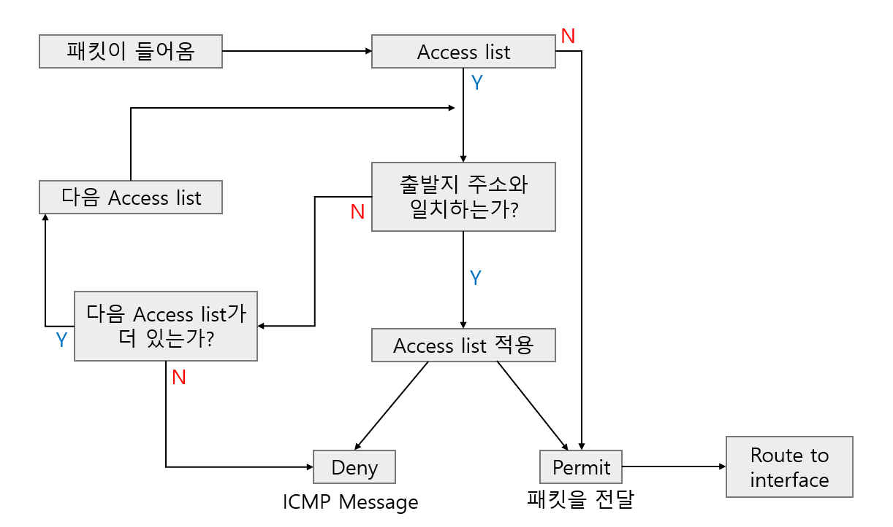
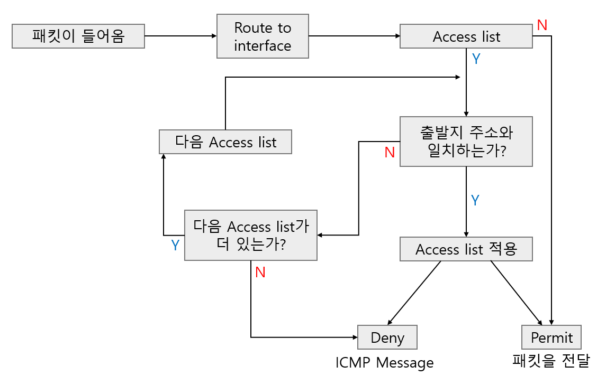
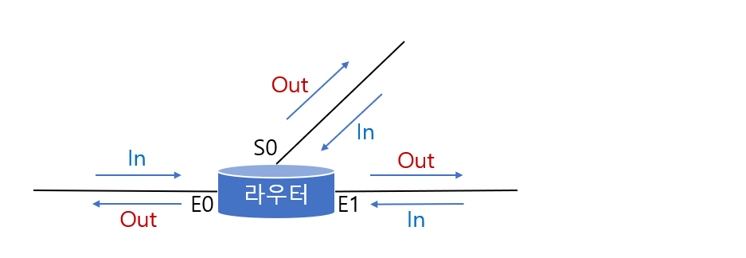
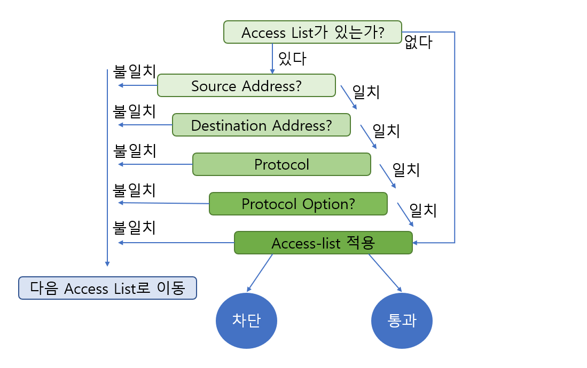

# Access List

> 라우터에서 네트워크 접근을 관리해주는 Access List에 대해 알아본다.

<br>

액세스 리스트는 한마디로 말해서 네트워크에 액세스, 즉 접근을 허용하냐를 미리 정해놓은 리스트라고 생각하면 된다. 

이러한 액세스 리스트는 주로 보안을 위해서 사용되고 있다. 물론 라우터에서 세팅하므로 라우터가 볼 수 있는 한계, 즉 네트워크 계층까지만 관리가 된다. 하지만 최근에는 어플리케이션 계층까지 관리하는 기능도 나오기 때문에 꼭 네트워크 계층까지만이라고 단정할 수는 없다. 

액세스 리스트는 크게 두 가지라고 볼 수 있는데 첫 번째가 **스탠다드 액세스 리스트(Standard Access List)**, 말 그대로 일반적인, 단순한 액세스 리스트다.

두 번째는 **익스텐디드 액세스 리스트(Extended Access List)**인데, 이것은 조금 복잡한 액세스 리스트이다. 그리고 다이내믹 액세스 리스트라고 또 하나가 있는데 이것은 자주 쓰이지 않으므로 스탠다드와 익스텐디드만 알아보도록 하자.

<br>

### 액세스 리스트의 규칙

본격적으로 스탠다드, 익스텐디드 액세스 리스트에 대해 알아보기 전에 액세스 리스트에서 잊어버리면 안되는 가장 중요한 규칙 4개를 알아보자.

1. **액세스 리스트는 윗줄부터 하나씩 차례로 수행된다.**
   * 만약 액세스 리스트 4개가 있다면 맨 윗줄이 수행되고 그 다음 줄로 내려온다는 것이다.
2. **액세스 리스트의 맨 마지막 line에 "permit any"를 넣지 않을 경우는 default로, 어느 액세스 리스트도 match되지 않은 나머지 모든 address는 deny된다.**
   * 즉 액세스 리스트는 맨 마지막 줄에 항상 모든 것을 막아버리는 deny all이 들어있다고 생각하면 된다. 따라서 만약 어떤 액세스 리스트의 항목에도 해당하지 않는 주소가 있다면 그 주소는 맨 마지막 줄까지 내려온 다음 deny all에 걸려서 모두 막힌다.
3. **액세스 리스트의 새로운 line은 항상 맨 마지막으로 추가되므로 access-list line의 선택적 추가(selective add)나 제거(remove)가 불가능하다.**
4. **interface에 대한 액세스 리스트의 정의(define)가 되어 있지 않은 경우(즉 interface에 access-group 명령이 들어있지 않은 경우) 결과는 permit any가 된다.**
   * 즉 액세스 리스트가 정의되어 있지 않은 인터페이스는 액세스 리스트를 거치지 않고 바로 통과 되기 때문에 당연히 permit all이 된다.

<br>

<br>

### Standard Access List

스탠다드 액세스 리스트의 가장 큰 특징은 출입 통제를 할 때 출발지 주소만을 참고한다는 것이다. 즉 스탠다느 액세스 리스트는 출발지 주소만을 가지고 제어를 한다.



위 그림은 라우터 인터페이스의 Inbound쪽에 액세스 리스트가 설정되었을 때를 보여준다. 나중에 나오겠지만 액세스 리스트는 인터페이스의 IN과 OUT으로 구성될 수 있는데, 여기서는 IN에 걸었을 경우이다.



위 사진은 반대로 라우터 인터페이스의 Outbount쪽에 액세스 리스트가 설정되었을 때를 보여준다.

명령어의 형식은 다음과 같다.

```
Router(config)# access-list access-list-number {permit | deny} {source [source-wildcard] | any}
```

일단 명령어의 처음 부분을 보면 일반 구성 모드(Router(config)&#35;)에서 내리는 명령이라는 것을 알 수 있다.

형식은 맨 앞에 access-list라고 쓰고, 그 다음에 액세스 리스트 번호를 넣어준다. 이 때 번호는 1에서 99사이의 숫자를 사용한다.(액세스 리스트에 따라서 access-list 번호가 정해져 있다.)

그 다음이 통과시킬 것인가 말 것인가를 결정하는 permit과 deny 결정이다.

그 뒤에는 출발지 주소 또는 출발지 네트워크를 넣는다. 그리고 그 뒤는 와일드카드 마스크가 따라 나온다. 여기서 출발지 주소 뒤에 오는 와일드카드 마스크는 생략이 가능하지만 만약 생략한다면 0.0.0.0으로 들어간다.

출발지 주소를 적지 않고 any라고 하면 모든 주소가 포함된다.

이렇게 액세스 리스트 명령을 입력하고 나면 이제 이 액세스 리스트를 어떤 인터페이스에 적용할까를 결정해야 한다. 

```
Router(config-if)# ip access-group access-list-number {in | out}
```

위의 명령은 각 인터페이스에 내리는 명령이다. 따라서 프롬프트가 인터페잇 구성 모드임을 알 수 있다. 

뒤에 나오는 access-list-number은 앞에서 액세스 리스트에 부여했던 번호와 동일한 번호를 써 줌으로써 액세스 리스트 명령을 인터페이스에 연결해 주는 기능을 한다.

마지막에 나오는 in,out은 액세스 리스트를 인터페이스의 들어오는 쪽(in)에 부여할 것인가, 나오는 쪽(out)에 부여할 것인가를 결정한다. 만약 값을 생략한다면 자동으로 out이 된다. in, out은 실제 적용에 혼동하는 경우가 많은데 다음 그림을 보면 쉽게 이해가 될 것이다.



<br>

<br>

### Extended Access List

익스텐디드 액세스 리스트는 출발지만 확인했던 스탠다드 액세스 리스트와는 달리 출발지,목적지,프로토콜,프로토콜 옵션등 다양한 조건을 다 확인한다.

---

스탠다드 액세스 리스트와의 차이점을 알아보도록 하자

* 스탠다드 액세스 리스트는 출발지 주소만을 제어하는 반면, 익스텐디드 액세스 리스트는 출발지 주소와 목적지 주소 모두를 제어할 수 있다.
* 스탠다드 액세스 리스트는 전체 TCP/IP 에 대한 제어만을 하는 반면, 익스텐디드 액세스 리스트는 ip, tcp, udp, icmp등 특정 프로토콜을 지정해서 제어할 수 있다.
* 스탠다드 액세스 리스트는 1에서 99까지의 숫자를 Access-list번호로 사용하고, 익스텐디드 액세스 리스트는 100에서 199까지의 숫자를 사용한다.

---

이번에는 익스텐디드 액세스 리스트가 어떻게 작동하는지 그림을 통해서 알아보도록 하자.



익스텐디드 명령어 형식은 다음과 같다.

```
Router(config)# access-list access-list-number {permit | deny}
protocol source source-wildcard [operator port]
destination destination-wildcard [operator port] [established] [log]
```

위에서와 같이 우선 액세스 리스트를 정의한다. 먼저 액세스 리스트의 정의는 일반 구성 모드에서 구성하고, 명령어 형식 역시 조금 복잡해지긴 했지만 비슷하다.

또 하나의 명령어는 인터페이스에 적용하는 명령어이다.

```
Router(config-if)# ip access-group access-list-number {in | out}
```

이 명령어는 스탠다드 액세스 리스트와 동일하다.

```
access-list 101 permit ip 0.0.0.0 255.255.255.255 0.0.0.0 255.255.255.255
```

는 access-list 101 permit ip any any와 같은 의미이다. 즉, 0.0.0.0 255.255.255.255는 any로 바꾸어서 사용할 수 있다.

또 하나 알아두어야 할 것은 `established`이다. Established 옵션은 TCP 데이터그램이 ACK나 RST bit이 set되어 들어오는 경우에만 match가 발생하게 된다. 예를 들어

```
access-list 104 permit tcp any 128.88.0.0 0.0.255.255 established
```

라는 액세스 리스트가 주어졌다면 어느 source 주소에서든지 ACK나 RST bit이 set되어 있는 경우 128.88.0.0 network와 connection이 가능함을 의미한다.  그러나 이 경우 ACK나 RST는 먼저 connection을 맺을 수는 없고, 다만 128.88.0.0 쪽에서 먼저 connection을 설정하려고 할 때 reply가 가능하도록 하는 것이다.

즉 이 명령은 128.88.0.0 네트워크에 있는 호스트들은 밖으로 나갈 수 있고, 밖에서는 128.88.0.0 네트워크로 들어올 수 없게 하는 기능을 제공한다.