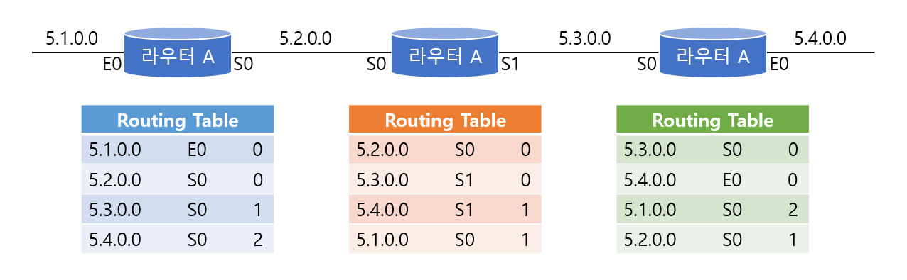
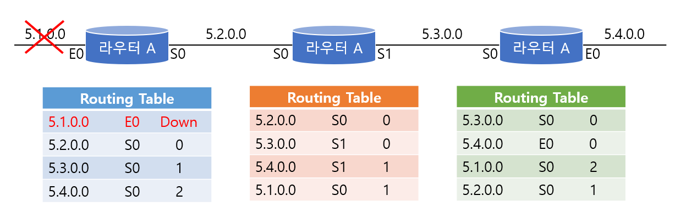
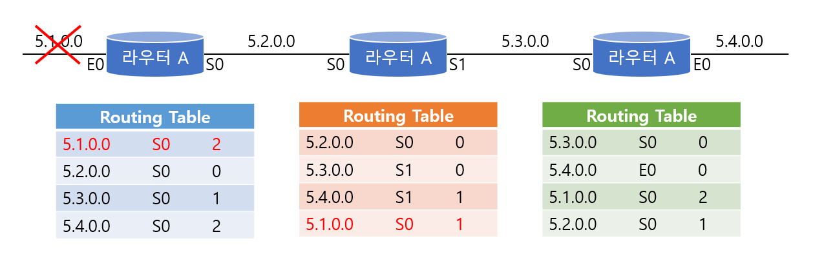
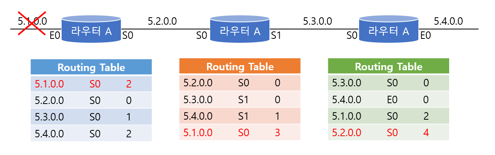
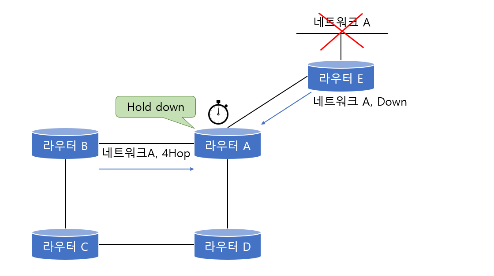
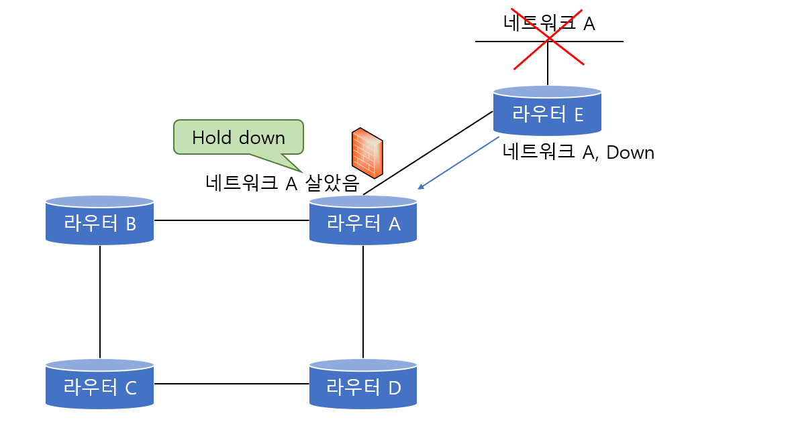
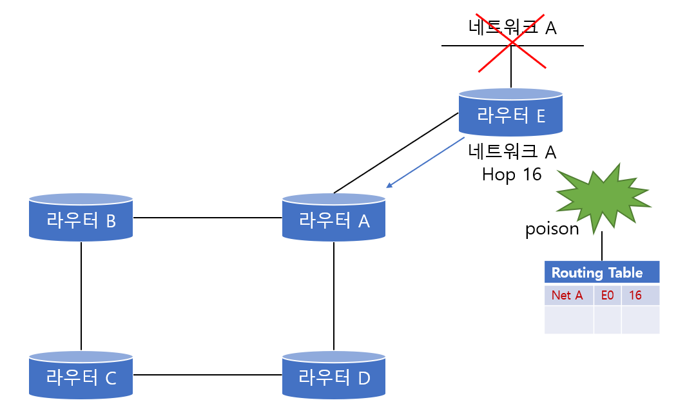
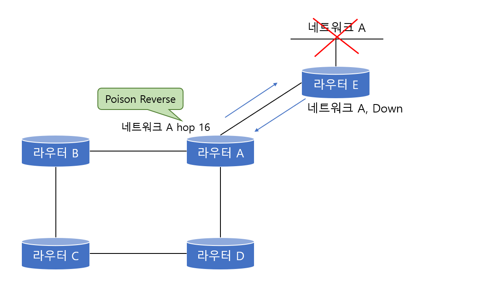

# Distance Vector Algorithm

> 거리와 방향만을 위주로 만들어진 Distance Vector 알고리즘에 대해 알아본다.

 

### 개념

디스턴스 벡터 알고리즘은 말 그대로 **디스턴스(Distance : 거리)**와 **벡터(Vector : 방향)**만을 위주로 만들어진 라우팅 알고리즘이다. 따라서 라우터는 목적지까지의 모든 경로를 자신의 라우팅 테이블 안에 저장하는 것이 아니라 목적지까지의 거리(홉 카운트 등)와 그 목적지 까지 가려면 어떤 인접 라우터(Neighbor Router)를 거쳐서 가야 하는(방향)만을 저장한다.

따라서 인접 라우터들과 주기적(RIP의 경우 30초)으로 라우팅 테이블을 교환해서 자신의 정보에 변화가 생기지 않았는지를 확인하고 관리한다.

디스턴스 벡터 알고리즘은 밑에 서술할 단점들로 인해 커다란 네트워크에는 적용하지 않고 다만 작은 규모의 네트워크에 적용할 겨우엔 구성의 편리와 메모리의 절약 등의 장점을 살릴수 있다. 대표적인 디스턴스 벡터 알고리즘에는 RIP, IGRP가 있다.

 

 

### 장점

한 라우터가 모든 라우팅 정보를 가지고 있을 필요가 없기 때문에 라우팅 테이블을 줄일 수 있어서 메모리를 절약하고, 또 라우팅의 구성 자체가 간단하며, 여러 곳에서 푲ㄴ으로 사용되고 있다.

 

 

### 문제점

디스턴스 벡터의 문제점으로 가장 먼저 떠오르는 것은 '시간'이다. 즉 한 번 배운 라우팅 테이블을 계속 전달하기 때문에 업데이트가 모든 네트워크에 전달되는 시간이 많이 걸린다. 따라서 이것 때문에 루핑이 발생할 수 있다.

다음 예시를 통해 어떻게 루핑이 생기는지 확인해보자

위 그림은 각 라우터별로 현재 가지고 있는 라우팅 테이블을 보여주고 있다(물론 실제 라우팅 테이블과는 다르다). 맨 앞에 있는 것이 목적지 네트워크이고, 그 다음은 어디를 통해서 갈 것인가를 알려주는 테이블이다. 그리고 맨 마지막이 홉 카운트 정보이다.

위 상태에선 모든 라우팅 테이블이 정상적이다. 이때 라우터 A에 연결되어있는 5.1.0.0 네트워크에 문제가 발생했다. 즉, 5.1.0.0 네트워크가 다운되었다.

 

라우터 A는 즉시 자신의 라우팅 테이블에 5.1.0.0이 다운이라고 업데이트 한다. 하지만 아직 업데이트 주기가 되지 않았기 떄문에 라우터 B나 라우터C 는 이 정보를 알지 못한다. 이때 라우터 B가 라우팅 테이블을 업데이트 했다.

B의 업데이트 정보에는 위 그림에서 보는것처럼 5.1.0.0 네트워크 정보도 들어 있다. 네트워크 5.1.0.0에 대한 라우팅 정보를 라우터 B로부터 받은 라우터 A는 5.1.0.0 네트워크를 라우터 B를 통해서 갈 수 있다고 생각하고 자신의 라우팅 테이블을 변경한다. 즉 5.1.0.0 네트워크는 라우터 B로 갈 수 있는데 홉 카운트는 2라고 생각하는것이다.

이번에는 라우터 B가 라우터 A로부터 온 네트워크 5.1.0.0에 대한 정보를 보니 홉 카운트가 2로 바뀌어진 것을 알았다. 어차피 라우터 B는 라우터 A를 거쳐서 5.1.0.0 네트워크를 가야 하기 때문에 자신의 홉 카운트를 3으로 바꾸게 된다. 그렇게 되니 라우터 C는 5.1.0.0 네트워크에 대한 자신의 홉 카운트를 4로 바꾸는 것이다.

이런 식으로 라우팅 테이블은 계속 루핑을 돌기 시작하는데 결국 죽어있는 네트워크로 향하는 데이터들은 뱅글뱅글 돌기만 할 뿐 목적지에 도착하지 못하기 때문에 네트워크에 엄청난 트래픽이 발생할 뿐 아니라 라우팅 테이블이 꼬이게 되서 제대로 된 라우팅을 수행할 수 없게 된다.

따라서 이런 문제를 방지하기 위한 대책이 필요한데 이 대책에 대해서 한번 알아보도록 하자.

 

 

### 해결 방법

#### Maximum Hop Count

RIP 라우팅 프로토콜의 경우는 `최대 홉 카운트를 15`로 규정하고 15를 넘어가는 라우팅 경로에 대해서는 `unreachable`로 간주한다. 그리고 `flush time`이 지난 후에는 라우팅 테이블에서 아예 삭제해 버린다. 이렇게 최대 홉 카운트를 정해두면 라우팅의 루핑이 발생하더라도 16까지 이르게 도면 멈출 수 있다.

그러나 RIP의 이러한 최대 홉 카운트 제한은 15홉을 넘어서는 경로에 대해서는 아예 도달할 수 없기 떄문에 네트워크 규모가 커질수록 약점이 드러나게 된다.

 

#### Hold down Timer

위 그림에서 라우터 E에 붙어있는 네트워크 A가 다운되었다고 가정해보겠다. 라우터 E는 네트워크 A가 다운되었다는걸 라우터 A에게 알린다. 그러면 라우터 A는 네트워크 A에 대한 **Hold down** 타이머를 시작한다. 만약 이때 라우터 B가 라우팅 테이블을 업데이트하면서 라우터 A에게 네트워크 A를 자신을 통해서 갈 수 있는데 홉 카운트 4라고 보고한다면 라우터 A는 이 정보를 무시한다.

즉, **Hold down** 타이머가 동작하고 있는 동안에는 외부에서 해당 네트워크에 대한 라우팅 경로 정보를 받았을 때 원레 가지고 있던 메트릭 값 보다 큰 값이 들어오면 무조건 무시하고 Hold down 카운터가 종료되거나 목적지에 대한 새로운 경로가 지금 가지고 있던 매트릭과 같거나 좋은 경로가 들어올 때만 이웃 라우터로부터의 업데이트를 받아 들인다.

 

#### Split Horizon

스플릿 호라이즌은 한마디로 말하면 **라우팅 정보가 들어온 곳으로는 같은 정보를 내보낼 수 없다**는 것이다. 즉 위 그림에서 라우터 A는 네크워크 A에 대한 정보를 이미 라우터 E에서 받았기 때문에 네트워크 A에 대한 정보를 다시 라우터 E쪽으로는 내보낼 수 없다는 것이다. 이러한 스플릿 호라이즌이 뜻하는 바는 만약에 하나의 라우터가 어느 네트워크 정보를 인접한 라우터에게서 받았다면 그 인접한 라우터가 그 네트워크에 더 가까이 있을 것이 분명하며 이러한 정보를 다른 라우터들로부터 더 이상 받을 필요가 없다는 것이다.

여기서 라우터 A가 모든 라우팅 업데이트를 라우터 E쪽으로 보내지 않는 것은 아니다. 다만 네트워크 A에 대한 라우팅 정보만을 보내는 않는 것이다. 또 하나 알아야 할 점은 **스플릿 호라이즌은 두 라우터 간의 루핑만을 막기 위해서 만들어진 기술**이라는 것이다. 따라서 전체 라우터 네트워크의 루핑을 스플릿 호라이즌을 가지고 막는것은 힘들다.

 

#### Route Poisoning

위 그림을 보면 네트워크 A가 다운되자 라우터가 네트워크 A에 대한 메트릭 값을 16으로 바꾸었다. 즉 사용할 수 없는 값으로 만들어 버린 것이다. 그 대신 라우팅 테이블에서 지워버리지는 않는다.

이때 라우터 A에서 네트워크 A에 대한 업데이트 정보가 들어와도 라우터 E는 그것을 무시한다. 그리고 나서 라우터 E는 네트워크 A에 대한 메트릭 값을 16으로 해서 내보낸다. 따라서 라우터 A는 이제부터 네트워크 A에 대한 메트릭을 16으로 갖게 된다. 

이런 식으로 다운된 네트워크를 먼저 무한대로치로 바꾸어 버리는 방식이 바로 라우트 포이즈닝이라고 생각하면 된다. 이렇게 되면 라우팅 테이블에서 지웠다가 잘못된 라우팅 정보를 받는 일을 미리 막을 수 있는 효과가 있다.

 

#### Poison Reverse

포이즌 리버스는 스플릿 호라이즌을 약간 변형했다고 생각하면 이해가 쉽다. 이 방식은 스플릿 호라이즌처럼 라우팅 정보를 보내온 쪽으로 알려주지 않는 것이 아니라 라우팅 정보를 되돌려 보내기는 하되 이 값을 무한대 값으로 쓰는 방식이다.

홉 개수가 무한대라는 뜻은 앞서 다루었듯이 경로가 사용할 수 없다는 것이라서 라우터는 이 경로에 대한 라우팅 업데이트를 무시하는 것이 된다. 따라서 경로의 정보를 아주 없애는 것보다 무한대 홉 값을 포함해서 라우팅 업데이트를 실시한다면 다른 모든 라우터들은 실수로 잘못된 정보를 사용하는 경우를 현저하게 줄일 수 있다.