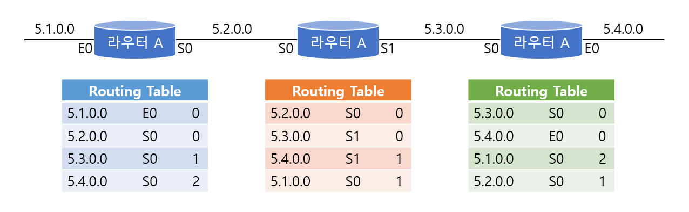
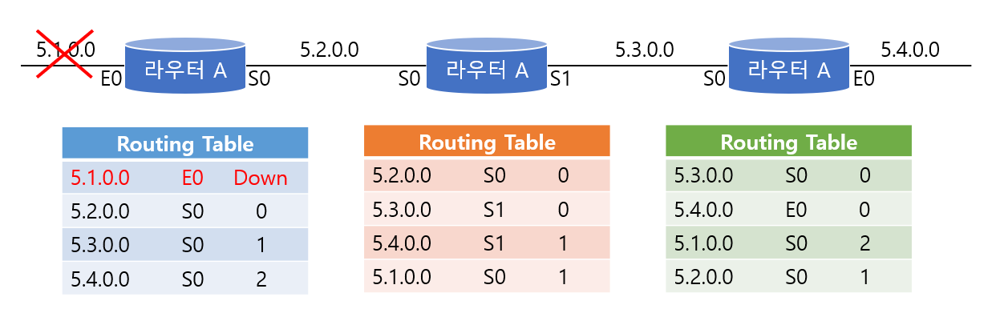
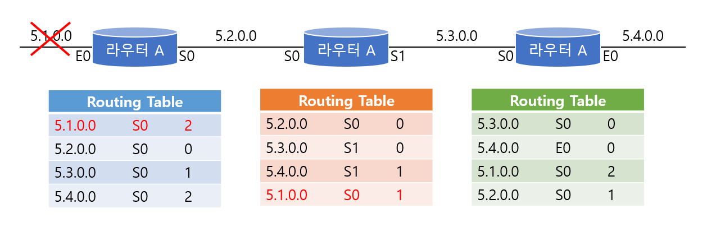
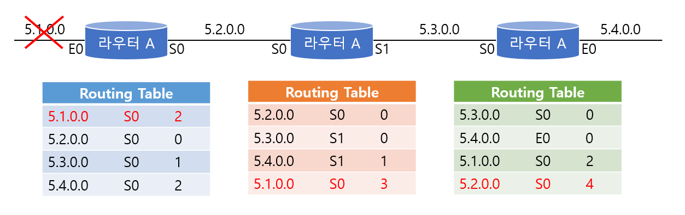
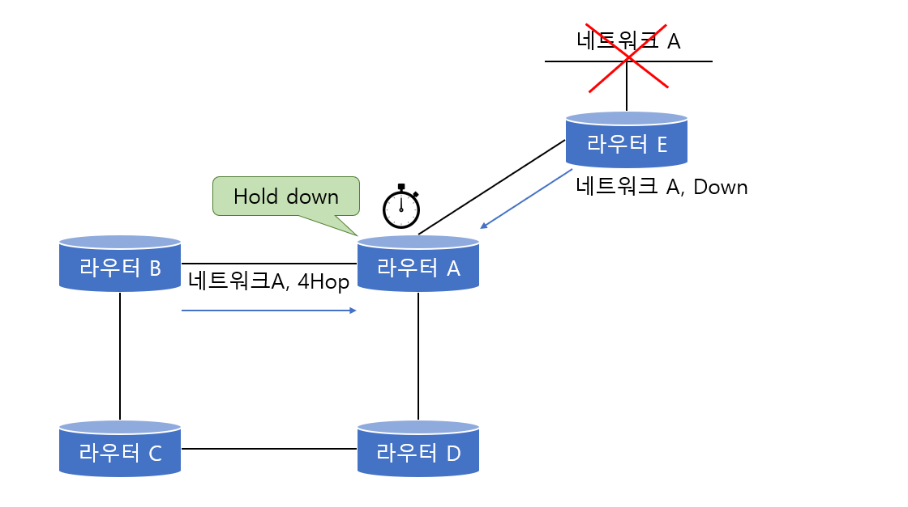

# Distance Vector Algorithm

> 거리와 방향만을 위주로 만들어진 Distance Vector 알고리즘에 대해 알아본다.

 

### 문제점

디스턴스 벡터의 문제점으로 가장 먼저 떠오르는 것은 '시간'이다. 즉 한 번 배운 라우팅 테이블을 계속 전달하기 때문에 업데이트가 모든 네트워크에 전달되는 시간이 많이 걸린다. 따라서 이것 때문에 루핑이 발생할 수 있다.

다음 예시를 통해 어떻게 루핑이 생기는지 확인해보자

위 그림은 각 라우터별로 현재 가지고 있는 라우팅 테이블을 보여주고 있다(물론 실제 라우팅 테이블과는 다르다). 맨 앞에 있는 것이 목적지 네트워크이고, 그 다음은 어디를 통해서 갈 것인가를 알려주는 테이블이다. 그리고 맨 마지막이 홉 카운트 정보이다.

위 상태에선 모든 라우팅 테이블이 정상적이다. 이때 라우터 A에 연결되어있는 5.1.0.0 네트워크에 문제가 발생했다. 즉, 5.1.0.0 네트워크가 다운되었다.

 

라우터 A는 즉시 자신의 라우팅 테이블에 5.1.0.0이 다운이라고 업데이트 한다. 하지만 아직 업데이트 주기가 되지 않았기 떄문에 라우터 B나 라우터C 는 이 정보를 알지 못한다. 이때 라우터 B가 라우팅 테이블을 업데이트 했다.

B의 업데이트 정보에는 위 그림에서 보는것처럼 5.1.0.0 네트워크 정보도 들어 있다. 네트워크 5.1.0.0에 대한 라우팅 정보를 라우터 B로부터 받은 라우터 A는 5.1.0.0 네트워크를 라우터 B를 통해서 갈 수 있다고 생각하고 자신의 라우팅 테이블을 변경한다. 즉 5.1.0.0 네트워크는 라우터 B로 갈 수 있는데 홉 카운트는 2라고 생각하는것이다.

이번에는 라우터 B가 라우터 A로부터 온 네트워크 5.1.0.0에 대한 정보를 보니 홉 카운트가 2로 바뀌어진 것을 알았다. 어차피 라우터 B는 라우터 A를 거쳐서 5.1.0.0 네트워크를 가야 하기 때문에 자신의 홉 카운트를 3으로 바꾸게 된다. 그렇게 되니 라우터 C는 5.1.0.0 네트워크에 대한 자신의 홉 카운트를 4로 바꾸는 것이다.

이런 식으로 라우팅 테이블은 계속 루핑을 돌기 시작하는데 결국 죽어있는 네트워크로 향하는 데이터들은 뱅글뱅글 돌기만 할 뿐 목적지에 도착하지 못하기 때문에 네트워크에 엄청난 트래픽이 발생할 뿐 아니라 라우팅 테이블이 꼬이게 되서 제대로 된 라우팅을 수행할 수 없게 된다.

따라서 이런 문제를 방지하기 위한 대책이 필요한데 이 대책에 대해서 한번 알아보도록 하자.

 

 

### 해결 방법

#### Maximum Hop Count

RIP 라우팅 프로토콜의 경우는 `최대 홉 카운트를 15`로 규정하고 15를 넘어가는 라우팅 경로에 대해서는 `unreachable`로 간주한다. 그리고 `flush time`이 지난 후에는 라우팅 테이블에서 아예 삭제해 버린다. 이렇게 최대 홉 카운트를 정해두면 라우팅의 루핑이 발생하더라도 16까지 이르게 도면 멈출 수 있다.

그러나 RIP의 이러한 최대 홉 카운트 제한은 15홉을 넘어서는 경로에 대해서는 아예 도달할 수 없기 떄문에 네트워크 규모가 커질수록 약점이 드러나게 된다.

 

#### Hold down Timer

