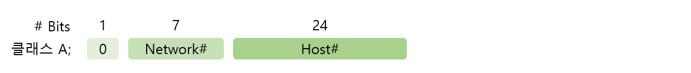

# IP Address

> IP 주소의 개념에 대해 알아본다.

 

### IP 주소의 개념

IP 주소란 `TCP/IP 프로토콜`을 만들 때 이 프로토콜을 사용하는 모든 장비들을 구분해 주기 위해 만들어냈다.

이 IP 주소는 2진수 32자리로 구성되어 있다. 즉,
`0000 0000.0000 0000.0000 0000.0000 0000` 부터
`1111 1111.1111 1111.1111 1111.1111 1111` 까지 있다. 

따라서 지정 가능한 전체 IP 주소의 개수는 약 2의 32승 개밖에 되지 않는다. 

 

### IP 주소의 구분

앞에서 알아본 것처럼 IP 주소는 32자리 2진수로 구성되어 있다. 근데 이 32자리는 `네트워크 부분(Network Part)` 와 `호스트 부분(Host Part)` 로 구분된다. 

여기서 말하는 네트워크란 하나의 `브로드캐스트 영역(Broadcast Domain)` 이라고 생각하면 된다. 즉, 하나의 PC가 데이터를 뿌렸을 때 그 데이터가 라우터를 거치지 않고 바로 받을 수 있는 영역이란 말이다.

그럼 호스트란 그냥 각각의 PC 또는 장비라고 생각하면 된다.

따라서 어떤 네크워크에서든지 "하나의 네트워크" 에서는 네트워크 부분은 모두 같아야 되고 호스트 부분은 모두 달라야 정상적인 통신이 일어난다.

 

### IP주소의 클래스

위에서 IP 주소의 네트워크 부분과 호스트 부분을 이야기 했는데 IP 주소를 보고 네트워크 부분, 호스트 부분을 나누는 방법은 이미 정해져 있는 약속이 있다. 그것이 바로 IP주소의 Class 라는 것이다.

IP주소의 클래스는 A &#126; E로 구분되어 있다. 이 클래스는 바로 네트워크의 크기에 따른 구분이라고 생각하면 된다. 즉, 하나의 네트워크가 호스트의 수를 몇 개까지 가질 수 있는가에 따라서 클래스가 나누어진다.

우리는 여기서 A, B, C만 알고 있으면 된다. 나머지 2개는 멀티캐스트용, 연구용으로 구분된다.

#### 클래스 A

클래스 A는 하나의 네트워크가 가질 수 있는 호스트 수가 가장 많은 클래스이다. 클래스 A는 32개의 이진수 중에서 맨 앞쪽 하나가 항상 0으로 시작되는 것들이다.

* 네트워크 번호가 1 &#126; 126 으로 시작한다.
* 한 네트워크 안에 들어갈 수 있는 호스트 수 16,777,214

 

#### 클래스 B

클래스 B는 맨 앞이 반드시 10(이진수)으로 시작된다. 뒤에는 어떤 숫자가 와도 상관 없다.

* 네트워크 번호가 128.0 &#126; 191.255 로 시작한다.
* 한 네트워크 안에 들어갈 수 있는 호스트 수 65,534

 

#### 클래스 C

클래스 C의 경우는 맨 앞이 110(이진수)으로 시작된다. 뒤에는 어떤 숫자가 와도 상관 없다.

* 네트워크 번호가 192.0.0 &#126; 223.255.255 로 시작한다.
* 한 네트워크 안에 들어갈 수 있는 호스트 수 254

이렇게 클래스를 나누는 이유는 IP 주소를 적절하고 효율적으로 배분하기 위해서다.