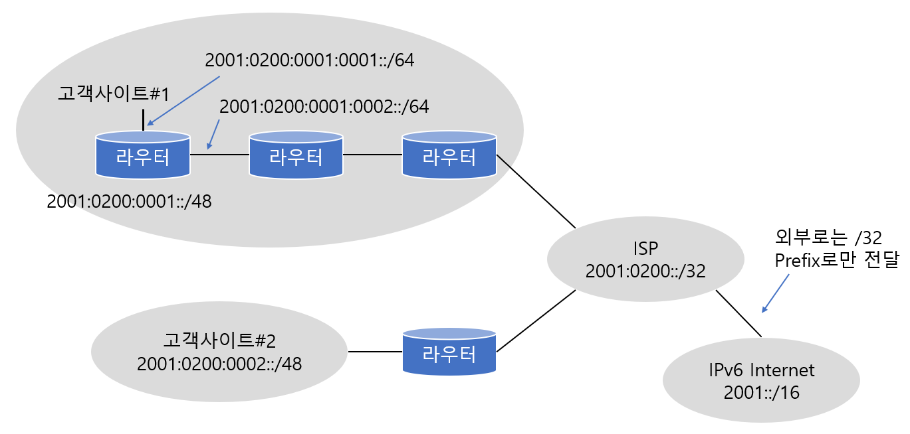

# IPv6

> IPv6의 특징에 대하여 알아본다.

<br>

### 개요

현재 우리가 사용하고 있는 인터넷 주소 방식인 IP version 4는 그 사용자가 기하급수적으로 늘어나고, 또 네트워킹을 사용하는 장비가 늘어나서 포화상태이다. 현재까지 이 문제를 자체적으로 해결하기 위해 IPv4에서는 NAT를 비롯한 다양한 솔루션을 사용했지만, 점점 더 복잡해지는 구성 방법과 End to End 지원이라는 문제가 있는 상태였다.

따라서 기존 IPv4를 대체하면서도 훨씬 더 개선된 새로운 IP 방식이 필요하게 되었는데 그게 바로 IP version 6 이다.

<br>

### IPv6의 특징

#### 주소 범위

IPv4는 32비트 체계였고, 이론상 가능한 주소는 43억 개 정도이다. 하지만 IPv6은 128비트 체계이고, 가능한 주소는 3.4 * 10^36개 정도이다. 따라서 이론적으로 생각했을때 거의 무제한으로 사용 가능하다.

<br>

#### 1. Global Reachability

Global Reachability란 전 세계의 네트워크 어디에서나 주소를 변경하지 않고, 즉 고유의 주소를 가지고 접속이 가능하다는 걸 뜻한다. IPv6의 넓은 주소공간은 점점 늘어나는 네트워크 지원 장비들 모두에게 충분한 IP 주소를 제공해줄 수 있기 때문에 전 세계 어디에 있더라도 한쪽 끝에서 다른 쪽 끝까지 주소 변환 없이 자기 자신이 주소를 가지고 접속 가능한 End-to-End Reachability를 지원한다. 따라서 어플리케이션적인 측면이나 보안적인 측면에서 훨씬 더 효과적이 되었다.

<br>

#### 2. Address Hierarchy

IPv6은 계층화된 주소 배정이 가능하다. 예를 들어 128비트의 IPv6 주소를 가지고 처음 16비트까지는 상용 주소를 구분하고, 17비트부터 23비트까지는 대륙을 구분하고, 23비트부터 32비트까지는 그 대륙에 있는 ISP들을 구분하고, 또 32비트부터 48비트까지는 하나의 사이트, 회사, 학교 같은것을 구분하고, 48비트부터 64비트까지를 이용해서 각 LAN을 구분하는 것이다.

이러한 계층적 관리 기법으로 인해 효과적인 주소 배치가 가능하고 여러 개의 네트워크를 하나의 네트워크로 묶어 트래픽을 줄일 수 있다.

<br>

#### 3. Aggregation

앞에서 설명한 계층적인 주소 배정이 가능해짐에 따라 여러 개의 네트워크 주소를 묶어주는게 가능해졌다. 



고객사이트#1을 보자

고객사이트#1에는 두 개의 네트워크가 있다고 가정한다. 하나는 2001:0200:0001:0001::/64 이고 또 하나는 2001:0200:0001:0002::/64 이다.

두 개의 주소를 보면 앞에서부터 3번째 콜론까진 똑같고 4번째 묶음이 0001, 0002로 다르다. 즉 서로 다른 2개의 네트워크가 있다.

하지만 이 두 개의 네트워크가 밖으로 나갈 땐 하나로 묶어서 내보낼 수 있다는 것이다. 즉 2001:0200:0001::/48로 보낼 수 있다.

뒤에 붙는 /64나 /48같은 수는 바로 IPv4에서의 서브넷 마스크 비트랑 비슷하다. 즉 /48이란 맨 앞에서 48비트까지가 같은 네트워크라는 뜻이다. 

다시 그림을 보면 고객사이트#2 역시 같은 개념으로 묶을 수 있는 것을 알 수 있다. 2001:0200으로 시작하는 네트워크를 다 모아주면 하나의 네트워크가 되는 것이다. 그림에 있는 ISP가 바로 그런 네트워크다.

이 개념이 바로 Aggregation이다.

이처럼 Prefix Aggregation(네트워크의 앞부분을 묶는 방식)을 해주는 이유는 경로 정보 여러 개를 하나로 묶어줌으로써 라우팅 테이블을 줄일 수 있고, 이렇게 라우팅 테이블을 줄여 라우터의 메모리 절약은 물론이고 라우팅을 훨씬 더 효과적이고 빠르게 진행할 수 있기 때문이다.

<br>

#### 4. Auto configuration

IPv6의 4번째 특징은 Stateless Auto Configuration이다.

Stateless 란 말을 이해하려면 이와 반대되는 Stateful을 이해해야하는데, 예를 들어 Stateful Auto Configuration 이란 말은 어떤 state를 계속 유지하면서 자동 구성을 지원해준다는 말이다. 예를 들어 DHCP같이 특정 서버에서 테이블을 관리하면서 IP주소를 분배하는 방식을 Stateful Auto Configuration이라고 한다.

그러나 Stateless Auto Configuration은 IPv6에서만 지원하는 기능으로, 이 기능을 이용하면 특정서버가 없어도 호소트의 IP주소를 자동으로 구성해줄 수 있다. 그 방법은 호스트가 만든 64비트 주소와 라우터가 보내주는 64비트 Prefix를 더해서 만들어낸다. 따라서 IPv6부터는 DHCP 서버같이 전용 서버 없이도 그냥 네트어크에 붙이기만 하면 알아서 자동으로 주소를 만들어주는 Plug and Play가 가능해진다.

<br>

#### 5. Multicast

IPv6에서는 브로드캐스트 대신 멀티캐스트가 그 역할을 대신한다. 물론 IPv4에서도 멀티캐스트가 있었지만 IPv6에서의 멀티캐스트는 그 기능이 훨씬 강화되었고 주소 영역도 늘어났다. 특히 IPv6의 멀티캐스트는 4비트의 Scope ID 라는 것을 사용한다. 이 Scope ID라는 것이 바로 멀티캐스트의 전송영역을 지정해줄 수 있게 해주는 역할을 한다. 

<br>

#### 6. Header

6번째 IPv6의 특징은 간단해진 헤더정보이다.

요약해서 말하면 IPv4에 있던 헤더 정보 중 절반을 날려버렸다. IPv4에서는 Source address와 Destination address가 32비트면 됐지만, IPv6에서는 그 4배인 128비트가 되니까 기존 헤더 정보를 그대로 쓸 경우 헤더 정보가 엄청나게 커진다. 따라서 헤더 정보를 효과적으로 줄일 필요가 있었다.

헤더 필드를 없애고 나니 패킷 처리가 훨씬 간단해지고 라우팅 성능도 올릴 수 있게 되었다. 또 모든 필드들이 64비트 단위로 정렬되어 있어 메모리를 읽고 쓰는 게 훨씬 빨라진다는 장점도 있다. 하지만 주소 길이가 기존 32비트에서 128비트로 늘어났기 때문에 주소를 확인하는데 더 많은 시간이 걸릴 수 있고, IPv4의 헤더를 많이 줄였지만 주소 길이로 전체적인 헤더 길이는 2배로 늘어났기 때문에 처리 속도 이슈가 생길수 있다.

<br>

#### 7. Mobility

IPv6의 마지막 특징은 바로 Mobility이다. 

네트워크 Mobility란 장비가 현재의 네트워크 접속이 끊어지지 않고 이동이 가능하도록 해주는 기능이다. IPv4도 Mobile IP를 지원했지만 여러가지 까다로운 옵션이 있었고, 적용 방식 역시 효율적이지 못한 부분이 있었지만 IPv6에선 더 효과적인 방법으로 간편하게 지원이 가능하다.

<br>

<br>

### IPv6의 주소표기

앞에서 간단하게 주소 범위는 언급했었는데 이제 본격적으로 IPv6은 어떻게 표기하는지 알아보도록 하자.

IPv6은 10진수를 썼던 IPv4와 다르게 **16진수**를 사용한다.

IPv6에서 주소는 16진수 네 자리를 쓰고 콜론(:)을 찍고, 또 16진수 네 자리를 쓰고 콜론(:)을 찍고.... 이렇게 16진수로 네 자리를 8번 쓰고 중간에 콜론 7개를 찍어 주소를 표시한다.

```
xxxx:xxxx:xxxx:xxxx:xxxx:xxxx:xxxx:xxxx
```

이런 방식으로 표시한다. 여기서 x는 16진수 한 자리를 뜻한다. 예를 들면 아래와 같다.

```
2001:0DB8:010F:0001:0000:0000:0000:0D0C
```

이때 A&#126;F까지의 알파벳은 문자가 아닌 16진수 숫자이므로, 대소문자의 구분이 없다는 것도 알아두자.

IPv6 주소 표기의 두 번째 규칙은 앞쪽에 오는 `0`은 생략이 가능하다는 점이다. 예를들어

```
2001:0DB8:010F:0001:0000:0000:0000:0D0C
```

라는 주소는

```
2001:DB8:10F:1:0:0:0:D0C
```

로도 쓸 수 있다는 것이다. 

마지막 세 번째 규칙은 `0`이 연속으로 나올 때는 `::`으로 표시할 수 있다. 예를 들어

```
2001:DB8:10F:1:0:0:0:D0C
```

를

```
2001:DB8:10F:1::D0C
```

로 표기할 수 있다는 것이다.

즉, 위에서 보이는 대로 `0`들이 연속으로 나오는 경우는 `::`를 쓸 수 있다. 하지만 이런 방식을 두 번 이상 사용하면 안된다. 

그 이유는 `::`에 `0`이 몇개 생략됐는지 알 수 없기 때문이다 .

<br>

<br>

### IPv6 주소의 종류

IPv6에서 주소 방식은 기존의 브로드캐스트가 사라지고 **유니캐스트, 멀티캐스트, 그리고 애니캐스트**가 있다. 여기서 애니캐스트란 그 그룹 멤버 중 가장 가까이 있는 장비에게 패킷을 보내는 방식이다. 