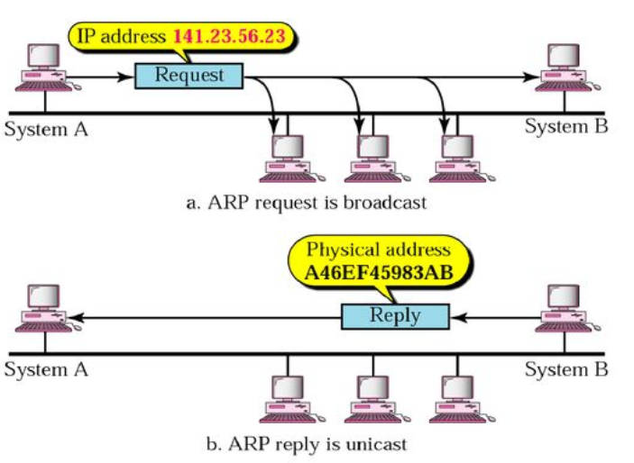

# MAC Address

> 미디어 액세스 컨트롤(Media Access Control)을 알아본다.

<br>

### MAC Address의 사용

MAC Address는 컴퓨터를 네트워크상에서 통신을 할 때 서로 구분지어주는 유일한 주소이다.

여기서 한가지 의문이 생기는데 바로 `IP`에 대해서다. 통신을 위해서 각 장비마다 `IP` 주소가 배정되고 또 그 주소를 가지고 통신을 하는 것 아니냐고 질문할 수 있다. 분명 인터넷은 `TCP/IP` 로 통신을 하고 따라서 통신을 위해서 IP 주소가 사용된다. 단, 이때 `MAC Address`도 같이 사용하게 된다.

IP에 대해서만 알고있다면 IP 주소만 있다면 모든 통신이 일어날 것 같지만 사실은 IP주소를 다시 MAC으로 바꾸는 절차(`ARP`) 가 있다. 다음 그림을 보면 쉽게 이해할 수 있다.



PC A와 B가 통신을 하려고 한다. 

이때 A는 B의 IP주소를 알고 있다. 그럼 A는 자기가 속한 네트워크에 있는 모든 PC에게 "우리 네트워크에 B라는 시스템이 있다면 맥 어드레스를 알려달라" 라고 브로드캐스트 매시지를 보내게 된다.

이때 B는 A와 같은 네트워크에 있기 때문에 A가 보낸 브로드캐스트를 받게 된다. 그럼 B는 A에게 자신의 맥 어드레스를 알려주게 되고 A는 B의 맥 어드레스를 안 다음에 통신을 시작하게 된다.

만약 위 상황에서 B가 다른 네트워크에 있는 경우라면 어떻게 될까? 이 경우는 A가 브로드캐스트 매시지를 보내면 A에 연결되 있는 라우터가 B는 내부 네트워크에 없다는 것을 알고 A에게 라우터 자신의 맥 어드레스를 보내준다.

 따라서 A는 B에게 정보를 보낼 때 맥 어드레스를 라우터의 맥 어드레스로 설정해서 보내게 된다. 그럼 그 정보를 라우터가 받은 다음 B가 살고 있는 해당 네트워크로 전달해준다.

<br>

<br>

### MAC Address 주소 체계

네트워크(이더넷)에 붙는 각 장비들은 `48bit` 의 주소를 갖게 되는데, 이 주소는 랜카드 또는 네트워크 장비에 이미 고정되어 있는 주소이고 유일한(전 세계에서)주소이다. 이 주소를 바로 맥 어드레스, 또는 하드웨어 주소라고 한다.

맥 어드레스는 8자리마다 하이폰(`-`) 이나 콜론(`;`), 점(`.`)으로 구분되어지기도 한다. 예를들면 다음과 같다.

```
00-60-97-8F-4F-86
00:60:97:8F:4F:86
00.60.97.8F.4F.86
```

이 3개는 모두 같은 호스트를 나타낸다.

이때 이 주소에서 앞쪽 6개의 16진수(`00-60-97`)가 벤더, 즉 생산자를 나타내는 코드로 이 코드를 `OUI(Organizational Unique Identifier)`라고 한다. 즉 이 코드를 확인하면 어느 회사에서 만든 제품인지 알 수 있게 되는 것이다. 그리고 뒤에 오는 6자리의 수가 메이커에서 각 장비에 분배하는 `Host Identifier` 이다.  한마디로 말해 시리얼 넘버다.