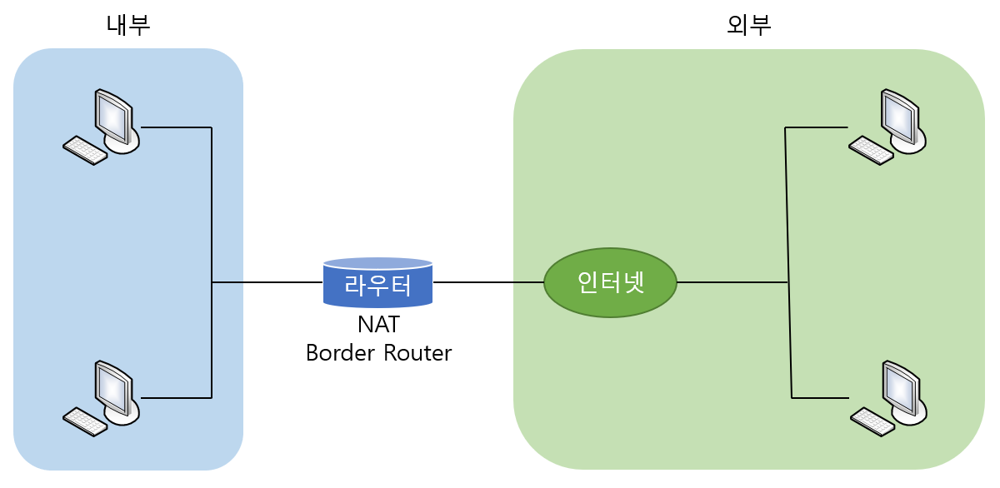

# NAT(Network Address Translation)

>  네트워크 주소 변환을 해주는 NAT에 대하여 알아본다.

 

### 개요

NAT(네트워크 주소 변환)은 IP 패킷의 TCP/UDP 포트 숫자와 소스 및 목적지 IP 주소 등을 재기록하면서 라우터를 통해 네트워크 트래픽을 주고받는 기술이다.

 

### NAT을 사용하는 이유

* 내부의 네트워크에는 비공인 IP 주소를 사용하고 외부 인터넷으로 나가는 경우에만 공인 IP 주소를 사용하고자 하는 경우
* 기존에 사용하던 ISP에서 새로운 ISP로 바꾸면서 내부 전체의 IP를 바꾸지 않고 기존의 IP 주소를 그대로 사용하고자 하는 경우
* 두 개의 인트라넷을 서로 합하려다 보니 두 네트워크의 IP가 서로 겹치는 경우
* TCP 로드 분배가 필요한 경우

 

위 그림을 보면서 NAT 동작을 알아보자. 그림에서 왼쪽이 내부 영역이고 라우터 오른쪽이 인터넷, 즉 외부 영역이다. 왼쪽의 내부 영역에 있는 비공인 주소가 라우터를 통과하면서 공익 주소로 바뀌게 된다.

여기서 내부 네트워크에 사용하는 비공인 주소를 **Inside Local 주소**라고 하고, 외부로 나갈 때 변환되어 나가는 주소를 **Inside Global 주소**라고 한다. 따라서 NAT은 Inside Local 주소를 Inside Global 주소로 바꾸어주는 과정이다.

