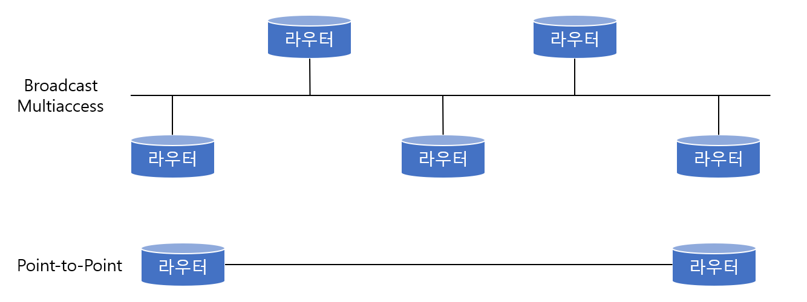

# OSPF Routing Protocol

> 다니내믹 라우팅 프로토콜인 OSPF에 대해 알아본다.

 

### 개념

OSPF(Open Shortest Path First) 프로토콜의 구성보다는 OSPF에서 알아두어야 할 개념 위주로 내용을 진행하겠다.

> IP 패킷 안에 있는 OSPF

그림이 조금 복잡하긴 하지만 한 번 봐 두면 도움이 될것이다. OSPF는 IP 패킷 안에 프로토콜 넘버 89(십진수)로 들어가게 된다. 그러니 IP 패킷만 봐도 이것이 OSPF정보라는 것을 알 수 있는 것이다. 그럼 이제 OSPF의 특징에 대해 알아보도록 하자.

1. 우선 `Convergence Time(컨버전스 타임)`이다. 컨버전스 타임은 쉽게 **라우터 간에 서로 변경된 정보를 주고받는데 걸리는 시간**이라고 생각하면 된다. OSPF는 어떤 변화가 생길때 바로 전달이 가능하기 때문에 컨버전스 타임이 빠르다. 따라서 큰 네트워크에 매우 적당하다. 특히 OSPF는 Area라는 개념을 사용해서 전체 OSPF 네트워크를 작은 영역으로 나누어 관리하기 때문에 빠른 업데이트를 하면서도 효율적인 관리가 가능하다.

2. 또 하나는 VLSM을 지원한다. VLSM을 지원하게 되면 IP 주소를 효과적으로 사용할 수 있다는 장점뿐만 아니라 라우팅 테이블을 줄이는 부수적인 효과도 있다. 이를 위해 OSPF는 라우트 서머리제이션을 지원하기 때문에 여러 개의 라우팅 경로를 하나로 묶어주는 기능이 탁월하다.
3. OSPF는 네트워크의 크기에 대한 제한이 없다.
4. OSPF는 네트워크에 변화가 있을 때만 정보가 날아가고 그것도 멀티캐스트로 날아가기 때문에 대역폭의 활용 측면에서 매우 실용적이다.
5. OSPF는 많은 관련요소를 합쳐서 경로를 결정하기 때문에 훨씬 정확한 경로 선택이 가능하다. 
6. 표준 라우팅 프로토콜이다.
7. 링크 스테이트 라우팅 알고리즘이다.

이렇게 OSPF 프로토콜의 특징을 알아보았다. 그럼 이제 OSPF가 어떤 네트워크 타입에서 적용 가능한지를 알아보도록 하자. 쉽게 말하면 OSPF가 적용되는 포폴로지(Topology)이다. 일반적으로 다른 라우팅 프로토콜의 경우는 토폴로지를 별로 따지지 않는데 반해서, OSPF는 토폴로지가 바뀌는 것에 따라 약간씩 동작이 바뀌기 때문에 기본을 이해하는 것이 중요하다. 일단 어떤 토폴로지가 있고, 그 정의가 무엇인지 알아보도록 하자.

브로드캐스트 멀티액세스 토폴로지는 네트워크에 두 개 이상의 라우터가 연결되는 경우로 하나의 메시지를 내보내면 이 네트워크 상에 있는 모든 라우터가 정보를 받아볼 수 있는 구조이다.

포인트 투 포인트 포폴로지는 네트워크에 항 쌍의 라우터만 존재하는 경우다.

NBMA란 Non Broadcast Multi-access로, 이 토폴로지 역시 네트워크에 두 개 이상의 라우터가 연결된다. 하지만 브로드캐스트 멀티액세스와는 다르게 브로드캐스트 능력은 가지고 있지 않다. 프레임릴레이나 X.25 네트워크가 이 경우에 해당한다.

이처럼 OSPF는 Broadcast Multi-access, Point-to-Point, 그리고 NBMA로 네트워크를 나누어 지원하고, 동작 방식도 약간씩 다르기 때문에 구성시 네트워크가 어떤 토폴로지인지 확인한 다음에 구성에 들어가야 한다.

 

 

### OSPF의 Neighbor

이번에는 OSPF가 어떻게 주위의 다른 OSPF 라우터들과 교류를 시작하는지 알아본다. 원레 OSPF에서 라우터는 주위에 있는 OSPF 라우터들을 찾아서 자신의 데이터베이스 안에 저장하는데, 이런 주위의 라우터들을 Neighbor(이웃)라고 한다. OSPF 라우터는 주위의 이웃을 찾기 위해 Hello 패킷을 내보낸다.

위 그림을 보면 Hello 패킷을 보내는 과정을 알 수 있다. 두번째 상자에 있는 화살표부터 보면, 라우터 A가 켜지면서 헬로 메시지를 내보낸다. 이때 라우터 ID가 같이 나가게 되는데 라우터 ID는 쉽게 말하면 OSPF에서 서로를 구분하는 이름이라고 보면 된다. 이때 이 라우터 ID는 라우터의 IP주소 중에서 제일 높은 주소를 사용한다.

라우터 A가 켜지면 A는 이웃이 누구인지 모르기 때문에 모든 OSPF라우터들에게 헬로 패킷을 보내는데, 브로드캐스트로 보내는 것이 아니라 멀티캐스트 주소 224.0.0.5를 이용해서 패킷을 보낸다.

헬로를 받은 다른 라우터들은 라우터 A를 자신들의 이웃목록(Neighbor List)에 넣게 되는데, 이 과정을 Init 과정이라고 한다.

세번째 화살표에서는, A에게 헬로 메시지를 받은 OSPF 라우터들이 A에게 유니캐스트로 자신들의 정보를 보내게 된다.

마지막 과정에 라우터 A는 Neighbor들로부터 받은 정보를 자신의 Neighbor 리스트에 넣어 관리하게 된다. 이렇게 이웃들과 주고받은 헬로 패킷이 다음 그림에 나와있다.

여기서 빨간색으로 표시한 내용은 무엇일까? 헬로 패킷에서 최소한 빨간색으로 표시된 것들끼리는 똑같아야 이웃으로 인정해 주겠다는 것이다. 예를 들어 Hello/Dead 인터벌이 서로 다르면 죽어도 서로 이웃이 될 수 없다. 따라서 OSPF 구성에서 서로 Neighbor 형성이 이상하게 잘 되지 않을 경우 우선 위에서 빨간색으로 표시된 것들이 라우터에서 모두 일치하는지를 확인해 봐야 한다.

그리고 앞에서 이웃들과 통신을 할 때 같이 내보내는 정보 중에 라우터 ID라는 것이 있었다. 이 라우터 ID에 대해 알아보도록 하자.

OSPF에선 라우터 ID를 이용해서 서로를 식별하기 때문에 굉장히 중요한 의미를 갖는다. 이 라우터 ID는 통상 그 라우터의 IP 주소 중 가장 높은 IP 주소를 사용한다. 그런데 보통 OSPF를 지원하는 라우터의 경우 Loopback 인터페이스가 하나씩은 다 있는데 이 루프백 인터페이스를 사용하면 그 IP 주소의 높낮이에 관계 없이 무조건 루프백 주소가 라우터 ID가 된다. 

 

 

### DR(Designated Router)과 BDR(Backup Designated Router)

DR과 BDR은 한마디로 반장과 부반장이라고 생각하면 된다. DR과 BDR은 선거를 통해서 뽑힌다.

OSPF 세그먼트에서는 각 라우터들이 OSPF에 참여하게 되면 DR과 BDR에게 자신의 Link State를 알리게 된다. 일렇게 DR, BDR에게만 자신의 링크 정보를 알리는 이유는 모든 라우터들과 Link State를 교환할 경우 발생하는 트래픽을 줄이고 Link State의 Sync(일치성)를 제대로 관리하기 위해서이다. 이 정보를 전달받은 DR은 이 정보를 모두 관리하면서 링크의 상태를 일치시키는 역할을 하게 된다.

BDR은 DR이 역할을 제대로 수행하고 있는 감시하는 역할을 한다. 그러다가 DR 라우터가 다운되면 바로 DR로 변환되어 DR의 역할을 수행한다.

따라서 OSPF에서 모든 라우터가 반드시 DR, BDR과 Link State를 Sync해야 한다. 이것을 Adjacency(어드제이션시)라고 한다. 또 하나 DR과 BDR은 라우터 ID와 라우터의 Priority를 가지고 선출된다는 것도 알아두자.

그럼 지금부터는 DR과 BDR이 어떻게 선출되는지에 대해서 알아보자.

OSPF에서 DR이 되기 위해서는 Priority가 높아야 한다 OSPF로 동작하는 라우터들은 모두 Priority를 갖는데 이 값이 디폴트로는 1이다. 그런데 어떤 한 라우터가 이보다 높은, 예를 들어 Priority 2가 있다면 무조건 이 라우터가 DR이 된다. 물론 BDR은 그 다음으로 높은 라우터가 된다.

위 그림에서 보이는 대로 라우터들은 헬로 패킷이라는 멀티캐스트 패킷을 이용해서 서로의 정보를 주고받아서 DR과 BDR을 선출하게 된다.

그림을 보니 Priority 2인 라우터가 2개 있는걸 볼 수 있다. 만약 Priority가 서로 같으면 라우터 ID를 가지고 비교한다. 즉 라우터 ID가 높은 것이 DR이 된다.

따라서 그림에서 라우터B가 DR이 되고 라우터A가 BDR로 선정된다.

만약 여기서 새로운 라우터가 연결되고 그 라우터의 Priority가 3이라면 어떻게 될까? 원칙대로라면 새로운 라우터가 DR이 되야 하지만 이미 DR과 BDR의 선출이 끝났기 때문에 새 라우터는 DR이나 BDR이 될 수 없다. 하지만 만약 DR이 다운되면 BDR이 DR이 되면서 BDR의 자리가 비게 되고, 이때 다시 BDR 선출을 하게 되는데 이 경우에 Priority 3인 라우터가 BDR로 올라갈 수 있다.

마지막으로 어떤 라우터가 영원히 DR, BDR 이 되지 못하게 하려면 그 라우터의 Priority를 0으로 세팅하면 된다.