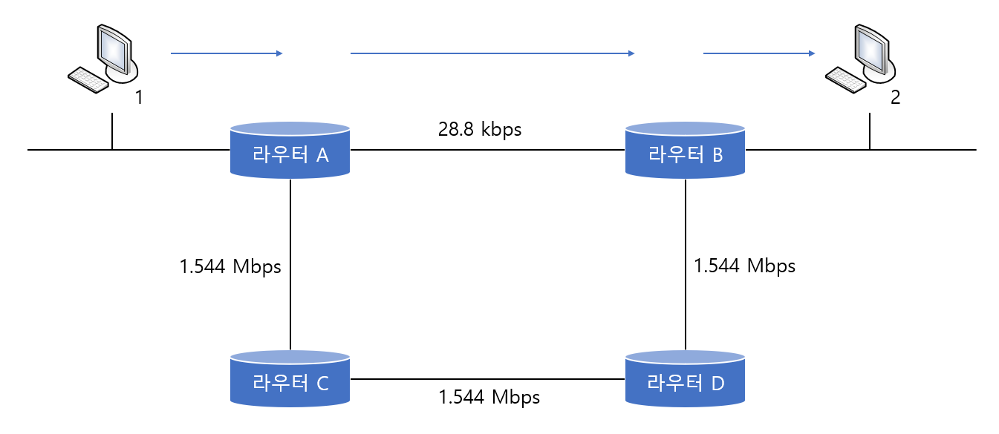

# RIP(Routing Information Protocol)
> 다이내믹 라우팅 프로토콜인 RIP에 대하여 알아본다. 

RIP는 단순하기는 하지만 옛날부터 많이 쓰인 스탠다드, 즉 표준 라우팅 프로토콜이다. RIP의 특징은 다음과 같다.

* 다이내믹 라우팅 프로토콜이다
* 내부용 라우팅 프로토콜이다(IGP)
* 디스턴스 벡터 알고리즘을 사용한다
* 홉 카운트(Hop Count)가 가장 낮은 경로를 최적이라 판단한다.(홉 카운트의 최대는 15개, 16개부턴 도착이 불가능하다)
```
목적지까지 가는데 네트워크를 몇 번 거쳐가야 하는것을 나타낸것이 홉 카운트이다. 
```

<br>

* **장점**
	* 소규모 네트워크에서 효율이 좋다.
	* 라우터의 메모리를 적게 사용한다.
	* 구성이 간편하다
* **단점**
	* 경로 선택을 오로지 홉 카운트에만 의존하기 떄문에 속도나 회선의 신뢰도, 회선의 로드 등을 확인해 볼 수 없다.
	* 자신의 라우터에서 15개 이상의 라우터를 거치는 목적지의 경우는 unreachable(갈 수 없음)으로 정의하고 데이터를 보내지 못한다.(큰 네트워크 환경에선 사용하기에 무리가 있다.)

<br>


위 그림에서 1번 PC에서 2번 PC로 가는 데이터가 있을 때 라우터 A에 RIP 라우팅 프로토콜이 돌고 있다면 라우터 A는 화살표대로 라우터B 쪽으로 데이터를 보낸다. 왜냐하면 라우터 B쪽으로 보내는 것이 홉 카운트가 더 적기 때문이다. 하지만 라우터 간의 회선 속도를 확인해보자.

데이터가 라우터 B쪽으로 가게 되면 28.8Kbps라는 엄청나게 느린 속도로 날아가게 된다. 하지만 라우터C 방향으로 가면 비록 라우터는 위쪽보다 많이 거치게 되어도 속도가 1.544Mbps이기 때문에 훨씬 빨리 날아갈 수가 있다. 즉, 라우터 A는 2번 PC로 가는 패킷을 라우터C 쪽으로 보내는 게 훨씬 빨리 보낼 수 있는 것이다.

하지만 RIP의 특성상 그대로 데이터는 라우터B쪽으로 보내게 된다.

이것이 바로 RIP의 단점이다. 즉, 경로 선택을 오로지 홉 카운트에만 의존하기 때문에 라우터를 적게 거치는 경로를 좋은 경로로 선택해 버린다.
