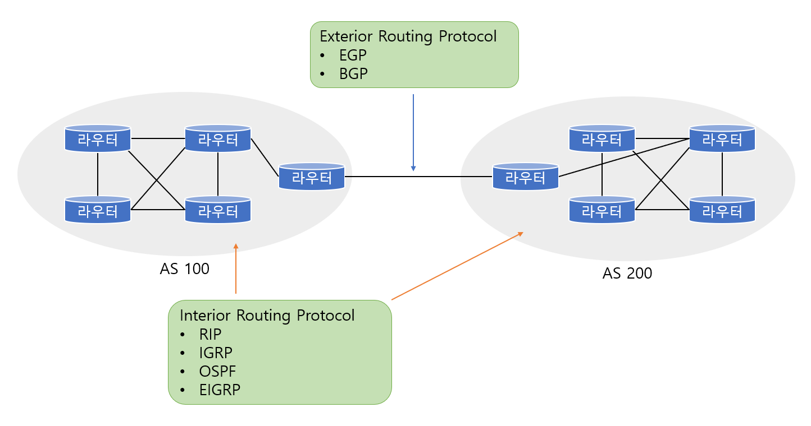

# Router

> '지능을 가진 경로 배정기'라 불리는 라우터에 대하여 알아본다.

 

### 라우터의 개념

라우터는 **Path Determination(경로 결정)** 과 **Switching(스위칭)** 을 해주는 네트워크 계층의 장비이다. 라우터는 데이터 패킷이 목적지까지 갈 수 있는 길을 검사하고 어떤 길로 가는 것이 가장 적절한지를 결정한다. 이것을 `경로 결정`이라고 말한다. 또한 그 길이 결정되면 그 길로 데이터 패킷을 `스위칭`해준다.

이 라우터가 가장 좋은 경로를 결정하기 위해서 **라우팅 프로토콜**을 사용하며 이 라우팅 프로토콜은 **라우팅 테이블**을 만들어서 관리한다.

 

 

### 라우팅, 라우티드 프로토콜

---

#### 라우티드 프로토콜

지금까지 알고있던 TCP/IP, IPX, AppleTalk 등의 프로토콜은 전부가 라우티드 프로토콜이다. **라우티드 프로토콜(Routed Protocol)**이란 말 그대로 라우팅을 당하는, 즉 라우터가 라우팅을 해주는 고객을 뜻한다. 

 

#### 라우팅 프로토콜

라우팅 프로토콜은 위의 라우티드 프로토콜들이 목적지까지 가장 좋은 길을 갈 수 있게 해주는 역할을 한다. 라우팅 프로토콜은 자신의 라우팅 테이블을 가지고 있으면서 자기가 찾아갈 경로에 대한 정보를 이 테이블에 기억해둔다(어디가 가장 빠르고 안전한 길인가). 즉, 라우팅 테이블은 일종의 메모라고 생각하면 되고 어떤 라우팅 프로토콜을 사용하느냐에 따라 테이블의 내용은 달라지게 된다. 

라우팅 테이블은 주로 목적지, 그 목적지까지의 거리, 어떻게 가야하는가 등의 내용이 들어있다. 또한 라우팅 테이블은 시간이 지나면서 계속 업데이트 된다.

* 주로 사용하는 라우팅 프로토콜은 **RIP, IGRP, OSPF, EIGRP** 등이 있다.

 

 

### 스태틱(Static), 다이내믹(Dynamic) 라우팅 프로토콜

라우팅 프로토콜을 구분할 때 스태틱과 다이내믹 라우팅 프로토콜로 구분한다.

---

#### 스태틱 라우팅 프로토콜

스태틱 라우팅 프로토콜은 라우터에 사람이 일일이 경로를 입력해주는 것을 말한다. 가장 빠르고 좋은 길을 사람이 찾게된다. 그럼 라우터는 사람이 입력해 준대로 데이터를 보내기만 하면 된다.

* 장점
  * 라우터에 부담이 없어 라우팅 속도가 빨라지고 라우터의 성능이 좋아진다.
  * 네트워크 대역폭을 절약할 수 있다.
  * 보안성이 강화된다.
* 단점
  * 입력해준 경로에 문제가 생기면 제대로 전송이 안된다.

 

#### 다이내믹 라우팅 프로토콜

다이내믹 프로토콜은 사람이 일일히 경로 입력을 해줄 필요 없이, 라우터가 알아서 가장 좋은 길을 찾아간다. 일반적으로 이야기하는 RIP, IGRP, OSPF, EIGRP 등이 다이내믹 라우팅 프로토콜에 속한다.

* 장점
  * 일반적인 라우팅 환경에서는 여러 가지 상황에 자동으로 대응한다.
  * 자동으로 가장 좋은 길을 찾아간다.
* 단점
  * 라우터에 부담을 준다.

 

 

### AS(Autonomous System)

`AS`란 하나의 네트워크 관리자에 의해서 관리되는 라우터들의 집단이라고 생각하면 된다. 즉, 쉽게 말하면 한 회사나 기업, 또는 단체의 라우터 집달이라고 생각하면 된다.

라우터들을 다시 AS라는 그룹으로 묶어주는 이유는 라우터가 가지는 정보를 효율적으로 관리하고 인터넷 서비스를 좀더 간편하게 하기 위해서이다. 즉 AS 안에 있는 라우터들은 자신의 AS에 속해있는 라우터에 대한 정보만 알고 있으면 된다. 그러다가 외부, 즉 AS 밖으로 나갈 때는 그 AS에 있는 문지기 라우터(ASBR라고 한다.)에게 정보를 물어봐서 밖으로 나가는 것이다.

ASBR 라우터는 자신의 AS와 인접해 있는 다른 AS에 대한 정보를 가지고 있으면서 자기 AS에서 밖으로 나가는 라우터나 외부 AS에서 자기 AS쪽으로 들어오는 라우터에게 정보를 제공하는 역할을 한다.

이런 시스템 때문에 라우터들은 인터넷에 접속하더라도 전 세계의 모든 네트워크에 대한 정보를 다 가지고 있을 필요가 없고 단지 자신이 속한 AS에 대한 정보만 가지면 된다.

이때 라우터가 AS 내부에서 사용하는 라우팅 프로토콜을 **Interior Routing Protocol** 이라고 하고 AS간에, 즉 AS 외부에서 서로 라우팅 정보를 주고 받기 위해 라우터가 사용하는 프로토콜을 **Exterior Routing Protocol**이라고 한다.

##### Interior Routing Protocol

* RIP, IGRP, EIGRP, OSPF

##### Exterior Routing Protocol

* EGP, BGP

위 그림에서 회색 원으로 보이는 것이 하나의 AS이다. 즉 AS 안에서는 Interior Routing Protocol, 즉 내부용 라우팅 프로토콜인 RIP나 IGRP 등이 라우터에서 사용되고, AS나 AS간의 통신에서는 라우터에서 BGP 등과 같은 Exterior Routing Protocol, 즉 외부용 라우팅 프로토콜이 사용된다.

