# Spanning Tree Protocol

> 스패닝 트리 프로토콜이 무엇인지 알아본다.

 

### Looping(루핑)

일단 스패닝 트리가 왜 필요한지 알기 위해선 먼저 루핑 현상에 대해 알고 있어야 한다.

`루핑(Looping)` 은 프레임이 네트워크 상에서 무한정으로 뱅뱅 돌기 때문에 이더넷의 특성상 네트워크가 조용해야 데이터를 정송할 수 있는 다른 장치들이 계속 네트워크가 조용해지기를 기다리기만 할 뿐 데이터 전송은 불가능해지는 상태를 말한다.

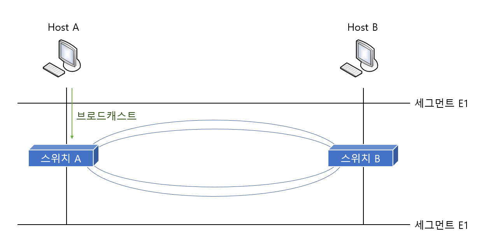

위 그림처 럼 두 호스트 사이에 스위치 또는 브리지가 두 개 있다고 가정해보겠다. 즉 하나의 호스트에서 다른 호스트로 가는 경로가 두 개 이상 만들어 진다는 것이다. 보통 이렇게 구성하는 것은 하나의 경로가 끊어져도 다른 경로를 쓰기 위한 것인데, 아무 생각없이 이렇게 구성을 하게 될때 `루핑 현상` 이 발생하게 된다.

호스트 A가 `브로드캐스트 패킷(Broadcast Packet)`을 보낸다. 그럼 양쪽 브리지(스위치)로 전달이 된다. 그 다음에 이 두 개 브리지(스위치)는 이 패킷을 분석한다. 이 패킷이 브로드캐스트 패킷이라는것을 안 브리지는 `Flooding(플로딩)` 을 하게 된다. 브리지는 목적지 주소를 보고 그 주소가 자신의 브리지 테이블에 없거나, 멀티캐스트 또는 브로드캐스트 주소인 경우에는 들어온 포트를 제외한 나머지 모든 포트로 패킷을 Flooding 하게 된다.

그럼 양쪽 브리지에서 모두 패킷이 다리를 건너게 된다. 그 다음엔 반대쪽으로 건너간 브로드캐스트 패킷은 다시 양쪽 브리지의 아래쪽 포트로 전달되고 이 패킷 역시 브리지 특성에 따라 다시 위로 전달된다. 

이런 과정이 반복되게 되면 한 번 발생한 브로드캐스트 패킷이 양쪽 브리지를 통해 네트워크를 계속 뱅뱅 돌게 되는 루핑이 발생하게 된다. 이와 같이 루핑이 발생되면 `CSMA/CD` 특성상 다른 네트워크를 전송할 수가 없게 된다.

이와 같이 루핑은 네트워크를 치명적인 상태에 빠뜨릴 수 있다. 따라서 자동으로 루핑을 막아주는 알고리즘이 필요한데 이 알고리즘을 **스패닝 트리 알고리즘(Spanning Tree Algorithm)** 이라고 한다. 

 

 

### 브리지 ID, Path Cost

스패닝 트리 프로토콜을 이해하기 위해선 먼저 두 가지 개념을 이해할 필요가 있다. 그 첫번째가 브리지 ID이고, 두번째는 Path Cost 라는 것이다.

#### 브리지 ID

브리지 ID란 브리지나 스위치들이 통신 할 때 서로를 확인하기 위해 하나씩 가지고 있는 번호라고 생각하면 된다.

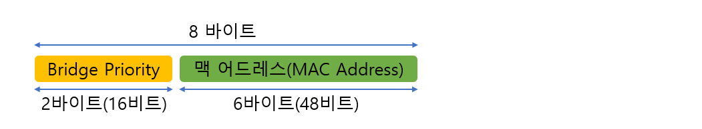

위 그림에서 보는 것처럼 브리지 ID 는 16비트의 `브리지 우선 순위(Bridge Priority)` 와 48비트의 `맥 어드레스` 로 만들어진다.

먼저 앞쪽에 있는 브리지 우선 순위는 16비트로 만들어지기 때문에 0 &#126; 65,535 까지의 수가 올 수 있다. 그런데 보통 디폴트로 그 중간에 해당하는 값인 32,768을 사용한다. 즉 아무런 구성도 하지 않은 스위치나 브리지에서 Bridge Priority 는 32,768이라는 것이다.

뒤에 오는 맥 어드레스는 스위치에 고정되어 있는 값이다. 

#### Path Cost

Path Cost란 말 그대로 Path=길, Cost=비용이니까 '길을 가는데 드는 비용' 정도로 이해하면 된다. 네트워크 분야에서 길이란 장비와 장비가 연결되어 있는 링크를 말하는 것이다. 즉, Path Cost란 브리지가 얼마나 가까이, 그리고 빠른 링크로 연결되어 있는지를 알아내기 위한 값이다.

원레 스패닝 트리 프로토콜을 정의하고 있는 IEEE 802.1D에서는 이 Cost 값을 계산할 때 1000Mbps 를 두 장비 사이의 링크 대역폭으로 나눈 값을 사용했다. 

그러나 기가비트와 ATM나오면서 소수점이 나오는 문제가 생겨 IEEE에서는 각 속도마다 Path Cost를 정의했다. 그 표는 다음과 같다.

| Bandwidth(대역폭) | STP Cost(Path Cost) |
| :---------------: | :-----------------: |
|       4Mbps       |         250         |
|      10Mbps       |         100         |
|      16Mbps       |         62          |
|      45Mbps       |         39          |
|      100Mbps      |         19          |
|      155Mbps      |         14          |
|      622Mbps      |          6          |
|       1Gbps       |          4          |
|      10Gbps       |          2          |

 

 

### Spanning Tree Protocol - 1

스패닝 트리 프로토콜은 복잡한 스위치의 루핑을 방지하기 위한 복잡한 프로토콜처럼 보이지만 사실은 기본적인 동작 세 가지만 이해하면 아주 간단하다. 그 세 가지는 다음과 같다.

1. **네트워크당 하나의 루트 브리지(Root Bridge)를 갖는다.**
2. **루트 브리지가 아닌 나머지 모든 브리지(Non Root Bridge)는 무조건 하나씩의 루트 포트(Root Port)를 갖는다.**
3. **세그먼트(Segment)당 하나씩의 데지그네이티드 포트(Designated Port)를 갖는다.**

첫번째로 네트워크당 하나의 루트 브리지를 갖는다고 한다. 여기서 말하는 네트워크는 스위치나 브리지로 구성된 하나의 네트워크이다. 따라서 라우터에 의해 나누어지는 브로드캐스트 도메인 하나의 네트워크라고 생각하면 된다. 즉, 하나의 브로드캐스트 도메인에 하나씩의 루트 브리지가 있다는 것이다.

두번째로 루트 브리지가 아닌 나머지 모든 브리지를 Non Root Bridge 라고 하는데 이 Non Root Bridge당 하나씩의 루트 포트(Root Port)를 가져야 한다. 여기서 루트 포트란 루트 브리지에 가장 빨리 갈 수 있는 포트를 말한다.

세번째로 세그먼트당 하나씩의 Designated Port(지정 포트)를 갖는다. 여기서 세그먼트란 쉽게 생각해 브리지 또는 스위치간에 서로 연결된 링크라고 보면 된다. 즉 브리지나 스위치가 서로 연결되어 있을 때 이 세그먼트에서 반드시 한 포트는 Designated Port로 선출되어야 한다는 것이다.

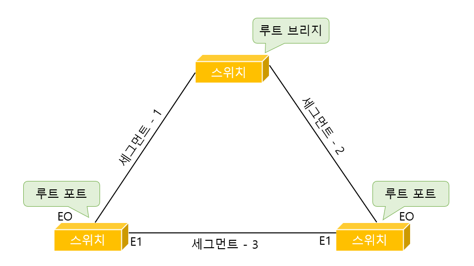

위에서 설명한 것을 그림으로 표현하면 위와 같다. 
위 그림에서 루트 브리지와 루트 포트, 데지그네이티드 포트가 어떻게 선출되는지는 아직 몰라도 된다. 

결국 스패닝 트리 프로토콜은 위의 세 가지 규칙을 적용해서 어느 쪽 링크를 살려두고 어느 쪽 링크를 끊을지 결정하는 과정이다.

 

### Spanning Tree Protocol - 2

위의 설명으로 스패닝 트리 프로토콜에서 어떤 일이 일어나는지 파악했을거라 생각한다. 이제붜는 스패닝 트리 프로토콜에서 이런 일들이 벌어질 때 어떻게 순서를 정하는지 알아보도록 한다. 즉, 누가 루트 브리지가 되고, 누가 루트 포트나 데지그네이티드 포트가 될지를 정하려면 어떤 순서가 필요하다. 따라서 다음과 같은 4 가지 단계를 통해 순서를 정하게 된다.

1. **누가 더 작은 Root BID를 가졌는가?**
2. **루트 브리지까지의 Path Cost 값은 누가 더 작은가?**
3. **누구의 BID(Sensor BID)가 더 낮은가?**
4. **누구의 포트 ID가 더 낮은가?**

 위 4단계 내용은 나중에 예제로 설명하니 일단 이런게 있다는 것만 알아도 된다.

#### BPDU

브리지(스위치)는 스패닝 트리 정보를 자기들끼리 주고받기 위해서 특수한 프레임을 사용하는데 이를 **BPDU(Bridge Protocol Data Unit)**라고 한다. 이 BPDU에는 아까 설명한 루트 브리지의 BID인 Root BID, 루트 브리지까지 가는 경로값인 Root Path Cost, 보내는 브리지의 BID인 Sender BID, 그리고 어떤 포트에서 보냈는지를 알게 해주는 Port ID 정보 등이 실려있다.

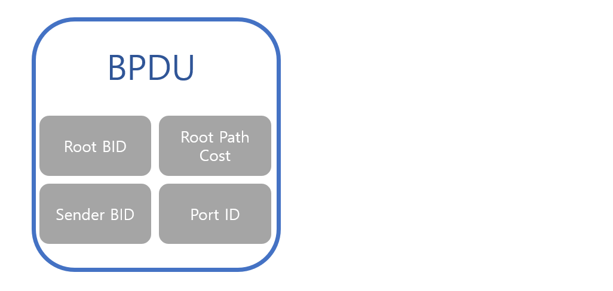

브리지나 스위치가 부팅을 하면 이들은 각각의 포트로 BPDU를 매 2초마다 내보내면서 서로의 스패닝 트리 정보를 주고받게 된다. 즉 브리지는 이 BPDU를 서로 주고받으면서 누가 루트 브리지이고 어떤 포트가 루트 포트가 될지, 그리고 어떤 포트가 데지그네이션 포트가 될지를 결정하게 된다. 

 

### Spanning Tree Protocol - 3

이제 스패닝 트리 프로토콜을 배우기 위한 준비과정이 다 끝났다. 이제 실제로 어떻게 구성되는지 예시를 통해 알아보기로 한다.

#### Root Bridge 선출

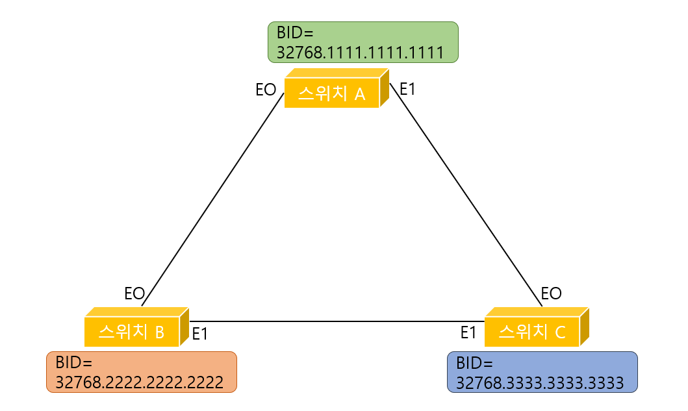

그림에서 보이는대로 이 네트워크엔 3대의 스위치가 있다. 편의상 이 스위치들을 스위치A, 스위치B, 스위치C라고 이름을 붙였다. 3대의 스위치는 그림과 같이 서로 연결 되어 있다. 그리고 각 스위치는 그림처럼 BID(Bridge ID)를 갖는다고 가정한다.

이제 루트 브리지(Root Bridge)를 뽑아보도록 하자. 루트 브리지를 뽑는 조건은 무조건 **낮은 BID를 갖는 스위치가 루트 브리지**가 되는 것이다. 어떻게 루트 브리지를 뽑는지 그 과정을 알아보도록 하자.

그림을 보면서 우선 스위치 B와 스위치 C 두 대의 스위치가 부팅을 시작했다고 가정한다.

그럼 이제 스위치 B와 스위치 C는 서로 BPDU(Bridge Protocol Data Unit)를 주고받게 된다. 브리지가 맨 처음 부팅하고 나서 내보내는 BPDU의 Sender BID 정보는 물론 자기 자신의 BID를 넣게 된다. 루트 브리지의 BID 역시 자기 자신의 BID를 넣게 된다. 그 이유는 스위치가 부팅이 끝나 다른 BPDU를 한 번도 받지 못했기 때문에 일단 이 네트워크에는 자시 혼자 있다고 생각하기 때문이다.

이렇게 스위치B 와 스위치C는 루트 브리지 BID를 자기 자신의 BID로 세팅해서 BPDU를 서로 주고받았다.

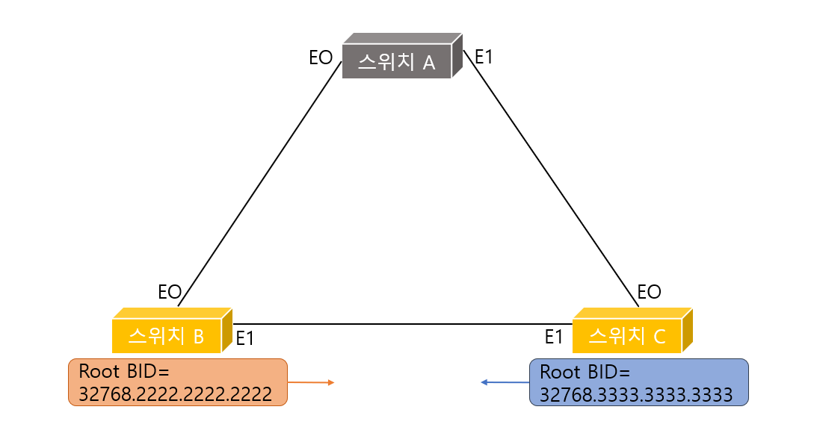

먼저 스위치B 에서의 상황이다. 스위치B 는 스위치C 로부터 BPDU를 받게 된다. 그리고 그 BPDU안의 Root BID를 자신이 알고 있던 Root BID와 비교하게 된다. 결과는 낮은 BID가 Root Bridge로 선출된다고 위에 설명 했으므로 Root Bridge의 BID는 32768.2222.2222.2222가 된다.  즉, 스위치B는 방금 스위치C에서 받은 BPDU를 무시해버린다.

이번엔 스위치C의 상황이다. 스위치C 역시 제일 처음 부팅하고 나서 자신의 BID를 루트 브리지 BID라고 해서 세팅한 BPDU를 내보내고 얼마 되지 않아 스위치B 로부터 BPDU를 받는다.

이 BPDU에는 루트 브리지가 32768.2222.2222.2222 로 되어 있다. 더 낮은 BID가 루트 브리지로 선출됨에 따라 스위치C는 이제부터 자신의 BPDU에 있는 루트 브리지 BID를 스위치B 의 BID로 바꾸어 다른 곳으로 전송하게 된다.

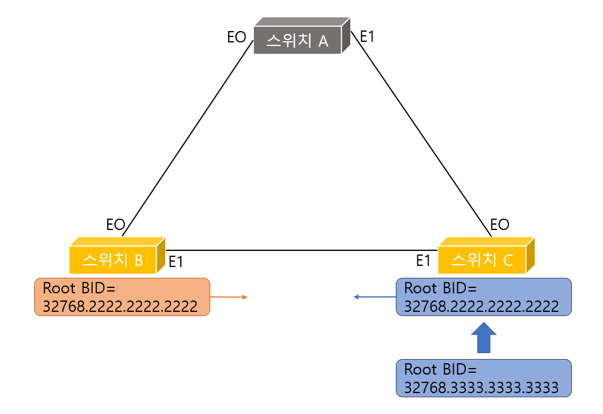

이제 스위치B 와 스위치C 사이에는 조정이 끝났다. 그러나 잠시 후 스위치A 가 부팅을 시작했다.

스위치 A는 다른 스위치와 마찬가지로 맨 처음 부팅했을 때는 누가 루트 브리지인지 알지 못한다. 부팅을 마친 스위치A는 자신의 BPDU에 루트 브리지의 BID를 자기 BID인 32768.1111.1111.1111로 세팅해서 양쪽의 스위치 B와 C에게 보낸다.

이때 이미 스위치B 와 스위치C 에서 역시 BPDU가 스위치 A쪽으로 전송된다. 이 때 스위치B와 스위치C에서 보낸 BPDU의 루트 브리지는 스위치B의 BID인 32768.2222.2222.2222 값이 들어있다.

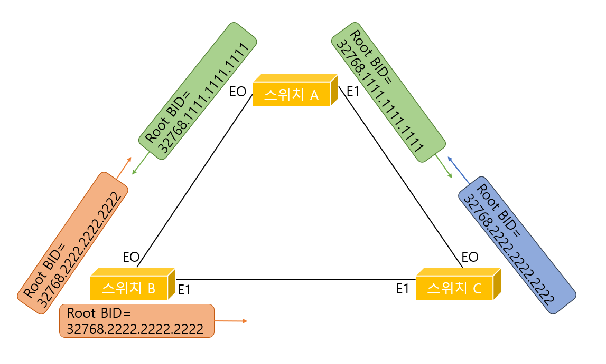

위 그림을 보면 스위치들이 서로 BPDU 값을 주고받는 것을 알 수 있다.

이제 어떻게 될것인지 다들 알거라 생각한다. 가장 낮은 Root BID는 32768.1111.1111.1111 이다. 따라서 이 값을 BID로 갖는 스위치A 가 루트 브리지가 된다. 

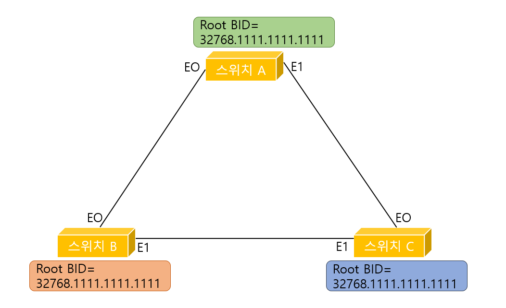

간단하게 정리하면 BID가 가장 낮은 값을 가지고 있는 브리지가 루트 브리지가 된다는 것이다. 원리는 매우 간단하지만 루트 브리지가 선출되는 과정을 꼭 이해하도록 하자.

마지막으로 본인이 네트워크 관리자인데 스위치C 를 꼭 루트 브리지로 만들고 싶다면 어떻게 해야될까? 그건 바로 스위치C의 BID를 스위치 A의 BID보다 낮은 값으로 만드는 것이다.

어떻게 하면 될까? 그래서 Bridge Priority 필드가 있는 것이다. 위 예시에서는 Bridge Priority 값이 디폴드 값인 32768이었지만 이 값을 더 낮은 수로 바꿔주면 그 스위치가 가장 낮은 BID를 가질 수 있게 되는 것이다.

 

#### Root Port 선출

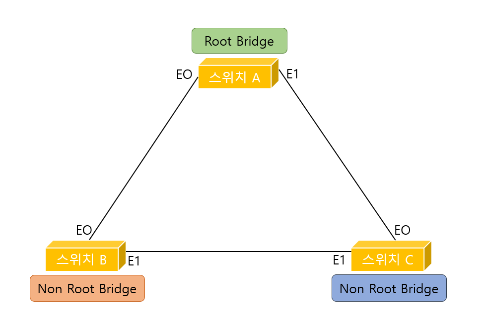

위 그림을 보면 어떤 스위치가 Non Root Bridge인지 한번에 알 수 있다. 바로 스위치B 와 스위치C 이다. 따라서 이 두 스위치에서 각각 한 개의 루트 포트를 뽑아야 한다.

스위치B와 스위치C에서 루트 포트를 뽑으려면 우선 Root Path Cost를 알아봐야 한다. Root Path Cost는 쉽게 **루트 브리지까지의 Path Cost**라고 생각하면 된다. 따라서 맨 처음 루트 브리지 스위치 A를 출발할 떄의 Root Path Cost는 0이다. 

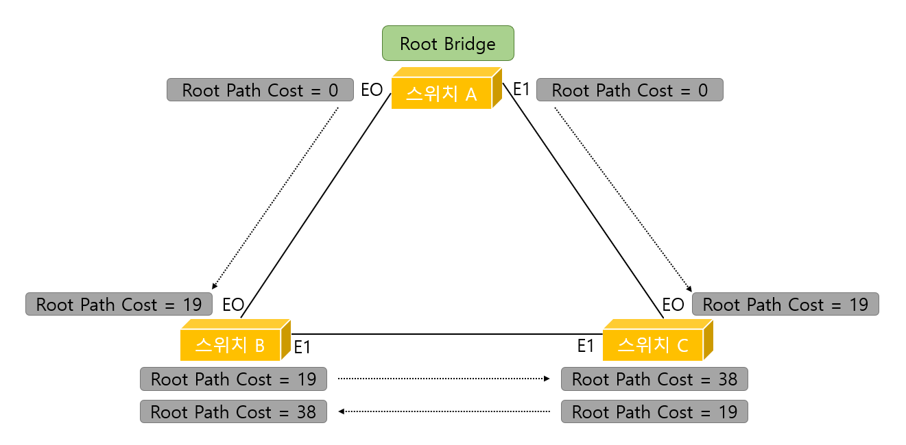

그림에서 각 스위치들은 패스트 이더넷(100Mbps)으로 연결되어 있다고 가정한다. 이 경우 Path Cost는 앞에서 배운 대로 19가 된다. 따라서 스위치 B의 E0 포트에서는 Root Path Cost 값이 다음과 같다.

0 + 19 = 19

이 값은 스위치 B의 E1 포트로 전달되고 다시 아래쪽 링크를 통해서 스위치 C의 E1 포트쪽으로 전달된다. 스위치 B와 스위치 C간에도 역시 100메가 통신을 하고 있다고 가정했기 때문에 스위치 C의 E1포트에서 Root Path Cost 값은 다음과 같이 계산된다.

0 + 19 + 19 = 38

마찬가지로 스위치 C의 E0 포트의 Root Path Cost 값은 19가 된다.

 일단 Root Path Cost를 계산했으니 이제 루트 포트를 선정할 차례이다. (사실 위 구조는 매우 간단해서 눈으로 봐도 바로 알 수 있으나 복잡한 구조에서도 구하는 과정은 같다) 지금까지 계산한 Root Path Cost 값이 가장 낮은 스위치 B의 E0포트와 스위치 C의 E0 포트가 루트 포트로 선정된다.

이렇게 3가지 규칙중 두번째인 **모든 Non Root Bridge는 반드시 한 개의 루트 포트(Root Port)를 갖는다** 도 알아보았다.

 

#### Designated Port 선출

지금까지 두 단계를 거쳐 다음과 같은 결과를 얻었다.

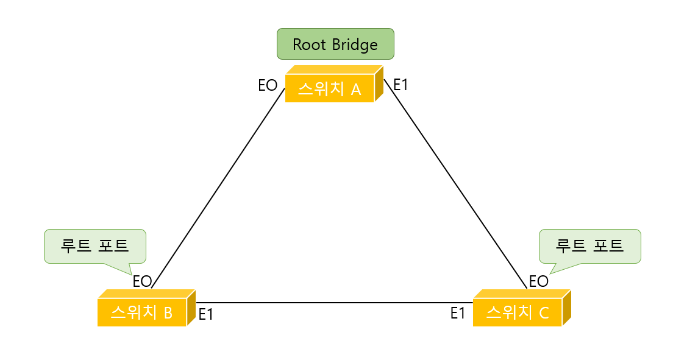

이제 마지막 과정만 남았는데 데지그네이티드 포트를 뽑아야 스패닝 트리에서 어떤 포트를 풀어주고 어떤 포트는 막을지가 결정되기 때문에 어떻게 보면 가장 중요한 일이라고 할 수 있다.

스패닝 트리의 세번째 규칙을 생각해보자. **세그먼트당 하나씩의 데지그네이티드 포트를 갖는다**가 바로 세번째 규칙이다. 즉, 브리지 네트워크에서 브리지와 브리지로 연결된 세그먼트당 각각 한 개의 데지그네이티드 포트를 뽑아야 한다는 말이다.

그럼 무엇을 기준으로 데지그네이티드 포트를 뽑을까? 그 기준은 위에서 설명했지만 또 설명하자면 다음과 같다.

1. **누가 더 작은 Root BID를 가졌는가?**
2. **루트 브리지까지의 Path Cost 값은 누가 더 작은가?**
3. **누구의 BID(Sender BID)가 더 낮은가?**
4. **누구의 포트 ID가 더 낮은가?**

그럼 이제 이 기준을 가지고 직접 데지그네이티드 포트를 뽑아보기로 하자.

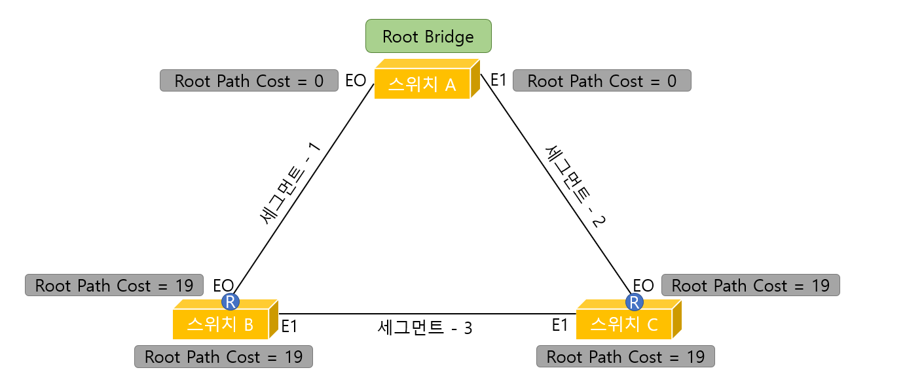

위 그림에서 보이는 대로 위의 과정을 통해 루트 브리지와 루트 포트는 찾았고 마지막으로 데지그네이티드 포트를 찾기 위해 각 포트별로 Root Path Cost 를 구했다.

먼저 세그먼트 1을 보면 스위치 A의 E0와 스위치 B의 E0가 100Mpbs로 연결되어 있다. 이때 스위치 A의 E0는 자기가 루트 브리지이기 떄문에 당연히 Root Path Cost가 0이 된다. 또한 스위치 B의 E0의 포트는 100Mpbs로 루트 브리지와 연결되어 있기 때문에 19가 된다. 따라서 세그먼트 1에서는 스위치 A의 E0포트가 데지그네이티드 포트로 선출된다.

마찬가지로 세그먼트 2에서도 스위치 A의 E1포트가 데지그네이티드 포트로 선출된다. 이걸로 생각해보면 루트 브리지의 모든 포트들은 언제나 데지그네이티드 포트로 선정된다는것을 알 수 있다.

마지막으로 세그먼트 3만 남았는데 여기선 서로 연결된 두 포트의 Root Path Cost가 같다. 이렇게 동점이 생겼을 땐 위에 써둔 기준을 통해 판별한다. 하나하나 비교해보기로 하자.

---

**1단계:** 누가 더 작은 Root BID를 가졌는가?

스위치 B나 스위치 C 둘 다 똑같은 루트 BID를 가지고 있기 때문에 여기서는 판별할 수 없다.

**2단계:** 루트 브리지까지의 Path Cost 값은 누가 더 작은가?

여기서도 마찬가지로 판별할 수 없다.

**3단계:** 누구의 BID(Sender BID)가 더 낮은가?

Sender BID란 BPDU에 스패닝 트리 정보를 실어 보낼 때 발신자의 주소를 넣는 것과 같다. 즉, 자기 자신의 BID를 말하는 것이다. 따라서 스위치 B의 Sender BID는 32768.2222.2222.2222이고, 스위치 C의 Sender BID는 32768.3333.3333.3333 이기 때문에 승자는 스위치 B이다. 즉, 스위치 B의 E1 포트가 데지그네이티드 포트로 선정된다.

만약 여기서도 판별할수 없다면 마지막 4단계로 포트 ID까지 비교해 판단을 내린다.

---

이렇게 해서 만들어진 스패닝 트리는 다음과 같다. 여기서 ND란 `Non Designated Port` 를 말한다. 즉, 루트 포트나 데지그네이티드 포트가 아닌 나머지 포트이다.

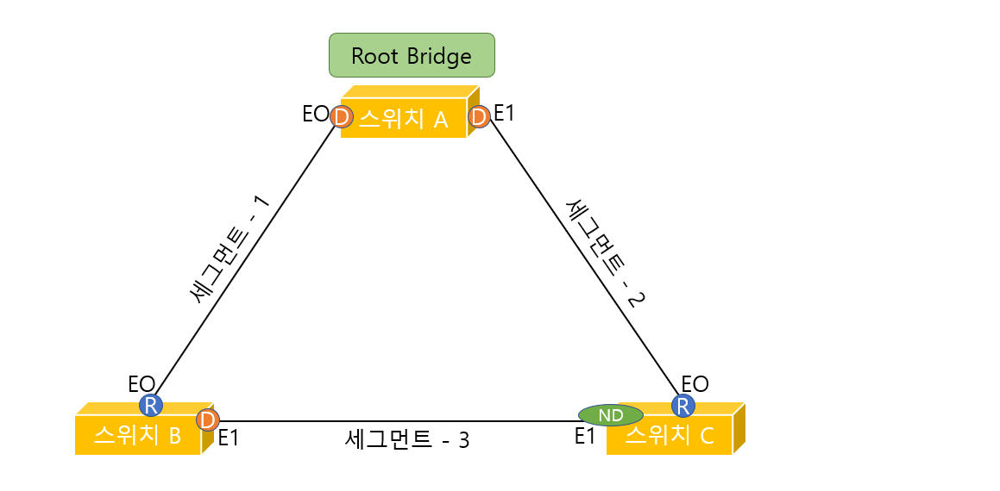

 

 

### 스패닝 트리 프로토콜의 5가지 상태 변화

지금까지 스패닝 트리를 만드는 과정을 알아보았다. 이렇게 스패닝 트리 프로토콜을 구현해 나가는 과정에서 모든 스위치나 브리지의 포트들은 언제나 5가지로 상태가 변한다. 즉, 앞으로 설명할 5가지의 상태 중 하나에 속하는 것이다.

* **Disabled**: 이 상태는 포트가 고장나서 사용할 수 없거나 네트워크 관리자가 포트를 일부러 Shut Down시켜 놓은 상태이다.

  | 데이터 전송 | 맥 어드레스 학습 | BPDU 전송 |
  | ----------- | ---------------- | --------- |
  | X           | X                | X         |

* **Blocking**: 스위치를 맨 처음 키거나 Disabled되어 있는 포트를 관리자가 다시 살렸을 때 그 포트는 블로킹 상태로 들어간다. 이 상태에서는 데이터 전송은 안되고 오직 BPDU만 주고받을 수 있다. 

  | 데이터 전송 | 맥 어드레스 학습 | BPDU 전송 |
  | ----------- | ---------------- | --------- |
  | X           | X                | O         |

* **Listening**: 블로킹 상태에 있던 스위치 포트가 루트 포트나 데지그네이티드 포트로 선정되면 포트는 바로 리스닝 상태로 넘어간다. 물론 리스닝 상태에 있던 포트도 네트워크에 새로운 스위치가 접속했거나 스위치의 구성값이 바뀌면 루트 포트나 데지그네이티드 포트에서 Non Designated Port로 상태가 변할 수도 있다. 그렇게 되면 다시 Blocking상태로 돌아가게 된다.

  | 데이터 전송 | 맥 어드레스 학습 | BPDU 전송 |
  | ----------- | ---------------- | --------- |
  | X           | X                | O         |

* **Learning**: 리스닝 상태에 있던 스위치 포트가 포워딩 딜레이(Forwarding Delay) 디폴트 시간인 15초 동안 그 상태를 계속 유지하면 리스닝 상태는 러닝 상태로 넘어간다. 러닝 상태에서야 비로소 맥 어드레스를 배워 맥 어드레스 테이블을 만들게 된다.

  | 데이터 전송 | 맥 어드레스 학습 | BPDU 전송 |
  | ----------- | ---------------- | --------- |
  | X           | O                | O         |

* **Forwarding**: 스위치 포트가 러닝 상태에서 다른 상태로 넘어가지 않고 다시 포워딩 딜레이 디폴트 시간인 15초 동안 그 상태를 유지하면 러닝 상태에서 포워딩 상태로 넘어가게 된다. 포워딩 상태가 되어야 스위치 포트는 드디어 데이터 프레임을 주고받을 수 있게 된다. 

  | 데이터 전송 | 맥 어드레스 학습 | BPDU 전송 |
  | ----------- | ---------------- | --------- |
  | O           | O                | O         |

이렇게 다섯 가지 상태 변화를 통해 스위치나 브리지는 링크를 막기도 하고 열기도 하면서 스패닝 트리를 만들게 된다. 

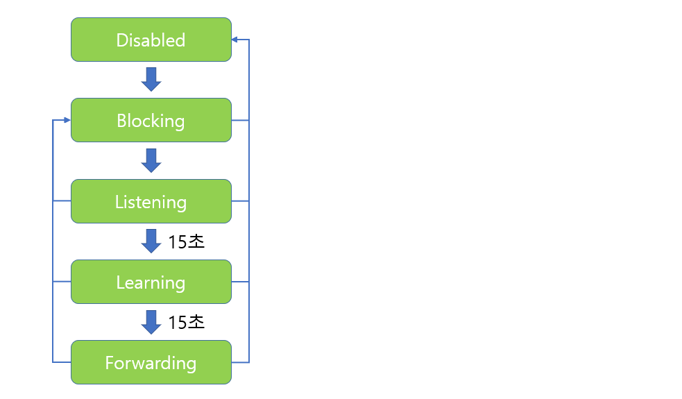

위 그림을 보면 다섯 가지 상태 변화가 나와 있다. 리스닝, 러닝, 포워딩 상태에서 다시 블로킹 상태로 화살표가 있는것은 리스닝, 러닝, 포워딩 상태에 있던 포트도 루트 포트나 데지그네이티드 포트에서 탈락되면 바로 블로킹 상태로 넘어갈 수 있다는 뜻이다.

또 모든 포트에서 Disabled 상태쪽으로 화살표가 있는 것은 포트가 어떤 상태에 있던지 사용자에 의한 Shut Down 명령이나 포트의 고장으로 인해 언제라도 Disabled 상태로 변할 수 있다는 의미이다.