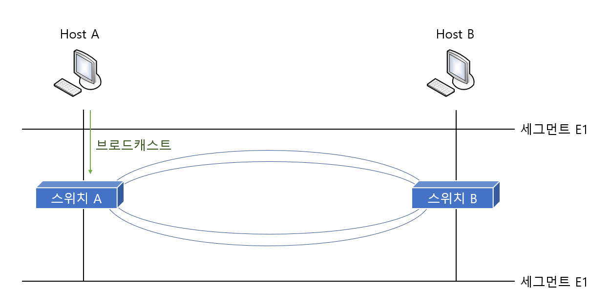
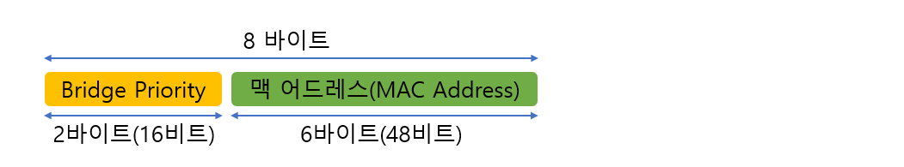
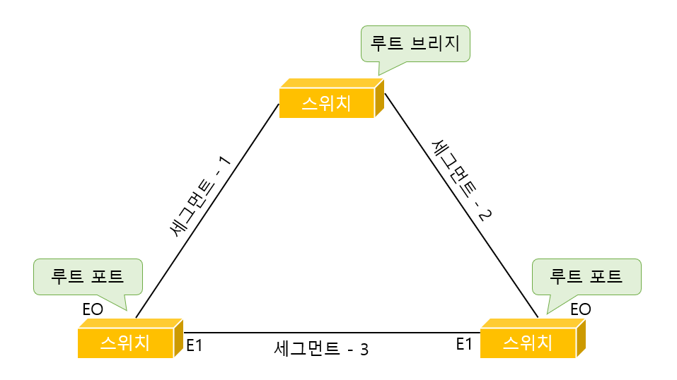

# Spanning Tree Protocol

> 스패닝 트리 프로토콜이 무엇인지 알아본다.

 

### Looping(루핑)

일단 스패닝 트리가 왜 필요한지 알기 위해선 먼저 루핑 현상에 대해 알고 있어야 한다.

`루핑(Looping)` 은 프레임이 네트워크 상에서 무한정으로 뱅뱅 돌기 때문에 이더넷의 특성상 네트워크가 조용해야 데이터를 정송할 수 있는 다른 장치들이 계속 네트워크가 조용해지기를 기다리기만 할 뿐 데이터 전송은 불가능해지는 상태를 말한다.

위 그림처 럼 두 호스트 사이에 스위치 또는 브리지가 두 개 있다고 가정해보겠다. 즉 하나의 호스트에서 다른 호스트로 가는 경로가 두 개 이상 만들어 진다는 것이다. 보통 이렇게 구성하는 것은 하나의 경로가 끊어져도 다른 경로를 쓰기 위한 것인데, 아무 생각없이 이렇게 구성을 하게 될때 `루핑 현상` 이 발생하게 된다.

호스트 A가 `브로드캐스트 패킷(Broadcast Packet)`을 보낸다. 그럼 양쪽 브리지(스위치)로 전달이 된다. 그 다음에 이 두 개 브리지(스위치)는 이 패킷을 분석한다. 이 패킷이 브로드캐스트 패킷이라는것을 안 브리지는 `Flooding(플로딩)` 을 하게 된다. 브리지는 목적지 주소를 보고 그 주소가 자신의 브리지 테이블에 없거나, 멀티캐스트 또는 브로드캐스트 주소인 경우에는 들어온 포트를 제외한 나머지 모든 포트로 패킷을 Flooding 하게 된다.

그럼 양쪽 브리지에서 모두 패킷이 다리를 건너게 된다. 그 다음엔 반대쪽으로 건너간 브로드캐스트 패킷은 다시 양쪽 브리지의 아래쪽 포트로 전달되고 이 패킷 역시 브리지 특성에 따라 다시 위로 전달된다. 

이런 과정이 반복되게 되면 한 번 발생한 브로드캐스트 패킷이 양쪽 브리지를 통해 네트워크를 계속 뱅뱅 돌게 되는 루핑이 발생하게 된다. 이와 같이 루핑이 발생되면 `CSMA/CD` 특성상 다른 네트워크를 전송할 수가 없게 된다.

이와 같이 루핑은 네트워크를 치명적인 상태에 빠뜨릴 수 있다. 따라서 자동으로 루핑을 막아주는 알고리즘이 필요한데 이 알고리즘을 **스패닝 트리 알고리즘(Spanning Tree Algorithm)** 이라고 한다. 

 

 

### 브리지 ID, Path Cost

스패닝 트리 프로토콜을 이해하기 위해선 먼저 두 가지 개념을 이해할 필요가 있다. 그 첫번째가 브리지 ID이고, 두번째는 Path Cost 라는 것이다.

#### 브리지 ID

브리지 ID란 브리지나 스위치들이 통신 할 때 서로를 확인하기 위해 하나씩 가지고 있는 번호라고 생각하면 된다.

위 그림에서 보는 것처럼 브리지 ID 는 16비트의 `브리지 우선 순위(Bridge Priority)` 와 48비트의 `맥 어드레스` 로 만들어진다.

먼저 앞쪽에 있는 브리지 우선 순위는 16비트로 만들어지기 때문에 0 &#126; 65,535 까지의 수가 올 수 있다. 그런데 보통 디폴트로 그 중간에 해당하는 값인 32,768을 사용한다. 즉 아무런 구성도 하지 않은 스위치나 브리지에서 Bridge Priority 는 32,768이라는 것이다.

뒤에 오는 맥 어드레스는 스위치에 고정되어 있는 값이다. 

#### Path Cost

Path Cost란 말 그대로 Path=길, Cost=비용이니까 '길을 가는데 드는 비용' 정도로 이해하면 된다. 네트워크 분야에서 길이란 장비와 장비가 연결되어 있는 링크를 말하는 것이다. 즉, Path Cost란 브리지가 얼마나 가까이, 그리고 빠른 링크로 연결되어 있는지를 알아내기 위한 값이다.

원레 스패닝 트리 프로토콜을 정의하고 있는 IEEE 802.1D에서는 이 Cost 값을 계산할 때 1000Mbps 를 두 장비 사이의 링크 대역폭으로 나눈 값을 사용했다. 

그러나 기가비트와 ATM나오면서 소수점이 나오는 문제가 생겨 IEEE에서는 각 속도마다 Path Cost를 정의했다. 그 표는 다음과 같다.

| Bandwidth(대역폭) | STP Cost(Path Cost) |
| :---------------: | :-----------------: |
|       4Mbps       |         250         |
|      10Mbps       |         100         |
|      16Mbps       |         62          |
|      45Mbps       |         39          |
|      100Mbps      |         19          |
|      155Mbps      |         14          |
|      622Mbps      |          6          |
|       1Gbps       |          4          |
|      10Gbps       |          2          |

 

 

### Spanning Tree Protocol - 1

스패닝 트리 프로토콜은 복잡한 스위치의 루핑을 방지하기 위한 복잡한 프로토콜처럼 보이지만 사실은 기본적인 동작 세 가지만 이해하면 아주 간단하다. 그 세 가지는 다음과 같다.

1. **네트워크당 하나의 루트 브리지(Root Bridge)를 갖는다.**
2. **루트 브리지가 아닌 나머지 모든 브리지(Non Root Bridge)는 무조건 하나씩의 루트 포트(Root Port)를 갖는다.**
3. **세그먼트(Segment)당 하나씩의 데지그네이티드 포트(Designated Port)를 갖는다.**

첫번째로 네트워크당 하나의 루트 브리지를 갖는다고 한다. 여기서 말하는 네트워크는 스위치나 브리지로 구성된 하나의 네트워크이다. 따라서 라우터에 의해 나누어지는 브로드캐스트 도메인 하나의 네트워크라고 생각하면 된다. 즉, 하나의 브로드캐스트 도메인에 하나씩의 루트 브리지가 있다는 것이다.

두번째로 루트 브리지가 아닌 나머지 모든 브리지를 Non Root Bridge 라고 하는데 이 Non Root Bridge당 하나씩의 루트 포트(Root Port)를 가져야 한다. 여기서 루트 포트란 루트 브리지에 가장 빨리 갈 수 있는 포트를 말한다.

세번째로 세그먼트당 하나씩의 Designated Port(지정 포트)를 갖는다. 여기서 세그먼트란 쉽게 생각해 브리지 또는 스위치간에 서로 연결된 링크라고 보면 된다. 즉 브리지나 스위치가 서로 연결되어 있을 때 이 세그먼트에서 반드시 한 포트는 Designated Port로 선출되어야 한다는 것이다.

위에서 설명한 것을 그림으로 표현하면 위와 같다. 
위 그림에서 루트 브리지와 루트 포트, 데지그네이티드 포트가 어떻게 선출되는지는 아직 몰라도 된다. 

결국 스패닝 트리 프로토콜은 위의 세 가지 규칙을 적용해서 어느 쪽 링크를 살려두고 어느 쪽 링크를 끊을지 결정하는 과정이다.

 

### Spanning Tree Protocol - 2

위의 설명으로 스패닝 트리 프로토콜에서 어떤 일이 일어나는지 파악했을거라 생각한다. 이제붜는 스패닝 트리 프로토콜에서 이런 일들이 벌어질 때 어떻게 순서를 정하는지 알아보도록 한다. 즉, 누가 루트 브리지가 되고, 누가 루트 포트나 데지그네이티드 포트가 될지를 정하려면 어떤 순서가 필요하다. 따라서 다음과 같은 4 가지 단계를 통해 순서를 정하게 된다.

1. **누가 더 작은 Root BID를 가졌는가?**
2. **루트 브리지까지의 Path Cost 값은 누가 더 작은가?**
3. **누구의 BID(Sensor BID)가 더 낮은가?**
4. **누구의 포트 ID가 더 낮은가?**

 일단은