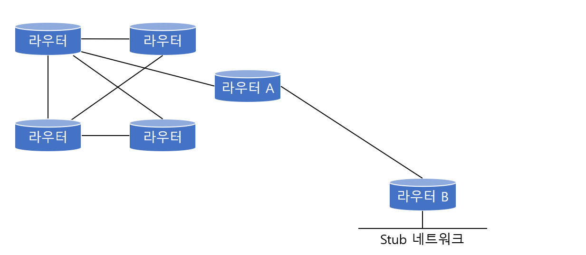

# Static Routing Protocol

> 라우터 운영자가 직접 경로를 입력 해 주는 스태틱 라우팅 프로토콜을 알아본다.

 

### 개념

스태틱 라우팅 프로토콜은 라우터 운영자가 직접 경로를 입력해 준다. 이에 따른 장단점은 다음과 같다.

#### 장점

* 라우터는 라우팅하는데 자원을 쓰지 않아 빠르게 라우팅이 가능하다.
* 라우팅 테이블을 적게 사용한다.

#### 단점

* 운영자가 입력해준 경로에 문제가 생겨도 다른 길을 자동으로 찾아내지 못한다.

따라서 스태틱 라우팅 프로토콜은 갈 수 있는 경로가 하나밖에 없는 stub라우터용으로 많이 사용된다.

Stub 네트워크란 오직 하나의 경로만을 통해서 외부 망과 연결된 네트워크를 의미한다. 밑의 그림에서 B 라우터는 stub 네트워크 상에 있다. 즉 B 라우터는 오직 A 라우터를 통해서만 외부 네트워크로 연결이 되어 있기 때문이다. 

 

 

## Default Route

> 스태틱 라우팅과 같은 계열인 디폴트 라우트에 대해 알아본다.

 

### 개념

디폴드 라우트란 경로를 찾아내지 못한 모든 네트워크들은 모두 특정 장소로 가라고 미리 정해 놓는 길이다. 즉 여러 가지 라우팅 프로토콜에 의해서 길을 다 찾아간 다음에 그래도 길을 못 찾은 네트워크가 있다면 무조건 이 곳으로 가라고 말해준다.

이 디폴트 라우트는 인터넷을 사용하는 라우터에서 가장 많이 사용된다. 가장 많이 사용하는 인터페이스 쪽으로 디폴트 라우트를 잡아 놓으면 다른 경로에서 해당 네트워크를 못 찾을 때 무조건 인터넷쪽 인터페이스로 가는 것이다.

전에 배운 스태틱 라우팅은 그냥 특정 목적지를 가기 위한 구성이었지만, 디폴트 라우팅은 특정 목적지를 지정하지 않고 그냥 모든 목적지가 모두 디폴트로 지정한 곳으로 간다는 것에서 차이가 있다.

