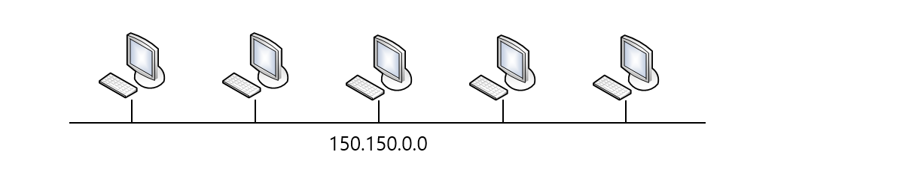
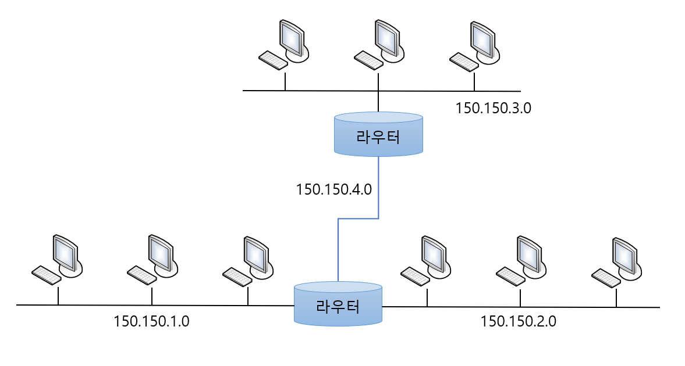

# Subnet Mask

> 서브넷 마스크가 무엇인지 알아본다.

 

### 서브넷 마스크의 개념

`서브넷 마스크(Subnet Mask)`란 말뜻 그대로 서브, 즉 메인이 아닌 어떤 가공을 통한 네트워크를 만들기 이해서 씌우는 마스크라고 생각하면 된다. 다시 말해서 사용자가 어떤 IP 주소를 배정받게 되면 보통은 이 주소를 그대로 사용하지 않는다.

예를 들어 클래스 B 주소를 배정 받고 이 주소를 그대로 쓰게 되면 하나의 네트워크가 65,000여 개의 호스트를 가지는데 이렇게 큰 네트워크를 구성했다가는 브로스캐스트 영역이 너무 커져 아무것도 할 수 없게 된다.

따라서 이것을 나눠줄때 서브넷 마스크를 사용하는 것이다.

* 네트워크 150.150.0.0 (호스트 수 - 65,534개)
* 브로드캐스트 도메인이 너무 커진다.
* 실제 상황에서는 통신이 불가능하다.

* 클래스 B 네트워크 150.150.0.0 을 서브넷해서 사용한다.
* 서브넷 마스크는 255.255.255.0 이다.
* 이렇게 해서 나눠진 서브넷 간의 통신은 라우터를 거쳐야만 가능하다.

아직은 서브넷 마스크가 어떻게 이뤄지는지 몰라도 위 그림을 통해서 서브넷 마스크는 커다란 네트워크를 잘게 나누기 위해서 사용한다 라는 것만 알아두면 된다.

 

