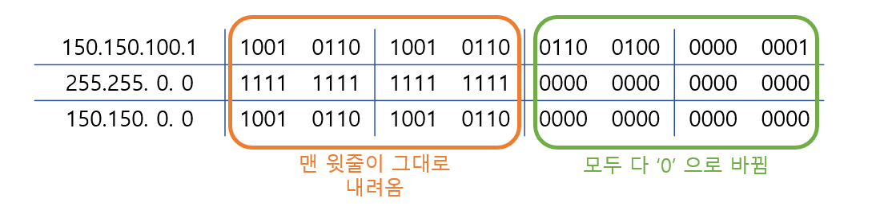
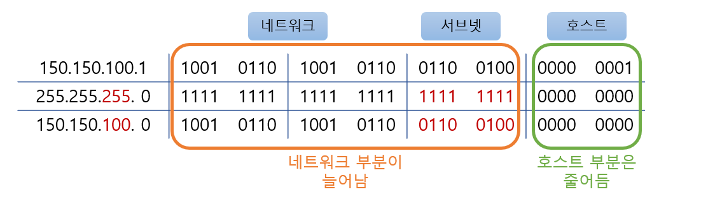
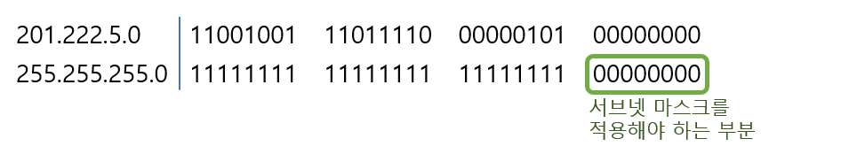
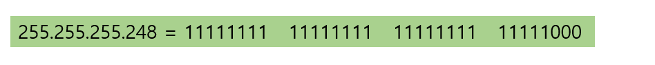

# Subnet Mask

> 서브넷 마스크가 무엇인지 알아본다.

 

### 서브넷 마스크의 개념

`서브넷 마스크(Subnet Mask)`란 말뜻 그대로 서브, 즉 메인이 아닌 어떤 가공을 통한 네트워크를 만들기 이해서 씌우는 마스크라고 생각하면 된다. 다시 말해서 사용자가 어떤 IP 주소를 배정받게 되면 보통은 이 주소를 그대로 사용하지 않는다.

예를 들어 클래스 B 주소를 배정 받고 이 주소를 그대로 쓰게 되면 하나의 네트워크가 65,000여 개의 호스트를 가지는데 이렇게 큰 네트워크를 구성했다가는 브로스캐스트 영역이 너무 커져 아무것도 할 수 없게 된다.

따라서 이것을 나눠줄때 서브넷 마스크를 사용하는 것이다.

* 네트워크 150.150.0.0 (호스트 수 - 65,534개)
* 브로드캐스트 도메인이 너무 커진다.
* 실제 상황에서는 통신이 불가능하다.

* 클래스 B 네트워크 150.150.0.0 을 서브넷해서 사용한다.
* 서브넷 마스크는 255.255.255.0 이다.
* 이렇게 해서 나눠진 서브넷 간의 통신은 라우터를 거쳐야만 가능하다.

아직은 서브넷 마스크가 어떻게 이뤄지는지 몰라도 위 그림을 통해서 서브넷 마스크는 커다란 네트워크를 잘게 나누기 위해서 사용한다 라는 것만 알아두면 된다.

 

 

### 서브넷 마스크의 특징

1. 서브넷 마스크로 만들어진 네트워크, 즉 서브넷은 하나의 네트워크이기 때문에 서로 나뉘어진 서브넷끼리는 라우터를 통해서만 통신이 가능하다.
2. 서브넷 마스크는 이진수로 썼을 때 `1` 이 연속적으로 나와야 한다.
3. 할당받은 네트워크에 `AND` 연산을 사용해 `네트워크 부분` 과 `호스트 부분` 을 나눠준다.
4. 디폴드 서브넷 마스크와 무언가 변형을 한 서브넷 마스크로 나눌수 있다.

위 특징을 가지고 직접 서브넷 마스크가 어떻게 작동하는지 알아보도록 하자. 

위 그림은 IP주소가 서브넷 마스크를 통과해서 네트워크 부분이 어디까지인지를 알아내는 과정을 보여주고 있다.
위 특징에 나온대로 네트워크를 작게 나누지 않고 원레 클래스대로 사용하더라도 서브넷 마스크는 있다. 이것이 바로 디폴트 서브넷 마스크이다.

어떤 IP 주소라도 서브넷 마스크를 통과시키게 되면(AND 연산을 통해) 네트워크 부분이 어디까진지 알 수 있다. 이 규칙은 디폴트 서브넷 마스크도 마찬가지이다.

그림에서 150.150.100.1 이라는 IP 주소에 디폴트 서브넷 마스크인 `255.255.0.0`을 씌웠다.(150.150.100.1은 클래스B 이기 때문에 디폴트 서브넷 마스크는 255.255.0.0이다) 그러자 서브넷 마스크를 통해서 내려온 네트워크 부분은 `150.150.0.0` 이 되었다.

그럼 이번에는 150.150.100.1에 새로운 서브넷 마스크 255.255.255.0을 씌워 보겠다. 어차피 서브넷 마스크의 성질은 똑같다. 따라서 서브넷 마스크가 1인 부분은 IP 주소가 그대로 내려오고, 서브넷 마스크가 0인 부분은 모두 0이 된다는 원칙엔 변함이 없다. 따라서 서브넷 마스크를 통과해서 내려온 값이 새로운 네트워크 부분이 된다.

그림에서처럼 서브넷 마스크가 `255.255.255.0` 이 되자 서브넷 마스크를 통과해서 아래로 온 네트워크 부분은 3자리의 십진수로 늘어났다. 즉, `150.150.100.0` 이 되었다. 이 의미는 클래스 B 주소를 마치 클래스 C 처럼 사용한다는 의미이다. 즉 네트워크 부분이 3자리로 늘고 호스트 부분이 1자리로 줄어들었다. 이렇게 하나의 주소를 서브넷 마스크를 씌워서 작은 네트워크로 만드는 것을 `서브네팅`이라고 한다.

 

 

### 실습해보기

위의 설명만을 가지고는 완벽히 이해하기 힘들 수 있으니 문제를 가지고 풀어보며 서브넷 마스크를 배우기로 한다.

---

문제는 다음과 같다.

* 주어진 네트워크: 201.222.5.0
* 서브넷 요구 조건
  서브넷 당 호스트 수: 5개 이상
  총 서브넷 수: 20개 이상

---

맨 먼저 해야할 것은 주어진 공인 주소를 2진수로 바꿔야한다. 또 현재의 서브넷 마스크를 이진수로 바꿔 주어야 한다. 아래 그림을 보면 서브넷 마스크를 적용해야 하는 부분을 알아낼 수 있다. 서브넷 마스크는 호스트 부분에 적용해 주어야 한다. 즉 클래스C 의 경우 맨 마지막 8비트에 서브넷 마스크를 적용해서 서브넷을 만든다. 즉 8개 중 몇 개를 호스트 비트로 쓰는가를 정하는 것이다.

정리해보면 `서브네팅` 이란 기존의 호스트 부분을 줄여서 일부를 서브넷 부분으로 만들고 나머지를 호스트로 만드는 개념이기 때문에 호스트의 숫자는 줄어들고 서브넷의 숫자는 늘어나는 것이다.

* 20개의 서브넷 필요 = 최소 2&#94;5승(32) 이상 필요
  									  (2의 4승이 16이므로 만족 못함)
* 5개의 호스트 필요 = 최소 2&#94;3승(8) 이상 필요
  								    (2의 2승이 4이므로 만족 못함)

* 따라서 서브넷 마스크는 8비트 호스트 부분 중 5비트를 1로 세팅해야 한다.
  (5비트 서브넷 부분 = 32서브넷, 3비트 호스트 부분 = 6호스트/서브넷)

즉 201.222.5.0 네트워크는 255.255.255.248 서브넷 마스크를 이용해서 서브넷으로 나누게 되면 각 서브넷 당 6개의 호스트를 가지는 32개의 서브넷을 얻을 수 있다.

여기서 각 서브넷당 호스트 부분을 전부 0으로 만들면 그것이 바로 그 서브넷의 네트워크 주소가 되고, 호스트 부분을 전부 1로 만들면 그것이 바로 그 서브넷의 브로드캐스트 주소가 된다. 따라서 호스트에 부여할 수 있는 주소는 네트워크 주소 더하기1부터 브로드캐스트 주소 빼기 1까지이다.