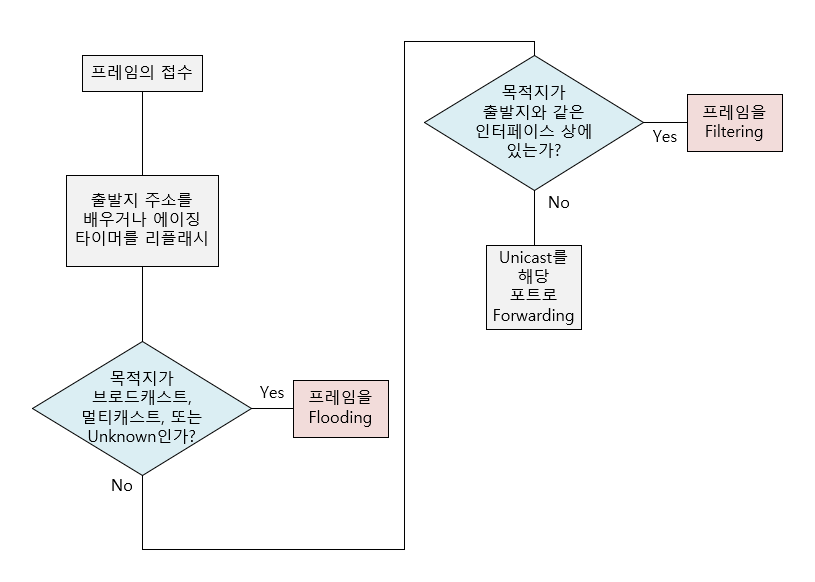

# Switch, Bridge

>스위치, 브리지의 기능에 대하여 알아본다.

 

### 스위치/브리지의 개념

스위치와 브리지는 Data Link(2계층)에 속해 있는 장비들로 허브의 한계인 콜리전 도메인을 분리해주는 역할을 한다.

예를 들어 1번 포트에 연결된 PC가 2번 포트에 연결된 PC와 데이터를 주고받는 동안에도 3번 퐅에 연결된 PC와 4번 포트에 연결된 PC가 서로 데이터를 주고 받을 수 있게 하는 장비이다.

 

### 스위치/브리지의 기능

이제 스위치/브리지가 어떻게 콜리전 도메인을 분리시켜주는지 그 기능들을 알아보도록 한다. 일단 결론부터 말하면 스위치/브리지는 다음 5가지 일을 한다.

---

* Learning: 배운다.
* Flooding: 모르면 들어온 포트를 제외한 다른 모른 포트로 뿌린다.
* Forwarding: 해당 포트로 건네준다.
* Filtering: 다른 포트로는 못 건너가게 막는다.
* Aging: 나이를 먹는다.

---

#### Learning

브리지나 스위치는 자신의 포트에 연결된 PC가 통신을 위해 프레임을 내보내면 이 때 이 PC의 `맥 어드레스(MAC Address)`를 읽어서 자신의 맥 어드레스 테이블에 저장한다.

 

#### Flooding

들어온 포트를 제외한 나머지를 모든 포트로 뿌려주는 것을 의미한다. 들어온 프레임의 목적지가 브리지 테이블에 없을 때 Flooding 한다.

 

#### Forwarding

브리지가 목적지의 맥 어드레스를 자신의 브리지 테이블에 가지고 있고, 이 목적지가 출발지의 목적지와 다른 세그먼트에 존재하는 경우에 발생한다. 목적지의 포트에만 프레임을 뿌려준다.

 

#### Filtering

목적지의 맥 어드레스를 알고 있고, 출발지와 목적지가 같은 세그먼트 상에 있는 경우 발생한다. 프레임이 브리지를 못 넘어가게 막아주며 이 필터링이 콜리전 도메인을 나눠주는 기능을 제공한다.

 

#### Aging

브리지 테이블에 있는 맥 어드레스를 기억하는 기간에 대한 타이머.
맥 어드레스를 브릿지 테이블에 저장하고 있는 디폴트 값을 5분이다. 만약 Aging타이머가 다 끝나기 전에 같은 출발지를 가진 프레임이 들어오게 되면 타이머를 리셋시키고 처음부터 다시 카운트 한다.

 

아래 그림은 브리지나 스위치에서 프레임이 어떻게 흘러가는지를 나타낸 것이다.

 

### 스위치와 브리지의 차이점

1. 스위치는 처리 방식이 하드웨어로 이루어지고 브리지는 소프트웨어적으로 처리한다. 물론 속도는 스위치가 훨씬 빠르다.

2. 브리지는 포트들이 모두 같은 속도를 지원하는 반면, 스위치는 서로 다른 속도를 연결할 수 있는 기능을 제공한다.

3. 스위치는 브리지에 비해 제공하는 포트 수가 훨씬 많다. 브리지는 대부분 2개에서 3개 정도를 가지고 있지만 스위치는 몇십 또는 몇백 개의 포트를 제공할 수 있다.

4. 스위치의 경우는 `cut-through`, 또는 `store-and-forward` 방식을 사용하는데 비해서 브리지는 오로지 `store-and-forward` 방법만을 사용한다.

   * **스토어-앤-포워드(Store-and-forward)**: 이 방식은 스위치나 브리지가 일단 들어오는 프레임을 전부 받아들인 다음 처리를 시작하는 방식이다. 에러 복구 능력이 뛰어나고, 따라서 이런 방식은 회선 상에 에러가 자주 발생하거나 또는 출발지와 목적지의 전송 매체가 다른 경우에 자주 사용된다.
   * **컷스루(Cut-through)**: 이 방식은 스위치가 들어오는 프레임의 목적지 주소만을 본 다음 바로 전송 처리를 시작하는 방식이다. 따라서 처리 속도가 빠르다는 장점을 가지고 있지만 프레임에 에러를 찾기가 어렵기 때문에 에러 복구 능력은 약하다.
   * **프래그먼트-프리(Fragment-Free)**: 이 방식은 앞에서 배운 스토어-앤-포워드, 컷스루 방식의 장점을 결합한 방식으로 전체 프레임이 다 들어올 때까지 기다릴 필요가 없다는 측면에서 컷스루 방식을 닮았지만, 컷스루처럼 처음 48비트만을 보는 것이 아니라 512비트를 보게된다. 따라서 에러 감지 능력이 컷스루에 비해서 우수하다.

   